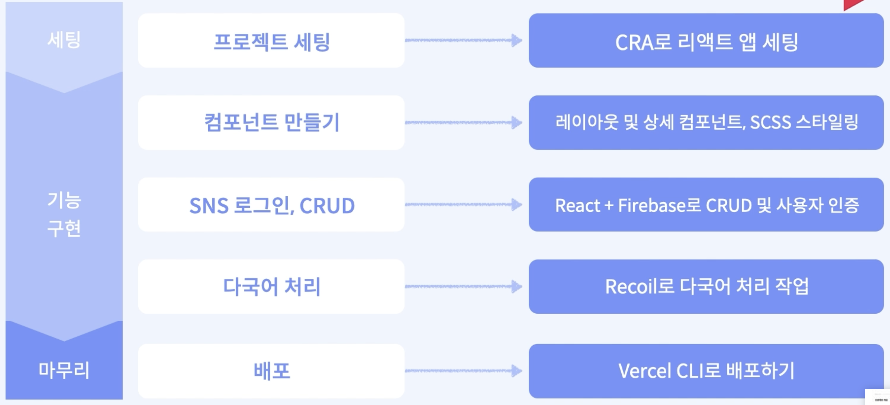
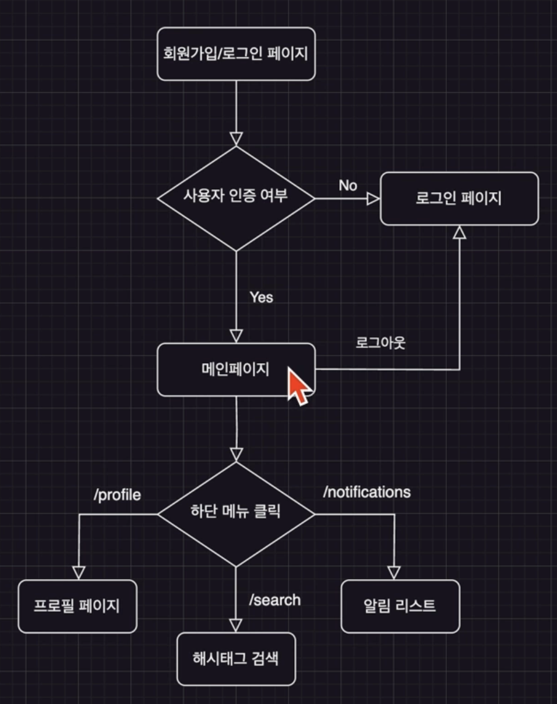

# [Course1] 트위터 앱 프로젝트

## 1️⃣ 프로젝트 개요

### 1. 프로젝트 개요 및 목적

#### 프로젝트 개요

- React 앱의 구조와 라우팅을 이해하고, 직접 프로젝트 설계
- Firebase의 심화 개념을 익히고 **실시간 데이터 처리** 및 **이미지 업로드** 실습
- Firebase의 **OAuth**를 이용한 SNS 로그인 구현을 적용
- 전역 상태 관리의 필요성과 **recoil** 사용법 이해
- **Media query** 및 **scss** 개념을 알아보고, 직접 스타일링 적용
- **Vercel**를 이용해 배포를 진행


#### 사용기술

- create-react-app
- React-router-dom
- Firebase auth를 이용한 **SNS** 회원가입/로그인
- Firebase Firestore과 **onSnapshot**을 이용한 **실시간** 게시판 CRUD
- **Media Query** 및 **SCSS**를 이용한 반응형 스타일링
- **Recoil**을 이용한 상태관리(메뉴 다국어 처리)
- **Vercel CLI**로 배포


#### 흐름도




### 2. 완성 프로젝트 미리보기

- 서비스 주소: https://react-twitter-three.vercel.app/
- github: https://github.com/jen-frontend/fastcampus-react-twitter


### 3. 프로젝트 구조

#### 프로젝트 설계(다이어그램)




#### 폴더 구조

- src안에  pages, component
- components: 공통 컴포넌트
- **constants: 다국어 처리 정보**
- context: 사용자 인증 상태 관리
- **hooks: 다국어 처리 관련 훅**
- pages: 페이지 코드
- **_utils.scss: scss변수 및 미디어 쿼리**
- firebaseApp: 파이어베이스 설정


### 4. 사용하는 기술 소개

#### React, Create-react-app

- React: 사용자 인터페이스를 만들기 위한 JavaScript UI 라이브러리
- CRA: React 애플리케이션을 쉽게 설정할 수 있는 도구


- 개발 생산성 향상: 컴포넌트 기반 아키텍쳐, 미리 정의된 설정 등
- 유지보수 용이: 컴포넌트 단위 UI 관리, CRA의 단순화
- 성능 최적화: 가상 DOM을 이용한 성능 최적화
- 풍부한 커뮤니티: 활발한 생태계 및 라이브러리, 도구들


#### CSR vs SSR

- CSR(Client-Side Rendering)
  - 웹 애플리케이션 초기 **로딩 후**, 클라이언트에서 JS를 이용해 동적으로 페이지 구성
    - 빈 root를 먼저 로딩 후 동적으로 페이지 구성
  - 사용자 경험 향상, **빠른 상호작용**
    - SNS와 같은 실시간 업데이트 빈번한 서비스에 적합
    - 빠른 상호작용. 실시간 업데이트 중요한 서비스
- SSR(Server-Side Rendering)
  - 서버에서 초기 HTML 컨텐츠 생성 & 전송
    - HTML을 모두 사전에 받아서 보여줌
  - 검색엔진최적화(SEO)에 유리
    - 뉴스 웹사이트나 블로그 등 컨텐츠 중심 서비스에 적합


#### SCSS(SASS)

- SASS(Syntactically Awesome Style Sheets)
- CSS 전처리기 언어. CSS의 단점 보완
- 스타일 코드를 모듈화하여 개발 & 유지보수 용이


- **가독성 및 모듈화**: 중첩 규칙을 통해 스타일 구조를 시각적으로 나타냄, 모듈화 가능
- **재사용가능**한 코드: 변수를 활용하거나 믹스인을 사용해 스타일 재사용 가능
- 생산성 향상, **유지보수 용이**


#### Recoil

- Recoil: 페이스북에서 개발한 상태 관리 라이브러리
- 리액트의 상태를 효율적으로 관리
- 컴포넌트간 상태공유와 업데이트를 용이하게 함


- 상태관리 간편화: 전역 상태를 간단하게 관리할 수 있는 API 제공
- 유연한 아키텍처: 코드의 복잡성을 줄여줌
- 비동기 상태관리: 비동기 데이터 흐름을 처리할 수 있도록 도와줌


#### Firebase (Authentication, Firestore, Storage)

- Firebase: 구글에서 제공하는 개발 플랫폼
- Authentication: 사용자 인증 및 보안을 관리하는 도구
- Firestore: 클라우드 기반 NoSQL 데이터베이스. 실시간 데이터 동기화 기능 제공
- Storage: 클라우드 스토리지 서비스로, 이미지, 동영상 등의 파일 저장 & 관리


#### Vercel

- Vercel: 클라우드 플랫폼. 정적 웹사이트 및 SPA 앱을 빠르고 쉽게 배포 & 관리 할 수 있음. 높은 성능과 보안 제공.

- 배포 방법: 

  1. Git 저장소와 연동 후, 코드를 푸시하면 자동 빌드 & 배포. 

  2. **Vercel CLI를 사용해서 로컬에서 앱 빌드 & 수동 배포 가능** => 이 프로젝트에서는 수동 배포

- 장점

  - 빠른 배포: 깃 저장소와 연동되므로 코드 변경 사항을 자동 감지, 실시간 빌드 배포 가능
  - 글로벌 배포 네트워크: 빠른 로딩 속도 제공, CDN을 활용해 컨텐츠 최적화
  - 스케일링 및 자동화: 트래픽이 증가시 스케일이 자동으로 확장


## 2️⃣ 프로젝트 세팅

### 1. Create-react-app 주요 개념 설명

#### 개요

- Create React App: 한 번에 React 개발 환경을 구성해주는 환경
  - Meta에서 만든 보일러플레이트
- 장점
  - 하나의 명령어로 손쉽게 세팅 가능
  - 초기 개발 시간 단축, 갭라 생산성 향상
  - React 앱 개발에만 집중 가능(babel, webpack 등 심화된 관리 X)
- 단점
  - 빌드 설정을 커스터마이징하기 어려움
  - 리액트 앱 구조에 대해 이해하기 어려울 수 있음
  - 원하지 않는 dependencies로 앱이 무거울 수 있음


#### create-react-app 구조

- `node_modules` : 패키지 모듈 저장되는 디렉터리(커밋X)
- `package.json` : 의존 모듈 정보를 json 형태로 저장. 설치한 모듈에 대한 버전 관리
- `public` : static 파일 저장 디렉터리
  - `public/index.html` : 리액트 앱을 브라우저에 나타냄(페이지 템플릿)
  - `public/favicon.ico` : 브라우저 탭 아이콘
- `src` : 개발이 이루어지는 작업 공간(실제로 webpack은 src안의 파일만 실행. js, jsx, css 등 소스 코드)
  - `src/App.css` : 앱이 실행되는 메인 코드 및 스타일(JSX)
  - `src/App.js` 
  - `src/App.test.js`
  - `src/index.css` : index.js 컴포넌트 스타일링을 위한 css 파일
  - `src/index.js` : App.js의 App 컴포넌트와 public/index.html 연결
  - `src/log.svg`


#### react 설치 방법

(1) yarn을 사용해서 프로젝트 설치

- 자바스크립트 패키지 매니저: 프로젝트 패키지 의존성을 관리해주는 툴

- Node >= 14 필요

- node.js 및 yarn 설치 후 아래 커맨드 입력

  ```cmd
  yarn create react-app fastcampus-react-blog --template typescript
  ```

  

### 2. Create-react-app 세팅

#### Node.js 설치

- https://nodejs.org/en/download

- LTS 버전 설치

- 설치 후 버전체크

  ```cmd
  node -v
  ```


#### Yarn 설치

https://classic.yarnpkg.com/lang/en/docs/install

- 자바스크립트 패키지 매니저: 프로젝트 패키지 의존성을 관리
- npm과 비교
  - 성능, 보안 향상
  - npm은 패키지를 순서대로 설치하지만, yarn은 병렬로 설치해서 설치 속도가 빠름
- 캐싱 사용해서 두 번째 인스톨 부터는 패키지 설치 속도가 더 빨라짐 


#### CRA(create-react-app) 설치

```cmd
yarn create react-app fastcampus-blog-app --template typescript
```

```cmd
cd fastcampus-blog-app
```


### 3. Create-react-dom 설명

- React-router-dom

  - React 앱의 라우팅 처리를 위한 라이브러리

- 사용하는 이유

  - 쉬운 설치와 설정
  - 선언적인 라우팅
    - 컴포넌트 기반으로 라우팅 정의 가능
    - 코드의 가독성 및 유지보수성 높임
  - 다양한 라우팅 기능
    - 링크, 중첩된 라우팅, 동적 경로 등 복잡한 라우팅 처리 가능

- `BrowserRouter`로 App 컴포넌트 감싸서 라우팅 활성화

- `Route`로 경로와 해당 경로에 대응하는 컴포넌트 정의

- `Link`로 다른 경로로 이동하는 링크 생성

- 예제

  ```javascript
  import { BrowserRouter as Router, Route, Link } from 'react-router-dom';
  const App = () => {
    return (
    	<Router>
      	<div>
      		<Link to="/">Home</Link>
      	</div>
      	<Route exact path="/" component={Home}/>
      </Router>
    )
  }
  ```

  

### 4. react-router-dom을 이용한 라우팅 실습

- React-router-dom install

```cmd
yarn add react-router-dom
```

- Typescript

```cmd
yarn add @types/react-router-dom
```

- `index.tsx`

  ```javascript
  import { BrowserRouter as Router } from "react-router-dom";
  
  const root = ReactDOM.createRoot(
    document.getElementById("root") as HTMLElement
  );
  root.render(
    <React.StrictMode>
      <Router> // Router
        <App />
      </Router>
    </React.StrictMode>
  );
  ```

  


## 3️⃣ 사용자 인증 구현

### 


##  사용자 인증 구현

### Firebase, Firebase Auth 알아보기

### Firebase Auth 세팅하기

### Firebase Auth로 기본 회원가입 실습

### Firebase Auth로 기본 로그인 실습

### Firebase OAuth 실습

### Firebase란

- Firebase란?

  - 실시간 데이터베이스, 인증, 스토리지, 분석 등 다양한 기능을 제공하는 모바일 및 웹 앱 개발 플랫폼

  - 2011년 스타티업에서 시작(실시간 채팅 기능) > 2014년 구글이 인수(백엔드 서버리스)

  - 백엔드 서버 구축하고 관리할 필요 없이, Google Cloud Platform을 이용해 빠르고 효율적인 개발이 가능

  - 특히 실시간 기능 서비스, 클라이언트 사이드 집중, 초기 프로토타입 개발에 유용

- 주요 기능 소개

  - 이번 프로젝트에서 사용할 주요 기능: Authentication, Firestore, Storage, Hosting
  - **Authentication: 간편한 다중 플랫폼 로그인**
    - 이메일 인증, 소셜 미디어 계정 인증, 전화번호 인증방식 제공
    - 보안 강화, 사용자 인증 과정 안전하게 처리
  - **Firestore: NoSQL 데이터베이스**
    - Firebase에서 제공하는 NoSQL 형식의 클라우드 데이터베이스
    - 실시간 데이터 동기화 지원(ex. 실시간 채팅)
  - **Storage: 사진 및 동영상 저장**
    - 사용자 파일 저장 및 공유. 강력한 보안
  - **Hosting: 웹 호스팅**
    - 정적 및 동적 콘텐츠 모두 호스팅 가능

- Firebase 장단점

  | 장점                                                         | 단점                                                         |
  | ------------------------------------------------------------ | ------------------------------------------------------------ |
  | 백엔드 서버 없이 개발: 개발 시간 절약, 클라이언트에 집중해서 개발 가능 | 쿼리 제한: NoSQL 데이터베이스의 간단한 쿼리만 사용 가능      |
  | 실시간 데이터베이스: 사용자 데이터 실시간 공유, 실시간 채팅 등의 기능 쉽게 개발 | 비용: 확장성이 중요한 경우, 비용이 빠르게 증가할 수 있음     |
  | Google 플랫폼 통합: Google Cloud Platform 서비스 쉽게 이용 및 분석 가능 | 마이그레이션 어려움: 타 백엔드 서비스로 전환하는 경우 추가적인 작업 필요 |

- Firebase Pricing

  - 무료 할당량으로 시작 > 이후 지불

- Firebase 설정 방법

  1. 프로젝트 생성

  2. 앱 설정

     - 생성된 Firebase 프로젝트 페이지에서, "웹"을 선택하고 앱의 별칭을 입력
     - Firebase SDK를 추가하는 과정에서, Firebase가 제공하는 구성 객체를 복사

  3. React 프로젝트에 Firebase 설치

     ```cmd
     yarn add firebase
     ```

  4. React 앱에서 Firebase 초기화

     ```javascript
     import firebase from 'firebase/app'
     
     const firebaseConfig = {
       apiKey: "YOUR_API_KEY",
       authDomain: "YOUR_AUTH_DOMAIN",
       projectId: "YOUR_PROJECT_ID",
       storageBucket: "YOUR_STORAGE_BUCKET",
       messagingSenderId: "YOUR_MESSAGING_SENDER_ID",
       appId: "YOUR_APP_ID"
     };
     
     firebase.initializeApp(firebaseConfig);
     ```

  5. React 앱에서 Firebase 사용

     ```javascript
     import 'firebase/auth'
     import 'firebase/firestore'
     
     const auth = firebase.auth()
     const db = firebase.firestore()
     ```


### Firebase Auth란?

- Firebase Authentication

  - 쉽게 사용자 인증을 구현할 수 있도록 돕는 Firebase 서비스
  - 이메일과 비밀번호 인증, 소셜 미디어 인증, 전화번호 인증
  - 인증 정보 안전하게 저장
  - 인증 정보 변경시 실시간으로 앱에 업데이트
  - 인증 이멩리 전송, 비밀번호 재설정 이메일 전송 등 가능

- 장점

  - 편의성
    - 복잡한 인증 과정을 Firebase가 대신 처리
    - 클라이언트 사이드 개발에만 집중이 가능
  - 소셜 미디어 계정 인증
    - OAuth 2.0과 OpenID Connect 지원
    - 각종 소셜 미디어 계정 이용한 인증 구현
  - 보안
    - 사용자의 비밀번호 안전하게 암호화
    - HTTP 이용해 데이터 전송 보안

- 언제 사용할까?

  - 로그인 시스템 구현시
  - 사용자 프로필 시스템 구현시

- Firebase Auth 세팅

  1. Firebase 프로젝트 생성 & Firebase SDK 앱 추가

  2. Firebase 초기화

     ```react
     import firebase from 'firebase/app'
     import 'firebase/auth'
     
     const firebaseConfig = {
       // Firebase 프로젝트 설정 값
     }
     
     firebase.initializeApp(firebaseConfig)
     
     const auth = firebase.auth();
     ```

  3. Authentication 서비스 불러오기

     ```react
     import { getAuth, signInWithEmailAndPassword } from "firebase/auth"
     
     const onSubmit = async (e: any) => {
       e.preventDefault();
       
       try {
         // 로그인 성공
         const auth = getAuth(app)
         await signInWithEmailAndPassword(auth, email, password);
         toast("로그인이 성공했습니다")
       } catch (error: any) {
         // 로그인 실패 에러 메시지
         toast.error(error?.code)
       }
     }
     ```


### `onAuthStateChanged` 메서드

- 개념

  - Firebase Authentication 서비스에서 제공하는 메서드
  - 인증 상태가 변경될 때마다 호출되는 리스너 설정(로그인, 로그아웃)
    - 로그인을 하거나 로그아웃을 할 때 마다 실시간으로 호출이 됨
  - 사용자 객체를 인자로 받는 콜백 함수 등록
    - 사용자의 로그인 상태 확인 후 적절한 작업 수행
    - 로그인 상태일 때는 사용자의 정보를, 아니라면 null을 리턴

- 예시

  - 사용자가 로그인 하거나 로그아웃할 때 콘솔에 사용자 상태 출력
  - `onAuthStateChanged`를 사용해 사용자의 로그인 상태를 실시간으로 파악하고, 원하는 특정 작업을 수애할 수 있음
    - 동적인 사용자 경험 제공 가능
    - 현재 사용자를 가져올 때, auth객체가 초기화와 같은 중간단계를 거치지 않기 때문에 빠르고 자연스러운 사용자 경험 제공 가능

  ```react
  import { getAuth, onAuthStateChanged } from "firebase/auth";
  
  useEffect(() => {
    onAuthStateChanged(auth, (user) => {
      if (user) {
        console.log('사용자가 로그인한 상태입니다.')
      } else {
        console.log('사용자가 로그아웃한 상태입니다.')
      }
      setInit(true);
    });
  }, [auth]);
  ```

- 공식 문서: Auth 객체에 `onAuthStateChanged` 라는 관찰자 설정하는 것을 권장

  ```react
  import { getAuth, onAuthStateChanged } from "firebase/auth";
  
  const auth = getAuth()
  onAuthStateChanged(auth, (user) => {
    if (user) {
      ...
    } else {
      ...
    }
  });
  ```


### Context API

- Context API란?

  -  React가 자체적으로 제공하는 상태 관리 방법
     - 컴포넌트 트리 안에서 **전역적**으로 사용할 수 있는 값 관리
     - Props Drilling을 피하고, 컴포넌트 간 상태를 쉽게 공유 가능
     - 데이터를 공유하기 위한 방법(context)
     - ex. 로그인한 사용자의 정보, 테마, 언어 설정 등

- 장단점

  - 장점
    - Prop Drilling 문제 해결
    - 추가적인 라이브러리 설치 필요 없음
    - 중간컴포넌트를 거치지 않고도 컴포넌트에 상태를 전달할 수 있기 때문에 코드의 복잡성을 줄이고 가독성을 향상시킬 수 있음
  - 단점
    - 복잡한 상태 관리는 어려울 수 있음
      - Redux, Recoil과 같은 전역 상태관리 라이브러리가 더 적합할 수 있음
    - 너무 많은 context를 사용하면 재사용성이 떨어짐
      - 한 component가 특정 context에 너무 의존하게 되면, 그 컨텍스트 없이는 해당 컴포넌트를 재사용하기 어려움

- 사용 사례

  - 전역적으로 관리해야하는 상태가 있는 경우 사용
  - 다크모드, 사용자 세션 관리, 다국어 처리 구현 등

- 사용법

  1. Context 생성

     ```react
     import { createContext } from 'react';
     
     export const LevelContext = createContext(1);
     ```

  2. Provider 설정

     - context를 구독하고 있는 컴포넌트들에게 컨텍스트의 변화를 알려주는 역할을 함

     ```react
     import { LevelContext } from './LevelContext.js';
     
     export default function Section({ level, children }) {
       return (
       	<section className="section">
         	<LevelContext.Provider value={level}>
             {children}
           </LevelContext.Provider>
         </section>
       )
     }
     ```

  3. 변화값 받아오기: **Consumer 설정**

     ```react
     import { LevelContext } from './LevelContext.js';
     
     export default function Heading({ children }) {
         <LevelContext.Consumer>
           {({level}) => (<div>{level}</div>)}
         </LevelContext.Consumer>
     }
     ```

  4. 변화값 받아오기: **useContext 훅 사용**

     -  React 16.8 버전 이상만 가능

     ```react
     import { useContext } from 'react';
     import { LevelContext } from './LevelContext.js';
     
     export default function Heading({ children }) {
       const level = useContext(LevelContext);
       
       // 전역 상태인 level 값 사용 가능
     }
     ```

     

## 4️⃣ 게시판 CRUD 구현

### Firestore란?

- Firebase에서 제공하는 NoSQL 형식의 클라우드 데이터베이스

  - 애플리케이션 개발을 하다보면, 데이터를 저장하고 불러오는 일이 매우 중요한데,  Cloud Firesotre는 이러한 일을 쉽게 도와줌
  - Firestore는 **실시간 데이터 동기화**를 지원하며, 웹, 안드로이드 iOS에서 데이터를 저장하고 동기화 할 수 있음
  - 데이터는 문서(document)와 컬렉션(collection)의 형태로 저장되며, 이는 효율적인 쿼리 작성을 가능하게 함
  - 오프라인 지원 제공

- 실제 화면

  - 한 프로젝트에 여러개의 콜렉션을 만들 수 있고, 하나의 콜렉션 안에는 여러 개의 문서(데이터) 를 추가 가능
  - 문서마다 새로운 컬렉션 추가도 가능하며, 해당 컬렉션에 필드도 추가/삭제 가능
    - User라는 상위 컬렉션 안에,  `User1`, `User2`, `User3`, `User4`라는 document가 존재
      - `User3` document는 Posts라는 또다른 컬렉션을 가지고
        - Posts라는 컬렉션 안에,  `Post1`, `Post2` 라는 document가 존재
        - `Post2` document는 Comments 컬렉션을 가지고, 
          - Comments 라는 컬렉션 안에,  `Comment1`, `Comment2`라는 document가 존재

  

- 장점

  - **실시간 데이터 동기화**
    - 실시간 채팅 및 데이터 분석 등 실시간 기능 애플리케이션 개발
  - 구조화된 데이터
    - 문서 - 컬렉션 형태로 데이터 저장 / 구조화된 데이터 쉽게 저장하고 불러올 수 있음
  - 보안
    - 사용자 기반의 보안규칙 설정 가능

- 사용 예시

  - 실시간 채팅 앱
  - 다양한 데이터 저장 및 불러올 수 있음
    - 게임 점수, 사용자 설정, 텍스트, 이미지
  - 사용자별 데이터 접근 권한 관리
    - 사용자 인증 정보와 함께 사용

- 사용 방법

  1. Firebase 프로젝트 생성 & Firebase SDK 앱 추가

  2. Firestore 인스턴스 가져오기

     ```react
     import { initializeApp, FirebaseApp, getApp } from "firebase/app";
     import { getFirestore } from "firebase/firestore";
     
     export let app: FirebaseApp;
     
     const firebaseConfig = {...};
     
     try {
       app = getApp("app");
     } catch (e) {
       app = initializeApp(firebaseConfig, "app");
     }
     
     export const db = getFirestore(app)
     ```

  3. Firebase 서비스 사용하기

     ```react
     import { db } from "firebaseApp";
     
     const onSubmit = async (e: any) => {
       e.preventDefault();
       
       try {
         await addDoc(collection(db, "posts"), {
           
         });
         toast.success("게시글을 생성했습니다");
       } catch (e:any) {
         console.log(e)
       }
     }
     ```

     

## 5️⃣ 해시태그 검색 구현

## 6️⃣ 이미지 업로드 구현

## 7️⃣ 좋아요 기능 구현

## 8️⃣ 댓글 기능 구현

## 9️⃣ 팔로잉 기능 구현

## 🔟 알림 기능 구현

## 1️⃣1️⃣ 다국어 처리 구현

## 1️⃣2️⃣ 모바일 반응형 작업

## 1️⃣3️⃣ 보안 확인하기

1. Firestore Database > 규칙 변경

   ```javascript
   rules_version = '2';
   
   service cloud.firestore {
     match /databases/{database}/documents {
   
       // This rule allows anyone with your Firestore database reference to view, edit,
       // and delete all data in your Firestore database. It is useful for getting
       // started, but it is configured to expire after 30 days because it
       // leaves your app open to attackers. At that time, all client
       // requests to your Firestore database will be denied.
       //
       // Make sure to write security rules for your app before that time, or else
       // all client requests to your Firestore database will be denied until you Update
       // your rules
       match /{document=**} {
         allow read, write: if request.auth != null;
       }
     }
   }
   ```

2. API Key 발급하기

   https://console.cloud.google.com/apis/credentials

   Edit API Key > Set an application restriction > click Websites

   Website restrictions > ADD > Add website address

   - Firestore > Authentication > Settings > 승인된 도메인 리스트
   - ex. `Fastcampus-react-blog-36459.firebaseapp.com/*`


## 1️⃣4️⃣ 배포하기

### Firebase CLI(Command Line Interface)

- Firebase 프로젝트를 관리하고 다양한 Firebase 기능을 로컬에서 사용할 수 있도록 해줌
- Firebase 프로젝트 설정, 데이터베이스, Cloud Function, 호스팅 등 관리


### Firebase CLI 설치방법

1. Node.js 및 npm 설치
2. `npm install -g firebase-tools`
3. Firebase login(로그인 후 테스트)
4. firebase projects:list (파이어베이스 프로젝트 확인)


### Firebase로 배포하기

#### 1. 프로젝트 초기화: 

```cmd
firebase init hosting
```


#### 2. 사이트 배포

```cmd
yarn build
firebase deploy --only hosting
```

- 배포된 url 확인 (도메인 추가할 것): `https://fastcampus-react-blog-36459.web.app`


### 3. Google console 및 Firebase 보안 적용

- 위에서 배포된 url이 이미 저장된 URL과 다르다면
  - Firebase Auth > settings > 승인된 도메인 추가
  - Google console > API > 보안 URL 추가