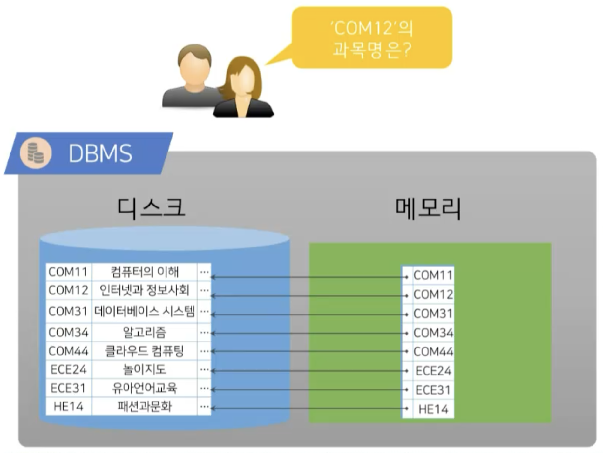
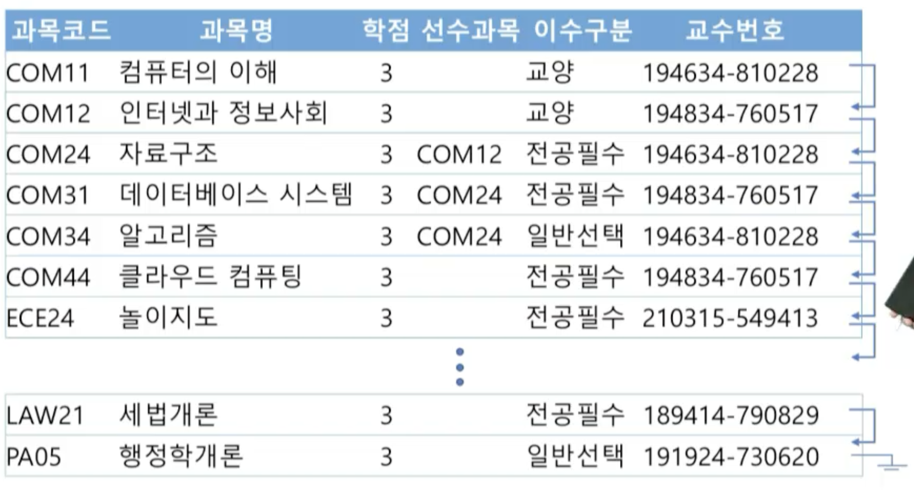
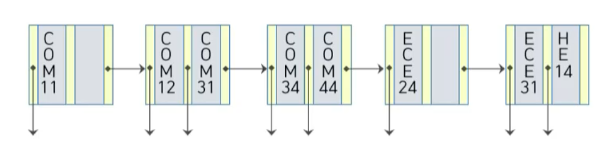
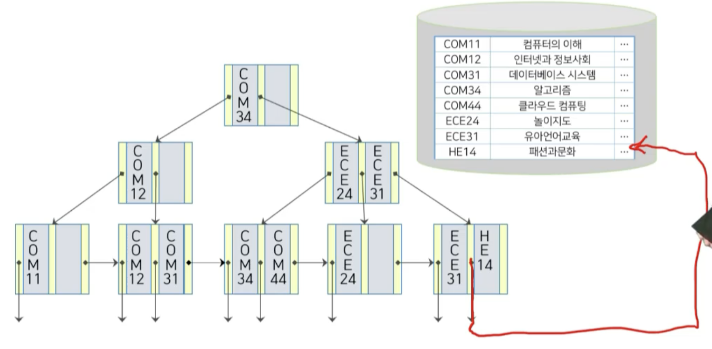
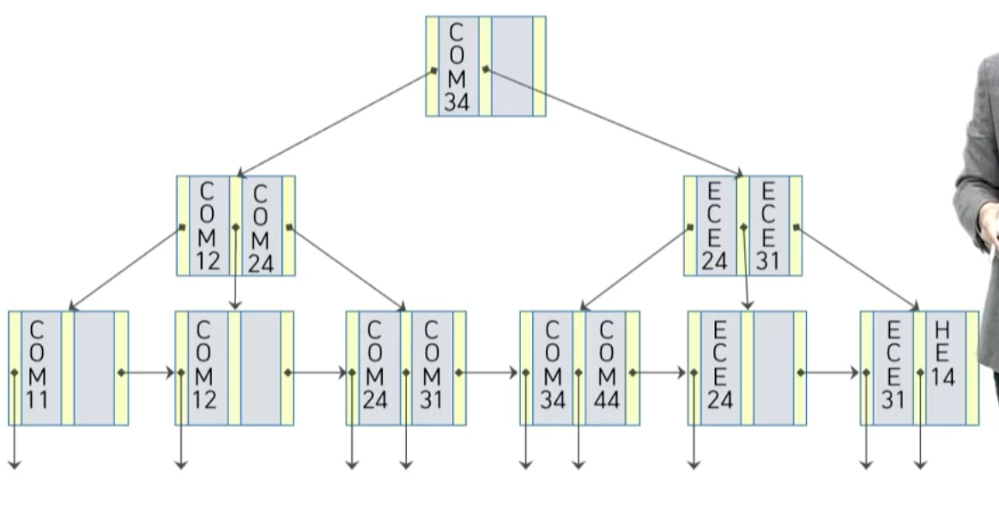

# 10강. 인덱싱

## 01. 인덱스의 이해

### 인덱스의 개념

#### 인덱스의 필요

- DBMS의 성능 향상을 위해
- 디스크와 메모리 사이에 IO를 가장 줄이는 방법

### 인덱스의 개념

- 데이터 검색에서 발생하는 비효율적인 데이터 입출력 문제를 해결하기 위한 목적으로 시작
  - 인덱스:  DBMS에서 요청된 레코드에 빠르게 접근할 수 있도록 지원하는 데이터와 관련된 부가적 구조
  - 인덱싱: 인덱스를 구성하고 생성하는 작업
- 인덱스의 탐색키를 이용하여 해당 레코드가 저장된 블럭을 디스크 저장장치 또는 메모리에서 파악하여 해당 블럭을 빠르게 적재
  - 탐색키: 파일에서 레코드를 찾는데 사용되는 컬럼이나 컬럼의 집합

### 인덱스 기반의 검색 과정

### 인덱스의 종류

- 인덱스의 종류
  - 순서 인덱스
    - 특정 값에 대해 정렬된 순서 구조
  - 해시 인덱스
    - 버킷의 범위 안에서 값의 균일한 분포에 기초한 구조로, 해시 함수가 어떤 값이 어느 버킷에 할당되는지 결정

- 인덱스의 평가기준
  - 접근 시간
    - 데이터를 찾는데 걸리는 시간
  - 유지 비용
    - 새로운 데이터 삽입 및 기존 데이터 삭제 연산으로 인한 인덱스 구조 갱신 비용
  - 공간 비용
    - 인덱스 구조에 의해 사용되는 부가적인 공간 비용

## 02. 순서 인덱스

### 순서 인덱스의 특징

- 탐색키로 정렬된 순차 파일에 대하여 레코드에 대한 빠른 접근이 가능하도록 구성한 인덱스
  - 탐색키를 정렬하여 해당 탐색키와 탐색키에 대한 레코드와의 연계를 통하여 인덱스 생성
    - 예: 어학사전(가나다 순, abc순)
  - 순서 인덱스의 종류
    - 밀집 인덱스
    - 희소 인덱스
    - 다단계 인덱스

### 순차 파일

- 각각의 레코드가 탐색키값 순으로 정렬되어 있는 파일
  - 순서인덱스는 순차파일처럼 저장된 데이터 레코드를 대상으로 만든 대상

### 인덱스의 구성

#### 인덱스 엔트리의 구조

- 인덱스 엔트리: 빠른 접근을 할 수 있는 별도의 레이블
  - 탐색키값, 포인터

### 밀집, 희소, 다단계 인덱스

#### 밀집 인덱스

- 모든 레코드에 대해 `탐색키 값, 포인터` 쌍을 유지

  - 해당 레코드로 곧바로 이동할 수 있는 경로 찾을 수 있지만 인덱스의 크기 자체가 커짐

  

#### 희소 인덱스

- 인덱스의 엔트리가 **일부**의 탐색키 값만을 유지
  - 엔트리의 대소를 비교
  - 장점
    - 인덱스 엔트리가 몇개 없기 때문에 사이즈가 작기 때문에, 인덱스 찾는 비용이 작음
  - 단점
    - 다시 인접한 인덱스 엔트리를 가져가서, 순차파일 내부에서 일부 검색을 다시 한번 해야 함

#### 다단계 인덱스

- 왜 필요한지?
  - 4KB 크기의 한 블럭에 100개의 엔트리가 삽입될 때, 100,000,000개의 레코드에 대한 순서 인덱스
    - 1,000,000개의 블럭 = 4GB의 공간 필요
    - 인덱스 유지하고 사용하는 것이 부담스러워짐
  - 인덱스 크기에 따른 검색 성능 => 다단계 인덱스
    - 인덱스 크기 < 메모리 크기
      - 디스크 I/O이 줄어 탐색 시간이 축소
    - 인덱스 크기 > 메모리 크기
      - 저장된 블럭을 여러번 나누어 읽어야 하기 때문에, 디스크 I/O 비용이 증가해 탐색 시간이 증가
- 내부 인덱스와 외부 인덱스로 구성
  - 외부 인덱스를 내부 인덱스보다 희소한 인덱스로 구성해 엔트리의 포인터가 내부 인덱스 블럭을 지칭
  - 포인터가 가리키는 블럭을 스캔해 원하는 레코드보다 작거나 같은 탐색기 값 중 가장 큰 값을 가지는 레코드 탐색
- 내부 인덱스는 1,000,000개의 블럭을 갖는 반면, 외부 인덱스는 100개의 블럭만 사용하여 작은 크기의 외부 인덱스로 메모리에 적재 가능

## 03. B+ 트리 인덱스

#### 이진탐색트리(binary search tree)

#### B+ 트리의 구조

- 이진탐색트리를 다단계인덱스와 결합한 구조
- 하나의 노드에 여러 개의 탐색기가 포함되어 트리 형태를 이룸

#### 특징

- 루트 노드로부터 모든 단말 노드에 이르는 경로의 길이가 같은 높이 균형 트리

  - 순서 인덱스는 파일이 커질수록 데이터 탐색에 있어서 접근 비용이 커지는 문제점을 해결하기 위해 제안
  - 상용 DBMS에서도 널리 사용되는 대표적인 순서 인덱스

- B+트리의 노드 구조

  - 탐색키가 들어가고, 탐색키 값보다 작은 포인터값이 왼쪽에 들어감

    

    - n-1개의 탐색키가 들어가고, 하위 노드로서 들어가는 포인터는 총 n개가 들어감

    - n개는 차수(하위노드: 팬아웃: fanout)

- 인덱스 세트: 루트노드와 중간노드로 구성

  

  - 단말노드에 있는 탐색키 값을 신속하게 찾아갈 수 있도록 경로를 제공하는 목적으로 사용
  - [n/2] ~ n 사이의 개수를 자식으로 소유

- 순차 세트: 단말노드로 구성

  

  - 모든 노드가 순차적으로 서로 연결
  - 단말 노드는 적어도 (n-1)/2 개의 탐색키를 포함
  - 탐색키에 대한 실제 레코드를 지칭하는 포인터를 제공

#### 단말노드의 구성

#### B+트리의 예

- 단말노드만이 실제 레코드를 가리키는 포인터를 제공
- http://cs.knou.ac.kr/~jaehwachung/visualization/BPlusTree // 안나옴
- https://www.cs.usfca.edu/~galles/visualization/BPlusTree.html // 원본
- 데이터 양이 많아졌을 때 굉장히 빠른 속도로 레코드에 접근이 가능한 효율적인 인덱스

#### B+트리상에서의 삽입, 삭제

- 레코드 삽입, 삭제시 B+트리 수정
  - 레코드 삽입
    - 노드에서 유지해야 할 탐색키와 포인터 수 증가로 인해 노드를 분할해야 하는 경우 발생
  - 레코드 삭제
    - 노드를 유지해야할 탐색키 값과 포인터 수 감소로 형제 노드와 키를 재분배 또는 병합해야 하는 경우 발생
  - 높이 균형 유지
    - 노드가 분할되거나 병합되면서 높이의 균형이 맞지않는 경우가 발생
    - 전체 트리를 재구조화해야함

- 삽입
  - 검색과 같은 방법을 사용해 삽입되는 레코드의 탐색키 값이 속한 단말 노드 탐색
    - 해당 단말 노드에 <탐색키, 포인터> 쌍을 삽입
    - 삽입시 탐색키가 순서를 유지

- 삭제
  - 삭제될 레코드의 탐색키를 통해 삭제될 탐색키와 포인터를 포함한 단말 노드를 탐색
    - 같은 탐색키 값을 가지는 다중 엔트리가 존재할 경우, 삭제될 레코드를 가리키는 엔트리를 찾을 때 까지 탐색후 단말 노드에서 제거
    - 단말 노드에서 제거된 엔트리의 오른쪽에 있는 엔트리들은 빈 공간이 없도록 왼쪽으로 이동

#### `COM24` 삽입 예제

- 분할

  - 삽입 대상 노드에 추가적인 저장할 공간 부족: 노드 분할
    - COM12를 하나의 단말 노드로 구성
    - COM24와 COM31이 하나의 단말 노드로 구성

- 부모 노드에 탐색키를 조정하고, 추가된 노드에 대한 포인터를 삽입

- 삽입 후 

  

#### `COM44` 삭제 예제

- 병합

#### 탐색키가 재분배되는 삭제

- `COM12` 삭제
  - COM12가 있는 단말 노드를 검색하고 탐색키를 삭제
    - 해당 단말 노드는 삭제 후 탐색키가 존재하지 않음
    - [(n-1)/2]개보다 탐색키가 적으므로 다른 노드와 별도의 작업이 필요
  - COM12이 저장된 노드의 오른쪽의 형제 노드와 키를 재분배
  - 