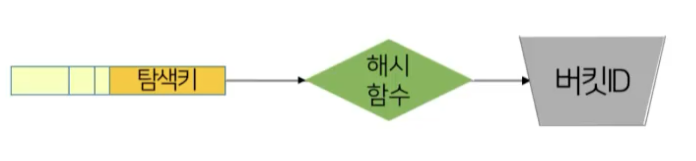
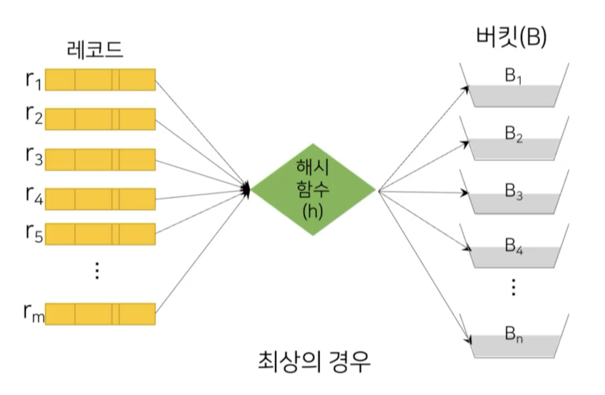
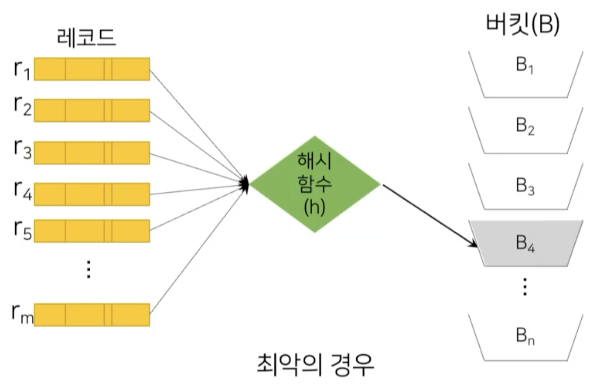
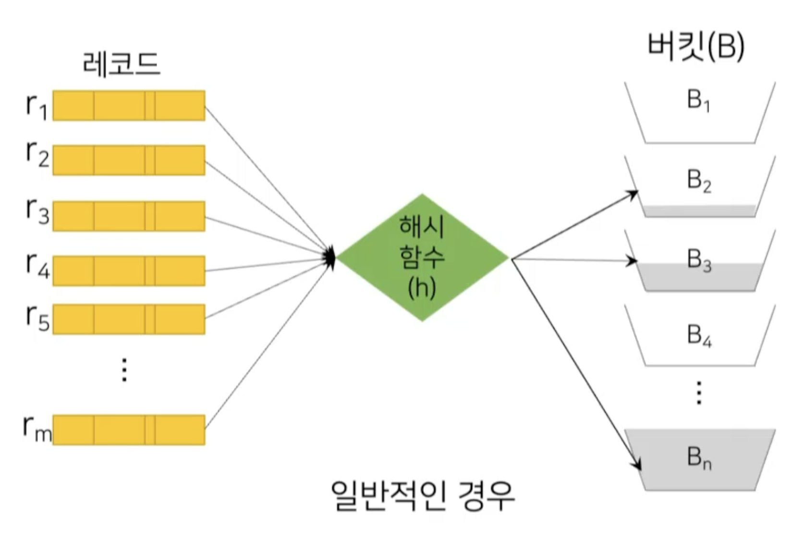
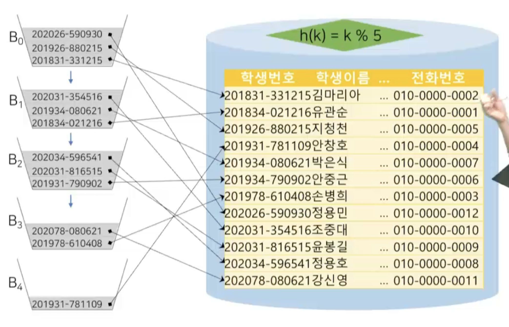

# 11강. 해싱과 특수 인덱스

## 01. 정적 해싱

### 해싱의 개념

- 해시(hash)

  - 탐색키에 산술적인 연산을 통해 버킷의 주소를 계산하는 해시 함수를 사용하여 데이터 배분 및 접근하는 기법

    

- 버킷(bucket)

  - 한 개 이상의 레코드를 저장할 수 있는 저장공간의 단위
  - 크기는 일반적으로 디스크 블록의 크기와 일치

### 해시의 구조

### 해시의 사용

### 해시 함수의 역할

- 최상의 경우
  - 해시 함수가 여러개의 레코드에 있는 탐색기를 가지고 해시 함수를 연산해서 모든 버킷에 **균등하게 배분**해주는 경우

- 최악의 경우

  - 한 버켓에 몰아주는 경우

  

- 일반적인 경우

  - 균등분배는 이론적으로만 가능
  - 최악을 피하는 정도

  

### 해시 파일 구조

- 각각의 레코드가 어느 버킷, 어느 디스크블럭에 저장되어야 하는건지를 해쉬 함수가 결정하도록 만들어진 구조

- 위 구조를 아래 구조처럼 배치시킨 것: 해시 파일 구조화

   

### 정적 해싱의 특징

- **버킷의 개수가 고정**된 해싱 기법
- 키  값이 Ki인 레코드 삽입
  - h(Ki)를 통하여 Ki에 대응하는 버킷 주소를 생성하고 레코드를 해당 버킷에 저장
- 키 값이 Ki인 레코드 검색
  - h(Ki)을 통하여 버킷 주소를 생성하고, 버킷에 저장된 레코드 접근
  - h(Ki) = h(Kj) = m인 경우가 발생하기 때문에, 버킷 m에 저장된 모든 레코드를 탐색하여 선택하는 과정이 필요

### 충돌과 동거자

- 충돌: 서로 다른 두 레코드가 동일한 버킷에 대응
- 동거자: 충돌에 의해 같은 버킷 주소를 갖는 레코드(ri, rj를 동거자라고 함)

### 오버플로(overflow)

- 버킷에 레코드를 저장할 수 있는 여유 공간이 없는 상황에 발생
- 추가적인 버킷을 할당 또는 다음 버킷에 할당하여 처리

- 오버플로우가 발생할수록 접근시간이 길어지고, 해시 성능이 저하된다

### 해시 인덱스

- 해시 파일 구조와 동작 방식을 레코드가 아닌 인덱스 엔트리에 적용한 인덱스

  

- overflow가 발생하면, 그 다음 버켓으로 이동시킨다(파랑 화살표)

  

### 정적 해싱의 문제

- 데이터베이스의 크기가 커짐에 따른 성능 감소
- 미리 큰 공간을 잡을 경우 초기에 상당한 양의 공간이 낭비됨
- 재구성 시 새롭게 선택된 해시 함수를 사용하여 모든 레코드에 대하여 다시 계산하고 버킷에 할당하는 대량의 비용이 발생
  - 해시 구조의 크기가 동적으로 결정되는 동적 해싱 기법 제안

## 02. 동적 해싱

### 동적 해싱의 개념

- 동적 해싱의 정의
  - 버킷의 개수를 가변적으로 조절할 수 있는 해싱 기법
  - 데이터베이스의 크기에 따라 버킷의 크기가 비례
- 데이터베이스의 증대 혹은 축소에 따른 인덱스의 구조를 조절하기 위해 해시 함수를 동적 변경하는 기술
- 확장성 해싱
  - 동적 해싱의 일종으로 디렉터리와 버킷의 2단계 구조
  - 디렉터리는 디스크에 저장되는 버킷 주소 테이블
  - 디렉터리 깊이를 의미하는 정수값 d를 포함하는 헤더와 데이터가 저장된 버킷에 대한 2^d개의 포인터로 구성

### 확장성 해싱

- 모조키(pseudo key)
  - 레코드의 탐색키 값이 해시 함수에 의해 일정 길이의 비트 스트링으로 변환된 키
  - 모조키의 첫 d비트를 사용하여 디렉터리에 접근
- 버킷 헤더
  - 정수값 i(<=d)가 저장되어 있음을 표시
  -  i는 버킷에 저장되어 있는 레코드의 모조키들이 처음부터 i 비트까지 일치함을 표시

### 확장성 해싱의 구조

### 확장성 해싱의 분할

- 레코드 삽입에 의해 분할된 확장성 해싱 파일

  - 위에선 1로 시작되는 부분만 배치되었는데 > 10, 11로 분할

  

## 03. 비트맵 인덱스

### 비트맵 인덱스의 개념

- 탐색키의 중복 비율이 높은 컬럼을 대상으로 하는 질의를 효율적으로 처리하기 위해 고안된 특수한 형태의 인덱스
- 비트맵
  - 간단한 비트의 배열
  - 릴레이션 r의 속성 A에 대한 비트맵 인덱스는 A가 가질 수 있는 값에 대해 비트맵을 구성
  - 각 비트맵은 릴레이션에 있는 레코드의 수 n개 만큼 n개의 비트로 표현

### 비트맵 인덱스의 구성

### 비트맵 인덱스의 사용

- 각각의 비트에 대해 AND연산 수행

  - 무엇을 의미하는가?

  - 1번째, 4번째 레코드가 조건을 만족한다

    

### 비트맵 인덱스의 특징

- 비트맵의 활용
  - 컬럼에 대한 값의 범위가 유한하고, 비교적 개수가 적은 규모일 때 용이
  - 적용: 직책, 학과, 혈액형 등
    - 가짓수가 많지 않고, 중복의 비율이 매우 높은 컬럼에 대해 빠른 검색 속도를 제공
- 비트맵 인덱스의 크기
  - 레코드의 크기가 수백 바이트 이상이 되어도 비트맵 인덱스에서는 하나의 비트로 표시
  - 실제 릴레이션 크기에 비해 매우 작은 것이 장점

