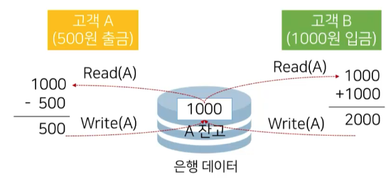
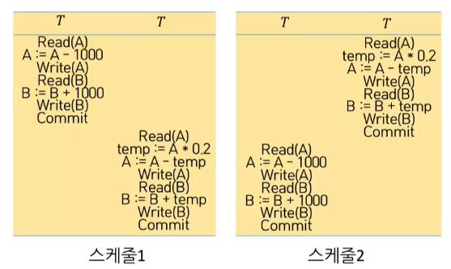
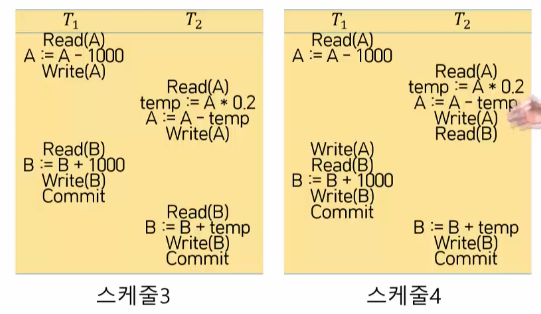
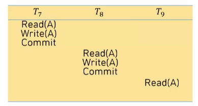

# 12강. 트랜잭션

## 01. 트랜잭션의 이해

### 데이터 동시 접근의 문제

- 동일 데이터에 다수 사용자의 접근 허용 시 일관성이 훼손



### 트랜잭션의 개념

- 데이터베이스를 조작하기 위한 하나의 논리적 단위를 이루는 일련의 연산의 집합
  - 예시: 예금인출
    - 작업 단위: 예금 1000원 인출
    - 일련의 연산: Read(A), A=A-1000, Write(A)
      - 3가지의 연산
- 데이터베이스를 사룔하여 처리하는 작업을 하나의 묶음으로 인식하여 묶음 단위로 실행되도록 정의한 개념


### 트랜잭션의 특징

- 다수의 연산으로 구성된 트랜잭션이 사용자에게 단일작업처럼 다뤄지도록 ACID 특징을 준수
- ACID
  - 원자성(Atomicity): 하나의 트랜잭션에 포함된 모든 연산은 완전히 수행되거나 전혀 수행되지 않음
  - 일관성(Consistency): 특정 트랜잭션이 수행되기 전과 후에 데이터베이스가 일관된 상태를 유지
  - 고립성(Isolation): 특정 트랜잭션이 데이터베이스를 갱신하는 동안 다른 트랜잭션에 의해 방해받지 않음
  - 지속성(Durability): 완료된 트랜잭션의 결관느 어떠한 시스템의 장애에도 데이터베이스에 반영되어야 함


###  트랜잭션 읽기와 쓰기

- 트랜잭션의 두 연산

  - Read(X):  데이터베이스에서 데이터 X를 읽고, 트랜잭션이 실행되는 메모리의 변수 X에 값을 저장하는 연산
  - Write(X): 트랜잭션이 실행되는 메모리에 있는 변수 X의 값을 데이터베이스에 저장하느 ㄴ연산

- 계좌 A에서 B로 1,000원을 이체하는 트랜잭션

  ```sql
  Read(A)
  A := A - 1000
  Write(A)
  Read(B)
  B := B + 1000
  Write(B)
  ```


### ACID 특성 유지

- 하드웨어 문제가 생겨서 두번째까지만 진행되다가, 멈추게 됨. 어떻게 될 것인가? 

  - 원자성에 의해 돌려보내짐

  

- 일관성이 훼손되는 경우에도 트랜잭션이 완료된 후에는 일관성이 유지되도록 한다

  

- 처리되고 있는데 중간에 또다른 트랜잭션이 끼어드는 경우

  - 하나의 트랜잭션이 처리되는 동안에는 다른 트랜잭션이 실행되지 못하게 함

  

- 정상적으로 작업이 끝났다면, 해당 결과물은 영구히 유지되어야 함

  - 하드에 물리적 오류가 있다고 하더라도, 해당 데이터를 원상복구 시킨다

  


### 트랜잭션 연산자

- 트랜잭션의 연산
  - Read(X)
  - Write(X)
- 트랜잭션 실행의 연산
  - Commit: 트랜잭션 연산에 의해 갱신된 데이터 항목의 값을 데이터베이스에 반영시키고 지속성을 확보하는 연산
  - Rollback: 트랜잭션이 중단되기 이전까지 수행한 연산에 의해 갱신된 모든 데이터 항목의 값을 무효화하여 일관성을 확보하는 연산


### 트랜잭션의 5가지 상태 변화

- 실제 데이터가 어디까지 반영되었는지, 트랜잭션을 재 수행해야 하는지 정도를 판단하는데 중요


- 동작: 트랜잭션이 시작을 준비 또는 실행 중인 상태
- 부분 커밋: 마지막 연산을 실행한 직후의 상태
- 커밋: 모든 실행이 성공적으로 완료된 후의 상태
- 실패: 실행이 정상적으로 진행될 수 없는 상태
- 중단: 실행 실패로 롤백되고 시작 이전의 상태로 환원된 상태


## 02. 트랜잭션의 동시성 

### 동시성 고려

- DBMS는 다수의 사용자가 데이터베이스를 공용으로 사용하기 위한 목적으로 도입
- 트랜잭션 동시 실행의 이점(일관성을 훼손하지 않는 범위 내)
  - 트랜잭션 처리율과 자원 이용률 향상
  - 트랜잭션의 대기 시간 감소
- 다중 사용자 환경에서 트랜잭션의 동시 실행으로 데이터 갱신 시, 일관성의 훼손 문제가 발생
- 동시성 제어(concurrency control)
  - 다수의 트랜잭션이 성공적으로 동시에 실행되어도 일관성을 유지할 수 있도록 지원하는 기법


### 적용 트랜잭션


- 스케쥴(schedule)
  - 다수의 트랜잭션에 포함된 연산의 실행 순서를 명시한 것


### 직렬 스케쥴

- T와 T가 순차적으로 실행되는 스케쥴

- 각 트랜잭션에 속한 모든 연산이 순차적으로 실행되는 스케줄




### 병렬 스케쥴

- T0과  T1이 비순차적으로 실행되는 스케줄
- 하나의 트랜잭션이 완료되기 전에 다른 트랜잭션이 실행되는 스케줄
- 병렬 스케줄의 순서로 연산을 수행할 경우 **일관성의 훼손 발생 가능**




### 직렬 가능 스케줄


- 복수개의 트랜잭션이 동시에 수행된 결과가 직렬 스케줄의 결과와 동일한 스케줄

- 트랜잭션 간 연산 순서를 교환하여 트랜잭션을 직렬 스케줄과 동등하게 변환이 가능한 스케줄

- 사용된 Read, Write 연산 교환 시 상황에 따라 실행 결과에 일관성이 훼손되는 현상(충돌)이 발생

- 연산 순서의 교환(단, Ii는 Ti의 연산)

  

### 충돌 동등


- 특정 스케줄 S에서 충돌이 일어나지 않는 연산의 순서를 바꿔 스케줄 S'으로 변환이 가능한 상태


### 충돌 직렬성


- 순서 교환이 가능한 연산을 교환하여 직렬 스케줄의 연산과 동등하기 변환이 가능한 스케줄


## 03. 트랜잭션의 특성

### 회복의 개념


- 완전히 반영되지 않은 값을 읽어서 커밋을 한 상태 - 회복이 불가능한 스케줄

- 원자성을 보장하기 위해 트랜잭션 실패 시 실행된 모든 연산을 실행 이전 상태로 복원하는 기법
- 회복이 불가능한 스케줄
  - T6가 T5가 기록한 A를 읽고 커밋한 상태
  - 커밋한 T6는 롤백 불가능


### 회복 가능한 스케줄

- Ti, Tj에 대해 Ti가 기록한 데이터를 Tj가 읽을 때, Ti의 커밋이 Tj보다 먼저 나타나는 스케줄

- **연쇄적 롤백** 유발 가능

  - T7의 롤백으로 인해 연쇄적으로 다른 트랜잭션도 롤백되는 현상
  - 큰 연산을 유발됨

  


### 비연쇄적 스케줄

- 연쇄적 롤백으로 발생할 수 있는 대량의 회복 연산을 방지하기 위해 연쇄적이지 않은 스케줄로 구성된 스케줄

- Ti가 기록한 데이터를 읽을 때 Ti의 커밋이 Tj의 읽기 연산보다 먼저 나타나는 스케줄

  - 회복가능하면서도, 연쇄적 롤백을 유발하지 않는 스케줄

  