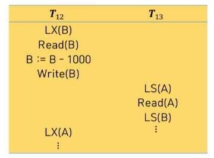
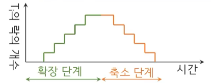

# 13강. 동시성 제어

## 00. 동시성 제어의 개념

- 트랜잭션 직렬화와 회복화는 스케줄이 데이터 일관성에 영향을 미치는 여부를 판별하고 일관성이 유지되는 상태로 복원시키기 위해 정의한 개념
- 일관성 훼손을 발생시키는 트랜잭션에 대해 동시성 제어를 통해 일관성 유지에 개입
  - 트랜잭션 간 연산 순서 제어
  - 어떠한 데이터 읽기, 갱신 연산에도 무결성 유지
  - 동시에 실행되는 트랜잭션 수 증가
- 동시성 제어 규약
  - 락 기반 규약
  - 타임스탬프 기반 규약
  - 검증 기반 규약

## 01. 락 기반 규약

### 락 기반 규약의 개념

- 직렬 가능성을 보장하기 위해 락(잠금)을 사ㅛㅇ하여 데이터 항목에 연산 적용 전 트랜잭션이 락을 획득하고 연산 후 반납하도록 하는 규약
- 락의 종류
  - 공유 락(S: shared lock)
    - 트랜잭션 TS LS(Q) 명령으로 데이터 항목 Q에 공유 락을 획득하면 T는 Q를 읽을 수는 있지만 쓸 수는 없는 락
  - 배타 락(X: exclusive lock)
    - 트랜잭션T가 LX(Q) 명령으로 데이터 항목 Q에 대한 배타 락을 획득하면, T가 Q를 읽고 쓸 수 있는 락

### 락 양립성

- 트랜잭션은 연산하고자 하는 데이터에 대한 락을 획득해야만 연산 진행 가능

- 락 양립성 합수

  

  - 공유 락은 다른 공유 락과 양립 가능
  - 배타 락과 다른 락과 양립 불가능
  - 배타 락의 요청은 공유 락이 반납될 때 까지 대기
  - 락의 반납은 `UN()` 명령 사용

### 예제 트랜잭션

### 동시 실행 스케줄

- T10이 **락을 일찍 반납**하여 비일관적인 상태에서 데이터 접근이 가능해져 T11이 정확하지 않은 결과값을 출력

### 락 반납이 지연된 트랜잭션

### 락 반납 지연의 문제

- T12, T13에 대한 부분 스케줄
  - T12이 B에 대한 배타 락을 반환할 때 까지 T13은 대기
  - T13이 A에 대한 공유 락을 반환 할 때까지 T12는 대기
- 따라서, 교착상태(deadlock) 야기
  - 두 트랜잭션 중 하나를 롤백
  - 한 트랜잭션이 롤백되면 그 트랜잭이 획득했던 모든 락은 반납

### 2단계 락킹 규약(2PL: 2 paced locking point)

- 트랜잭션은 락을 요청, 반납하는 두 단계로 구성
  - 확장 단계
    - 락을 얻을 수 있으나 반납할 수 없는 단계
  - 축소 단계
    - 락을 반납할 수는 있지만, 새로운 락을 얻을 수 없는 단계
- 직렬성을 보장하나 교착상태 예방 불가

## 02. 타임스탬프 기반 규약

### 타임스탬프 기반 규약의 개념

- 각 트랜잭션 Ti 실행의 순서를 판단하기 위해 타임스탬프 TS(Ti)를 부여

- 데이터 항목에 대한 타임스탬프 할당
  - W-TS(Q)
    - Write(Q)를 성공적으로 실행한 트랜잭션 중 가장 큰 타임스탬프
  - R-TS(Q)
    - Read(Q)를 성공적으로 실행한 트랜잭션 중 가장 큰 타임스탬프
- 타임스탬프 할당 방법
  - 시스템 클럭 값
  - 논리적 계수기

###  Read(Q)를 수행할 때

-  TS(Ti) < W-TS(Q)이면 Read 연산이 거부되고 Ti는 롤백
- TS(Ti) >= W-TS(Q)이면 Read 연산이 수행되고 R-TS(Q)는 기존 R-TS(Q)와 TS(Ti) 중 최대값으로 설정

### Write(Q)를 수행할 때

-  TS(Ti) < R-TS(Q) 또는 TS(Ti) < W-TS(Q)이면 Write 연산이 거부되고 Ti는 롤백
- 그렇지 않으면 Write 연산이 수행하고 W-TS(Q)는  TS(Ti) 로 설정

### 타임스탬프 기반 규약의 적용

- TS(T14) < TS(T15)

  

  

### 토마스 기록 규칙

- TS(Ti) < R-TS(Q)이면 Write 연산이 거부되고 Ti는 롤백
- **TS(Ti) < W-TS(Q)이면 Write 연산은 거부된다.**
  - 롤백 연산을 일정 부분 줄여줌
- 그렇지 않으면 Write 연산을 수행하고, W-TS(Q)는 TS(Ti)로 설정

## 03. 교착상태(deadlock)

### 교착상태의 개념

- 특정 트랜잭션 집합 내 속하는 모든 트랜잭션이 집합 내의 다른 트랜잭션을 기다리고 있는 상태

  

- 두 트랜잭션 중 하나를 반드시 롤백

### 교착상태 처리 방법

- 교착 상태 발생이 비교적 높은 시스템의 경우
  - 교착 상태 방지 규약 사용
    - 모든 데이터 항목에 대해 락을 설정하는 기법
    - 단점1: 트랜잭션이 시작되기 전에 어떤 데이터에 락을 걸어야 하는지 미리 알기가 어려움
    - 단점2: 락이 걸린 상태에서 많은 데이터들이 오랫동안 사용되지 않아 데이터 항목에 대한 이용률이 매우 낮아짐
  - 타임스탬프를 이용한 선점유기법
- 교착 상태 발생이 비교적 높지 않은 시스템의 경우
  - 교착 상태 탐지와 회복 기법 사용
    - 대기 그래프
    - 희생자 선정

### 교착상태 방지

#### 타임스탬프를 이용

- Tj가 락을 소유한 데이터 항목을 Ti가 요청하는 상황

  - **Wait-die 기법(비선점유 기반):** TS(Ti) < TS(Tj)일 때 Ti가 기다리고 그렇지 않으면 Ti를 롤백

    - 직렬성을 유지하는 거에는 관심없음

    

  - **Wound-wait 기법(선점유 기반):** TS(Tj) < TS(Ti), Ti가 기다리고 그렇지 않으면 Tj를 롤백하고 락을 이양

    

### 교착상태의 탐지와 회복

- 교착상태 발생이 비교적 높지 않은 시스템의 경우 **주기적으로 교착상태를 탐지**하고 발생시 회복 절차를 수행
- 탐지 및 회복 절차
  - 트랜잭션이 할당된 데이터 항목과 현재 요청되고 있는 데이터 항목에 대한 정보를 유지
  - 교착상태가 발생여부를 판별하기 위해 시스템의 상태를 검사하는 알고리을 주기적으로 수행
  - 교착상태가 검출되면 시스템은 교착상태로부터 회복을 위한 절차를 수행

#### 교착상태 탐지

- 대기 그래프(wait-for graph)를 이용하여 확인 가능
  - 정점 V는 시스템 내의 트랜잭션으로 구성되며
  - 간선 E는 트랜잭션의 순서쌍 (Ti, Tj)으로 이루어짐
    - Ti가 요청한 데이터의 락을 Tj가 소유하고 있으며 Ti는 Tj가 락을 반납하기 대기하는 상태

- 대기 그래프에 **사이클**이 있다면 교착 상태가 발생한 것

#### 교착상태 회복

- 희생자 선정: 롤백 비용이 가장 적은 트랜잭션을 선택
  - 연산을 수행한 시간과 남은 작업을 마치기 위한 시간
  - 사용한 데이터와 트랜잭션 실행에 필요한 추가적인 데이터
  - 롤백에 포함되는 트랜잭션의 개수

- 희생자 롤백: 어느 시점까지 롤백할 것인지를 결정
  - 전체 롤백 VS 교착상태를 해결하는 지점
  - 모든 트랜잭션의 상태에 대한 정보를 부가적으로 유지

- 무한정 기다림 해결
  - 같은 트랜잭션이 항상 희생자로 선정되지 않도록 희생자 선정시 롤백 횟수를 고려