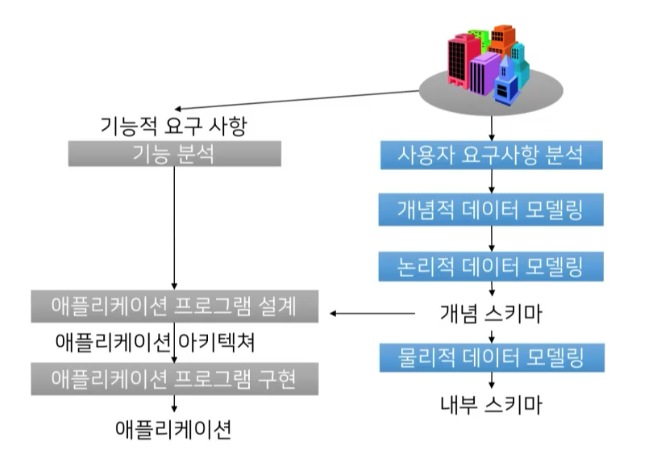
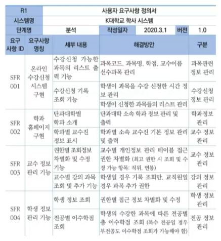
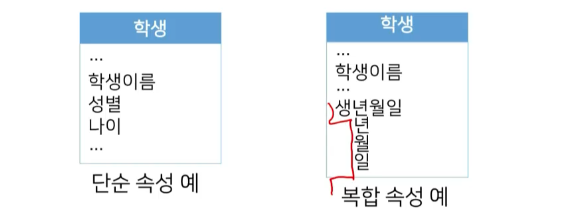
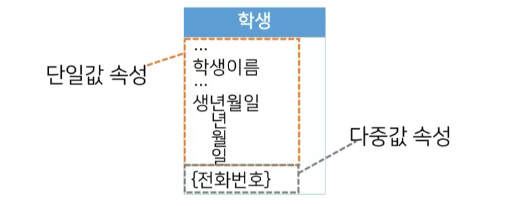

# 2강. 데이터베이스 모델링

## 01. 데이터베이스 모델링의 이해

### 데이터베이스 모델링의 필요

1. 비즈니스적 관점
   - 어떤 데이터를 저장해야 하는가?
2. 컴퓨터 프로그래머 관점
   - 어떻게 데이터를 저장해야 하는가?

### 데이터베이스 시스템 구현 과정

### 데이터베이스 모델링의 개념

1. 데이터의 의미를 파악하고 데이터와 관여하는 업무 프로세스를 개념적으로 정의하고 분석하는 작업

2. 모델링의 단계

   

### 데이터 모델

- 모델

  - 큰 틀의 가이드라인

- 사용할 데이터를 선별하여 데이터베이스에 체계적으로 구조화하여 저장, 사용할 방법이 필요

- 데이터모델

  - 의미, 데이터 타입, 연산 등을 명시하기 위해 사용할 수 있는 개념들의 집합

- 데이터 모델링

  - 실세계의 일부분을 DBMS가 지원하는 데이터 모델의 형태로 나타내는 과정(가이드라인, 구조화하는 과정)

  

### 데이터베이스 모델링의 단계

1.  **개념적 데이터 모델링**
   - 요구사항의 해석 오류 방지
   - 실세계의 데이터를 <u>개념적으로 일반화</u>시켜 데이터 구조, 데이터 타입, 속성, 관계, 제약조건 등을 이끌어내는 과정
2. **논리적 데이터 모델링**
   - 특정 DBMS의 구현 <u>모델에 맞춰 데이터를 표현</u>하는 과정
   - 데이터 정의 언어로 기술된 <u>개념 스키마 생성</u>
3. **물리적 데이터 모델링**
   - 데이터베이스 파일의 내부 저장구조, 파일 구성, 인덱스, 접근 경로 등을 결정하는 과정

## 02. 사용자 요구사항 분석

### 사용자 요구사항 분석의 필요

1. 데이터에 대한 충분한 사전 분석 없이 적절한 설계 불가능
   - 데이터베이스의 구조가 점차 복잡해지고, 수명 주기가 단축되기 때문에 신속, 정확성이 요구
   - 데이터베이스의 활용 범위가 확대됨에 데이터베이스의 효율적 운용에 초점
2. 사용자의 요구를 명세하지 않고 데이터베이스 설계 및 개발을 진행하는 경우
   - 결과물의 완성도 저하 및 신뢰도 추락
   - 개발 후, 발생하는 에러 수정에 추가 비용 지출(유지보수 비용 올라감)

### 사용자 요구사항 분석의 개념

1. 시스템의 대상이 되는 업무를 분석
   - 정보 시스템의 데이터베이스가 신속하고 효과적으로 업무 처리 지원
   - 필요한 데이터를 저장 및 운용할 수 있는 구조 개발
2. **도출, 분석, 기록** 단계로 수행
   - 국제 표준화: IEEE-Std-830
3. 

### 사용자 요구사항 분석 과정

**제안요청서**(Request For Proposal)(사용자) => **요구사항명세서**(개발자) => **요구사항정의서**

- **요구사항 도출단계**
  - 제안요청서
  - 구축대상, 프로젝트 목표, 범위를 기준으로 조사범위 결정
  - 업무관계자 인터뷰
  - 외부자료 수집 및 분석
- 요구사항 분석단계
  - 요구사항명세서
  - 도출된 요구사항의 명확성, 완전성, 모호성 검증
  - 불완전한 부분이 존재할 경우, 요구사항 도출단계 재수행
  - 요구사항을 분류하여 통합 또는 분리
- 요구사항 기록단계
  - 요구사항정의서
  - 요구사항 목록 정리 및 관리자의 승인
  - 정리된 요구사항을 형식에 맞춰 문서화
  - 프로젝트 종료 때까지 반영 여부 지속적 관리

- 요구사항 정의서의 예시(이건 엄청 간단한 예시)

  

## 03. ER 모델

### (1) ER 모델의 개념

1. 1976년 카네기 멜론 대학의 Peter Chen 박사 제안
2. 실세계 속성으로 이루어진 개체(entity)와 개체 사이의 관계(relationship)을 정형화시킨 모델
3. 개념적 모델링 단계에서 사용되는 데이터 모델
4. 데이터 구조와 관계를 ERD(ER다이어그램)으로 표현
5. 구성요소
   - 개체집합
   - 관계집합
   - 속성

### (2) ER 모델 구성요소

#### 개체 집합

1. 개체(entity)
   - 실세계에 존재하는 다른 객체와 구별되는 유무형의 사물
   - 개체를 설명하는 여러 속성들로 구성
2. 개체 집합(entity set)
   - 같은 속성을 공유하는 개체들의 모임

#### 관계 집합

1. 관계(relationship)
   - 개체와 개체 사이의 연관성
2. 관계 집합(relationship set)
   - 개체 집합 간의 연결 관계
   - 위 예: 학생 **개체집합**과 학과 **개체집합**은, 전공 **관계집합**으로 연결된다

### (3) 속성

1. 개체를 구체적으로 설명
2. 속성에 포함될 수 있는 값의 특성에 따라 여러 종류로 구분
3. 속성의 종류
   - 단순 - 복합
   - 단일값 - 다중값
   - 유도 - 저장

#### 속성의 종류

#### 

#### 단순-복합 속성

- 단순속성
  - 더 작은 구성요소로 나눌 수 없는 속성

-  복합 속성
  - 더 작은 구성요소로 나눌 수 있는 속성

#### 단일값 - 다중값

- 단일값 속성
  - 한 개체에 대해 단 하나의 값만을 갖는 속성
- 다중값 속성
  - 한 개체에 대해 여러개의 값을 갖는 속성

#### 유도 - 저장

- 유도 속성
  - 다른 속성의 값으로부터 값이 유추될 수 있는 속성
  - 실제 저장하지 않아도, 다른 저장값으로부터 유추가능한 속성
- 저장 속성
  - 유도 속성을 위해 사용될 수 있는 속성

### (4) 제약조건

- 데이터모델은 데이터, 의미, 구조, 연관성 및 **데이터의 조건**을 표현하기 위한 도구
- ER모델은 개체와 관계에 대한 표현의 정확성을 위해 데이터가 준수해야 하는 제약조건을 정의할 수 있는 표현 방법을 제공
- 제약조건(constraints)의 종류
  - 사상수
  - 참가 제약조건
  - 키 속성

#### 사상수(mapping cardianlity)

- 관계 집합에 참가한 개체 집합에 대해 한 개체가 다른 개체와 관계를 맺을 수 있는 수량을 명시

  - 일대일(1:1)

    

  - 일대다(1:N) (교수:과목)

    

  - 다대일(N:1)

  - 다대다(N:N)

    

#### 참가 제약조건(participation constraints)

- 전체적 참가
  - 어떤 개체 집합의 모든 개체가 관계 집합에 참여 하는 조건
- 부분적 참가
  - 어떤 개체 집합의 일부 개체가 관계 집합에 참여 하는 조건

#### 키 속성

- 각 개체를 구별하는데 사용되는 유일한 값을 가지는 속성의 집합
  - 개체를 고유하게 구분하는 역할
  - 관계 집합의 특정 관계를 찾는 역할
  - 밑줄을 그어놓음

#### 특수 속성과 특수 관계

- 관계 집합의 속성
  - 두 개체 집합의 관계에서 생성되는 값을 저장하는 속성
- 재귀적 관계
  - 한 개체 집합이 자기 자신과 관계 집합을 형성하는 관계

#### 특수 관계

- 약한 개체 집합(계좌 개체)
  - 개체의 존재 유무가 관계를 맺고 있는 개체의 속성에 종속되는 개체 집합
  - 계좌개체는 학생 개체가 없으면 존재할 수 없음 
- 강한 개체 집합(학생 개체)
  - 약한 개체 집합과 연결되는 일반 개체 집합
  - 학생 개체는 계좌 개체가 없어도 존재함