# 3강. 관계형 모델

## 01. 관계형 모델의 개념

### 데이터베이스 모델링 과정

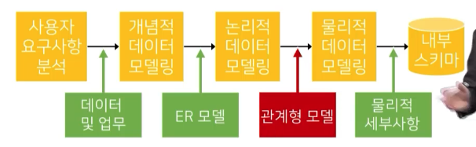

### 개념적 데이터 모델링의 결과

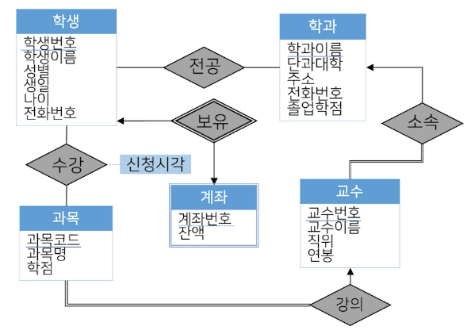

- **이중선**의 경우 전체적 참가를 말하는 참가제약조건
- 관계집합과 개체집합을 이중선으로 그리는 것


### 논리적 데이터 모델링 단계

- DBMS에서 사용하는 데이터 모델에 맞추어 데이터를 표현하는 과정
- **데이터 정의 언어(DDL)**로 기술된 개념 스키마 생성
- 관계형 모델(relational model)
  - 1969년 에드가 F.코드에 의해 제안
  - 릴레이션으로 데이터 표현
  - 데이터 표현이 단순, 직관적 구조화 모델
  - 현재 대다수 DBMS의 기초
    - 관계형 모델을 사용하는 관계형 DBMS(RDBMS)
    - Oracle, DB2, PostgreSQL, MySQL, MSSQL 등


### 릴레이션의 구성

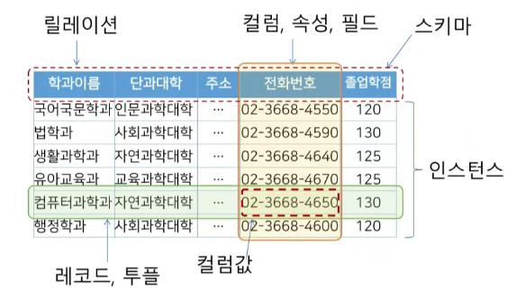


### 릴레이션의 특징

- 레코드의 유일성
  - 중복된 레코드 존재가 불가능
- 레코드의 무순서성
  - 레코드의 순서는 의미가 없음
- 컬럼의 무순서성
  - 컬럼은 순서가 없고, 이름과 값의 쌍
- 컬럼값의 원자성
  - 모든 값들은 나눌 수 없는 단하나의 의미


### 키(key)의 역할

- 릴레이션의 레코드를 유일하게 식별할 수 있는 값

#### 키의 종류 및 속성

- 키의 속성 두 개를 동시에 만족해야 함
  - 유일성(Uniqueness)
  - 최소성(Irreducibility)
- 키의 종류
  - 수퍼키(super key): 유일성 만족
  - 후보키(candidate key): 유일성, 최소성 만족
  - **기본키(PK: primary key)**: 레코드의 구분을 위해 선택된 후보키
  - **외래키(FK: foreign key)**: 참조된 다른 릴레이션의 기본키


#### 관계형 모델의 예

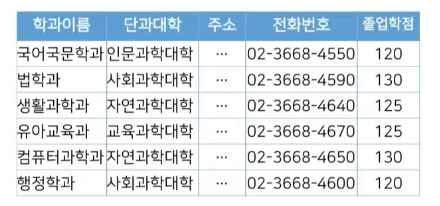

- 슈퍼키: 학과이름, {학과이름, 단과대학}, 주소, 전화번호, {전화번호, 졸업학점} 등
- 후보키: 학과이름, 주소, 전화번호
- 기본키: 학과이름
- 외래키: 아래 키의 참조 참고


#### 키의 참조

- 두 릴레이션에 포함된 레코드 간 연관성 표현(외래키)

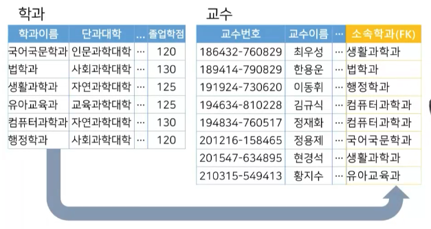


### 관계형 모델의 제약조건

- 영역제약조건
  - 컬럼에 정의된 영역(domain)에 속한 값으로만 컬럼값이 결정
- 키 제약조건
  - 키는 레코드를 고유하게 구별하는 값으로 구성
- 개체 무결성 제약조건
  - 어떠한 기본키 값도 널(null)이 될 수 없음
- 참조 무결성 제약조건
  - 반드시 존재하는 레코드의 기본키만 참조 가능


#### 널(NULL)의 개념

- '없음' 또는 '0'이 아닌 미지의 값에 대한 표현

  - 입력된 적이 없는 값 / 입력될 수 없는 값

  - 적용 불가능한 값

- 개체 무결성 제약조건

  - 어떠한 기본키 값도 널이 될수 없음


## 02. ERD의 변환

### 논리적 데이터 모델링

- DBMS의 구현 모델에 맞춰 데이터를 표현하는 과정
- 데이터 정의 언어로 기술된 개념 스키마 생성
- **논리적 데이터 모델링**의 필요
  - RDBMS의 구현 모델에 맞춰 데이터의 구조와 관계 표현
  - 작성된 ERD를 RDBMS가 수용 가능한 구조로 변환


### ER 다이어그램 변환 규칙

#### 관계형 모델로 변환 방법

1. 개체 집합
   - 개체 집합은 릴레이션으로 변환
2. 약한 개체 집합
   - 강한 개체 집합의 키 속성을 약한 개체 집합의 릴레이션에 포함
3. 일대일 관계
   - 두 릴레이션 중 한 릴레이션이의 기본키를 다른 릴레이션에서 외래키로 참조
4. 일대다 또는 다대일 관계
   - '일'쪽의 기본키를 '다'쪽 릴레이션에서 외래키로 참조
5. 다대다 관계
   - 관계 릴레이션을 생성하고, 두 릴레이션의 기본키를 각각 참조하는 외래키를 복합키 형태의 컬럼으로 구성
6. 다중값 속성
   - 릴레이션의 기본키를 참조하는 외래키와 다중값 속성으로 별도의 릴레이션으로 구성
7. 관계 집합의 속성
   - 외래키가 위치한 릴레이션의 컬럼으로 삽입


### ER 다이어그램의 변환

- 일대다

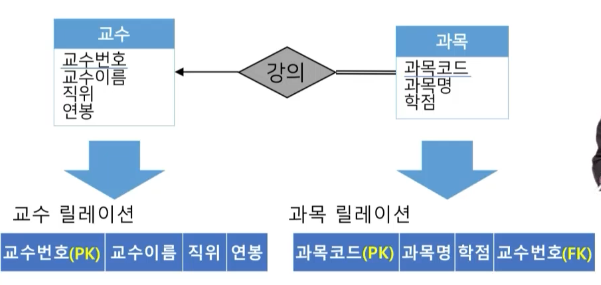

- **다대다 ⭐️**

  - 관계집합인 '수강' 자체가 릴레이션이 됨
  - 새로운 릴레이션에는 양쪽 릴레이션의 기본키들이 참조되어 외래키
  - 관계집합의 속성인 '신청시각'이 외래키가 위치한 곳에 따라옴

  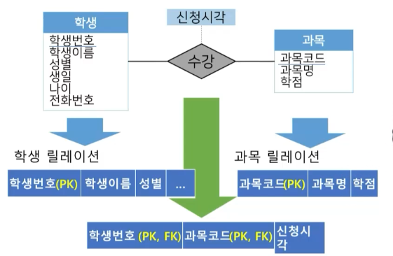

- 일대일

  - 외래키 위치는 어느 쪽으로 가도 괜찮지만 되도록 레코드 갯수가 적은 쪽으로 가는 것이 좋음
  - 약한 관계 (학생이 존재하지 않으면 계좌도 존재하지 않음)인 경우
    - 학생번호를 외래키로만 설정하는 것이 아니라, 참조된 외래키가 집합으로 **복합으로 기본키**를 이루도록
    - 즉, 참조되는 외래키가 그 테이블의 기본키가 된다

- 가중값 속성 처리 방법 알아두기 ⭐️


## 03. 데이터 연산

### 관계 연산의 개념

- 관계형모델을 기반으로 구성된 릴레이션을 사용하여 새로운 릴레이션을 생성하는 표현
- 사용자의 관점에서 필요한 데이터를 릴레이션에서 추출하는 방법을 제공하는 도구
- 관계 대수(relational algebra)
  - 관계 연산을 정의하는 방법
  - 주어진 릴레이션에서 필요한 릴레이션을 만드는 연산자(∪, ⋂, −, σ, 𝜋, x, ⋈, ÷, 집계함수 등)로 구성
  - 관계 대수 연산자는 새로운 임시 릴레이션 생성
  - 연산자를 중첩하여 연산 처리 절차를 표현


### 관계 대수 연산자

#### 셀렉트 연산

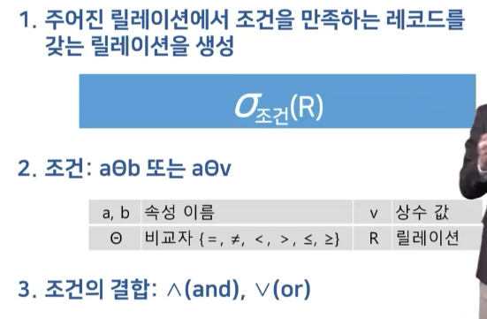

- 예시

  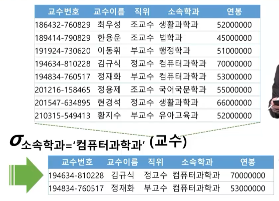

  ​	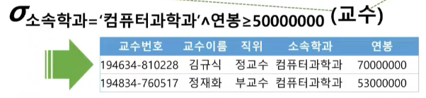


#### 프로젝트 연산

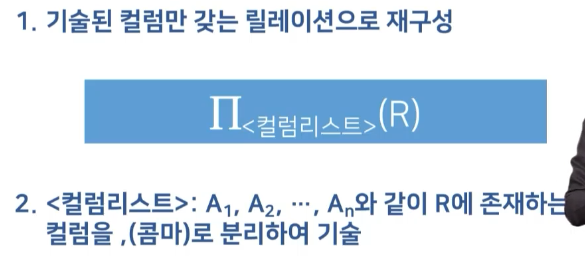

- 존재하지 않는 컬럼을 넣으면 안됨!

- 예제

  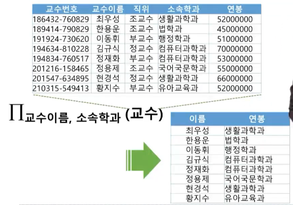


#### 관계 대수 연산식의 활용

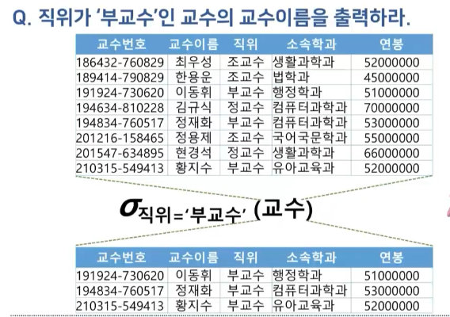

​		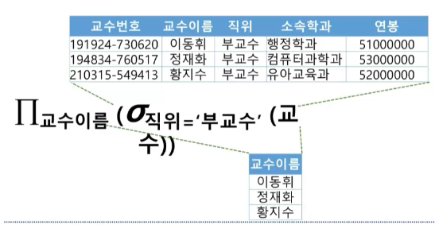


#### 집합 연산자

- 수학적 집합 이론에서의 이진 연산
  - 합집합, 교집합, 차집합 등
- 릴레이션은 집합, 레코드는 집합에 포함된 원소
- 집합 연산자 사용 조건
  - 릴레이션 R과 S의 **차수**(한 릴레이션에 포함된 컬럼의 갯수)가 동일
  - 모든 i에 대해 R의 i번째 컬럼의 도메인과 S의 i번째 컬럼의 **도메인**이 반드시 동일


#### 카티시언 프로덕트 연산 ⭐️

- 두 릴레이션에 포함된 레코드 간의 모든 조합을 생성하는 이항 연산자

  ```
  R x S
  ```

  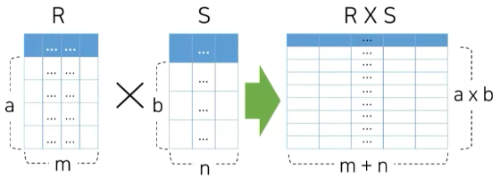

- 예시

  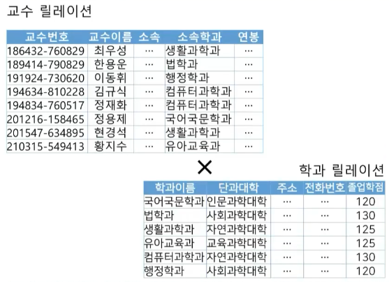

  - 카티시언 프로덕트 결과

    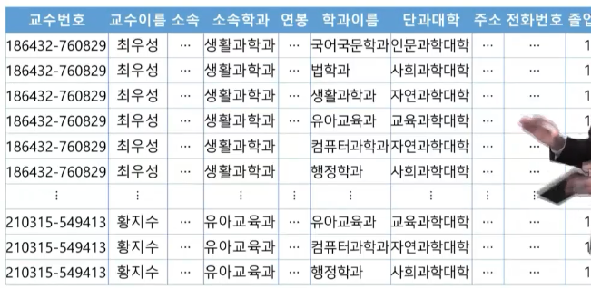


#### 조인 연산

- 두 릴레이션에서 조건을 만족하는 레코드를 결합한 레코드로 구성된 릴레이션을 생성

  - 카티시언 프로덕트 수행 후, 셀렉트 연산

  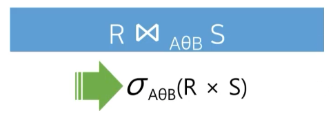

- 예시

  - 컴퓨터과학과 소속의 교수가 강의하는 과목의 과목명과 과목코드
    - **교수** 릴레이션
    - 과목명, 과목코드는 **과목** 릴레이션
    - 따로 질문해서 둘이 결합할 수는 없음 > 따라서 카티시언 프로덕트가 아주 중요!

- 카티시언 프로덕트 예시

  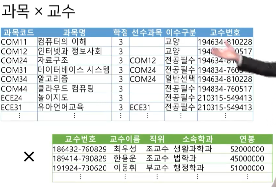

  - 카티시언 프로덕트 결과

    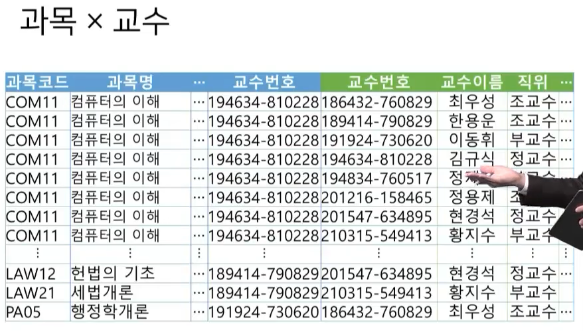

  - 카티시언 프로덕트와 셀렉트 결과

    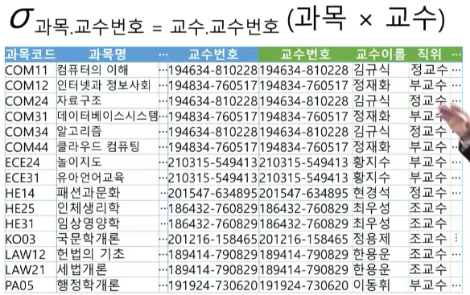

  - 질문: 컴퓨터 과학과 교수가 담당하는 과목명과 과목코드를 추출하기 위해서는?

    - 한번만 더 셀렉트와 프로젝트 연산 하면됨

- **조인연산**의 예시

  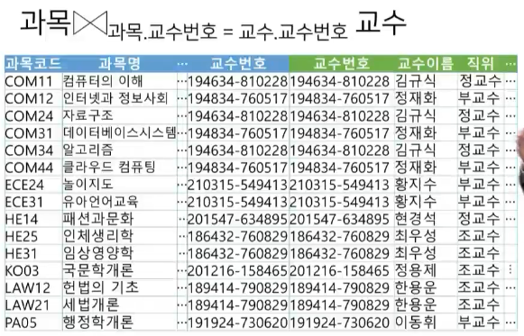


#### 집계 함수 연산

- 집계 함수를 값들의 집합 또는 레코드의 집합에 적용하는 연산

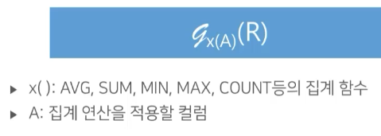

- COUNT 예시

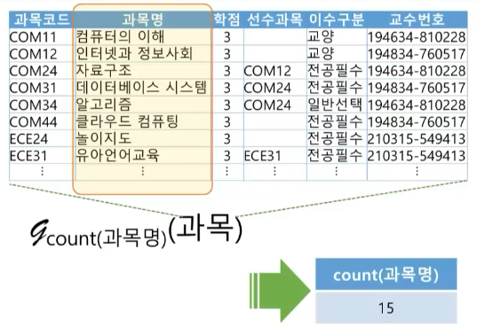

- 레코드 그룹화를 위해 집계 함수 연산자 앞에 그룹화 속성을 기술

  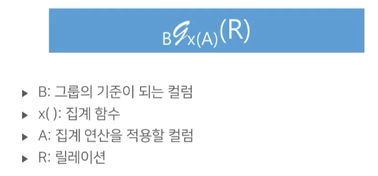

  - B: "그룹의 기준이 되는 컬럼"

- GROUP BY 예시

  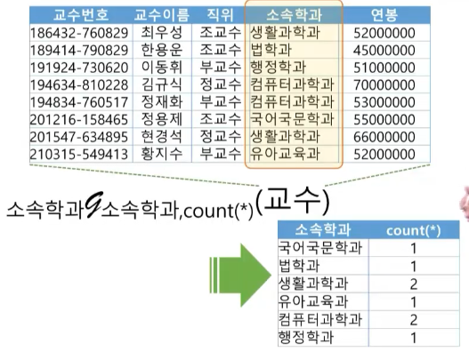