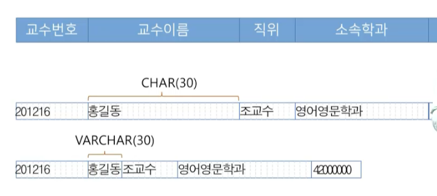
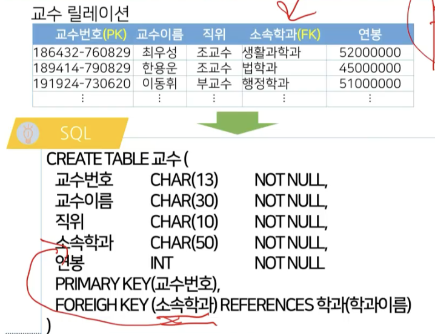
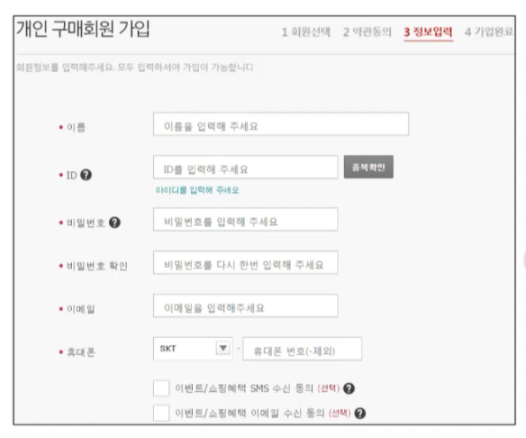
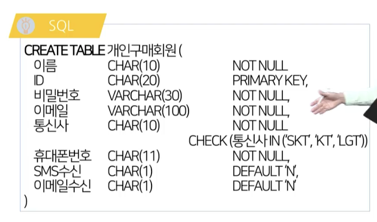

# 4강. SQL(1)

## 01. 데이터베이스 언어

### 데이터베이스 언어의 필요

- DBMS에 데이터를 의뢰하기 위한 언어


### SQL의 개요

- SQL(Structured Query Language)은 관계대수에 기초하여 RDBMS의 데이터 관리를 위해 설계된 언어
- 1986년 ANSI, 1987년 ISO에서 표준으로 제정
  - SQL-86, SQL-89, SQL-92, SQL:1999, SQL:2003, SQL:2008
  - 상용 DBMS의 특성에 맞게 국제표준을 확장한 독자적 버전 존재
- 특징
  - 비절차적(선언형) 언어, 필요한 데이터만 기술
  - 인간의 언어와 매우 유사하고 간단, 명료


### SQL의 구성

- 데이터 정의 언어(DDL: Data Definition Language)
  - 데이터베이스 내의 객체를 생성 및 삭제하고 그 구조를 조작하는 명령어의 집합
  - 데이터가 준수해야 하는 제약조건 기술
  - CREATE, ALTER, DROP문 등
- 데이터 조작 언어(DML: Data Manipulation Language)
  - DDL에 의해 정의된 테이블에 데이터를 조작하는 명령어의 집합
  - 데이터에 대한 CRUD 명령 포함
  - INSERT, UPDATE, DELETE, SELECT문 등


## 02. 데이터 정의 언어

### 데이터 정의 언어의 개념

- 데이터베이스 객체를 생성, 삭제 또는 구조를 수정하는 명령어의 집합
- 데이터베이스 객체의 종류
  - 데이터 저장 - 테이블, 인덱스, 뷰
  - 데이터 조작 - 트리거, 프로시저, 함수 등

- 데이터 정의 명령어 종류
  - CREATE, ALTER, DROP


### 데이터 정의 언어의 구문 형식


### 스키마 정의

- 스키마 = 데이터베이스
- 한 조직의 데이터베이스 시스템의 운영에 필요한 테이블, 인덱스, 뷰 등의 데이터 베이스 객체의 집합
- 스키마 관리 방법
  - Forward Engineer
  - SQL 에디터
  - 내비게이터 패널


### 스키마 관리 구문 형식

- 스키마 생성

  ```sql
  CREATE SCHEMA 스키마 이름
  ```

  

- 스키마 삭제

  ```sql
  DROP SCHEMA 스키마 이름
  ```

  

### 테이블 정의

- 새로운 2차의 형태의 테이블 생성

  

### 데이터 타입의 개념

- 컬럼이 가질 수 있는 값의 범위, 즉 도메인을 결정
- 프로그래밍 언어에서의 변수를 생성하는 데이터 타입의 사용목적과 방법이 매우 유사
- 기본 데이터 타입
  - 문자
    -  CHAR
    - VARCHAR
    - TEXT
  - 숫자
    - INT
    - FLOAT
    - DOUBLE
    - DECIMAL(m,n)
  - 날짜/시간
    - DATE
    - TIME
    - DATETIME
    - TIMESTAMP


### 정수 데이터 타입

- TINYINT - 1바이트 정수, -128 ~ 127
  - 나이, 학년 등
- SMALLINT - 2바이트, -32768~32767
  - 물품번호, 인원 등
- INT - 4 바이트, 약 -20억 ~ 20억
  - 물품 금액, 전화번호 등 일반 크기 정수
- BIGINT - 8바이트 정수
  - 계좌 잔고, 천문학적 크기의 정수


### 실수 데이터 타입

- 고정 소수형
  - DECIMAL(M,N) - 전체 M자리, 소수점 이하 N자리의 숫자
  - NUMERIC - DECIMAL과 동일
- 부동 소수형
  - FLOAT - 4바이트 크기 부동 소수
  - FLOAT(P) - 소수점 이하 P개 자리
  - DOUBLE - 8바이트 크기 부동 소수


### 날짜 및 시간 데이터 타입

- 날짜 데이터 타입
  - DATE -"YYYY-MM-DD"
  - YEAR - 'YYYY'

- 시간 데이터 타입
  - TIME - 'HH:MI:SS'
- 날짜 및 시간 데이터 타입
  - DATETIME - 'YYYY-MM-DD HH:MI:SS'
  - TIMESTAMP - DATETIME과 동일


### 문자 데이터 타입

- CHAR(N) - 최대 길이가 N인 고정길이 문자열

- VARCHAR(N) - 최대 길이가 N인 가변길이 문자열

- 'DATABASE' 문자열 저장 시

  


### CHAR와 VARCHAR



- CHAR의 경우, 공간낭비가 있지만 유지보수가 덜하고
- VARCHAR의 경우 공간낭비는 없지만 수정시 문제


### 문자 데이터 타입

- TEXT, CLOB - 길이가 최대 2~4GB인 가변길이 문자열
- ENUM - 유한개의 문자열 집합 중 하나의 값을 선택
  - 성별 - ENUM('남', '여')
  - 혈액형 ENUM('A', 'B', 'O', 'AB')


### 테이블 수정

- 생성된 테이블에 컬럼을 추가, 수정(이름, 데이터타입, 제약조건) 또는 삭제하는 명령
- 컬럼 삭제 또는 컬럼의 데이터 타입 수정시 데이터에 대한 소실이 발생하므로 많은 주의 필요
- 테이블 수정 방법
  - SQL 구문
  - 내비게이터 패널


### 테이블 수정 구문 형식

- 새로운 컬럼을 추가, 삭제, 수정하는 등 테이블의 구조를 변경

  ```sql
  ALTER TABLE 테이블이름
  	[ADD COLUMN]
  	[DROP COLUMN]
  	[CHANGE COLUMN]
  	[MODIFY COLUMN]
  ```


### 테이블 수정 질의의 사용

- 교수 테이블에 데이트 타입이 INT인 나이 컬럼을 추가하시오

  ```sql
  ALTER TABLE 교수
  	ADD COLUMN 나이 INT
  ```


### 테이블 삭제

- 존재하는 테이블을 스키마에서 삭제
- 삭제할 테이블의 모든 데이터가 소실, 복구가 불가능하므로 주의 필요
- 테이블 삭제 방법
  - SQL 구문
  - 네비게이터 패널

- 테이블을 데이터베이스에서 제거

  ```sql
  DROP TABLE 테이블 이름
  ```

- 교수 테이블을 삭제하시오

  ```sql
  DROP TABLE 교수
  ```


### 제약 조건

- 테이블과 테이블에 존재하는 데이터를 보다 무결하게 관리하기 위한 목적으로 사용
- DBMS는 테이블 조작 시 테이블에 정의된 제약조건을 만족시키는지 지속적으로 검사
- DBMS는 적용하려는 제약의 유형에 따라 다양한 제약 조건을 지원


### 제약 조건의 종류

- PRIMARY KEY
  - 기본키 지정, UNIQUE와  NOT NULL  특성
- FOREIGN KEY
  - 외래키 지정, 참조 컬럼 정의
- NOT NULL
  - NULL이 될 수 없는 컬럼에 지정
- UNIQUE
  - 동일한 컬럼값을 가질 수 없음을 지정
- AUTO_INCREMENT
  - 레코드가 추가될 때 자동적으로 속성값이 1부터 1씩 증가되어 입력
- CHECK
  - 컬럼값이 특정 조건 준수 여부 지정


### 제약조건의 사용




### 제약조건의 응용



​	