# 5강. SQL(2)

## 01. 데이터 삽입, 수정, 삭제

### 데이터 조작 언어의 개념

- DML: Data Manipulation Language
- 정의된 테이블에 레코드를 삽입, 수정, 삭제 및 검색하는 사용되는 명령어의 집합
- 명령어 종류
  - INSERT, UPDATE, DELETE, SELECT


### INSERT 문

- 테이블에 새로운 레코드를 삽입하는 명령문

  - 테이블에 새로운 레코드 삽입
  - 모든 속성 또는 부분 속성에 대한 속성값 삽입

  ```sql
  INSERT INTO 테이블이름
  	VALUES(값1, 값2, ... 값n)
  ```

  ```sql
  INSERT INTO 테이블이름(컬럼1, 컬럼2, ... 컬럼m)
  	VALUES(값1, 값2,... 값m)
  ```


#### INSERT문의 사용

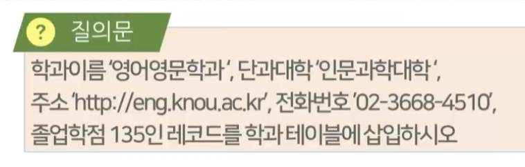

```sql
INSERT INTO 학과
	VALUES('영어영문학과', '인문과학대학', 'http://eng.knou.ac.kr', '02-3668-4510', 135)
```


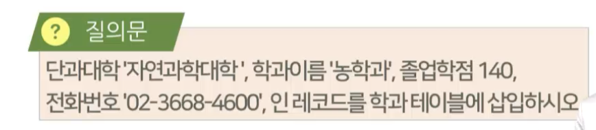

```sql
INSERT INTO 학과('단과대학', '학과이름', '졸업학점', 주소)
	VALUES('자연과학대학', '농학과', 140, '02-2668-4600')
	
# 입력안된건 NULL로 채워짐
```


### UPDATE 문

- 조건을 만족하는 레코드의 특정 컬럼값을 수정

  ```sql
  UPDATE 테이블이름
  	SET 컬럼1=값1[, 컬럼2=값2, ... , 컬럼n=값n]
  	[WHERE 조건]
  ```

  ```sql
  UPDATE 테이블이름
  	SET 컬럼1=수식1[, 컬럼2=수식2, ... , 컬럼n=수식n]
  	[WHERE 조건]
  
  # 연산 동반 가능
  ```


#### UPDATE문의 사용

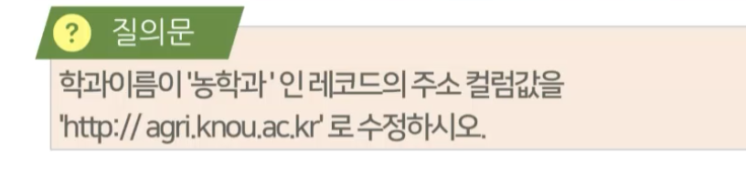

```sql
UPDATE 학과
	SET 주소 = "http://agri.knou.ac.kr"
	WHERE 학과='농학과'
```

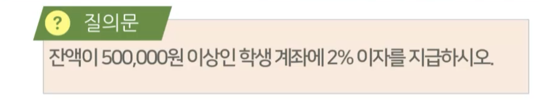

```sql
UPDATE 학과
	SET 잔액 = 잔액*1.02
	WHERE 잔액 >= 500,000
```


### DELETE 문

- 조건에 일치하는 레코드 집합을 테이블에서 삭제할때 사용

  ```sql
  DELETE FROM 테이블이름
  	[WHERE 조건] # WHERE 없으면 모든 레코드 삭제됨
  ```


#### DELETE문의 사용

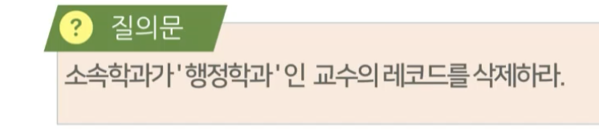

```sql
DELETE FROM 교수
	WHERE 소속학과='행정학과'
```

- 교수번호를 참조하는 또다른 테이블이 있다면
  - 삭제가 안된다
  - 참조 무결성 제약조건
  - 참조되는 대상을 먼저 삭제한 후, 삭제 필요

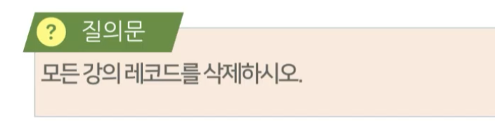

```sql
DELETE FROM 과목
```

- 조건(WHERE)이 없으면 모든 레코드 삭제됨
  - 이런 경우 진짜 없다 


#### SAFE UPDATES 모드

```sql
SET SQL_SAFE_UPDATES = 0 or 1 # 0이면 꺼짐, 1이면 켜짐
```

- WHERE 절이 없는 UPDATE/DELETE 문은 테이블의 전체 레코드를 변경/삭제
- 의도하지 않은 데이터 변경/삭제 방지를 위해  MySQL은 SAFE UPDATES 모드를 지원
- 기본키가 아닌 컬럼을 대상으로 수정/삭 조건을 명시할 경우 실행 여부 결정


## 02. 데이터 검색(1)

### SELECT문 구문형식

#### SELECT문

- 한 개 이상의 테이블에서 주어진 조건에 만족하는 레코드를 출력하는 명령문
- 관계 대수의 셀렉션, 프로젝션, 조인, 카티션 프로덕트 연산자의 기능을 모두 포함하는 명령문
- 필수적 절인 SELECT절과 부가적인 목적으로 사용할 수 있는 여러 절을 혼합해 검색 기능 구체화

#### 구문형식

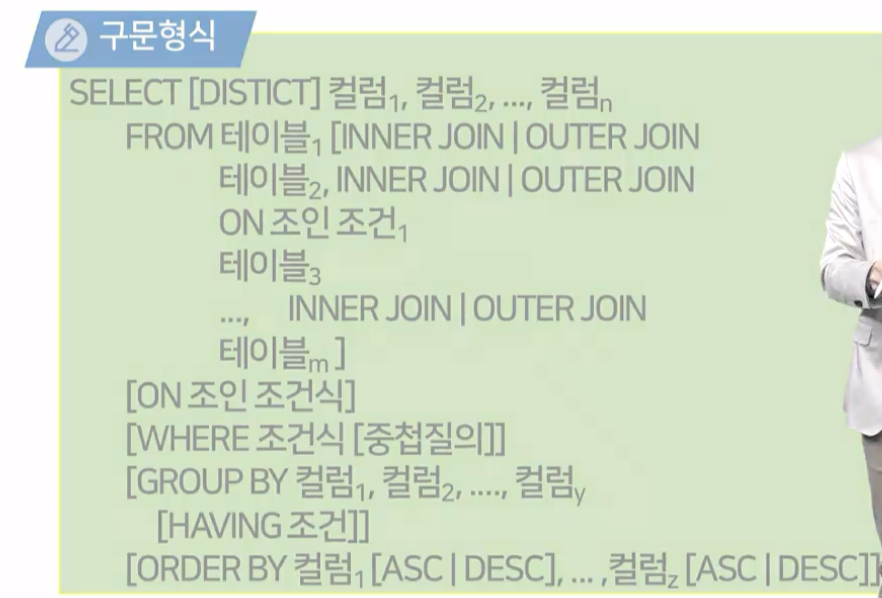

#### SELECT문의 각 절의 기능

- SELECT절
  - 결과 포함되는 컬럼 지정
- FROM절
  - 질의 적용 테이블 지정
- ON/WHERE
  - 조건, 검색 레코드 조건 지정
- GROUP BY
  - 레코드 그룹화를 위한 그룹 조건 지정
- HAVING
  - GROUP BY절이 적용된 결과에 대한 조건 지칭
- ORDER BY
  - 검색 결과 정렬 기준


### 단순질의문

- 레코드를 제한하지 않고 전체 테이블을 검색하는 SELECT문으로 WHERE절이 없는 질의문

  ```sql
  SELECT 컬럼1, 컬럼2, ... 컬럼n FROM 테이블명
  ```

  ```sql
  SELECT * FROM 테이블명
  ```

- 예제

  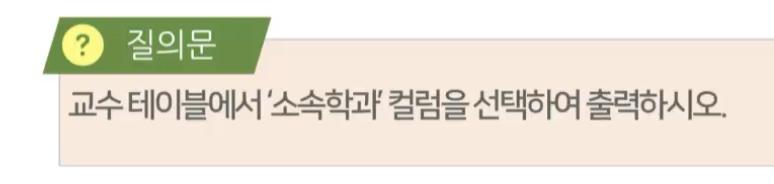

  ```sql
  SELECT 소속학과 FROM 교수
  ```

  ```sql
  SELECT DISTINCT 소속학과 FROM 교수
  ```

   ```sql
   SELECT * FROM 교수
   ```


### 조건질의문

- 산술연산식, 함수 등을 사용하여 표현한 조건을 WHERE절에 기술하여 조건을 만족하는 레코드만 검색
  - 산술연산자
  - 비교연산자
  - 논리연산자

- WHERE절은 UPDATE, DELETE문에서도 동일하게 적용

#### 산술연산자

- SELECT절 또는 WHERE 절에 사용되어 컬럼값 또는 상수와의 산술 계산을 위한 연산자

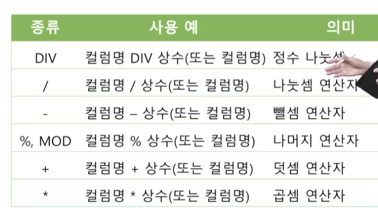

- 예제

  

  ```sql
  SELECT 과목명, 학점, 선수과목 FROM 과목
  	WHERE 이수구분 = '전공필수'
  ```

  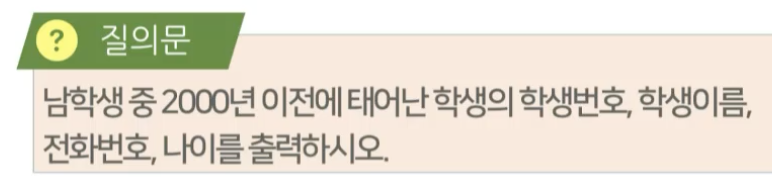

  ```sql
  SELECT 학생번호, 학생이름, 전화번호, 나이 FROM 학생
  	WHERE 성별='남' AND 생년월일 <'2000-1-1'
  ```


#### 비교연산자

- 컬럼값과 상수 또는 컬럼값과 다른 컬럼값과의 크기를 비교하는 연산자

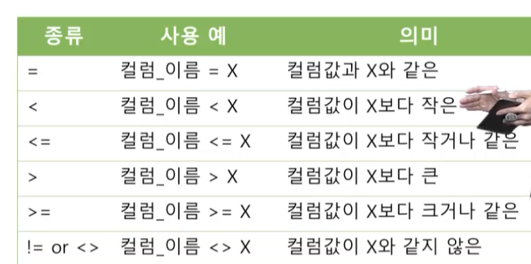

#### 논리연산자

- 두 개 이상의 조건이 기술되는 질의문에서 조건식 간의 관계를 정의하는 연산자

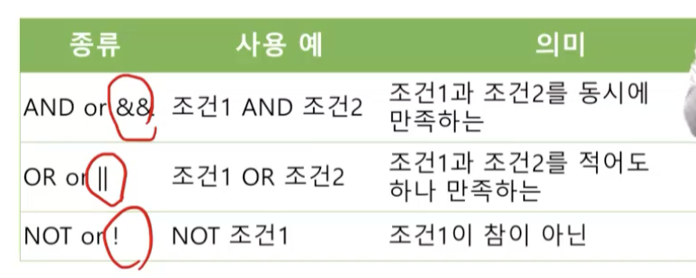


### 데이터 정렬

- ORDER BY 절을 사용
- 검색결과를 특정 컬럼에 대해 오름차순 또는 내림차순으로 정렬
  - ASC, DESC

```sql
SELECT 문 형식
	ORDER BY 컬럼1[ASC|DESC]
```

- 예시

  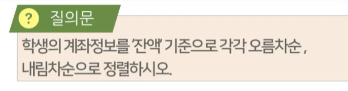

  ```sql
  SELECT * FROM 계좌
  	ORDER BY 잔액 DESC
  ```

  

### 특수연산자

- 범위 포함 여부, 부분 일치 여부, 포함 여부 등 관계형 데이터베이스에서만 사용되도록 고안된 연산자

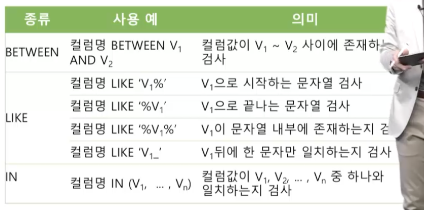

- 예시

  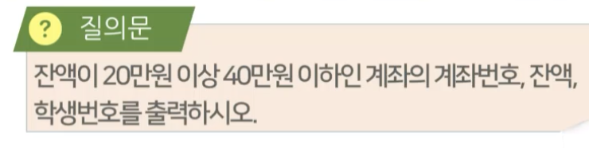

  ```sql
  SELECT 계좌번호, 잔액, 학생번호 FROM 계좌
  	WHERE 잔액 >= 200000 AND 잔액 <= 400000
  ```

  ```sql
  SELECT 계좌번호, 잔액, 학생번호 FROM 계좌
  	WHERE 잔액 BETWEEN 200000 AND 400000
  ```

  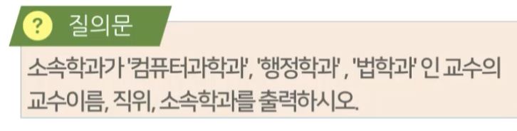

  ```sql
  SELECT 교수이름, 직위, 소속학과 FROM 교수
  	WHERE 소속학과 = '컴퓨터과학과' 
  		OR 소속학과 = '행정학과' 
  		OR 소속학과 = '법학과'
  ```

  ```sql
  SELECT 교수이름, 직위, 소속학과 FROM 교수
  	WHERE 소속학과 IN ('컴퓨터과학과', '행정학과', '법학과')
  ```

  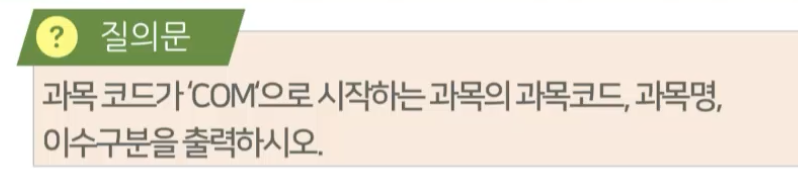

  ```sql
  SELECT 과목코드, 과목명, 이수구분 FROM 과목
  	WHERE 과목코드 LIKE 'COM%' #부분일치
  ```

  - %: 0개 이상의 모든 문자를 대체


### 함수

- 특정 목적을 수행하도록 사전에 정의된 연산 및 기능을 수행한 후 결과값을 반환하는 명령어 집합
- 상용 DBMS는 검색결과가 사용자에게 여러 형태로 사용되도록 여러 데이터 타입에 대한 다양한 함수를 제공(MySQL)
  - 문자, 숫자, 날짜 및 시간 함수


#### 숫자함수

- 삼각함수, 상수, 올림버림, 난수 등의 숫자 데이터 타입에 적용할 수 있는 계산을 위한 함수

  - 무슨 함수가 뭘 하는지 알 필요는 없다! (시험안나옴)

  - 숫자 함수들이 있다. 따라서 여러 숫자들에 대한 조작을 할 떄는 숫자 함수를 찾아보면된다 정도

    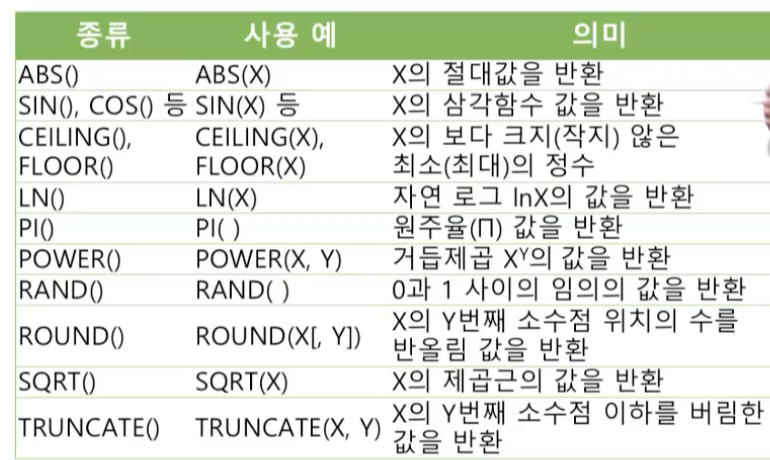


#### 문자함수

- 문자열 조작 및 문자 형식 변환 등 문자와 관련된 다양한 연산을 지원하는 함수

  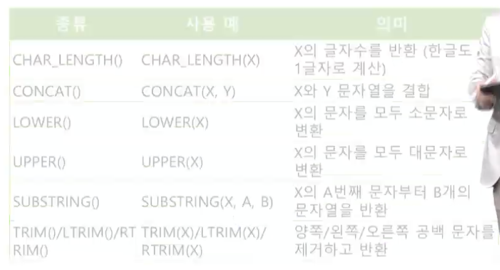

#### 날짜함수

- 날짜 및 시간 데이터 타입에 적용돼 산술 연산 및 시간 형 변환 등의 조작을 위한 함수

  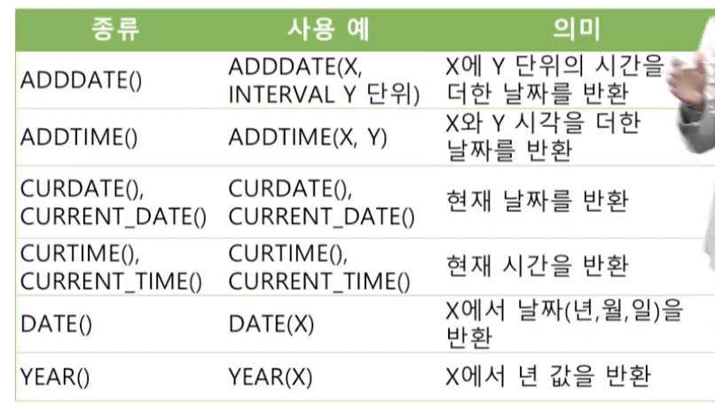


#### 예시

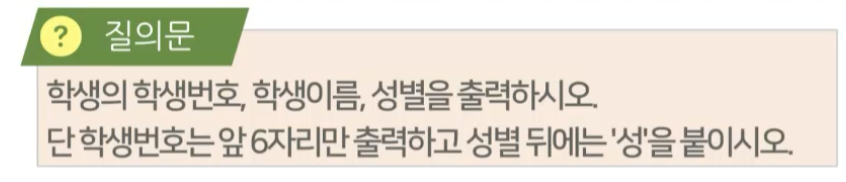

```sql
SELECT SUBSTRING(학생번호, 1, 6), 학생이름,
	CONCAT(성별, '성')
	FROM 학생
```

