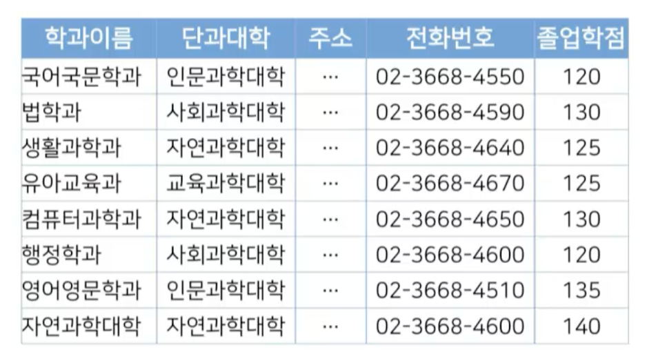
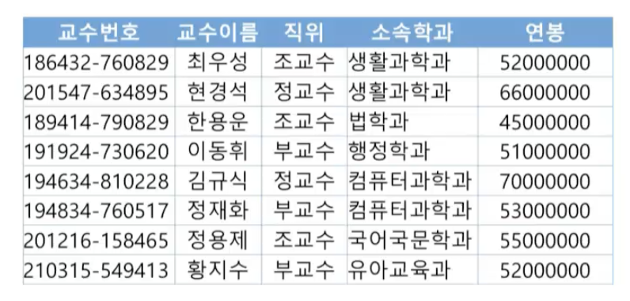
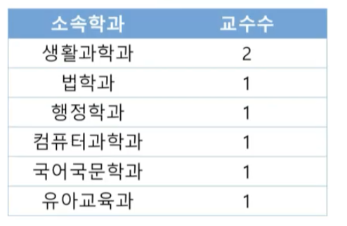
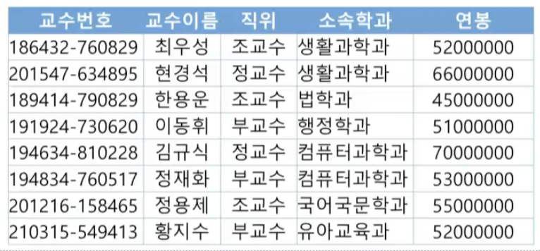
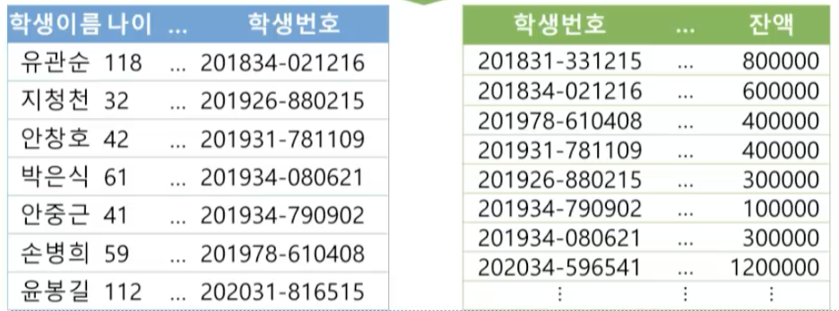
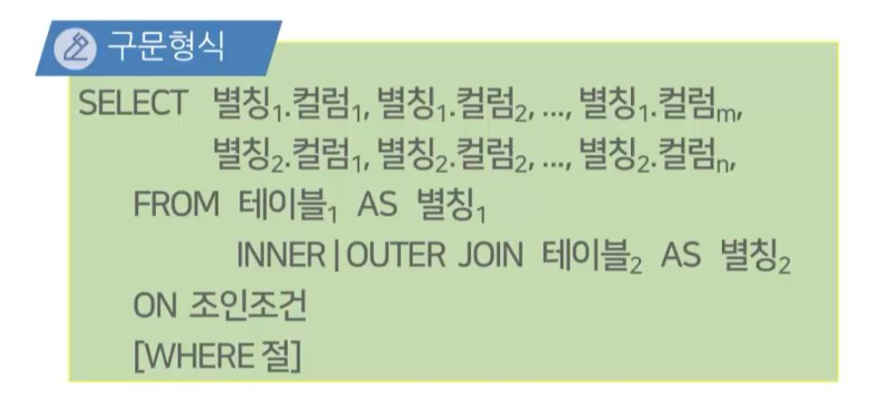
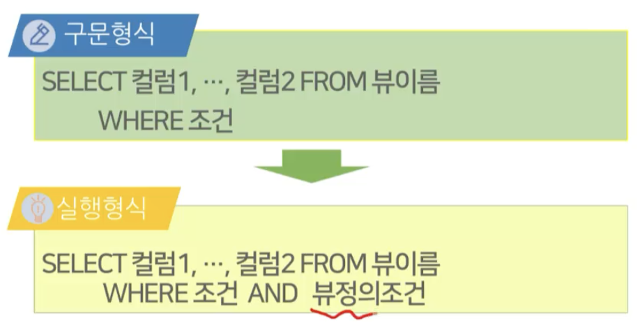

# 6강. SQL(3)

## 01. 데이터 검색(2)

### 그룹 질의

#### 집계 함수

- 특정 컬럼에 집계함수를 통해 다양한 통계 연산을 수행할 수 있는 기능
- SELECT절 또는 HAVING절에 기술
- 집계 함수의 종류
  - COUNT
  - SUM
  - AVG
  - MAX
  - MIN


####  집계 함수의 사용

- 단과대학의 개수를 출력하시오

  

  ```sql
  SELECT COUNT(DISTINCT 단과대학)
  	FROM 학과
  ```

  - 가독성 높인 SQL

  ```sql
  SELECT COUNT(DISTINCT 단과대학) AS 단과대학수
  	FROM 학과
  ```


#### 그룹질의

- 그룹질의

  - 특정 기준으로 레코드를 그룹화하고, 각 레코드 그룹에 대해 집계 함수를 적용하는 질의

  - 구문형식

    ```sql
    SELECT 질의
    	GROUP BY 컬럼
    ```

  - [주의] **<u>SELECT 절에 그룹의 기준과 집계 함수 이외의 컬럼은 포함될 수 없음</u>**

- 그룹 질의의 사용

  - 소속학과별 교수의 수를 출력하시오

    

  ```sql
  SELECT 소속학과 COUNT(*) AS 교수수
  	FROM 교수
  	GROUP BY 소속학과
  ```

  - 결과

    


#### HAVING 절

- 그룹 질의의 결과 레코드에 대해 출력 조건을 기술하기 위한 절

- 구문 형식1

  ```sql
  SELECT 질의
  	GROUP BY 컬럼
  	HAVING 조건
  ```

- 조건 기술 절

  - WHERE: **레코드**에 대한 조건을 기술
  - HAVING: **집계 결과 레코드**에 대한 조건을 기술

- 그룹 질의의 사용

  - 2개 이상의 전공을 신청한 학생의 학생번호와 신청 전공수를 출력하시오

  

  ```sql
  SELECT 학생번호, COUNT(*) AS 신청_전공수
  	FROM 전공
  	GROUP BY 학생번호
  	HAVING 신청_전공수 >= 2
  ```

  - 결과

  

#### 중첩 질의

- 중첩 질의

  - SELECT 문 내부에서 독립적으로 실행 가능한 또 다른 SELECT문이 내포되어 있는 질의
  - 일반적으로 내부 질의의 처리결과를 외부 질의에서 재사용
  - 중첩 질의의 종류
    - FROM 절에서의 중첩 질의 활용
      - FROM 절에서의 결과 집합을 SELECT에서 재검색
    - WHERE 절에서의 중첩 질의 활용
      - WHERE 절에서의 결과 집합을 활용하여 외부 질의에서 레코드의 출력 여부를 결정
      - IN, NOT IN, EXISTS, NOT EXISTS 사용

- 중첩 질의의 형식

  - 구문 형식

  ```sql
  SELECT 컬럼1, 컬럼2, ..., 컬럼n
  	FROM(SELECT 컬럼1, 컬럼2, ..., 컬럼m 
             FROM 테이블 
             WHERE 조건)
  	WHERE 조건
  ```

  ```sql
  SELECT 컬럼1, 컬럼2, ..., 컬럼n
  	FROM 테이블1
  	WHERE 컬럼i 연산자(SELECT 컬럼j
                        FROM 테이블2
                        WHERE 조건)
  ```

- 중첩 질의의 사용(1)

  - 학과별 교수의 평균 연봉이 70,000,000 미만인 학과 중 가장 높은 평균 연봉을 출력하시오

  

  ```sql
  SELECT MAX(d.평균연봉) AS 평균연봉
  	FROM(SELECT 소속학과, AVG(연봉) AS 평균연봉
        FROM 교수
        GROUP BY 소속학과) AS d
    WHERE d.평균연봉 < 70000000
  ```

  - 결과

  

- 중첩 질의의 사용(2)

  - '생활과학과' 소속 학생 중 수강신청을 하지 않은 학생의 학생번호를 출력하시오

  

  ```sql
  SELECT 학생번호
  	FROM 전공 AS A
  	WHERE A.학과이름='생활과학과' AND
  		NOT EXISTS(SELECT B.학생번호 FROM 수강 B # 수강 테이블에 없는 애
                		WHERE A.학생번호 = B.학생번호)
  ```


### 조인 질의

- 필요성
  - 테이블 간의 관련성을 이용해 두 개 이상의 테이블에서 데이터를 검색하는 질의 기법
  - ER 모델링 및 정규화 기법으로 여러 테이블로 분리된 정보를 통합하여 검색시 유용
  - 조인 질의 종류
    - 내부조인
    - 외부조인

### 내부 조인

- 두 개 이상의 테이블에서 조인 조건을 만족하는 레코드만 결합하여 출력 결과에 포함시키는 연산

- 조인 조건은 WHERE이 아닌 **ON 절**에 기록

- ANSI SQL 표준과 사실상의 표준인 Oracle사가 제안한 조인 형식 사용

- 구문형식

  ```sql
  SELECT 컬럼1, 컬럼2, ..., 컬럼m
  	FROM 테이블1 INNER JOIN 테이블2
  	ON 조인 조건1
  	[WHERE 조건]
  ```

- 내부 조인의 사용

  - 나이가 30세 이상인 학생의 학생이름과 니이, 그리고 그 학생이 소유한 계좌의 계좌번호와 잔액을 출력하라

  

  ```sql
  SELECT 학생이름, 나이, 학생번호
  	FROM 학생 INNER JOIN 계좌
  	ON 학생.학생번호 = 계좌.학생번호
  	WHERE 학생.나이 >= 30
  ```

  ```sql
  # ORACLE
  SELECT 학생.학생이름, 학생.나이
  			 계좌.계좌번호, 계좌.잔액
  	FROM 학생, 계좌
  	WHERE 학생.학생번호 = 계좌.학생번호
      AND 학생.나이 >= 30
  ```


#### 자연 조인

- 두 개 이상의 테이블을 하나의 테이블로 결합하는 내부 조인과 매우 유사한 기능

- 두 테이블에 동일한 이름의 컬럼에 대해 값이 같은 레코드를 결합하는 **내부 조인**

- 구문 형식

  ```sql
  SELECT 컬럼1, 컬럼2,... 컬럼m,
  	FROM 테이블1 NATURAL JOIN 테이블2
  	[WHERE 조건]
  ```

  

### 외부 조인

#### 외부 조인의 개념

- 내부 조인(inner join)은 조인조건에 일치하는 레코드만 결합하여 결과를 생성

  - 조인 결과에 정보의 손실이 발생

- 외부 조인은 조인조건에 맞지 않는 레코드도 질의의 결과에 포함시키는 질의

- 외부 조인의 종류

  

  - 왼쪽 외부 조인(left outer join)
  - 오른쪽 외부 조인(right outer join)
  - 완전 외부 조인(full outer join)

#### 외부조인 구문형식


#### 외부조인의 사용

- 학생의 학생번호, 학생 이름과 그 학생이 수강신청한 과목의 과목코드, 신청시각을 출력하시오. 단, 수강신청을 하지 않은 학생도 결과에 포함시키고 과목코드를 기준으로 오름차순 정렬


```sql
SELECT A.학생번호, A.학생이름, B.과목코드, B.신청시각
	FROM 학생 AS A LEFT OUTER JOIN 수강 AS B # 학생 기준
	ON A.학생번호 = B.학생번호
	ORDER BY B.과목코드 ASC
```

- 결과


#### 외부조인의 실행과정


### 셀프 조인

- 한 테이블이 자기 자신과 조인되는 형태

- 동일한 이름의 테이블에 대한 조인이므로 반드시 테이블 이름에 대한 별칭이 의무적으로 사용

  

#### 셀프 조인의 사용 ⭐️

- 과목의 과목코드, 과목명 그리고 그 과목의 선수과목의 과목코드, 과목명을 모두 출력하시오. 단, 선수과목이 없는 과목도 결과에 포함시킨다

  

  ```sql
  SELECT B.과목명, B.과목코드
  			 A.과목명 AS 선수과목명, A.과목코드 AS 선수과목코드
  	FROM 과목 AS A RIGHT OUTER JOIN 과목 AS B
  	ON A.과목코드 = B.선수과목
  ```

  - 결과

    


## 02. 뷰의 사용

### 뷰의 개념

- 데이터를 저장하고 있는 하나 이상의 테이블을 유도하여 생성하는 가상의 테이블(virtual table)
  - 데이터 독립성: 원본 테이블의 구조가 바뀌어도 뷰를 이용한 작업은 정의만 변경되어 응용 프로그램에 영향 없음
  - 데이터 보안: 사용자에게 원본 테이블의 일부 컬럼에 대한 접근을 허용해 보안 효과 향상
  - 다양한 구조의 테이블 사용: 사용자 요구사항에 맞는 테이블 구조 제공
  - 작업의 단순화: 복합한 질의문을 뷰로 단순화
  - 데이터 무결성: WITH CHECK OPTION을 이용해 뷰 생성에 위배되는 수정작업 거부


### 뷰의 생성, 수정, 삭제

#### 뷰의 생성

- 생성되는 뷰의 구조는 SELECT 문의 결과로 정정

  ```sql
  CREATE VIEW 뷰이름 AS
  	( SELECT 컬럼1, 컬럼2, ..., 컬럼n
          FROM 테이블
          [WHERE 조건])
  [WITH CHECK OPTION]
  ```


#### 뷰의 수정 및 삭제

- 뷰의 수정은 생성과 동일하게 새로운  SELECT문의 결과로 변경

  ```sql
  ALTER VIEW 뷰이름(컬럼1, 컬럼2, ..., 컬럼n) AS
  	( SELECT 컬럼1, 컬럼2, ..., 컬럼n
          FROM 테이블
          [WHERE 조건])
  ```

- 뷰의 삭제

  ```sql
  DROP VIEW 뷰이름
  ```


#### 뷰의 생성 예시

- 컴퓨터과학과 소속의 학생정보와 학과이름 및 이수학점을 출력하는 '컴퓨터과학과_학생' 뷰를 생성하시오

  

  ```sql
  SELECT 학생.*, 전공.학과이름, 전공.이수학점
  	FROM 학생 NATURAL JOIN 전공
  	WHERE 전공.학과이름 = '컴퓨터과학과'
  ```

  ```sql
  # 뷰 생성
  # SELECT * FROM 컴퓨터과학과_학생 이 가능해짐
  CREATE VIEW 컴퓨터과학과_학생 AS 
  	(SELECT 학생.*, 전공.학과이름, 전공.이수학점
          FROM 학생 NATURAL JOIN 전공
          WHERE 전공.학과이름 = '컴퓨터과학과'
    )
  ```

  


### 뷰를 이용한 검색 및 수정

#### 뷰를 이용한 데이터 검색

- 뷰는 가상의 테이블이므로 데이터 조작은 테이블 조작과 동일하게 수행

  


#### 뷰를 이용한 데이터 삽입

- 뷰에 대한 INSERT문은 원본 테이블에서 실행
  - PRIMARY KEY, NOT NULL등의 제약사항이 위배되는 경우 삽입 불가능
  - 원본 테이블에 존재하는 컬럼이지만 뷰에는 없는 컬럼에 삽입하는 경우 실행 불가능
  - 조인 질의 또는 그룹 질의가 적용된 뷰는 데이터 삽입 및 수정이 불가능
  - WITH CHECK OPTION이 적용된 뷰는 위배되는 사항은 없지만 뷰에 맞지 않는 조건일 경우 실행 불가능