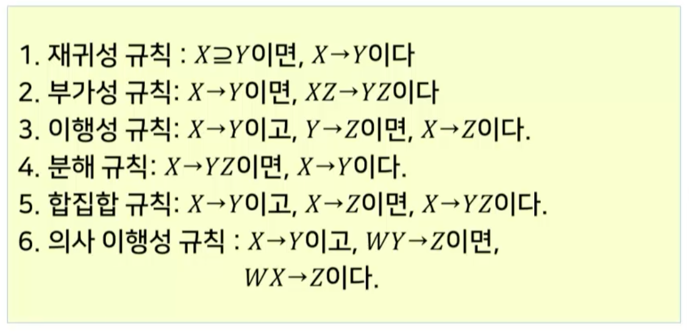
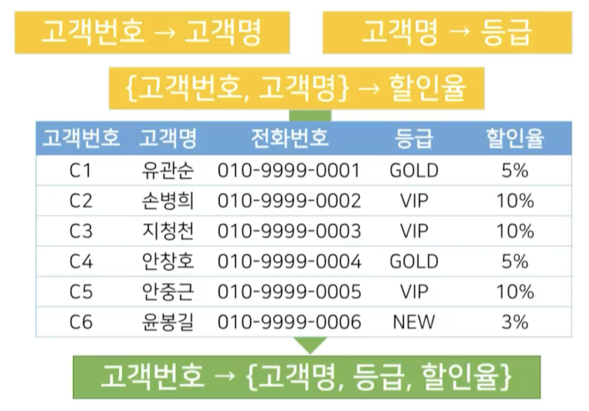

# 7강. 정규화

## 01. 좋은 릴레이션과 나쁜 릴레이션

### 잘못된 데이터베이스 모델링

- 데이터의 중복
  - 일관성 유지의 어려움
  - 저장 공간 낭비
- 갱신 이상
  - 삽입 이상
    - 레코드 추가 시 불필요한 컬럼의 값이 없이는 추가하지 못 하는 경우
  - 삭제 이상
    - 삭제시 의도하지 않았던 다른 데이터가 삭제되는 경우
  - 수정 이상
    - 중복 저장된 레코드를 수정 시 모두 반영이 안되어 데이터베이스의 일관성이 깨지는 경우

### 갱신 이상

#### 삽입 이상

- 고객번호, 고객명, 전화번호 값이 없이는 추가 못함

#### 삭제 이상

#### 수정 이상

- 비일관성 발생

### 좋은 릴레이션의 개념

- 좋은 릴레이션의 예
  - 데이터 중복 최소화, 일관적

- 컴퓨터 프로그래머적 관점에서의 모델링
  - 어떻게 데이터를 저장해야 하는가?
- 릴레이션의 스키마가 얼마나 효율적으로 실세계를 반영하고 있는지 평가
- 고려사항
  - 한 릴레이션 내의 컬럼 간의 관계 분석
  - 원하지 않는 데이터의 종속과 중복 제거
  - 새로운 컬럼들이 데이터베이스에 추가될 때 기존 컬럼과의 관계 수정을 최소화

## 02. 함수적 종속성

### 함수적 종속성의 정의

- 릴레이션 인스턴스를 분석하여 속성들 간의 연관관계를 표현한 것

- 릴레이션의 효율성을 향상시켜 좋은 릴레이션으로 변환하는데 이용되는 중요한 개념

  

### 함수적 종속성의 판별

- 등급은 할인율을 종속한다

- 등급은 전화번호를 종속하는가?
- 고객번호는 고객명에 종속되는가?

### 함수적 종속성의 확장

- 함수적 종속성은 릴레이션의 효율성 여부에 중요한 판단기준
- 그러나 릴레이션의 인스턴스만으로 내제된 모든 함수적 종속성을 찾아내기 어려움
- 판별되지 않은 모든 함수적 종속성을 찾기 위해 추론 규칙을 사용하여 함수적 종속성을 확장
- 클로저(closure)
  - 판별된 함수적 종속성 집합으로부터 유추할 수 있는 모든 함수적 종속성 집합

### 함수적 종속성 추론 규칙

- 암스트롱 공리(Armstrong's axiom)

  - 4, 5, 6은 암스트롱 공리의 확장 버전

  

### 함수적 종속성의 판별

- 고객번호가 고객명을 종속하는가?
  - 참
- 고객명은 등급을 종속하는가?
  - 참
  - 결정자(고객명) 컬럼의 값이 같으면 등급의 값이 같아야 함
  - **결정자 컬럼이 기준인 것**

### 커버와 카노니컬 커버

#### 카노니컬 커버

- 함수적 종속성 추론 규칙으로 확장된 클로저에는 **자명한 종속성**과 **중복된 종속성**을 포함
- 불필요한 함수적 종속성을 제거한 표준형으로 변환 후 정규화를 수행
- 표준형 조건
  - F의 모든 함수적 종속성의 오른편 속성은 반드시 1개
  - F에서  X→A를 X의 진부분집합 Y에 대하여 Y→A 로 교체했을 때, 그 집합이 F와 동등한 집합이 불가능
  - F에서 어떤 함수적 종속성을 제거했을 때, 그 집합이 F와 동등한 집합이 불가능

## 03. 정규화

### 정규형의 개념

- 이상 현상을 최소화 하도록 특정 조건을 갖춘 릴레이션의 형식

- 정규형의 분류

  - 현업에서 4, 5 까지는 잘 하지 않음

  

### 정규화의 목적

- 정의
  - 특정 정규형의 조건을 만족하도록 릴레이션과 속성을 재구성하는 과정

- 정규화의 기능
  - 데이터베이스 내에 모든 릴레이션을 효과적으로 표현
  - 보다 간단한 관계 연산에 기초하여 **검색 알고리즘을 효과적으로 작성**할 수 있도록 지원
  - 바람지갛지 않은 삽입, 수정, 삭제 등의 이상 발생 방지
  - 새로운 형태의 데이터가 삽입될 때 릴레이션 재구성의 필요성을 축소

### 제1정규형

- 가장 조건이 단순한 정규형
- 관계형 모델의 조건에 따라 자동 적용되는 정규형
- 정의
  - 릴레이션 스키마에 정의된 모든 속성의 도메인이 원자값을 갖는 상태

#### 제1정규화가 필요한 릴레이션

- **원자값을 갖지 않는 속성**

  

- 예제 설명

  - 선박이 항구에 정박하기 위해 정밀한 작업이 요구됨
    - 풍향과 풍속, 파도와 안개 상황 등을 고려
    - 단순히 수신호 뿐만 아니라 소형 배들로 정박하려는 대형 배를 밀어 안전하게 위치시키는 작업 필요
  - 도선사: 배를 도크에 안전하게 접안시키고 항로로 인도하는 일을 하는 사람
  - 도크: 선박의 건조, 수리, 계선, 하역 작업 등을 위해 축조된 설비 및 시설의 총칭

- 제1정규화 적용

  

#### 함수적 종속성 판별

#### 함수적 종속성 다이어그램

- 릴레이션 내의 속성간의 종속 관계를 직관적이고 이해하기 쉽게 도식화 한 표현 방식

  - 직사각형: 속성 또는 속성 집합

  - 화살표: 함수적 종속성

    

#### 도크 릴레이션의 함수적 종속성 다이어그램

### 제2정규형

#### 제2정규형의 정의

- 릴레이션이 제1정규형을 만족하고 기본키의 부분집합이 특정 속성을 종속하고 있지 않은 상태

- 정의
  - 주어진 릴레이션의 인스턴스가 기본키가 아닌 속성들이 기본키에 완전히 종속되어 있는 상태

#### 제2정규형의 적용

- 도크관리자의 경우 키의 일부분인 도크번호에 대해 종속되고 있음
  - 도크관리자는 키에 **부분적으로 종속**되고 있는 상태
  - 출항시간, 목적, 담당도선사는 키에 **완전히 종속**되고 있음

### 릴레이션의 무손실 분해

- 무손실분해(lossless decomposition)

   

- 도크관리 릴레이션 무손실 분해

  

#### 제2정규화의 적용

#### 제2정규화의 함수적 종속성 다이어그램

- 두 개의 다이어그램이 나왔다는 건, 두 개의 릴레이션이 되었다는 것

### 제3정규형

#### 제3정규화의 정의

- 릴레이션이 제2정규형을 만족하고, 기본키가 아닌 속성들이 어떤 키에도 이행적으로 종속되지 않은 상태

#### 제3정규화의 적용

- 이행적 종속성이 있으면 부분적 중복이 만들어 짐
  - 그래서 끊어내야 함

- 적용

  

  

    → 

### BC정규형

####  BC정규형의 정의

- 릴레이션이 제3정규형을 만족하고 릴레이션에 성립하는 X → Y 형태의 모든 함수적 종속성에 대해 X가 수퍼키인 상태
- 입출항관리 릴레이션의 함수적 종속성
  - {도크번호, 입항시간} → {목적}
  - {도크번호, 입항시간} → {출항시간}
  - {목적} → {도크번호}
    - 목적은 일반 속성인데 도크번호라는 속성을 종속하고 있음

#### BC정규화의 적용

- 함수 종속성 다이어그램

  **→**  

- 변경된 릴레이션

 → 

### 정규화 결과

### 역정규화(de-normalization)의 개념

- 정규화
  - 릴레이션 분할을 통해 데이터의 중복성을 최소화 하는 과정
  - 사용과정에서 많은 조인연산을 유발
- 역정규화
  - 정규화의 반대 개념
  - 정규화를 통해 분리되었던 릴레이션을 통합하는 재조정을 수행하고, 정보의 부분적 중복을 허용하는 기법
  - 데이터 접근 성능을 개선 목적
  - 퍼포먼스 관점에서 수행할 때도 있음
- 정규화되지 않은 스키마와 역정규화 스키마는 규별
  - 정규화 안한 스키마가 아니라, 정규화를 단 한 다음에, 다시 통합하는 것임