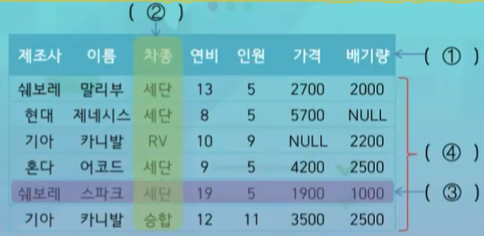
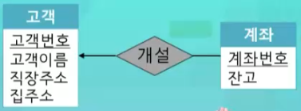
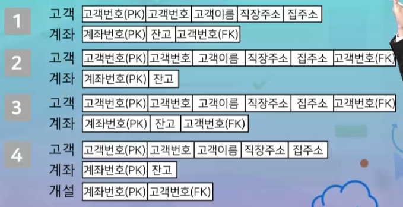
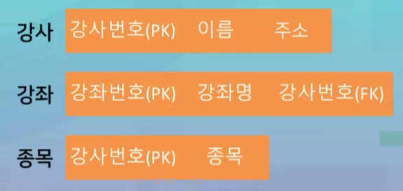
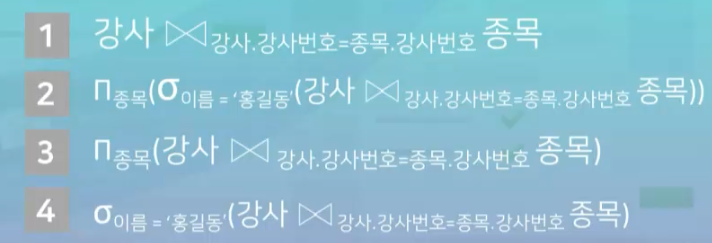
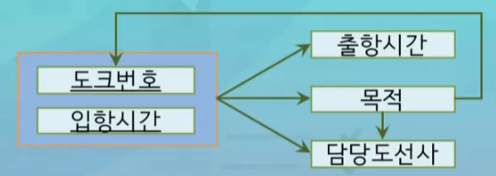

# 8강. 연습문제 풀이 1

#### 01. DBMS 사용 이전의 데이터 관리 방식으로, 운영체제의 지원으로 여러 파일에 나누어 데이터를 영구 저장하고 운영하는 시스템을 무엇이라고 하는가? (교재 1.3절, 강의 1강)

- 파일 처리 시스템

> 데이터의 사용과 데이터의 관리를 분리시켜 놓은 장치

#### 02. 다음 중 파일 처리 방식의 데이터 관리가 갖는 문제점으로 볼 수 없는 것은? (교재 1.3절, 강의 1강)

- 문제점
  - 데이터의 중복
  - 데이터의 무결성 훼손
  - 동시접근이상
- 문제점이 아닌 것
  - 데이터의 독립

> 데이터의 독립은 DBMS에서만 가능하고, 파일 처리 시스템에서는 불가능 > 문제점이 아니라 해결해야 할 사항임
>
> 데이터의 중복 - 하나의 애플리케이션마다 유사 데이터를 가지고 있다면 중복될 가능성 있음
> 데이터에 대한 여러가지 제약, 범위가 있는데 파일 처리 시스템은 맞출 수 없음
> 두명 이상의 사용자가 동시에 동일 데이터에 접근하게 되면 데이터 일관성 훼손 가능성 있음

#### 03. DBMS가 데이터베이스 자체 뿐만 아니라 데이터에 대한 정의나 설명에 대한 것 까지 포함하고 있는 특성은 무엇이라고 하는가?(교재1.4.2절, 강의 1강)

- 자기 기술성

> 자기 기술성이란 내가 어떤 정보를 가지고 있든, 값에 대한 설명 데이터(메타 데이터)를 같이 저장하고 있는 것

#### 04. 데이터베이스 언어의 한 영역으로, 데이터베이스에 의해 구조화된 데이터에 사용자가 접근 및 사용할 수 있도록 지원하는 언어를 무엇이라고 하는가?(교재 1.6.2절, 강의 1강)

- 데이터 조작 언어

#### 05. DBMS를 외부, 개념, 내부 스키마로 분리하고 각 단계 간 사상을 통해 구조화하는 방식을 무엇이라고 하는가? (교재 1.5절, 강의 1강)

- 3단계구조

#### 06. 클라이언트와 서버 사이에 데이터에 접근하는데 사용되는 비즈니스규칙을 저장한 중간 계층을 삽입하여 운용하는 데이터베이스 시스템 아키텍처는? (교재 1.7.2절, 강의 1강)

- 3계층 클라이언트-서버 구조

> 중앙집중식 구조의 경우 - 메인컴퓨터가 처리한 것들을 보기만 하는 것. 따라서 클라이언트-서버 구조
> 서버 1계층 - 애플리케이션 서버 2계층 - 클라이언트 3계층

#### 07. 데이터베이스 모델링 단계 (교재 2.1절, 강의 2강)

- 요구 분석 - 개념 - 논리 - 물리

#### 08. 사용자 요구사항 분석 과정에서 데이터베이스를 구축하기 위한 목표와 조사 범위를 결정하고 필요한 자료를 수집하는 등을 수행하는 세부 단계는? (교재 2.1.1절, 강의 2강)

- 사용자 요구사항 도출

> 도출 > 분석 > 기록

#### 09. ER모델의 구성요소 중 실세계에 존재하는 다른 모든 객체와 구별되는 유, 무형의 대상의 모임을 무엇이라고 하는가? (교재 2.3.1절, 강의 2강)

- 개체 집합

> 객체: 실세계에 존재하는 다른 모든 객체와 구별되는 유 무형의 대상
>
> 속성: 개체 집합에서 각 개체를 설명하는 것

#### 10. 개체 집합의 각 개체마다 서로 다른 값을 갖는 속성을 뜻한다. 즉, 어떤 개체의 이 값은 각각의 개체들을 서로 구별하는데 사용되는 개체 집합에서 유일한 값이다. (교재 2.3.4절, 강의 2강)

- 키 속성

#### 11. 다음 요구사항에 대한 ER 모델링한 결과로 올바르게 표현된 학생 객체는? 학생은 이름, 학번, 학과명, 주소로 구성된다. 학번은 입학년도, 학과코드 및 일련번호로 이루어지고, 학과명은 학과 코드를 통해 알 수 있다. (교재 2.3.3절, 강의 2강)

- 3번

> 복합속성은 들여쓰기
>
> 학과명은 학과 코드를 통해 알 수 있다 → 유도속성(다른 값을 계산을 통해서 알아낼 수 있다)은 `()` 

#### 12. 요구사항을 참조하여 물음에 답하시오

##### 12-1. 위 요구사항에 대한 ER 모델링 결과 고객 개체 집합을 올바르게 표현한 것은?

> 키속성은 <u>밑줄</u>
>
> 한개의 객체에 대해 여러 값이 들어갈 수 있음. 다중값은 집합기호 `{}`

- 1번	

##### 12-2. 고객과 계좌 개체 집합 사이의 소유 관계 집합에 대해 사상수를 올바르게 표현한 것은? (단, 개체 집합은 개체 집합 이름만 표현한다)

- 4번

> 계좌가 없는 고객도 있다. 하지만 모든 계좌는 모든 고객에 의해 소유된다. 
> 즉, **참가제약조건**을 어떻게 설정할 것인가?
>
> **부분적 참가는 간선**
> **전체적 참가는 복선**

#### 13. 아래의 릴레이션에서 빈칸에 들어가야 하는 용어로 올바르지 않은 것은?(교재 3.1.2절, 강의 3강)

1. 스키마
2. 컬럼(필드)
3. 레코드
4. 인스턴스

#### 14. 다음은 릴레이션의 어떤 특징에 대한 설명인가? (교재 3.1.2절, 강의 3강)

##### 한 릴레이션을 구성하는 컬럼 사이에는 순서가 없고, 이름과 값의 쌍으로 구성된다

- 레코드의 무순서성

#### 15. 다음은 무엇에 대한 설명인가? 두 개의 릴레이션 사이에 명시되는 제약조건으로 한 릴레이션에 있는 레코드가 다른 릴레이션에 있는 레코드를 참조하려면 반드시 존재하는 릴레이션만 참조해야하는 제약조건을 명시한다 (교재 3.1.4절, 강의 3강)

- 참조 무결성 제약조건

#### 16. 다음의 ER 다이어그램을 관계형 모델로 올바르게 변환한 것은? (교재 3.2.1절, 강의 3강)

- 1번

> 3번의 경우, 재귀적 관계가 없으므로 

#### 17. 아래의 스키마를 참조하여 다음 물음에 답하시오. (교재 3.3.2절, 강의 3강)

##### 17-1. 강좌명이 '요가'인 강좌의 강좌번호, 강좌명, 강사번호를 출력하시오. 에 대한 관계 대수 연산식으로 올바른 것은?

- 2번인데..
  - 𝞼강좌명='요가'(강좌)
  - 위의 그림 2번 보기 오타

> SELECT 연산자: 조건을 만족하는 레코드를 가지고 오는 것
>
> PROJECT 연산자: 지정된 컬럼만을 빼서 하나의 릴레이션으로 구성하는 것

##### 17-2. '홍길동'강사의 종목을 출력하시오. 에 대한 관계 대수 연산식은? (교재 3.3.2절, 강의 3강)

- 2번

#### 18. 테이블 스키마 정의, 테이블 삭제, 테이블 스키마 변경 및 제약조건을 명시하는 기능을 하는 SQL 언어 영역을 뭐라고 하는가? (교재 5.1절, 강의 4강)

- 데이터 정의 언어(DDL)

#### 19. 다음 중 데이터베이스 언어의 영역이 나머지 셋과 다른 SQL 명령어는 무엇인가? (교재 5.3절, 강의 4강)

- DROP(DDL)
- SELECT, UPDATE, INSERT(DML)

#### 20. 다음 중 테이블의 컬럼을 삭제하는데 사용하는 SQL 명령어는? (교재 5.4절, 강의 5강)

- ALTER

> ALTER는 테이블의 구조를 변경(컬럼 추가, 삭제)
> UPDATE 테이블의 특정 값을 변경할 때
> DROP은 테이블을 삭제
> DELETE은 레코드 단위로 데이터 삭제

#### 21. "교수의 교수번호, 소속학과, 교수이름, 입사일을 입사일을 내림차순으로 정렬하여 출력하시오."를 수행하기 위한 SQL문 (교재 5.4절, 강의 5강) 

- SELECT 교수번호, 소속학과, 교수이름, 입사일 FROM 교수 ORDER BY 입사일 DESC

#### 22. 다음 중 정규화에 대한 설명으로 올바르지 않은 것은? (교재 6.1절, 강의 7강) 

- 릴레이션 간 공통부분을 도출하고 유사 릴레이션을 통합하여 스키마의 구조를 간략화한다

> (맞음) 데이터가 삽입될 때 릴레이션 재구성의 필요성을 줄인다
> (맞음) 데이터의 중복을 제거하여 릴레이션의 효율성을 향상시킨다
> (맞음) 삽입, 갱신, 삭제 이상(anomaly) 현상을 제거한다

#### 23. 다음은 무엇에 대한 설명인가? 이것은 릴레이션 인스턴스를 분석하여 속성들 간의 연관관계를 표현한 것으로, 주어진 릴레이션 인스턴스에서 서로 다른 두 레코드와 속성 집합 X와 Y에 대해 두 레코드의 X 속성값이 같을 때 Y의 속성값이 같으면 성립하는 특성을 말한다.(교재 1.1.1절, 강의 1강) 

-  함수적 종속성

#### 24. 아래의 도크관리 릴레이션에 포함된 합수적 종속성이라고 할 수 없는 것은? (교재 6.2.1절, 강의 7강) 

- 4번

> 출항시간 같은게 있는데, 목적은 다름

#### 25. 제약조건이 강한 순으로 정규형 간의 관계가 올바른 것은? (교재 6.3절, 강의 7강)

- 제1정규형 < 제2정규형 < 제3정규형 < BC정규형 < 제4정규형 < 제5정규형

#### 26. 다음 릴레이션의 정규형은 무엇인가? (교재 6.3절, 강의 7강)

- 제2정규형

