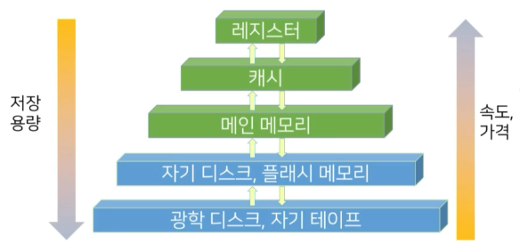
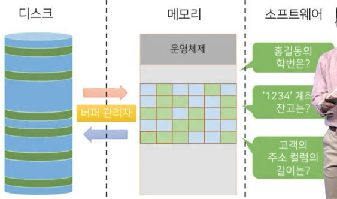

# 9강. 데이터 저장과 파일

## 01. 물리적 저장장치

### 물리적 저장장치의 구성

- 물리적 저장장치는 데이터 접근 속도, 용량을 기준으로 다양한 장치로 구성

### 물리적 저장장치별 특징

- 휘발성
  - 캐시: **고비용** 저장장치로 **빠른** 접근 속도 보장
  - 메인 메모리: 실제 프로그램과 데이터 적재 공간
- 비휘발성
  - 플래쉬 메모리: 메인 메모리와 유사하나 비휘발성
  - 자기 디스크: 데이터베이스 전체를 안정적으로 저장
  - 광학 디스크 드라이브: CD, DVD, Blue-ray 등
  - 테이프 장치: 용량이 크고 저렴하나, 순차 접근 방식으로 접근 속도가 매우 느림

## 02. 파일

### 물리적 저장장치

#### 데이터베이스 구성

#### 데이터베이스 구성 요소

- 파일
  - 데이터를 영구적으로 저장하기 위해 사용되는 가장 기초적인 논리적 구조
- 블럭
  - 파일을 고정적인 길이로 분할하여 생기는 균등한 크기의 데이터 묶음
  - 일반적으로 메모리와 디스크간 데이터 전송 단위로 결정
- 레코드
  - 블럭을 구성하는 요소
  - 더 이상 분리될 수 없는 최소 데이터 저장 단위

### 고정 길이 레코드

- 고정적인 바이트 수를 갖는 레코드를 저장하는 기법

  

- 하나의 블럭에 레코드 저장할 때 아래와 같아짐. 모든 레코드는 42바이트 길이를 가지고 있음

  

- 데이터 접근

  - 모든 레코드는 42바이트로 구성
  - i번째 레코드 접근
    - (i-1)*42+1번째 바이트부터 42개의 바이트를 읽어 접근

#### 잔여 고정 길이 레코드 할당

- 블럭의 길이가 레코드 길이로 정확히 나눠지지 않아 잔여 공간을 비워두는 방법
  - 블럭 내의 남은 공간 낭비

#### 고정 길이 레코드 할당

- 블럭의 길이가 레코드 길이로 정확히 나눠지지 않아 한 레코드를 두 블럭에 나누어 저장하는 방법
  - 레코드 접근시 두 블럭을 접근
  - 2 블럭에 걸쳐 있는 레코드를 읽을 때 블럭을 두 번 가져오는, 즉 연산이 2번 일어나므로 속도가 느려질 수 있음

#### 고정 길이 레코드 할당 문제

- 레코드 삭제 시
  - 해당 레코드가 저장된 위치에 빈공간이 생성
  - 장시간 레코드의 삽입 및 삭제 발생 시, 저장 공간에 많은 낭비가 발생

- 레코드 삭제 시 대처 방안
  - 마지막 레코드로 공백 대체
  - 삭제 레코드 이후의 레코드를 이동
  - 가용 리스트 관리

#### 레코드 삭제 대처

- 마지막 레코드로 공백 대체
  - 단, 레코드의 순서가 변경됨
  - 검색시 검색 시간이 길어질 수 있음
- 삭제 레코드 이후의 레코드를 이동
  - 단, 삭제 레코드 이후 레코드를 모두 옮겨야해서 시간이 많이 들 수 있다 
  - 삭제 자체가 커다란 오버헤드를 일으킬 수 있다.
- 가용 리스트 관리
  - linked list 사용
  - 가용 리스트를 꾸준히 관리함

### 가변 길이 레코드

- 블럭에 저장되는 레코드의 길이가 서로 다른(가변적) 레코드를 할당하는 방법
- 가변 길이 레코드가 사용되는 상황
  - 한 블럭 내에 저장되는 레코드 유형이 둘 이상
  - 길이가 고정되지 않은 컬럼의 개수가 하나 이상
  - 레코드가 멀티셋을 허용한 컬럼을 가질 때
    - 멀티셋: 레코드의 컬럼값이 여러개의 컬럼
- 예제
  - NULL 이후로는 가변길이야!

#### 슬롯페이지 구조

- 가변길이 레코드를 저장하는 법 중 현존하는 가장 효율적 구조로 알려져 있다

### 파일 구조화 방법

- 파일 구조화

  - 파일 수준에서 레코드를 관리(순서 등)하는 기법

  

#### 파일 구조화 방법의 종류

- 힙 파일 구조: 저장순서 고려없이 파일 내 임의의 위치에 배치

  - 저장 속도는 가장 빠르지만 사용 효율은 가장 떨어짐(어디 저장했는지 모르므로)

- 순차 파일 구조: 레코드들이 탐색키 기준으로 정렬되어 저장

  

  - 이진탐색을 통해 검색 속도가 빠름
  - 탐색키가 이름일 경우, ㄱㄴㄷ순으로 진행 가능
    - 만약 레코드가 중간에 튑되는 경우, 이러한 연결 구조를 이루기 위해서 별도의 작업이 필요함
  - 가장 많이 사용됨

- 해시 파일구조: 해시 함수를 사용해 블럭 주소를 계산

  - 블랙박스라고 하는 해시함수에 집어넣으면 주소를 찾을 수 있음
  - 해시함수에 따라서 성능차가 많이 남

#### 순차 파일 구조

- 레코드가 검색키 순서대로 정렬
- 레코드가 파일에 삽입되는 시점에서 키 값이 부여
- 장점
  - 검색키에 대한 정렬 연산이 불필요, 키 값들의 순서로 레코드를 판독하는 연산에 효율적
  - 현재 레코드에서 정렬된 키 순서로 다음 레코드를 찾을 때 부가적인 블럭 접근이 불필요
  - 이진 탐색을 사용한다면 더 빠르게 레코드 검색 가능
- 단점
  - 레코드 삽입, 삭제에 많은 비용 소요

#### 오버플로우 블럭

- 순차 파일 구조에서 레코드의 정렬된 상태 유지를 위해 삽입된 신규 블럭

  - 저장 속도가 빨라짐

  

## 03. 저장장치 관리

### 저장장치 접근

- 파일은 논리적 관점에서의 저장 객체
- 실제 저장될 때에는 여러 개의 물리적 단위인 블럭으로 저장
  - 블럭은 메모리와 디스크 간 데이터의 전송 단위
  - 일반적으로 2KB ~ 32KB 사용
  - 블럭 전송을 최소화할 수록 입출력 소요 시간이 단축
    - 되도록이면 접근을 최소화하고**, 한번 읽은 블럭을 여러 번 재사용할 수 있도록 하는 것**이 컴퓨터 속도 향상을 위한 가장 좋은 방법
    - 사용 중인 블럭을 지속적으로 메모리에 적재
    - 한정적 공간으로 인해 필요에 따라 특정 블럭 할당을 해지
    - 메모리 내부에 버퍼라는 공간에 블럭을 저장하고, 이를 관리하는 버퍼 관리자를 사용

### 버퍼 관리자

- DBMS상의 소프트웨어는 필요한 블럭이 있을 때 버퍼 관리자에게 해당 블럭을 요청
  - 요청된 블럭이 버퍼에 있다면, 버퍼 관리자는 블럭이 위치한 메모리 주소를 프로그램에 전달
  - 요청된 블럭이 없는 경우, 버퍼 관리자는 버퍼내의 새로운 공간을 할당하고 해당 블럭을 적재
  - 더 이상 적재할 공간이 없다면, 버퍼에 있는 기존 블럭을 선택하여 할당을 해지하고 해당 블럭을 적재

### 버퍼 교체 전략

- 버퍼 관리자는 어떤 블럭을 비울까?

#### 버퍼 관리자의 기능

- 버퍼 교체 전략
  - 가용 공간을 확보하기 위해 기존에 적재된 블럭의 할당을 특정 기준에 의해 해지
  - **미래에 가장 적게 사용될 블럭을 선택**하여 디스크로 내보내는 것이 이상적인 버퍼 교체 전략
  - 버퍼 교체 전략 기법
    - LRU(Least Recently Used): 최근에 가장 적게 참조된 블럭을 교체
    - MFU(Most Frequently Used): 특정 기간 동안 가장 여러번 사용된 블럭을 선택하여 블럭을 교체

### 고정블럭(pinned block)과 블럭 강제 출력

- 처리 과정에 있는 것들, 또는 프로그램 오류에 의해 잘못들어간 데이터들은 디스크로 내보내지 못하게 고정

#### 버퍼 관리자의 기능

- 고정 블럭
  - 장애로 인해 메모리의 데이터가 손실되어 작업이 중단될 경우, 중단된 작업의 결과물이 디스크에 기록되는 것을 방지
  - 디스크 블럭이 교체되는 것을 제한

- 블럭 강제 출력
  - 시스템 로그와 같이 중요한 데이터는 디스크에 영구적으로 기록되어야 함
  - 버퍼 공간이 필요 없어도 강제로 디스크에 기록

