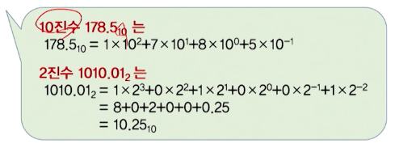

# 1강. 컴퓨터와 디지털 논리회로 및 데이터 표현

## 1.1 디지털 시스템

### 1.1.1 시스템

- 시스템의 정의
  - 검은 상자형(블랙박스) 시스템
    - 입력과 출력을 갖는 검은 상자로 표현
    - 시스템의 입력과 출력에만 관심을 가지고 시스템을 고려
  - 구성요소 집합으로서 시스템
    - 검은 상자 내부에 관해 규정
    - 시스템에 부여된 목적을 달성ㄹ하기 위해 상호작용하는 구성요소들의 집합

### 1.1.2 아날로그와 디지털

- 데이터의 표현 방법
  - 아날로그 방식
    - 데이터를 연속적인 값(continuous value)으로 표현
  - 디지털 방식
    - 연속적인 값을 근사하여 이산적인 값(discrete value)으로 표현

- 아날로그 시스템과 디지털 시스템
  - 아날로그 시스템
    - 입력과 출력이 아날로그 데이터인 시스템(바늘로 표현하는 계기 시스템)
  - 디지털 시스템
    - 입력과 출력이 디지털 데이터인 시스템(디지털 시계 등)
- 디지털 시스템의 장점
  - 편리섬: 데이터 숫자로 입출력
  - 융통성: 실행순서의 조정이 가능
  - 단순성: 시스템 설계가 단순
  - 안정성: 0과 1로 유지
  - 견고성: 잡음 등에 강함
  - 정확성
- 디지털 시스템의 설계
  - 회로 설계(circuit design)
    - 능동소자와 수동소자 연결
  - 논리 설계(logic design)
    - 논리화로를 만들기 위해 논리소자들을 연결
  - 시스템 설계(system design)
    - 논리회로들을 연결하여 프로세서, 입출력 제어장치등을 설계
  - 실제적 설계(physical design)
    - 시스템 설계단계의 부품들을 PCB나 와이어 랩 기판에 배치

- 디지털 논리회로의 개요
  - 디지털 논리회로
    - 2진 디지털 논리(0, 1)를 논리 게이트(logic gate)로 구현한 것
    - 디지털 시스템을 구현하는 기본 요소
    - 디지털 시스템의 논리 설계에서 설계됨
  - 디지털 논리회로는 **저장요소의 유무**에 따라 구분됨 
    - 조합논리회로: 저장요소가 **없음**(가산기, 디코더 등)
    - 순서논리회로: 저장요소가 **있음**(레지스터, 카운터 등)

## 1.2 컴퓨터 구성

### 1.2.1 컴퓨터 시스템

- 전자식 데이터 처리 시스템(EDPS: Electronic Data Processing System)
  - 컴퓨터 시스템의 하드웨어 측면에서 분석
    - 무엇으로 구성되어 있는가
    - 구성요소는 각각 무슨 기능을 갖는가
    - 입출력은 무엇인가

### 1.2.2 컴퓨터 하드웨어 구성

- 입력장치
- 기억장치
- 연산장치
- 제어장치
- 출력장치

## 1.3 집적회로

### 1.3.1 집적회로 개요

- 디지털회로는 집적회로로 구성
  - 집적회로(IC: Integrated Circuits)
  - 디지털 게이트의 기능을 수행하는 전자소자를 포함한 작은 실리콘 반도체 크리스털(silicon semiconductor crystal)
  - 칩(chip)이라고 함
  - 칩 내부에 있는 여러 가지 게이트들은 회로의 목적에 부합되도록 상호 연결

### 1.3.2 집적회로의 집적도

- 집적도(level of integration): 단위 실리콘 칩에 집적할 수 있는 게이트의 수
  - 소규모 집적(SSI): Small Scale Integration
    - 몇 개의 독립된 게이트 내장
  - 중규모 집적(MSI)
    - 10~100여개의 게이트 내장(디코더, 레지스터)
  - 대규모 집적(LSI)
    - 수백~수천 개의 게이트를 내장(프로세서, 기억장치 칩)
  - 초대규모 집적(VLS)
    - 수천개 이상의 게이트 내장(마이크로컴퓨터 칩)
- 디지털 논리계열
  - 디지털 논리회로는 집적회로를 구성
    - 기본 회로설계를 공유하는 집적회로의 그룹: 논리계열(logic family)
    - 각 논리계열의 기본적인 회로는 NAND 게이트 또는 NOR 게이트
  - 대표적인 디지털 논리계열
    - TTL(Transistor-Transistor Logic)
    - ECL(Emitter-Coupied Logic)
    - MOS(Metal-Oxide Semiconductor)
    - CMOS(Complementary Metal--Oxide Semiconductor

### 1.3.4 양논리와 음논리

- 양논리와 음논리
  - 게이트의 입력과 출력에 대한 2진신호는 두 값 중에 한 값을 갖는다
  - 두 논리값(0, 1)에 대한 두 신호값(H, L)을 할당하는 방법
- 양논리 시스템
  - 높은 값 H를 논리값 1, 낮은 값 L을 논리값 0으로
- 음논리 시스템
  - 낮은 값 L을 논리값 1, 높은 값 H를 논리값 0으로

# 제2장. 데이터 표현

## 2.1 수치 데이터

### 2.1.1 진법

- 진법
  - 수를 숫자로 나타내는 방법
  - 숫자의 위치에 따라 가중치 부여
  - 가중치는 기수의 승수를 이용
  - 기수는 2 이상의 양의 정수
- r진법
  - 기수가 r(r>=2)인경우를 r 진법이라고 함
  - r진법으로 표현된 수를 r진수라고 함

- 여러 가지 진법에 따른 수의 표현

  

- r진수의 10진수 변환

  

- 10진수의 r진수 변환

  

- 2진수와 2^n진수의 상호 변환

  

- 기타 변환(r진수를 s진수로 변환)

  

  #### 산술 연산

- 가산, 감산, 승산, 제산

  

- 예제

  

### 2.1.2 보수

#### 보수(r의 보수, (r-1)의 보수)

1) r의 보수(정수 부분이 n자리 일 때)

    

2) (r-1)의 보수

   

#### r의 보수와 (r-1)의 보수의 관계

- r의보수 = (r-1)의 보수 + 가장 낮은 자리의 1

  - 2의 보수는, 1의 보수에 1을 더한것과 같음

  

#### 보수를 이용한 감산

## 2.2 디지털 코드

### 2.2.1 10진 코드

#### 10진수를 나타내는 2진 코드

#### 영숫자 코드(영문자와 숫자를 2진 코드로 표현)

1. ASCII 코드
   - American Standard Code for Information Interchange
   - 하나의 영숫자 코드가 7비트로 구성. 전체 수는 128(2^7)개
   - 실제 사용될 때는 1비트의 패리티 비트를 포함하여 전송
2. EBCDIC 코드
   - Extended Binary Coded Decimal Interchange
   - 하나의 영숫자 코드가 8비트로 구성
   - 1비트의 패리티 비트를 포함하여 전송하면 9비트가 되어 비효율적
3. 유니코드
   - ASCII 코드의 한계점을 극복하고, 전 세계 문자체계를 표현
   - 1995년 ISO/IEC JTC1에서 국제표준 제정
   - 인코딩 방식으로 UTF-8, UTF-16, UTF-32 세가지가 있음

