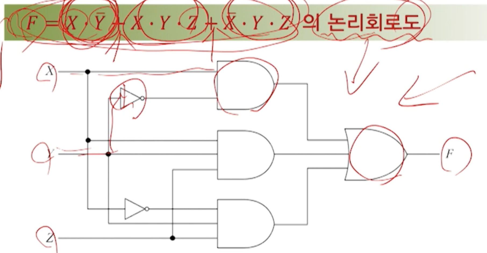

# 2강. 논리게이트와 부울대수(1)

- 논리회로도를 구현하기 위한 과정

## 01. 논리 연산

### 논리연산의 개요

- 2진 디지털 시스템에서 입출력 관계를 표현하는 방법

  

### 논리집합과 논리연산

- 논리집합(부울집합)
  - 집합이 0(거짓)과 1(참)으로만 구성된 집합 {0, 1}
- 논리연산(부울연산)
  - 두 개의 이산값에 적용되는 연산
- 논리집합{0, 1}에 대한 세 가지 논리연산
  - AND
    - 점(﹒)으로 표시. 생략 가능
  - OR
    - 덧셈 기호로 표시(+)
  - NOT
    - 변수 위에 줄(-)을 그어 표시

## 02. 논리 게이트

### 기본 논리게이트

- AND, OR, NOT 게이트

- AND 게이트

  

- OR 게이트

  

- NOT 게이트

  

### NAND 게이트와 NOR 게이트

- NAND

  

- NOR 게이트

  

### XOR 게이트와 XNOR게이트

- XOR 게이트

  

- XNOR 게이트

  

## 03. 부울대수

### 부울대수의 개요

- 부울대수(Boolean Algebra)

  - 0과 1의 값을 갖는 놀리변수와 논리연산을 다루는 대수

- 부울함수(Boolean Function)

  - 논리변수의 상호관계를 나타내기 위해 부울변수, 부울연산기호, 괄호 및 등호 등으로 나타내는 대수적 표현

  - 예시

    

- 부울함수와 논리회로도

  - 부울함수는 논리 게이트들로 구성되는 논리회로도 작성 가능

    

- 부울함수와 진리표

  - 진리표(truth table)

    - 논리 변수에 할당한 0과 1의 조합의 리스트

  - 부울 함수는 진리표로 나타낼 수 있다

    - 진리표를 가지고도, 부울 함수로 만들 수 있음

    

- 부울함수와 진리표와의 관계

  - 부울 함수에 대한 진리표는 하나이다
  - 동일 진리표를 만족하는 부울 함수는 여러 개가 될 수 있다
  - 따라서 동일 진리표에 대한 논리회로도는 여러 개가 될 수 있다
    - 결론적으로 논리회로도는 단순해야 한다
    - 복잡하면 게이트 수, 게이트의 입력 수가 많아지므로 비효율적
    - 따라서 부울함수의 단순화(간소화)가 필수

- 부울함수의 간소화 필요성

  - 논리회로를 간단하게 그리기 위해

  

- 부울함수의 간소화 방법
  - 대수적인 방법
  - 도표를 이용한 방법
  - 테이블을 이용한 방법

### 기본 공식

- 부울대수의 기본 공식

- 부울대수의 쌍대성 원리(principle of duality)

  - 부울대수에서 어떤 부울공식이 항상 성립하고 자신의 쌍대형태를 구할 수 있다면 그 쌍대형태의 부울식도 성립한다

  - 싸대형태: 논리연산자 +와 **﹒** 그리고 논리 상수 1과 0을 맞바꾼 형태

    

### 부울함수의 대수적 간소화

- 항 결합

  

- 문자

  

- 예시

  

### 부울함수의 보수

