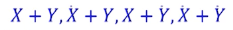
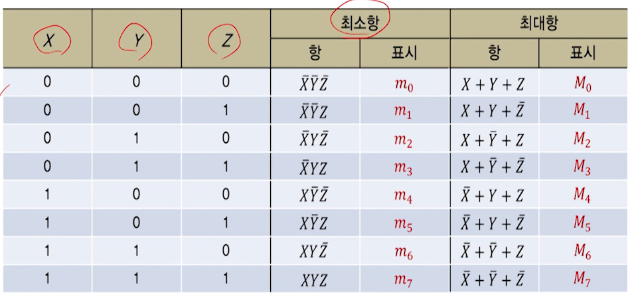

# 3강. 논리게이트와 부울대수(2)

## 부울 함수의 정규형 및 표준형

### 정규형

- 부울함수의 정규형
  - 부울함수를 최소항의 합(sum of minterm)이나 최대항의 곱(product of maxterm)으로 표현한 것

#### 최소항과 최대항

- 2개의 논리변수 X, Y가 있을 때

  - 최소항
    - 논리곱(AND)으로 표현되는 네 가지 항(그 결과가 논리-1)
    - 
  - 최대항
    - 논리합(OR)로 표현되는 네 가지 항(그 결과가 논리-0)
    - 

- 세 변수에 대한 최소항과 최대항

  

#### 최소항의 합

- 최소항
  - n개의 논리변수로 구성된 부울함수에서 최소항이란
    - 각 변수의 문자 1개씩 모두 n개의 문자의 논리곱 항으로서 그 결과가 논리-1인 경우
    - mj로 표시(j는 아래첨자)
- 진리표를 부울함수로 표현
  -  

#### 최대항의 곱

- 최대항
  - n개의 논리변수로 구성된 부울함수에서 최대항이란
    - 각 변수의 문자 1개씩 모두 n개의 문자의 논리합 항으로서 그 결과가 논리-0인 경우
    - Mj로 표시(j는 아래첨자)

### 표준형

#### 곱의 합

#### 합의 곱

