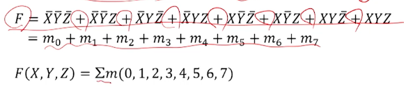
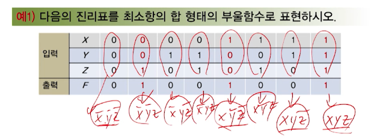
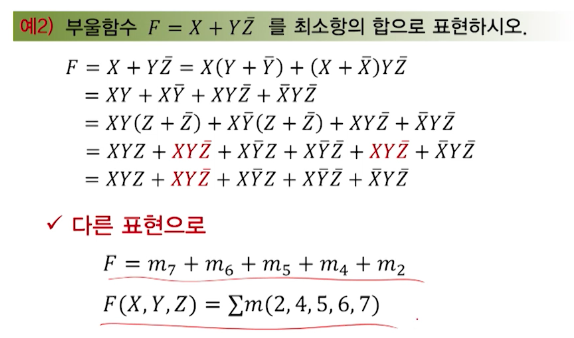
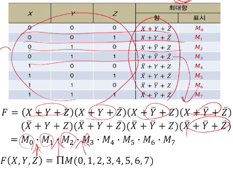
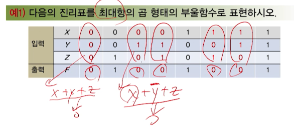
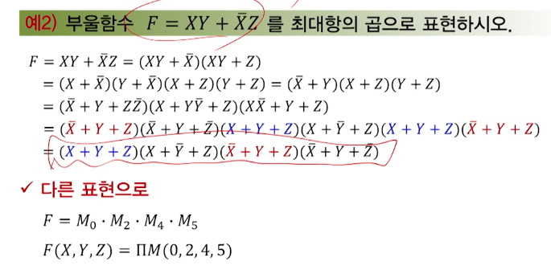
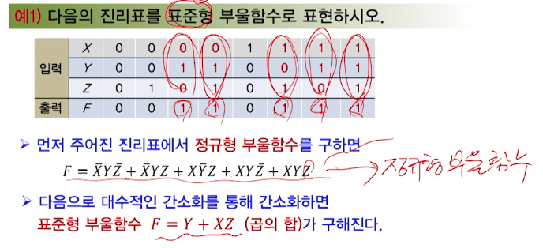
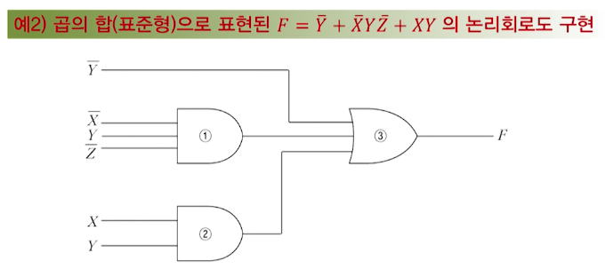
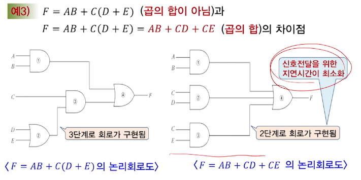

# 3강. 논리게이트와 부울대수(2)

## 부울 함수의 정규형 및 표준형

### 정규형

- 부울함수의 정규형
  - 부울함수를 최소항의 합(sum of minterm)이나 최대항의 곱(product of maxterm)으로 표현한 것

#### 최소항과 최대항

- 2개의 논리변수 X, Y가 있을 때

  - 최소항
    - 논리곱(AND)으로 표현되는 네 가지 항(그 결과가 논리-1)
    - 
  - 최대항
    - 논리합(OR)로 표현되는 네 가지 항(그 결과가 논리-0)
    - 

- 세 변수에 대한 최소항과 최대항

  

#### 최소항의 합

- 최소항

  - n개의 논리변수로 구성된 부울함수에서 최소항이란
    - 각 변수의 문자 1개씩 모두 n개의 문자의 논리곱 항으로서 그 결과가 논리-1인 경우
    - mj로 표시(j는 아래첨자)

- 진리표를 부울함수로 표현

  - 진리표에서 출력이 1이되는 최소항들을 논리합(OR)으로 묶으면 정규형 부울함수가 구해짐

  

- 예시 1

  - 진리표에서 출력 F가 1이 되기 위해서는 001, 100, 111 중 하나면 된다(OR 관계)
  - 따라서 정답은: 

  

- 예시 2

  

#### 최대항의 곱

- 최대항

  - n개의 논리변수로 구성된 부울함수에서 최대항이란
    - 각 변수의 문자 1개씩 모두 n개의 문자의 논리합 항으로서 그 결과가 논리-0인 경우
    - Mj로 표시(j는 아래첨자)

- 진리표를 부울함수로 표현

  

- 예시 1

  - 진리표에서 출력이0이 되는 최대항들을 논리곱(AND)으로 묶으면 정규형 부울함수가 구해진다
  - 진리표에서 출력 F가 0이 되기 위해서는 000, 010, 011, 101, 110중 하나면 된다(AND관계)
  - 정답은: 

  

- 예시 2

  

### 표준형

- 부울함수의 표준형
  - 부울함수를 표현하는 또 다른 형태(간소화된 형태)
  - 각 항은 하나 또는 그 이상의 문자로 구성
  - 곱의 합(sum of products)과 합의 곱(product of sums)의 형태
- 정규형은 진리표에서 바로 얻을 수 있지만, 최소항 또는 최대항에 모든 변수가 포함되어 있어 부울함수의 **간소화에는 부적합**
- 따라서 정규형으로부터 **간소화된 표준형으로 반환**이 필요

#### 곱의 합

- 부울함수의 필요성

  - 논리회로를 설계하고자 할 때

    

