# 5강. 부울함수의 간소화 및 구현(2)

## 4변수 카르노 도표

#### 개념

- 네 개의 변수를 가지는 부울함수 > 16개의 최소항(2^4)
- 16개의 정사각형으로 구성

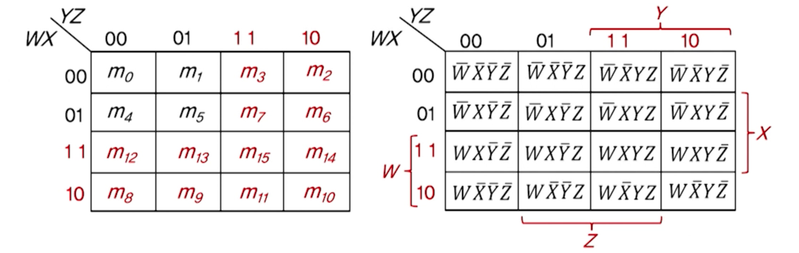

#### 정사각형들의 묶음 > 곱항으로 간소화

- 하나의 정사각형 > 네 개 문자의 곱항으로 표시
- 두 개의 인접 정사각형 > 세 개 문자의 곱항으로 표시
- 네 개의 인접 정사각형 > 두 개 문자의 곱항으로 표시
- 여덟 개의 인접 정사각형 > 한 개 문자의 항으로 표시
- 열 여섯개의 인접 정사각형 > 상수 1로 부울함수 표시

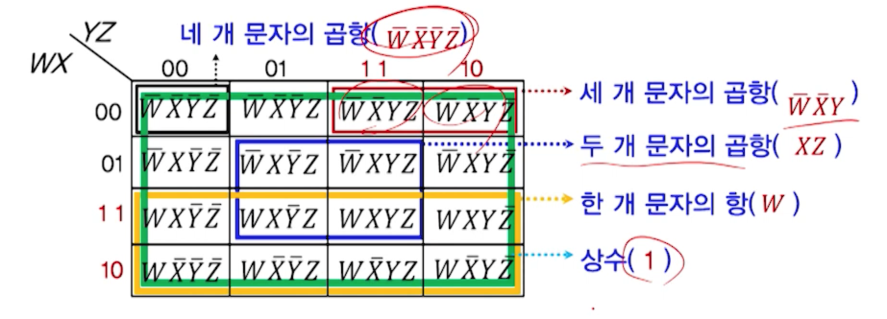

#### 예시

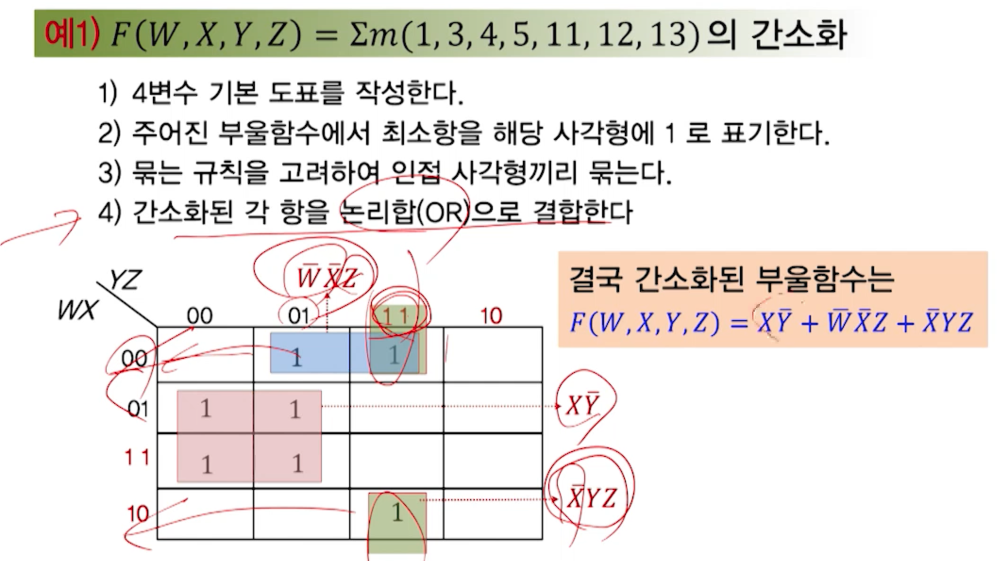

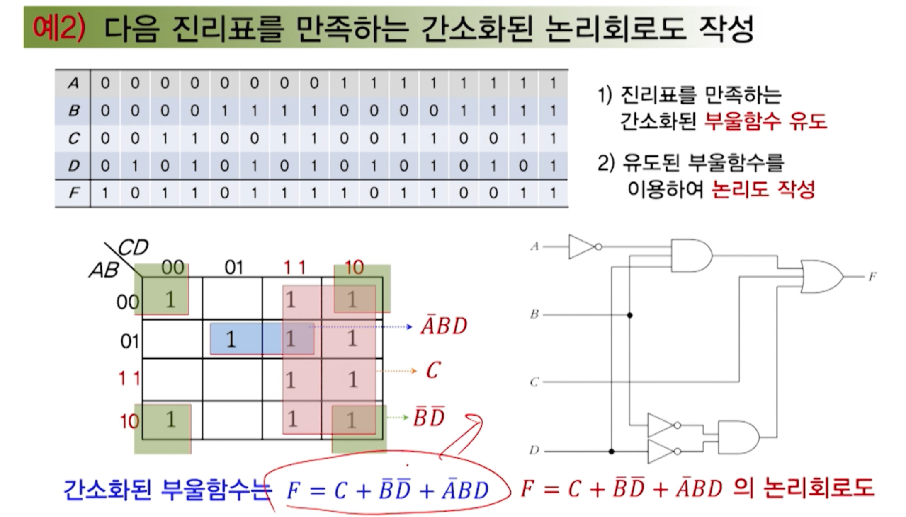

## 무관조건

### 무관조건(Don't care condition)

- 입력변수의 조합에 따라 함수값이 발생하지 않는 경우
- 함수값이 0과 1중 뭐가 나와도 무관한 경우

#### 예

- BCD 코드의 경우
- 2진수 16개 조합 중 10개 조합만 사용
- 나머지 6개 조합(1010, 1011, 1100, 1101, 1110, 1111)은 미사용
- 따라서 BCD 코드를 사용하는 논리회로는 6개 조합은 발생하지 않는다는 가정 하에 동작
- 결국 6개 조합에 무관하게 동작되는 논리회로 구성

=> 따라서 무관조건은 부울함수를 더욱 간소화하는데 사용

#### 부울함수에서 무관조건의 표현

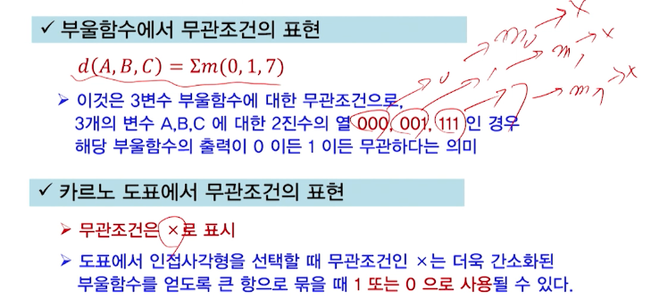

#### 예시

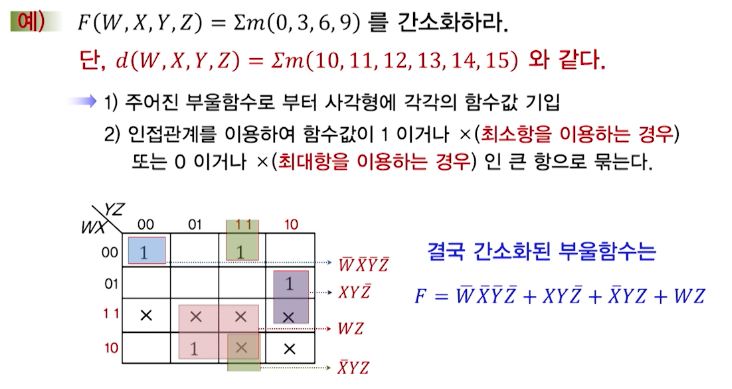

## 기타 카르노 도표

### XOR의 카르노 도표

#### 3변수 XOR의 카르노 도표

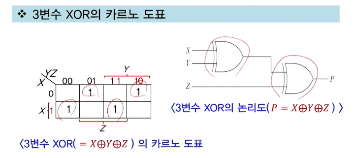

#### 4변수 XOR의 카르노 도표

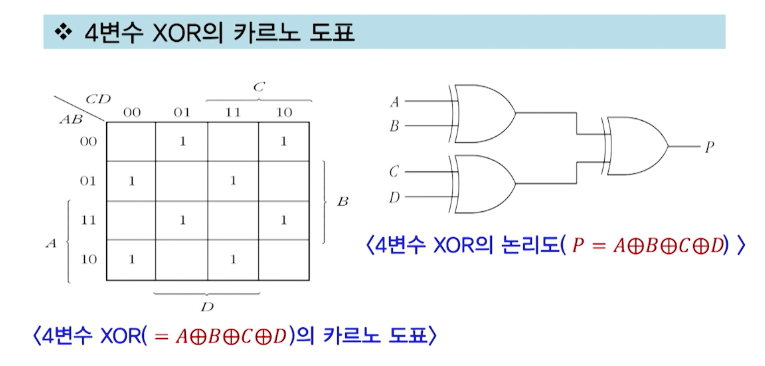

## NAND와 NOR 게이트를 이용한 구현방법

### 개요

- NAND와 NOR 게이트를 이용한 부울함수의 구현
- 모든 부울함수는 AND, OR, NOT 게이트로 구현이 가능
- 그러나 실제 회로는 NAND나 NOR 게이트로 구현
- 왜냐하면
  - NAND, NOR 게이트가 전자회로로 제작이 용이
  - 회로구성이 동일 게이트로 구성되는 것이 유리하기 때문
- 따라서 AND, OR 게이트로 구현된 논리회로를 NAND, NOR 게이트로 구현될 수 있또록 변환이 필요

#### NAND 게이트 개념 및 구상

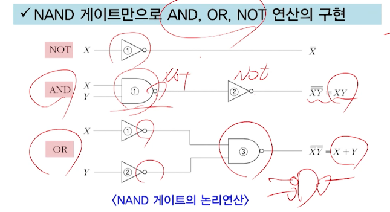

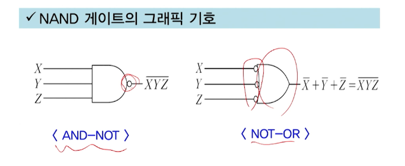

#### NAND 게이트를 이용한 구현방법

- 2단계 구현

  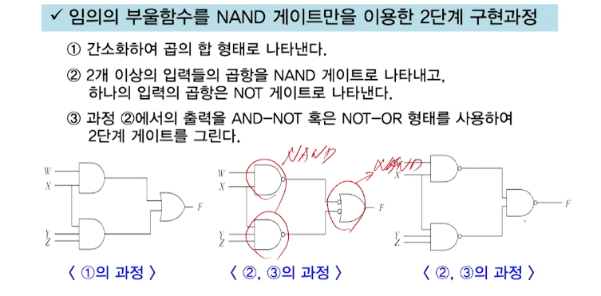

- 다단계 구현

  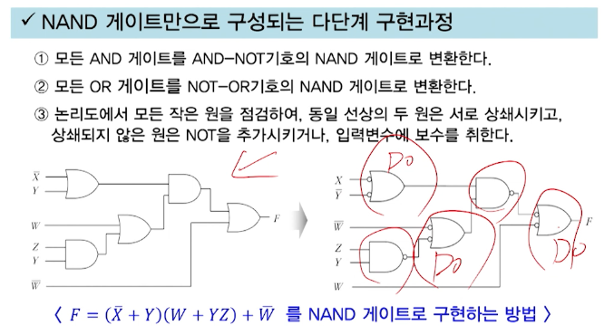

#### 예시

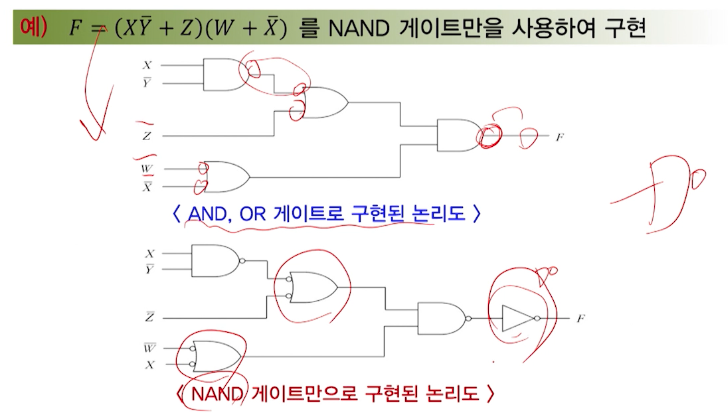

### NOR 게이트 개념 및 구성

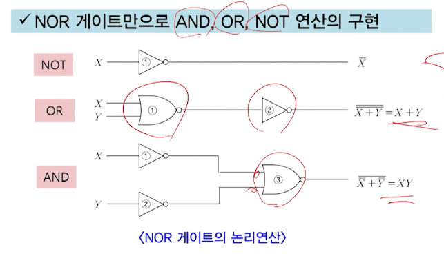

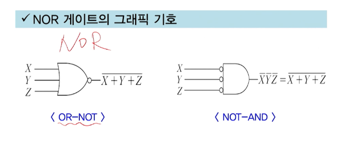

### NOR 게이트를 이용한 구현방법

- 2단계 구현

  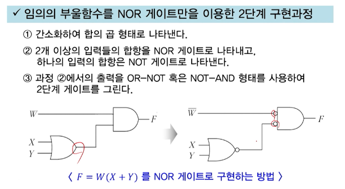

- 다단계 구현

  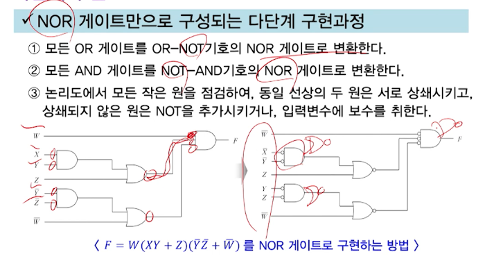