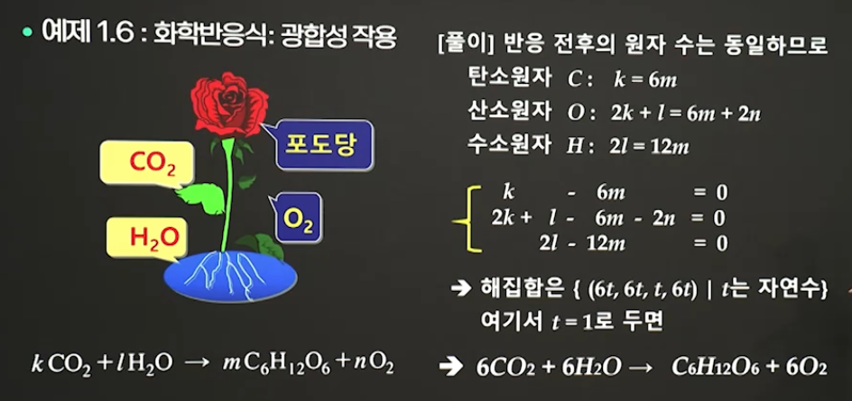

# 1강. 일차연립방정식

## 1.1 일차연립방정식

```
ax = b
```

- a: 계수(coefficient)
- x: 미지수(unknown)
- b: 상수(constant)
- s: 해(solution) 또는 근(root)


### (1) a ≠ 0인 경우

  

- 유일한 해 구할 수 있음


### (2) a = 0, b = 0인 경우

```
0x = 0 
```

- 무수히 많은 해(부정)


### (3) a = 0, b  ≠ 0인 경우

```
0x = b
```

- 해가 없음(불능)


### 일차연립방정식

- 미지수가 n개인 일차방정식들을 유한개 묶어 놓은 것


### 예제 1.1

- 3원 일차연립방정식의 해


## 1.2 소거법

> 다음의 3가지 연산을 이용하여 주어진 연립방정식을 동일한 해집합을 가지면서 보다 풀기 쉬운 형태의 연립방정식으로 변환하는 방법

1. 두 방정식을 교환한다
2. 한 방정식에 0이 아닌 상수를 곱한다
3. 한 방정식에 임의의 상수를 곱하여 다른 방정식에 더한다


## 1.3 일차연립방정식의 응용

- 예제 1.6 화학반응식

  

- 예제 1.7 유리함수의 부분 분수로 나누기

  

-  예제 1.8 교차로에서의 자동차 흐름

  

- Curve fitting

  

- Linear Programming

   

- Network analysis

  - Car traffic analysis
  - Electrical network analysis(옴의법칙 등)


## 숙제: 연습문제

- 다음 2원 일차연립방정식이 유일한 해를 가질 조건은?

  ```
  x - 2y = 3
  ax + by = c
  ```

  

  - 왜냐면 ax = b 에서 유일한 해를 가질 조건은
    - a ≠ 0 이므로~
