# 3강. 행렬연산

## 3.1 행렬의 기본 개념

### 정의 3.1: m x n 행렬 A에 대하여

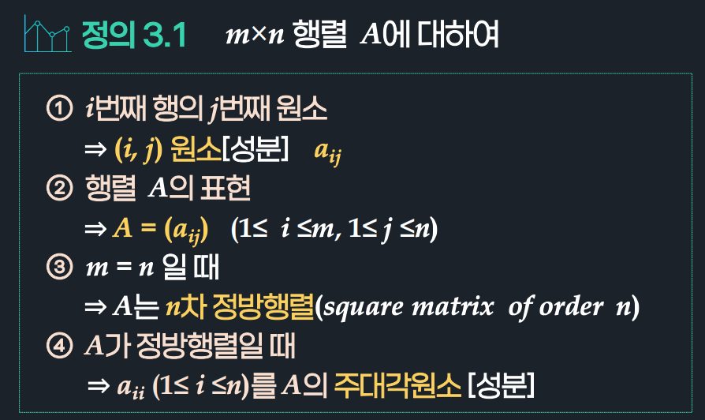

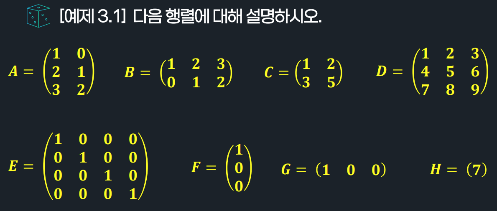

- A = 3x2 행렬
- B = 2x3 행렬
- C = 2차 정방행렬 / 행제형 행렬
- D = 3차 정방행렬
- E = 4차 정방행렬 / 4차 단위행렬
- F = 열벡터
- G = 행벡터
- H = 실수

### 정의 3.2: n차 정방행렬 A = (aij)에 대해

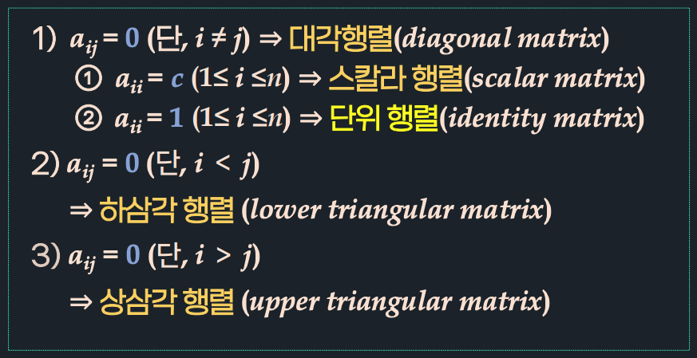

### 정의 3.3: 행렬의 상등

## 3.2 행렬의 합

### 정의 3.4: 행렬의 합

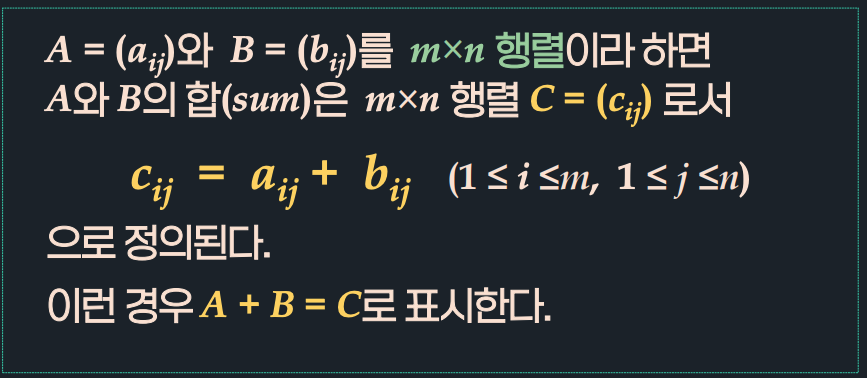

- 행렬 A, B의 크기가 같을 때만 가능

### 정리 3.1: 행렬의 합의 성질

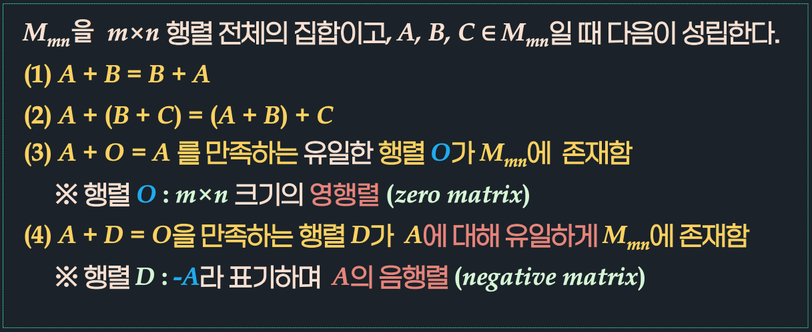

(1) 교환법칙

(2) 결합법칙

## 3.3 행렬의 스칼라곱

### (참고): 벡터의 스칼라곱

- 벡터: 방향과 크기가 둘 다 있음
- 스칼라: 크기만 있음

### 정의 3.5 행렬의 스칼라배

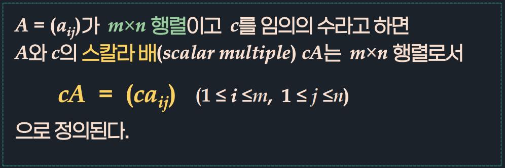

### 정리 3.2 행렬의 스칼라 배의 성질

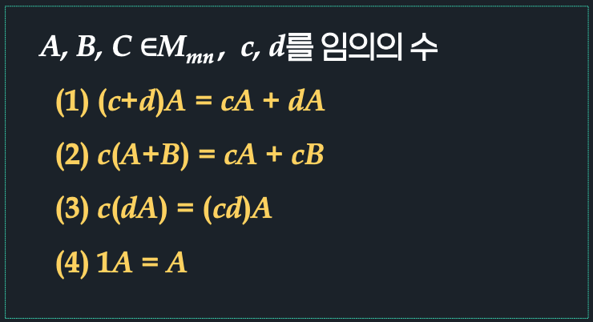

## 3.4 행렬의 곱

### 정의 3.6 행렬의 곱

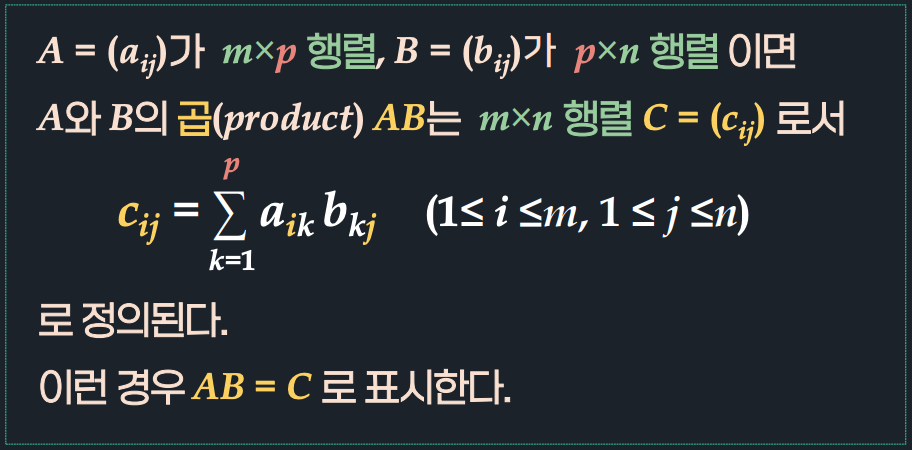

### 참고: 벡터의 내적(정의 7.14)

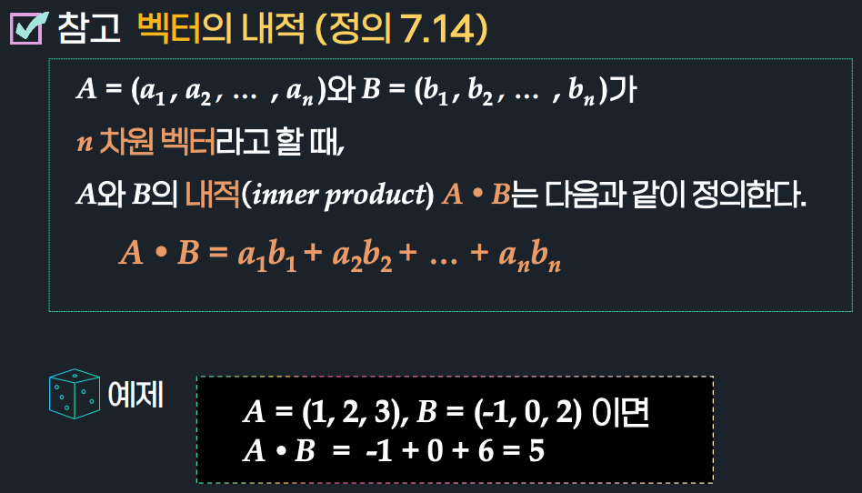

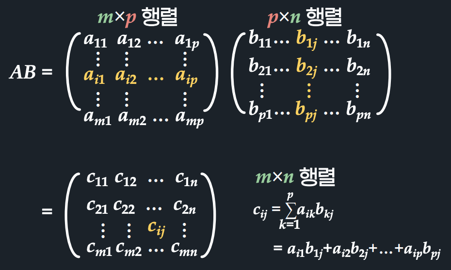

### 행렬의 곱의 특이 사항(1)

- 교환법칙이 성립하지 않음 

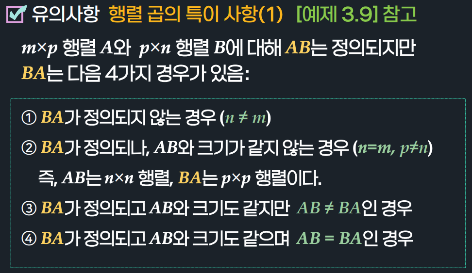

### 행렬의 곱의 특이 사항(2)

- 교환법칙이 성립하지 않음 

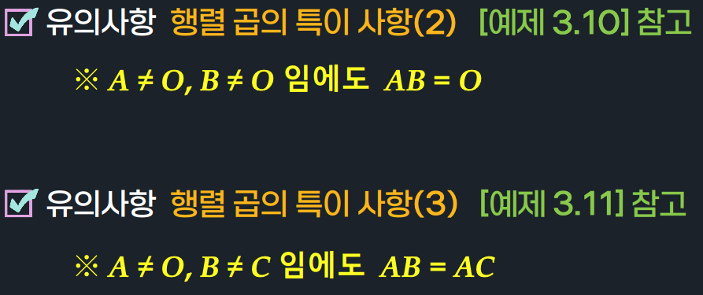

### 정리 3.3 행렬의 곱의 성질

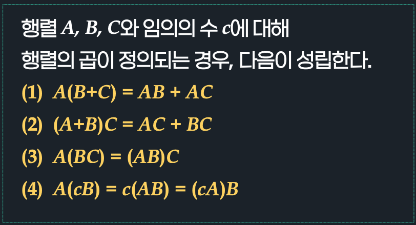

### 유의사항: 행렬 곱의 항등원

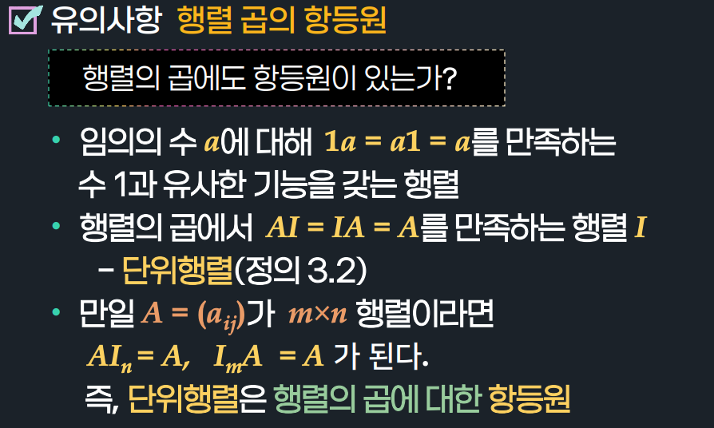

### 유의사항: 행렬의 거듭제곱

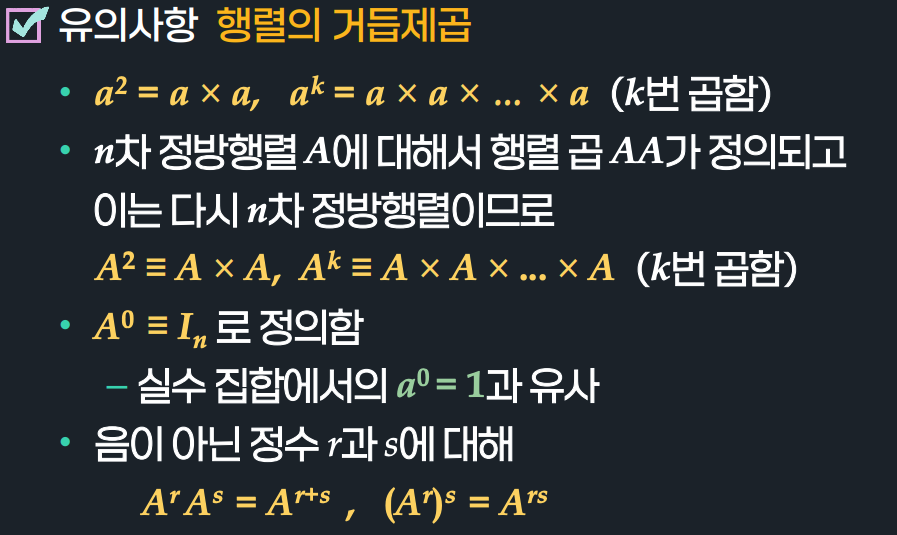

## 3.5 행렬의 전치

### 정의 3.7: 행렬의 전치

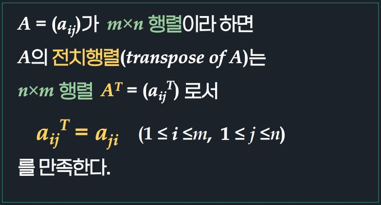

### 정리 3.4: 행렬의 전치의 성질

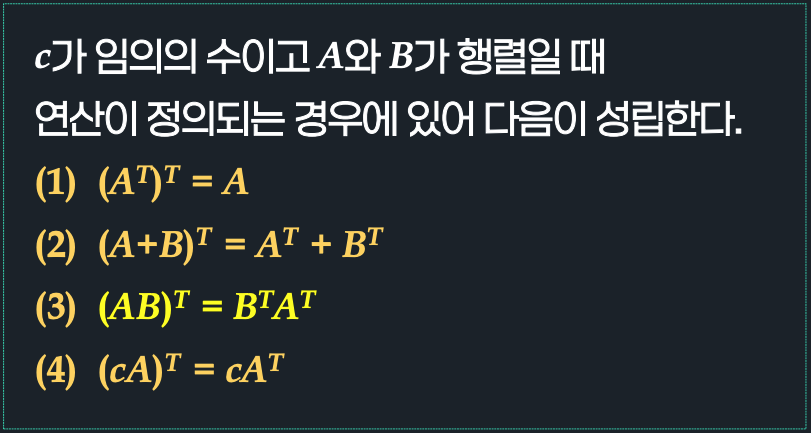

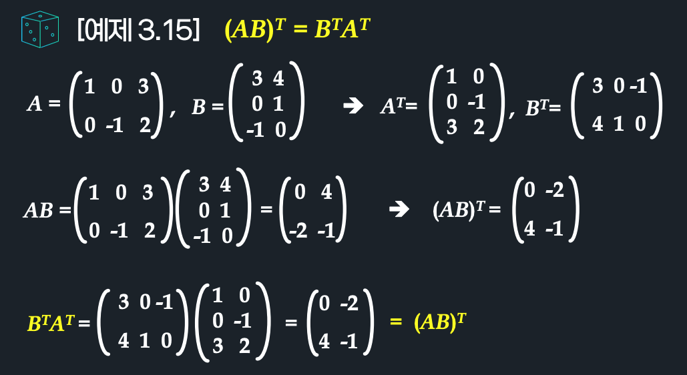

### 정의: 대칭행렬

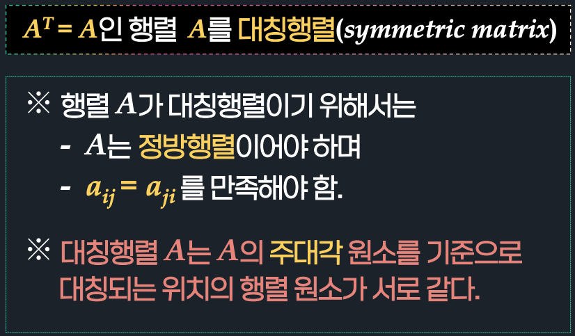

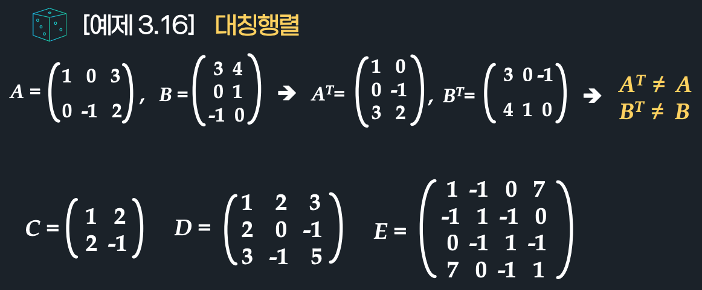

https://www.youtube.com/watch?v=rZ4-tTShpeo