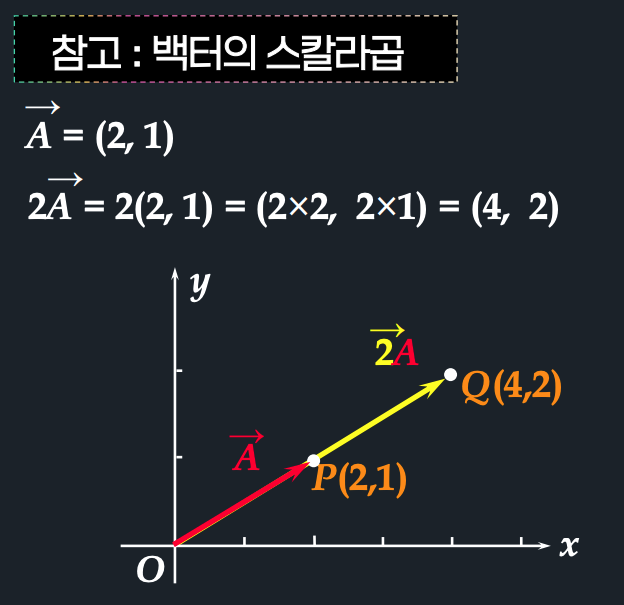

# 3강. 행렬연산

## 3.1 행렬의 기본 개념

### 정의 3.1: m x n 행렬 A에 대하여

- A = 3x2 행렬
- B = 2x3 행렬
- C = 2차 정방행렬 / 행제형 행렬
- D = 3차 정방행렬
- E = 4차 정방행렬 / 4차 단위행렬
- F = 열벡터
- G = 행벡터
- H = 실수

### 정의 3.2: n차 정방행렬 A = (aij)에 대해

### 정의 3.3: 행렬의 상등

## 3.2 행렬의 합

### 정의 3.4: 행렬의 합

- 행렬 A, B의 크기가 같을 때만 가능

### 정리 3.1: 행렬의 합의 성질

(1) 교환법칙

(2) 결합법칙

## 3.3 행렬의 스칼라곱

## 3.4 행렬의 곱

## 3.5 행렬의 전치

