# 4강. 역행렬

## 4.0 들어가기

### 역행렬 기본

- 행렬 곱 연산의 역원

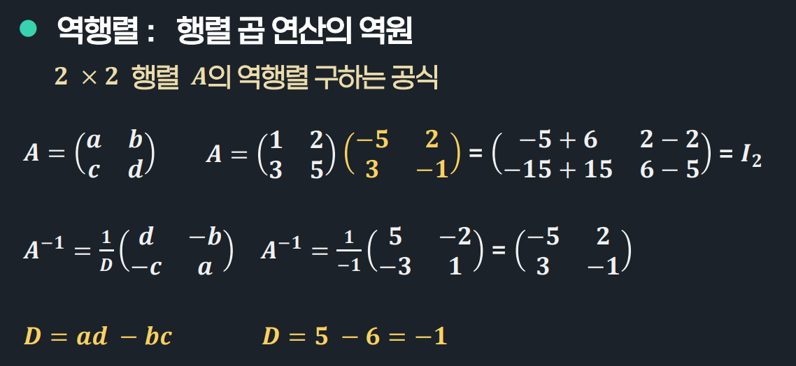

### 역행렬 응용: 암호문 만들기

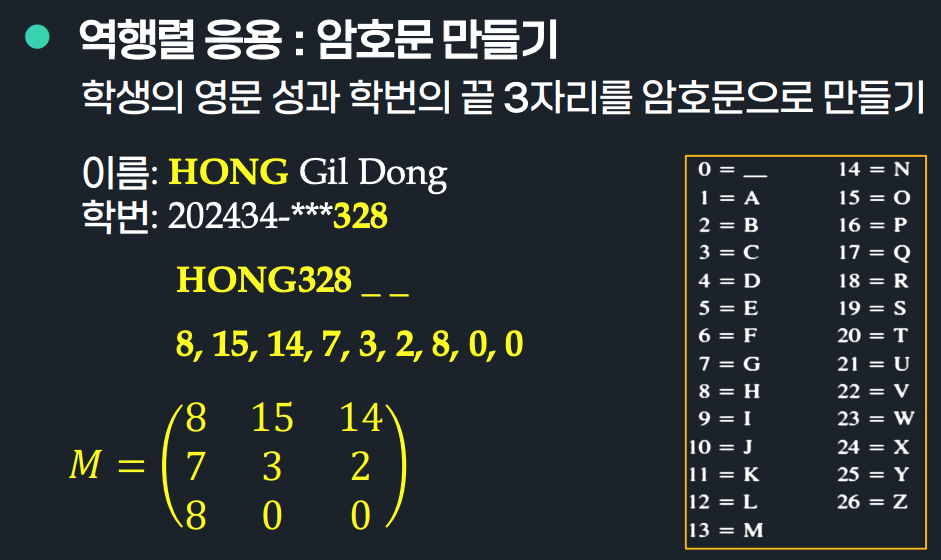

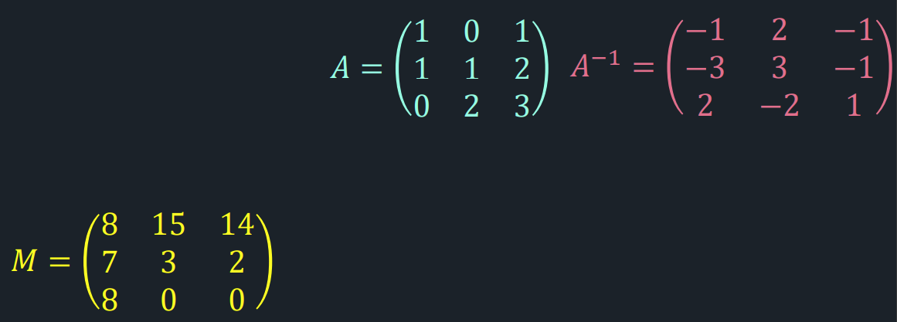

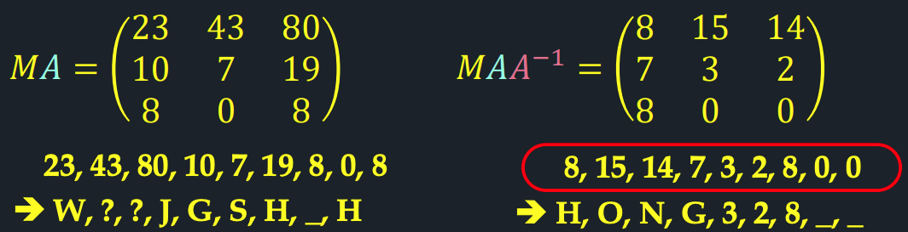

### 역행렬 응용: 추상화

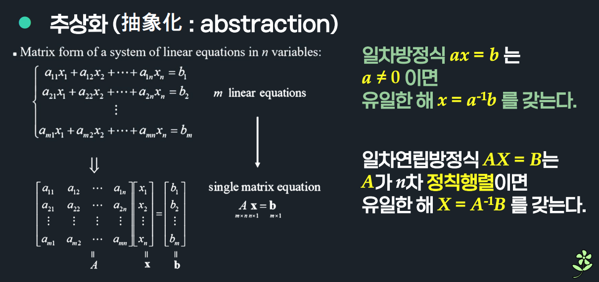

## 4.1 정칙행렬과 역행렬

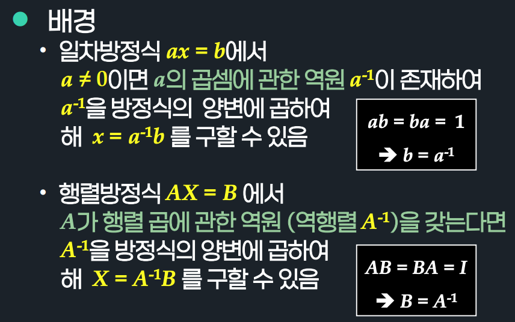

## 4.2 역행렬 구하는 방법

### 정의 4.2 기본행렬

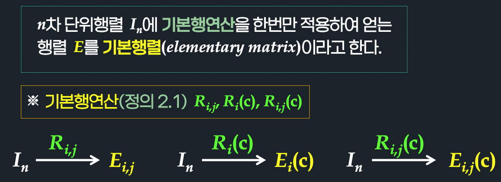

### 예제

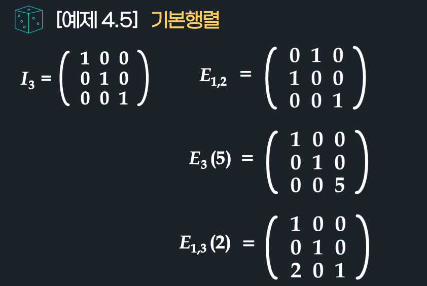

### 정리 4.3 기본행연산과 기본행렬의 관계

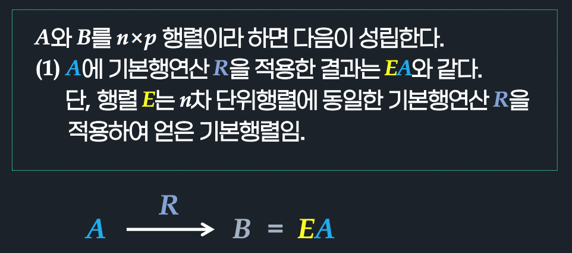

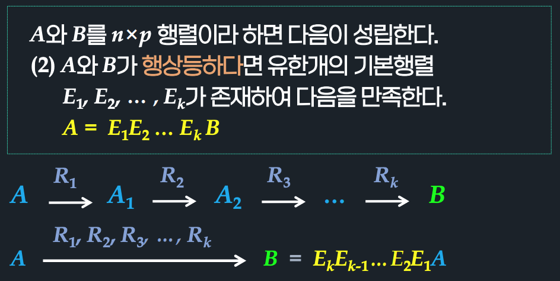

### 정리 4.4 기본행렬의 성질

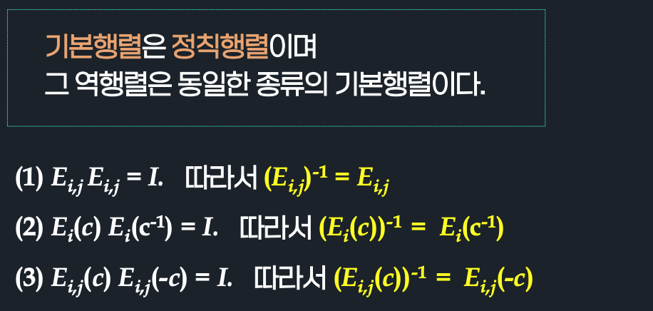

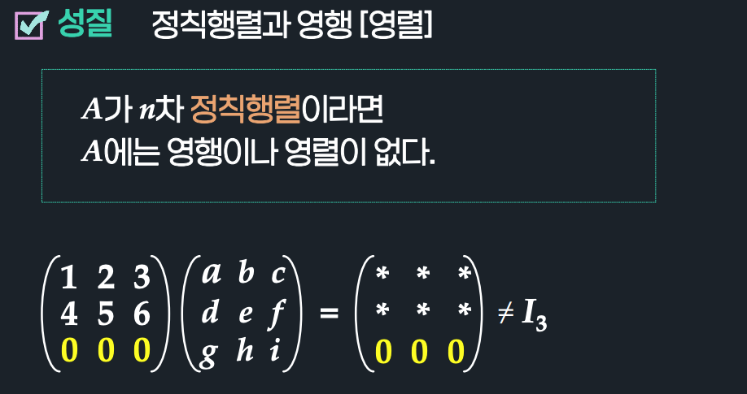

### 정리 4.5 정칙행렬의 성질

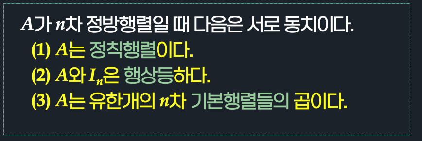

### 정리 4.6 역행렬 구하는 이론

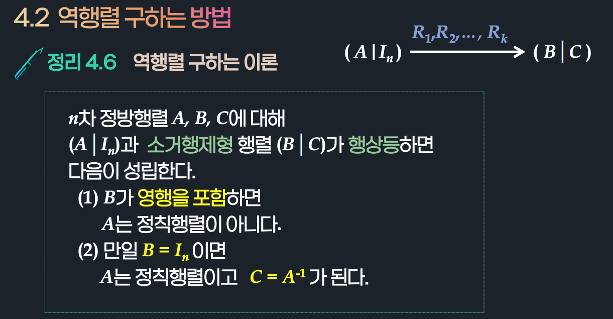

### 예제

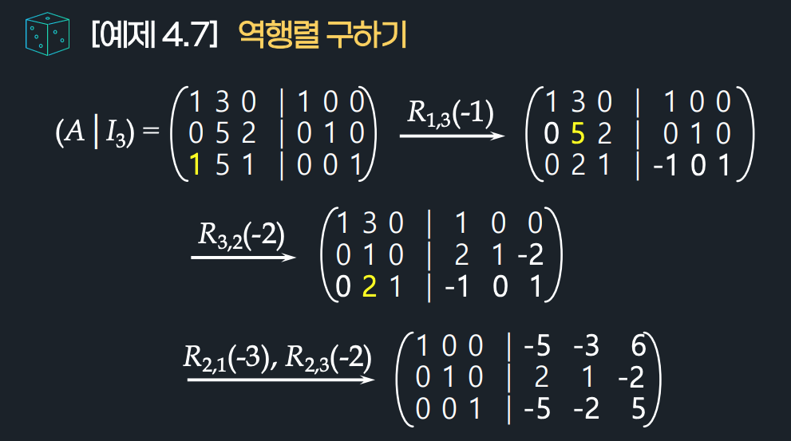

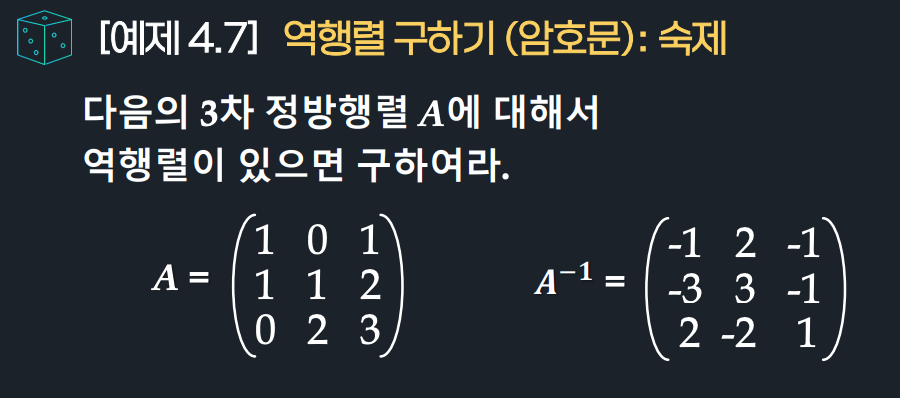

### 정리 4.6 역행렬 구하는 이론

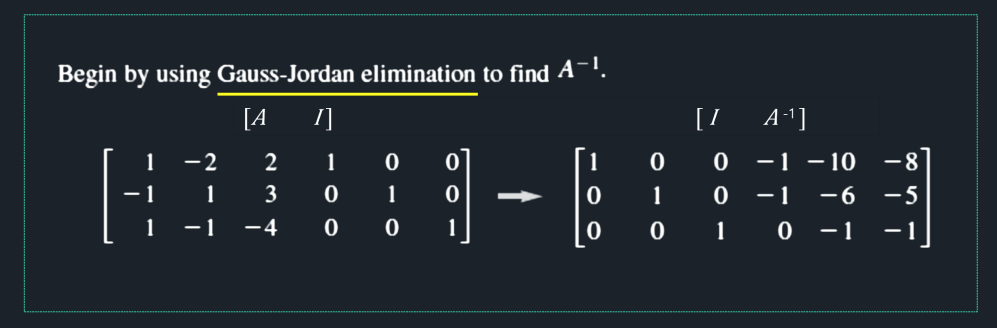

## 4.3 일차연립방정식과 역행렬

- 일차연립방정식 AX = B의 해
  - 위수
  - 위수와 AX = B의 해와의 관계
- 정칙행렬과 일차연립방정식
  - 알고리즘 비교
  - 정칙행렬의 성질

### 정의 4.3 위수

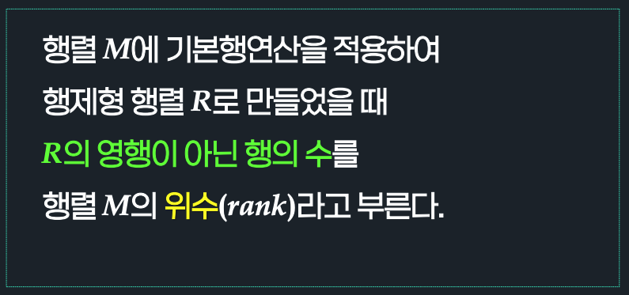

### 정리 4.7 일차연립방정식의 해

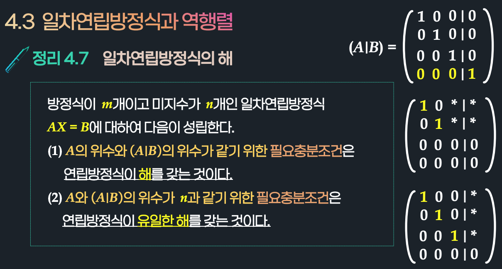

- 정칙행렬과 일차연립방정식

  - 알고리즘 2.3 (가우스-조르단 소거법)

  - 알고리즘 4.1 (역행렬 구하는 방법)

    

### 정리 4.8 행렬방정식 AX = B의 해

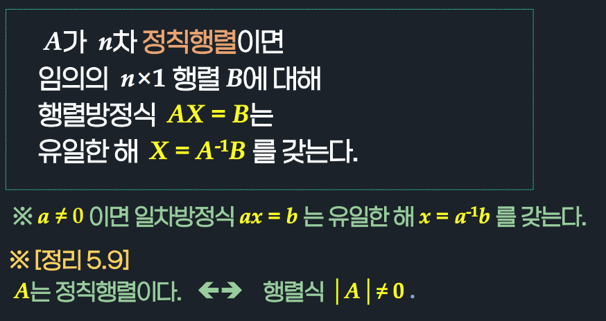

### 정리 4.9 동차연립방정식의 해

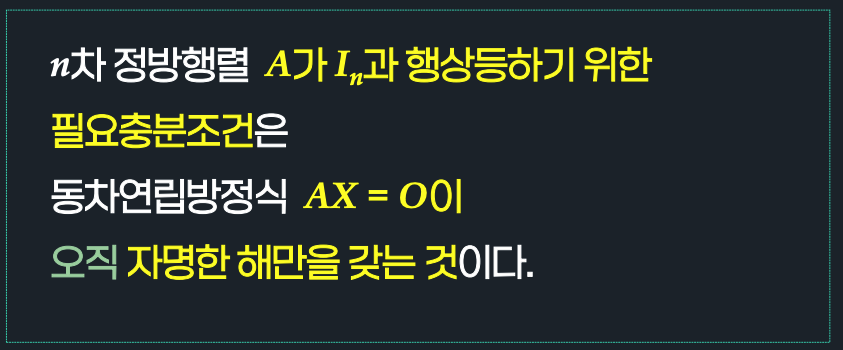

### 정리 4.10 정칙행렬의 성질 - 종합

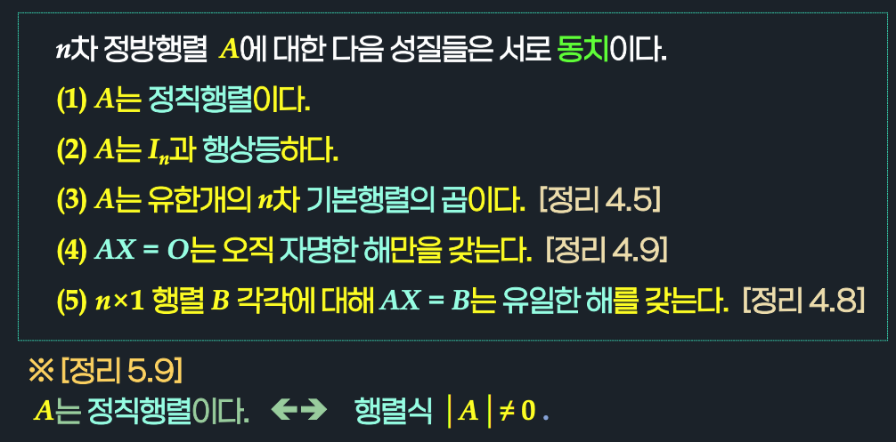