# 5강. 행렬식

## 5.1 행렬식

- 행렬식(determinant)
  - 정방행렬에 실수를 대응시키는 함수
  - 정방행렬  A의 행렬식은 |A| 또는 det A
  - 행렬식의 귀납적 정의
    - n차 정방행렬의 행렬식은 (n-1)차
    - 정방행렬의 행렬식과 관련지어 귀납적으로 정의

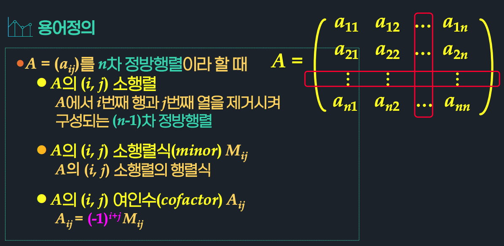

### 정의 5.1 행렬식

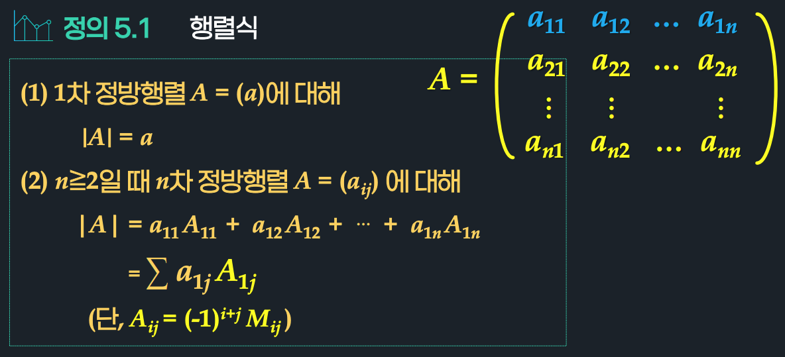

### 정의 5.1 행렬식

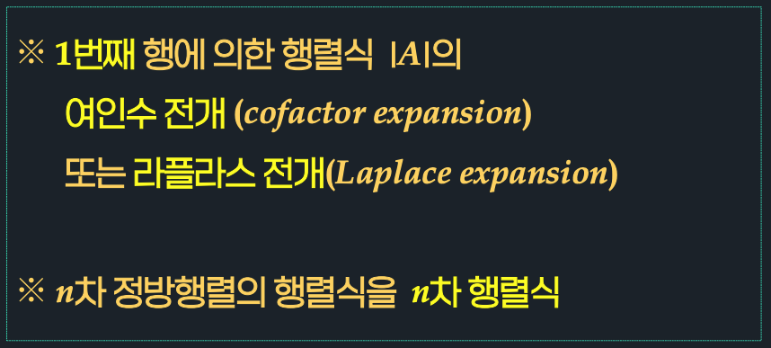

### 설명: 2차 행렬식

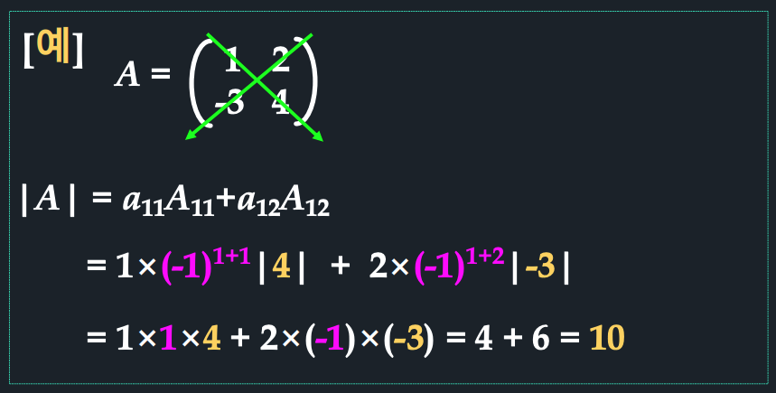

### 설명: 3차 행렬식

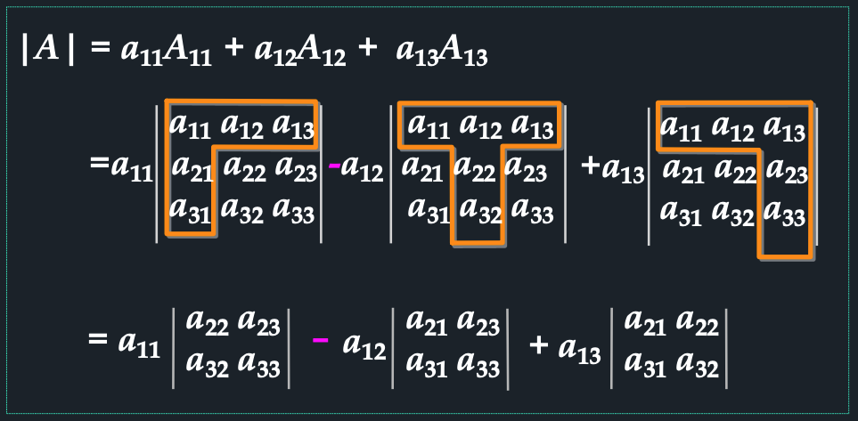

### 설명: 부호 문제

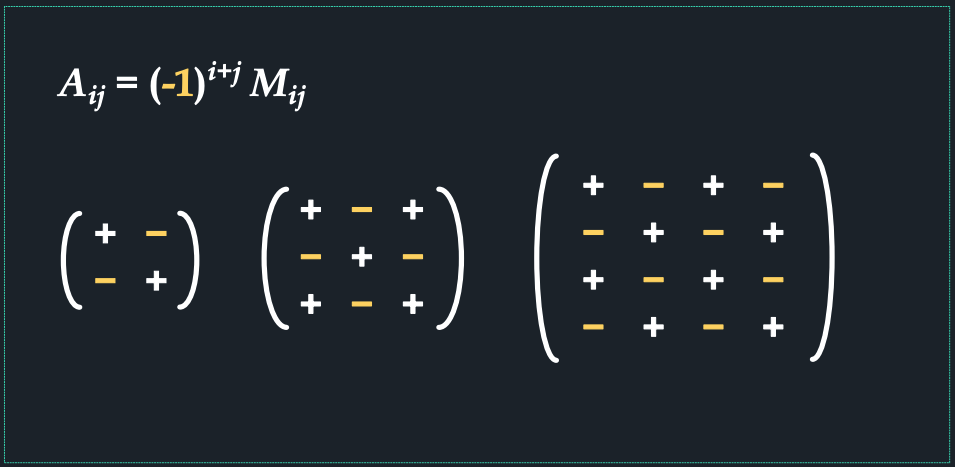

### 정리 5.1 n차 정방행렬 A의 행렬식

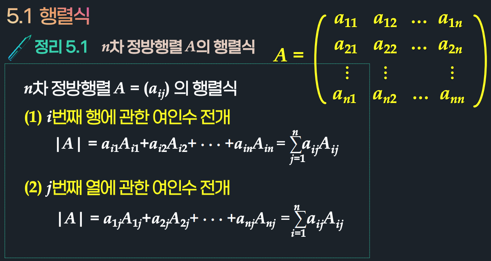

### 예제 5.1 3차 정방행렬의 행렬식

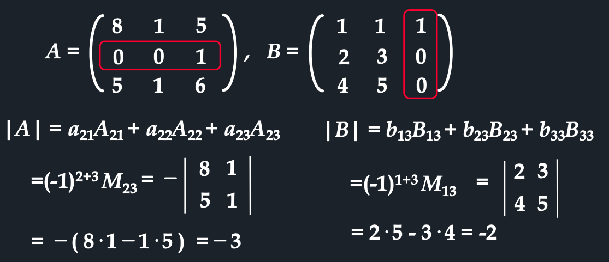

## 5.2 행렬식의 성질

### 정리 5.2 

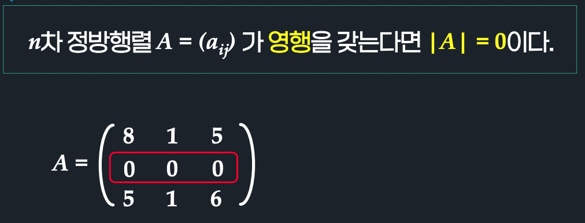

### 정리 5.3~5.5

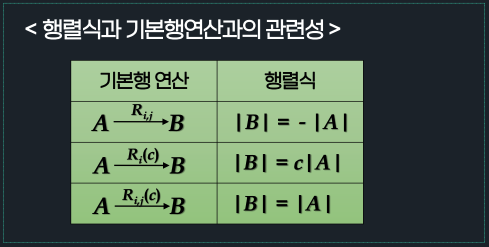

### 정리 5.3 기본행연산(Ri,j)과 행렬식

### 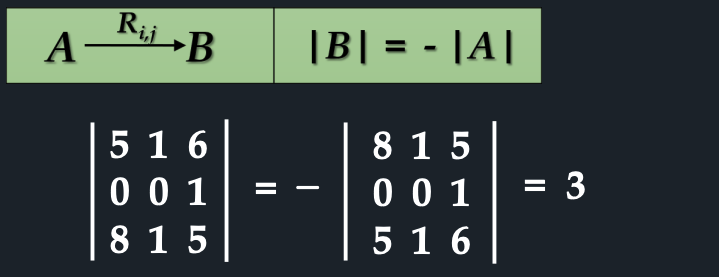

### 정리 5.4 기본행연산(Ri(c))과 행렬식

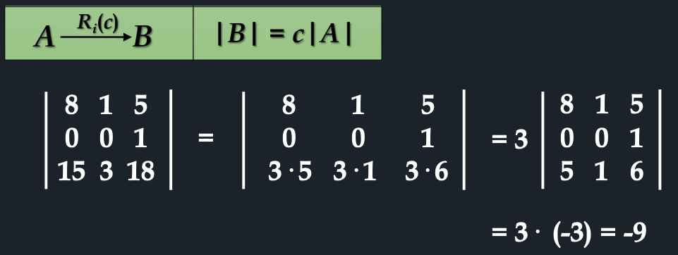

### 정리 5.5 기본행연산(Ri,j(c))과 행렬식

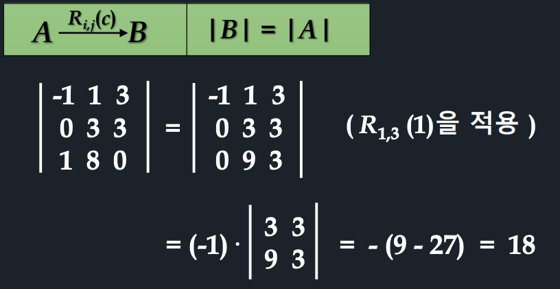

### 정리 5.6

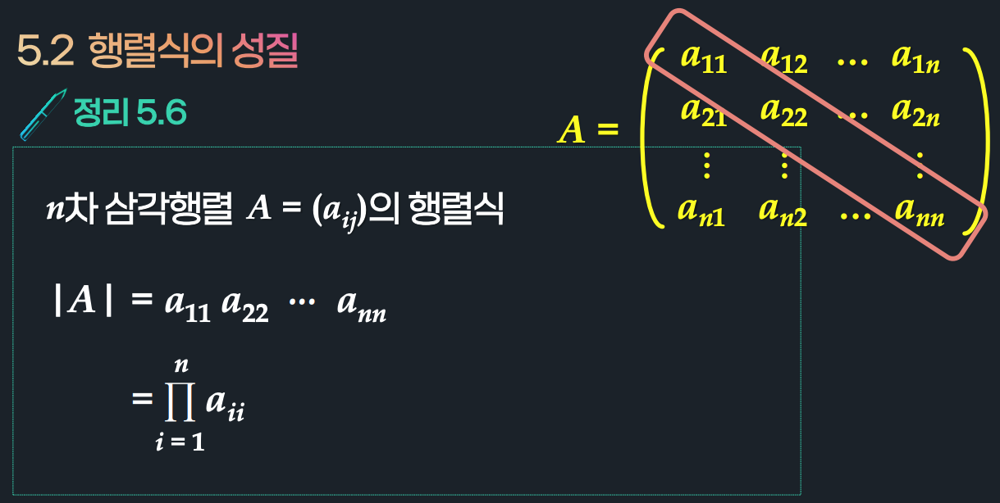

### 예제

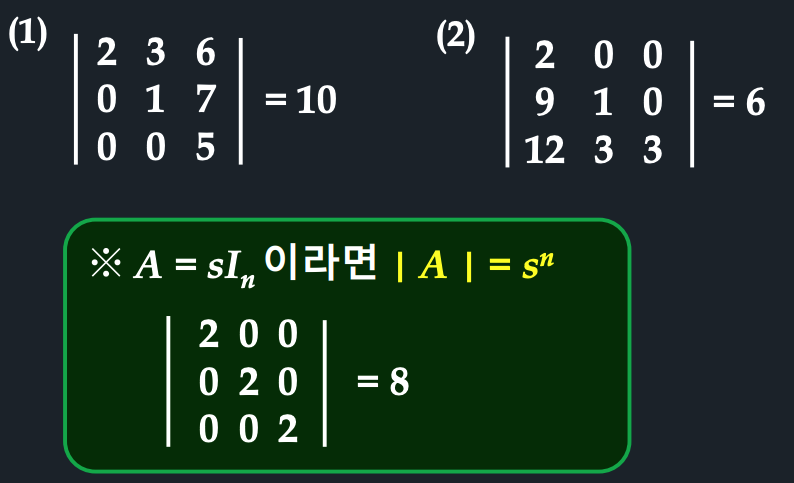

## 5.3 행렬연산과 행렬식

### 정리 5.7 n차 기본행렬의 행렬식

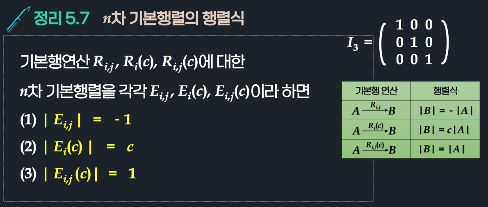

### 예제

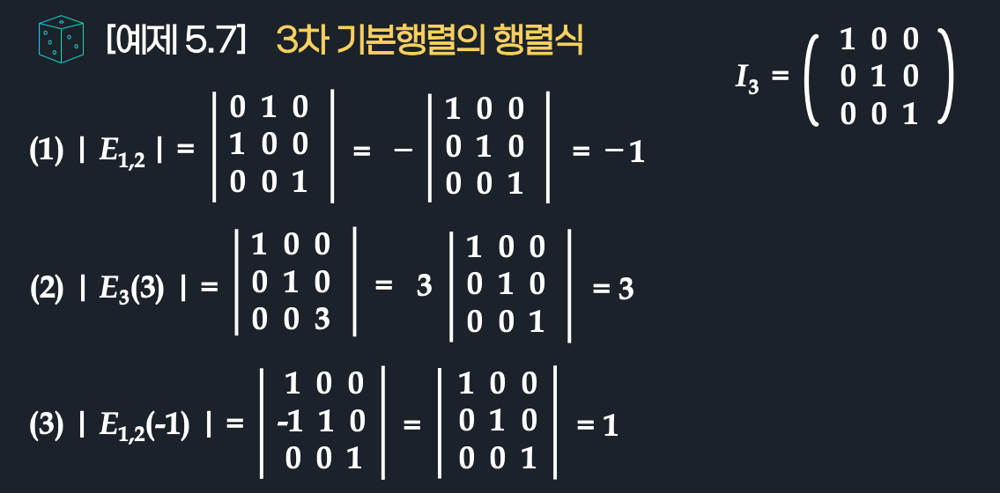

### 정리 5.8 

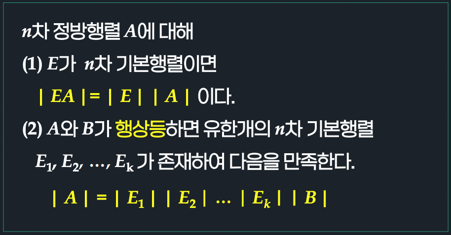

### 정리 5.8(따름정리)

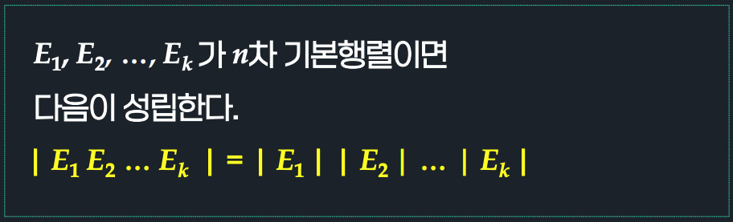

### 정리 5.9 

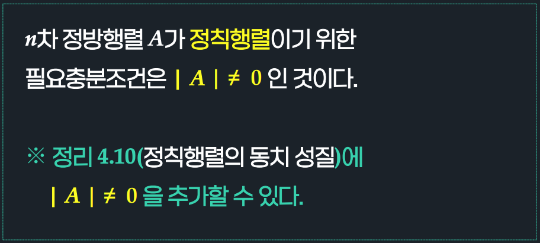

### 예제: 정칙행렬이 되기 위한 조건

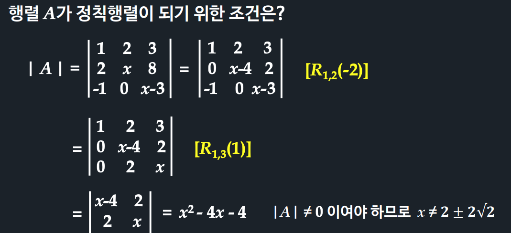

### 5.10 행렬 곱 연산

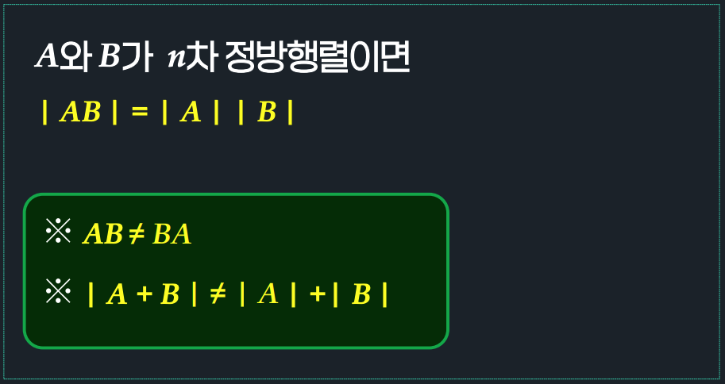

### 5.11 역행렬, 스칼라 배, 전치

### 예제

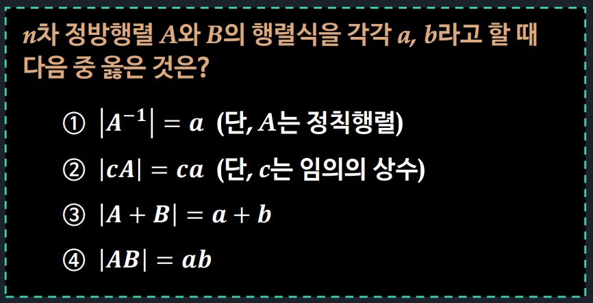