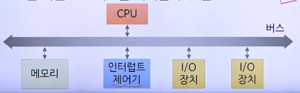
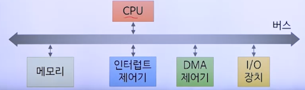

# 11강. 장치관리

## 01. 장치의 개념

### 컴퓨터 시스템의 구성

- 다양한 장치들
  - CPU, 메모리: 프로세스 실행에 필수
  - 나머지 장치들: 프로세스 실행 시 데이터 입력이나 출력에 사용되는 입출력장치


### 입출력장치의 구분

- 세 가지 구분
  - 전용장치, 공용장치, 가상장치
- 구분 기준
  - 장치의 기능적 특징과 장치관리자의 관리 방법


#### 전용장치

- 한 번에 단지 하나의 프로세스에만 할당
- 예: 테이프 드라이브, 프린터, 플로터 등
- 단점: 대기 시간이 길어질 수 있음


#### 공용장치

- 여러 프로세스에 동시 할당
- 예: 디스크 같은 직접 접근 저장장치
- 스케줄링 기법 필요


#### 가상장치

- 전용장치를 공용장치처럼 보이게 함
- 디스크 같은 공용장치를 이용
- 예: 스풀링을 적용한 플로터 등


## 02. 장치의 구성

### 논리적 구성


- 장치제어기
  - 장치를 직접적으로 다루는 전자장치
  - 장치에서 발생하는 각종 데이터를 전자신호로 변환하여 운영체제로 보냄
  - 운영체제가 요청하는 명령을 받아 장치를 구동
  - 운영체제가 보내는 출력을 장치에 맞게 변환

- 장치 드라이버(소프트웨어 형태)
  - 응용 프로그램의 입출력 요청을 해당 장치에 맞도록 변환
  - 장치의 종류나 제조사에 따라 장치제어기가 이해하는 명령이나 명령의 종류가 다를 수 있기 때문
  - 보통 장치 제조사에서 해당 장치의 드라이버도 같이 제공


### 물리적 구성

- CPU의 장치 사용법

  

  - 장치제어기의 레지스터를 이용
  - 장치의 상태를 확인하거나 장치에 명령

- 메모리 사상 입출력(memory-mapped I/O)

  

  - 메모리의 특정 영역을 장치제어기의 레지스터와 대응시켜 둠
  - 메모리를 읽고 쓰는 것으로 CPU가 장치를 사용


## 03. 입출력 처리 유형

### 입출력 처리

- 프로세스가 진행하며 입출력이 발생하는 경우
- 세 가지 유형
  - 프로그램 방법
  - 인터럽트 방법
  - DMA 방법


### 프로그램 방법

- CPU만 이용하는 폴링(polling)을 이용하여 입출력 처리

  - CPU가 입출력장치의 상태를 지속적으로 확인하며 CPU가 원하는 상태가 될 때까지 기다림

  ```
  repeat
    while (State(프린터) != 가용) do skip;
    한 줄 인쇄;
  until 10줄 인쇄 완료;
  ```

- CPU 낭비가 심해 비효율적


### 인터럽트 방법

- 인터럽트(interrupt)를 이용하여 입출력을 처리
  - 인터럽트: 어떤 장치가 다른 장치의 작업을 잠시 중단시키고 자신의 상태를 알리는 기능
- 프로세스를 대기상태로 보내고 인터럽트가 발생할 때까지 CPU는 다른 프로세스를 처리할 수 있음


#### 인터럽트 처리과정



1. I/O 장치가 가용한 상태가 되었다고 인터럽트 제어기에 신호를 보냄
2. 인터럽트 제어기는 CPU에 인터럽트 신호를 보냄
3. CPU는 현재 실행 중이던 명령만 마치고 즉시 인터럽트에 응답
4. 인터럽트 제어기는 이벤트 대상에 대한 정보를 CPU에 보냄
5. CPU는 현재 상태 보관 후 필요한 입출력 처리


### DMA 방법

- DMA(Direct Memory Access)를 이용하여 입출력을 처리
  - DMA 제어기를 이용하여 CPU를 통하지 않고 메모리에 직접 접근하여 데이터를 전송하는 방법
- 인터럽트 발생 횟수를 단 한 번으로 줄여 CPU 효율 증대


#### DMA 처리과정



1. CPU는 입출력에 필요한 정보를 DMA 제어기에 넘김
2. DMA 제어기는 소스에서 목적지로 데이터를 보내도록 장치제어기에 요청하고, 이를 CPU가 지시한 양만큼 반복
3. 입출력이 끝나면 DMA제어기는 인터럽트 제어기에 신호 보냄
4. 인터럽트 제어기는 CPU에 인터럽트 보냄


#### 사이클 스틸링(cycle stealing)

- CPU와 DMA 제어기가 동시에 메모리 액세스를 시도하면 DMA 제어기에 우선권을 줌(입출력 효율을 더 좋게 할 수 있게)


## 04. 입출력 관리

### 입출력 관리

- 입출력장치와는 독립적인 입출력 관리방법
- 두 가지 방법
  - 버퍼링
  - 스풀링


### 버퍼링

- CPU의 데이터 처리 속도와 I/O 장치의 데이터 전송속도의 차이로 인한 문제를 버퍼를 통해 해결
- 메모리를 일시적인 데이터 저장장소인 버퍼로 이용

- 단일 버퍼링

  

  - 저장과 처리를 동시에 할 수 없어 비효율적

- 이중 버퍼링

  

- 순환 버퍼링

  


### 스풀링


- 입출력 프로세스와 저속 입출력장치 사이의 데이터 전송을 **자기 디스크**와 같은 고속장치를 통하도록 하는 것

- 프로세스 입장에서는 입출력 작업이 빨리 끝남
- 전용장치를 가상장치로 변화시킴