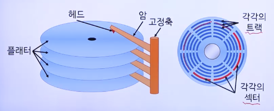
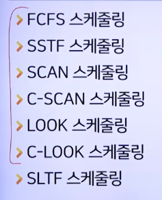
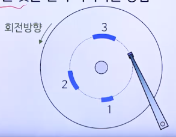

# 12강. 저장장치 및 파일 관리

## 01. 저장장치의 종류

### 순차접근 저장장치

- 데이터를 순차적으로 읽거나 쓸 수 있는 저장장치
- 예: 테이프 장치
- 초기 접근 시간이 굉장히 오래 걸림
- 대량의 데이터 백업용으로 사용

### 직접접근 저장장치

- 지정한 위치를 직접 찾아 데이터를 읽거나 쓸 수 있는 저장장치

- 임의접근 저장장치

- 예: 자기 디스크, 광디스크, SSD

- 자기 디스크

  

- 광디스크

  - 디스크 표면에 레이저를 쏘아 반사되는 빛의 차이를 이용해 데이터를 읽거나 씀
  - 예: CD-ROM, CD-RW, DVD, 블루레이 디스크 등
  - 나선형인 하나의 트랙으로 구성

- SSD⭐️

  - 읽고 쓰기가 가능하면서, 전력공급이 없어도 데이터가 지워지지 않는 메모리 이용
  - 자기 디스크보다 속도가 빠르고 전력 소모가 적음
  - 용량 대비 가격이 비싸며 수명이 짧음

## 02. 디스크 스케줄링 알고리즘

### 디스크 스케줄링

- 디스크 접근 요구를 효율적으로 처리하는 순서를 결정하는 작업
  - 디스크 접근 요구: 디스크에서 데이터를 읽거나 쓰는 요구
- 프로세스들의 요구를 디스크 큐에 두고 관리
- 기계적 동작이 최소화되도록 디스크 큐를 재배열
  - 직접접근을 위해 헤드의 이동, 디스크의 회전 같은 기계적 움직임 필요

### 디스크 접근 요구 처리 시간

- 탐구 시간 + 회전지연시간 + 전송시간
  - 탐구시간
    - 원하는 트랙으로 찾아가는 시간
  - 회전지연시간
    - 헤드 위치를 옮기는 시간

- 스케줄링 형태
  - 탐구시간 최적화
  - 회전지연시간 최적화

### 디스크 스케줄링 알고리즘

 -> SLTF는 회전지연시간 최적화, 나머지는 탐구시간 최적화

#### FCFS 스케줄링

- FCFS(First-Come-FIrst-Served)

- 먼저 도착한 접근 요구가 먼저 서비스를 받는 방법

  

- 장점

  - 접근 요구의 도착순서대로 실행되므로 공평

- 단점

  - 도착순서에 따라 총탐구시간이 커질 수 있음
  - 디스크 부하가 높을수록 응답시간이 길어짐

#### SSTF 스케줄링

- SSTF(Shortest Seek Time First)

- 탐구시간이 가장 짧은 접근 요구를 먼저 처리하는 방법

  

- 장점

  - FCFS 스케줄링보다 처리량, 평균응답시간 개선
    - **일괄처리 운영체제**에 적합

- 단점

  - 양 끝 쪽에 위치한 트랙에 대한 접근 요구는 기아상태 발생 가능
  - 트랙 위치에 따라 응답시간 편차 큼
    - 시분할 운영체제에 부적합

#### SCAN 스케줄링

- 양 끝 트랙 사이를 왕복하며 진행방향의 가장 가까운 접근 요구를 먼저 처리하는 방법

  

- 장점

  - SSTF 스케줄링의 응답시간 편차를 어느 정도 개선

- 단점

  - 새로운 요구가 헤드 진행방향의 바로 앞이냐 뒤냐에 따라 응답시간 편차 발생
  - 양 끝 트랙은 헤드가 한 번 왕복할 때 한 번의 서비스 기회만 있음

#### C-SCAN 스케줄링

- 오로지 한쪽 방향으로만 진행방향의 가장 가까운 접근 요구를 먼저 처리하는 방법으로 나머지는 SCAN 스케줄링과 동일

  

- 장점

  - 양 끝 트랙에 대한 접근 요구의 차별 제거
  - 응답 시간의 편차가 매우 작음

#### LOOK 스케줄링

- SCAN 스케줄링처럼 처리하되, 진행방향으로 더 이상 접근 요구가 없으면 방향을 바꾸는 방법

  

#### C-LOOK 스케줄링

- C-SACN 스케줄링처럼 처리하되 진행방향으로 더 이상 접근 요구가 없으면 방향을 바꾸어 가장 먼 접근 요구의 트랙까지 이동하는 방법

  

#### SLTF 스케줄링

- SLTF(Shortest Latency Time First)

- 동일 실린더의 여러 섹터에 대한 접근 요구에 대해 회전지연시간이 가장 짧은 것을 먼저 처리하는 방법

  

- 높은 부하 상태에서 유용
- 회전지연시간 최적화
  - 이론적인 최적해와 거의 일치

## 03. 파일 관리

### 파일 관리자

- 파일을 생성, 삭제, 수정
- 파일에 접근하는 것을 제어
- 파일에 의해 사용되는 자원을 관리

### 파일 관리자의 요소

- 액세스 방식
  - 파일에 저장되어 있는 데이터에 접근하는 방식
- 파일 관리
  - 파일의 저장, 참조, 공유 및 안전하게 보호하도록 함
- 보조기억장리 관리
  - 보조기억장치에 파일을 저장하는데 필요한 공간 할당
- 파일 무결성 유지
  - 파일의 정보가 소실되지 않도록 보장

### 파일 관리자의 기능

- 사용자가 파일을 생성, 수정, 및 삭제할 수 있어야 함
- 타인의 파일을 공동으로 사용할 수 있게 함
- 읽기, 쓰기, 실행 등 여러 종류의 액세싀 제어 방법 제공
- 사용자가 각 응용에 적합한 구조로 파일을 구성할 수 있게 함
- 백업 및 복구
- 기호화된 이름을 사용하여 파일을 참조할 수 있게 함
- 정보가 안전하게 보호되고 비밀이 보장되게 함

### 파일 구조와 접근방식 ⭐️

- 파일 구조

  - 파일을 구성하는 레코드들이 보조기억장치에 배치되는 방식
  - 접근방식: 순차 파일, 인덱스된 순차 파일, 직접 파일

- 순차 파일

  

  - 레코드가 물리적 순서에 따라 저장되어 있는 파일
  - 논리적 순서와 물리적 순서가 동일
  - 순차접근 저장장치에 많이 이용

- 인덱스된 순차 파일

  

  - 각 레코드의 키를 기준으로 한 논리적 순서대로 레코드가 저장됨
  - 일부 주요 레코드의 실제 주소가 저장된 인덱스를 구성하여 관리하는 파일
  - 순차접근(키 순서)과 직접접근(인덱스 검색) 모두 가능
  - 보통 디스크에 이용

- 직접 파일

  - 각 레코드의 키를 이용하여 직접접근 저장장치의 물리적 주소를 통해 직접 액세스되는 파일

  - 논리적인 키와 물리적 주소의 사상은 프로그래머가 정의

    

### 디스크 공간 할당

- **연속 할당 기법**
  - 보조기억장치의 연속된 가용공간에 파일 저장공간을 할당
  - 필요한 공간의 크기를 미리 정해야 함
  - 장점
    - 액세스가 효율적
    - 디렉터리 구현이 단순
  - 단점
    - 외부 단편화
    - 파일 크기 확장에 대한 대응이 비효율적
- **불연속 할당 기법**
  - 섹터 또는 블록 단위로 공간을 할당
  - 포인터를 이용하여 블록들을 연결
  - 장점
    - 단편화 문제 해결
    - 파일 확장 문제 해결
  - 단점
    - 파일 공간 분산으로 성능 저하
    - 포인터 관리를 위한 연산 및 공간 소비