# 13강. 분산 운영체제

## 01. 분산 운영체제의 개요

### 분산 시스템

- 크기나 성능이 다를 수 있는 여러 대의 컴퓨터가 네트워크로 연결되어 이루어지는 시스템

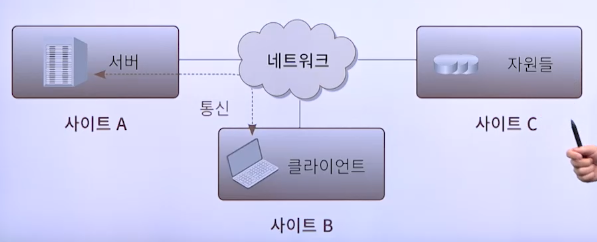

### 분산 시스템의 장점

#### 자원 공유

- 각 컴퓨터의 자원을 네트워크로 연결된 컴퓨터가 공유
- 예: 프린터 공유, 1000대 컴퓨터의 각 256GB 저장장치 등(1000대니깐 결국 256TB)

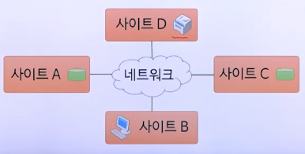

#### 성능 향상

- 여러 대의 프로세서에 작업을 분할하여 병렬적으로 동시 수행
- 많은 클라이언트가 동시에 작업을 요청할 때 복수의 서버가 처리

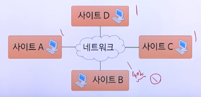

#### 신뢰성 향상

- 한 대가 고장나더라도 다른 컴퓨터가 작업을 계속 수행
- 하드웨어나 데이터의 중복을 통한 해결 가능

#### 통신의 편리성

- 단일 시스템 내부에서 동작하는 서비스와 같은 서비스 제공
- 예: A 위치의 파일을 Bdㅟ치로 복사

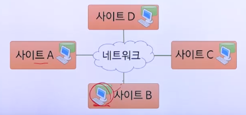

### 분산 시스템의 네트워크 구성

#### 네트워크 연결방법

- 완결연결 네트워크

  

- 부분연결 네트워크

  

- 분산 시스템 구축 시 고려사항
  - 망 구축 비용
    - 사이트들을 물리적으로 연결하는 비용
  - 통신 비용
    - 메시지를 보내는데 필요한 비용
  - 신뢰성
    - 링크나 사이트 고장 시 정상적 동작 가능 정도

#### 부분연결 네트워크의 구성 형태

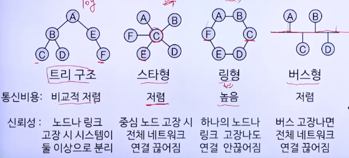

### 네트워크 연결방법

#### 근거리 통신망(LAN)

- 빠른 속도
- 좁은 담당 면적
- 적은 비용
- 낮은 혼잡, 작은 지연

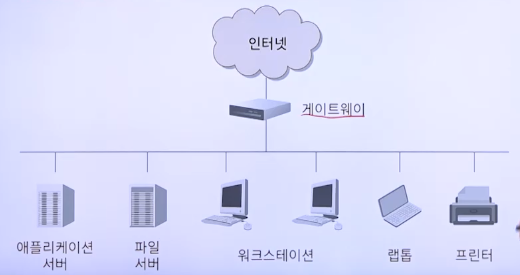

#### 원거리 통신망

- 느린 속도
- 넓은 담당 면적
- 많은 비용
- 높은 혼잡, 큰 지연

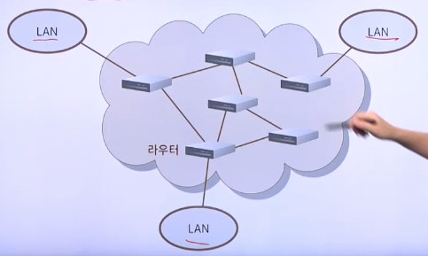

### 분산 운영체제

- 분산 시스템을 관리하기 위한 운영체제
- 투명성 제공
  - 로컬 자원과 원격 자원의 구분을 없애 줌
  - 원격 자원 접근에 필요한 일들을 분산 운영체제가 대신 해 줌
- 분산 운영체제에 적용할 수 있는 방법
  - 데이터 이주
  - 계산 이주
  - 프로세스 이주

#### 데이터 이주

- 원격 데이터를 로컬로 전송해 와서 사용하는 방식

#### 계산 이주

- 계산을 원격지에서 처리하고 결과를 전송받는 방식
- 원격 프로시저 호출(RPC) 이용

#### 프로세스 이주

- 프로세스 자체를 원격지로 이주시키는 방식
- 작업량 분산, 목적에 부합한 곳에서 프로세스 실행시켜 성능 향상

## 02. 분산 파일 시스템(DFS)

- Distributed File System
- 클라이언트가 원격 파일을 로컬 파일처럼 사용할 수 있게 해 줌
- DFS의 네이밍 방식
  - 호스트 이름과 로컬 이름을 조합
    - `host:local_name`
  - 원격 디렉터리를 로컬 디렉터리에 마운트
    - `mount -t nfs 10.10.10.10:/backups /var/backups`

#### 원격 파일에 대한 요청 처리

- RPC를 통해 구현

  

  - 네트워크 사용이 많아지면 효율성에 문제

- 캐시를 이용한 분산 파일 시스템

  - 전체 시스템의 성능 높임
  - 고려할 문제: 캐시 교체 정책, 캐시 일관성 문제 등

  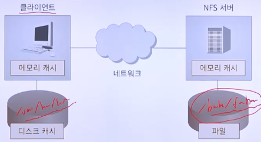

## 03. 분산 메모리

### 분산 메모리

- 원격 시스템의 메모리를 효율적으로 접근할 수 있게 함
- 널리 사용되는 두 가지 모델
  - 원격 메모리
  - 분산 공유 메모리

### 원격 메모리

- 원격 메모리 API 이용

  

  - 예: `<(net#, host#, port#), block, offset>`

### 분산 공유 메모리(DSM)

- Distributed Shared Memory

- 물리적으로 분리된 메모리를 하나의 주소공간을 통해 접근할 수 있게 해 줌

  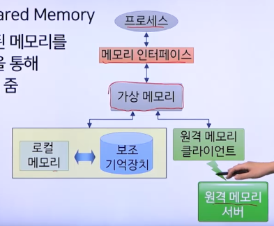

- 장점

  - 노드 갯수가 늘어나도 잘 확장됨
  - 실제로 메모리를 공유하기 위해 해야 할 일들을 프로그래머가 신경 쓸 필요 없음
  - 복잡하고 큰 데이터 처리에 유리
  - 멀티프로세서 시트메에 비해 저렴
  - 큰 가상 메모리 공간 제공

- 단점

  - 분산되지 않은 공유 메모리에 비해 접근속도 느림
  - 공유 메모리에 동시에 둘 이상이 접근할 때 보호 메커님즘 필요
  - 성능이 떨어질 수 있음
  - 프로그래머가 분산 공유 메모리를 직접 제어하는 것이 쉽지 않음

### NUMA

- Non-Uniform Memory Access
- 각 프로세서가 로컬 메모리를 갖는 분산 공유 메모리

## 04. 원격 프로시져 호출

### 원격 프로시져 호출(RPC)

- Remote Procedure Call
- 프로세스가 네트워크로 연결된 다른 컴퓨터에 있는 프로시저를 실행시키는 것
- 마치 같은 컴퓨터에 있는 것처럼 이용할 수 있게 함

### 원격 프로세저 호출의 동작

- 클라이언트는 같은 주소공간에 있는 프로시저(스텁 루틴)를 호출

  - 스텁 루틴은 매개변수나 결과를 메시지로 만든 후 네트워크를 통해 전달

  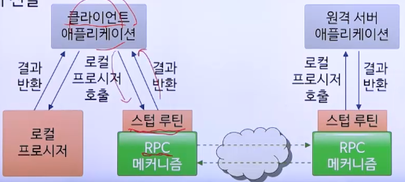

### 원격 프로시저 호출의 구현

- 고려사항
  - 이상적으로는 RPC 사용과 로컬 프로시저 사용이 구별되지 않아야 함
  - 서로 다른 주소공간에 속하기 때문에 메모리 주소를 리턴하는 참조 호출은 의미 없음
  - RPC 수신자는 호출이 생성된 곳과 유사한 환경에서 실행해야 함

### 원격 프로시저 호출의 구현 예

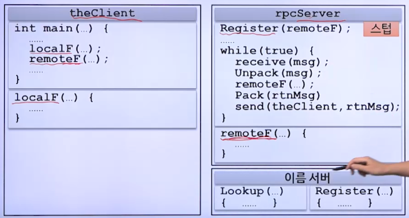