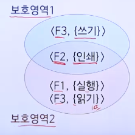
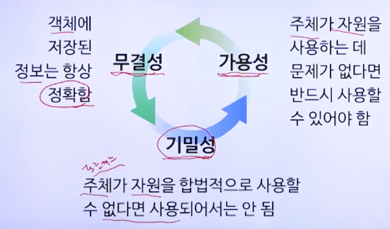
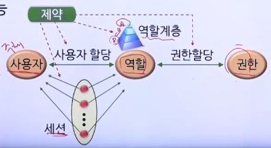
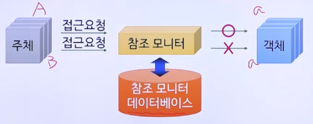
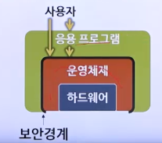

# 14강. 운영체제 보안

## 01. 보안의 개요 

### 보호와 보안

- 컴퓨터 시스템에서의 보호
  - 컴퓨터 시스템 내부 자원 각각의 영역을 보장해 주는 것
  - 각 프로세스가 사용하는 자원이 다른 프로세스에 영향을 받지 않도록 하는 것
- 컴퓨터 시스템에서의 보안
  - 인증, 암호화 등을 통해 합법적인 처리만 이루어지도록 보장
  - 시스템이 정상적으로 동작함으로써 저장된 자료가 결함이 없도록 하며 시스템을 신뢰할 수 있게 하는 것

### 보호와 보안의 목적

- 악의적인 사용자가 시스템 자원 접근 제한을 의도적으로 위반하는 것 방지
- 잠재적 오류를 미리 검출해 시스템의 신뢰도를 높임
- 시스템 자원을 권한이 없는 사용자가 잘못 사용하는 것을 막음
- 권한이 있는 사용자와 권한이 없는 사용자 구별

=> 시스템 프로세스와 사용자 프로세스가 권한을 가진 자원만 접근하도록 접근제어 규정

### 보호영역

- 한 프로세스가 접근할 수 있는 자원
- 각 영역은 자원의 집합과 그 자원에 대한 프로세스가 할 수 있는 연산을 정의
- 하나의 영역은 접근 권한의 집합
- 접근 권한
  - 프로세스가 객체에 대한 연산을 수행할 수 있는 능력
  - <객체 이름, 권한 집합>
  - 영역 사이에서 공유

### 운영체제 보안

- 운영체제가 관리하는 자원이 공격에 의해 불법적으로 이용되는 것을 막는 정책과 기법
  - 직접 또는 네트워크를 통해 접속하는 다수의 사용자가 모든 자원을 안정적으로 이용할 수 있도록 함
  - 저장된 정보가 소실되거나 유출되지 않도록 함
- 적절한 접근제어 설정, 정보의 암호화, 시스템 접속 및 자원 사용에 대한 기록 등 활용

### 운영체제 보안의 기본 목표

- 무결성, 가용성, 기밀성

### 정보 침해

- 운영체제 보안의 기본 목표가 달성되지 못하고 정보가 불법적으로 읽히거나 다른 값이 덮어 쓰이는 것
- 정보 침해가 발생하느 ㄴ경우
  - 소프트웨어 오류나 오작동을 통해 보호 영역이 지켜지지 못하는 경우
  - 공격자가 의도적으로 다른 사용자의 권한을 도용하는 경우

### 정보침해 형태

- 가로채기
  - 공격자가 허락받지 않은 컴퓨터 자원 접근(기밀성 공격)
- 흐름 차단
  - 시스템의 일부를 파괴하거나 사용할 수 없게 함(가용성 공격)
- 변조
  - 공격자가 기존에 있던 데이터의 내용을 바꿈(무결성 공격)
- 위조
  - 공격자가 기존에 없던 불법적인 정보 삽입(무결성 공격)

### 정보침해 유형

- 트로이 목마
  - 숨겨진 기능이 있는 프로그램을 사용자가 실행하게 만들어 사용자의 권한을 이요해 시스템에 침투
- 트랩 도어
  - 정상적인 인증절차나 암호화를 피해갈 수 있는 비밀 통로
- 비밀 채널
  - 데이터를 주고받을 수 없는 프로세스 사이에 정상적이지 않은 방법으로 정보를 주고받음
- 웜
  - 자기 자신을 복사하여 다른 컴퓨터에 전파
- 바이러스
  - 다른 프로그램을 감염시켜 전파

## 02. 보안정책 및 보안 메커니즘

### 보안정책과 보안 메커니즘

- 보안정책
  - 보안을 어떠한 관점에서 무엇을 행할 것인지 결정하는 것
  - 권한부여, 접근제어, 최소권한, 감사 등
- 보안 매커니즘
  - 보안을 어떤 방법으로 할 것인지 결정하는 것
  - 암호, 인증, 보안등급 관리 등

### 보안 정책

- **권한부여(authorization)**
  - 어떤 주체가 어떤 객체를 어떻게 액세스할 수 있는지 결정하는 것
  - 모든 주체와 객체는 식별 및 인증이 가능해야 함
    - 식별(identification): 신분을 알아내는 것
    - 인증(authentication): 정말 그 주체와 객체가 맞는 지 확인하는 것
  - 주체의 객체에 대한 접근제어 및 보안등급 부여를 가능하게 한다

- **임의적 접근제어(Discretionary Access Control: DAC)**
  - 관리자 또는 자원 소유자가 보안 관리자의 개입 없이 주체에 자원의 접근권한을 부여할 수 있음
  - 자원의 보호보다 **자원의 공유**가 중요할 때 적합
  - 장점: 유연하게 자원공유 가능
  - 단점: 관리가 쉽지 않음
    - 누가 권한을 가지고 있는지 판단 어려움
- **강제적 접근제어(Mandatory Access Control: MAC)**
  - 주체에는 **허가등급**, 객체에는 **비밀등급**이 주어짐
  - 접근 요청이 올 때마다 허가등급과 비밀등급을 비교하여 허가 여부를 결정
  - 보안 관리자가 시스템 전체에 대한 보안정책을 구현하고 강제
    - 각 사용자는 이 정책을 넘어서는 행동을 할 수 없음
  - 장점: 관리가 확실함
  - 단점: 자원의 공유가 어려움
- **역할 기반 접근제어(Role-Based Access Control: RBAC)**
  - 역할 개념을 사용하여 권한을 관리
  - 주체는 역할이 주어졌을 때, 그리고 그 역할에 권한이 주어졌을때만 권한 사용 가능
- **최소권한**
  - 사용자는 임무를 수행하기 위해 필요한 최소한의 권한을 받아야 함
  - 임무가 끝나면 이 권한을 반환해야 함

- **감사(auditing)**
  - 발생한 이벤트는 해당 내용 정보가 기록되어야 하고 변조되지 않고 보존되어야 함
  - 감사과정을 통해 로그 파일을 조사하여 발생한 이벤트를 추적하고 침해 사고 등이 발생했는지 여부를 확인하고 감시해야 함

### 보안 매커니즘

- 주체 및 객체의 레이블 부여 메커니즘
  - 유일한 식별자를 부여하여 서로 구별이 가능하게 함
  - 보안등급을 부여하여 허락되지 않은 접근을 막음
  - 강제적 접근제어를 구현하는데 필요
- 안전한 암호 메커니즘
  - 비밀키 암호 알고리즘과 공개키 암호 알고리즘
  - 서로 다른 특징으로 사용되는 분야가 다름
- 안전한 인증 매커니즘
  - 패스워드: 가장 간단한 방법
    - 수정이나 탈취를 막기 위해 암호화하여 저장
  - 다요소 인증: 사용자 인증에 둘 이상의 방법 요구
- 임의적 접근제어를 위한 메커니즘
  - UNIX 예: 파일 소유자가 각 파일마다 자신, 자신이 속한 그룹, 나머지에 대해 읽기, 쓰기, 실행 권한을 부여 가능
  - 접근제어 리스트(ACL)이용
- 보안등급 관리 메커니즘
  - 사용자에게 다양한 종류의 보안등급 부여
  - 체계적으로 안전한 방법으로 관리되어야 함
- 기록 파일 관리 메커니즘
  - 로그를 수정하지 못하게 접근 제어와 암호화를 통해 안전하게 보관
- 운영자 권한의 분산 메커니즘
  - 시스템 관리자의 권한을 세분화하여 목적에 따라 해당 역할을 담당하는 운영자에게 부여

### 하드웨어 보호를 위한 방법

- 사용자 프로세스가 불법적인 명령을 수행하거나 허락되지 않은 메모리에 접근하는 등 오류가 발생
- 예외 처리를 위해 프로세스를 잠시 중단시키고 해당 오류를 처리하는 운영체제 루틴을 호출
  - 트랩 또는 인터럽트를 이용

#### 이중 모드 연산

- 모드 비트를 이용해 **사용자 모드**와 **커널 모드** 구분
- 사용자 모드: 자신에게 허용된 권한만 행사 가능
  - 대부분의 경우 프로세스는 사용자 모드에서 수행
- 커널 모드: 특권명령 수행 가능
  - 특권명령: 시스템의 상태를 바꾸어 보안에 위험을 줄 수 있는 명령
- 사용자 모드에서 특권명령이 호출되면 트랩 발생

#### 메모리 보호

- 각 프로세스가 가지는 주소공간은 서로 분리
- 2개의 레지스터 이용
  - 기준 레지스터: 프로세스가 접근할 수 있는 물리적 주소의 최솟값
  - 한계 레지스터: 프로세스가 접근할 수 있는 주소 범위의 길이
- 운영체제가 사용하는 메모리 영역을 사용자 프로세스가 접근하려는 경우 트랩 발생

#### CPU 보호

- 무한 루프에 빠진 프로세스가 CPU를 독점하는 것을 막음

- 타이머: 주기적으로 인터럽트를 발생시키는 장치
  - 프로세스가 자신에게 할당된 시간을 다 쓰면 대기하고 있는 다른 프로세스로 제어를 옮김

#### 입출력 보호

- 한 프로세스의 입출력에 다른 프로세스가 영향을 미치면 안됨
- 입출력은 커널 모에서 동작

### 암호화

#### 비밀키 암호 시스템

- 비밀키를 아는 사람만 암호화와 복호화 가능
- 공개키 암호 시스템에 비해 속도가 빠름
- 키 공유 문제

#### 공개키 암호 시스템

- 암호화 키
- 전자서명에 응용
- 비밀키 공유에 활용

## 03. 운영체제 보안 모델

### 참조 모니터 모델

- 주체가 객체를 접근하는 과정에 대해 접근제어 수행

   

- 주체와 객체 사이에서 단순접근의 허용 여부만 결정

- 접근한 객체에 포함된 기밀 정보를 유포하는 것은 막지 못함

### 정보 흐름 모델

- 정보의 유형에 따라 정보가 흐르는 방향을 제어하는 모델
- 모든 허가된 정보 흐름은 허용하고 모든 허가받지 않은 정보 흐름은 방지
- 벨-라파듈라(BLP) 모델
  - 상위 보안 수준에서 하위 보안 수준으로 정보가 흐르는 것을 방지하는 것이 주된 목적
- 비바(Biba) 모델
  - 하위 보안 수준에서 상위 보안 수준으로 정보가 흐르는 것을 방지하는 것이 주된 목적

#### 벨 라파듈라(Bell-LaPadula:BLP) 모델

 

- 기밀성 유지에 초점
- 무결성이 깨질 수 있음

#### 비바(Biba) 모델

 

- 무결성을 보장하기 위한 모델
- 권한이 없는 주체가 데이터를 수정하는 것을 막음
- 권한이 없는 주체가 수정한 데이터를 사용하지 못하게 막음

## 04. 보안 커널

### 보안 커널(1)

- 기존의 운영체제 커널에 보안기능을 통합시킨 것
  - 자주 수행되고 중요한 일을 커널에 둠
- 보안 커널을 사용한 운영체제는 보안 기능 요소를 갖추어야 함
  - 사용자에 대한 식별 및 인증, 접근제어, 객체 보호, 칩입탐지 등
- 시스템 호출을 통해 보안경계를 통과

### 보안 커널(2)

- TCB의 하드웨어, 펌웨어, 소프트웨어 요소
- TCB(Trusted Computing Base)
  - 컴퓨터 시스템의 보안을 구성하는 핵심요소들의 집합
    - 정상적으로 동작하지 않을 경우 시스템 보안에 문제가 생길 수 있는 하드웨어, 펌웨어, 소프트웨어, 물리적 설치장소, 보안정책 등의 집합
  - 참조 모니터를 구현한 형태
    - 운영체제의 기본적인 작업에 대한 보안성 및 무결성을 감시