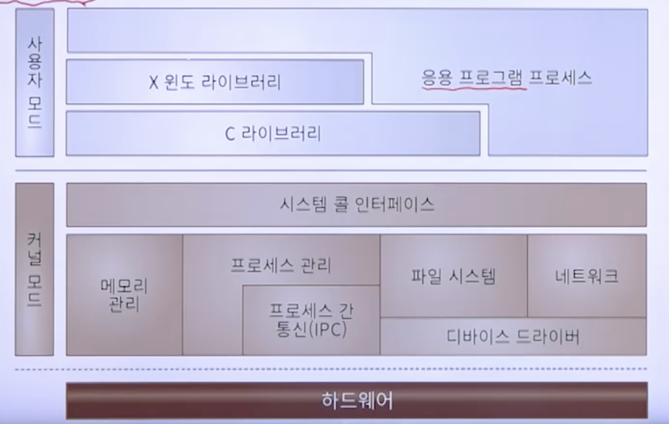
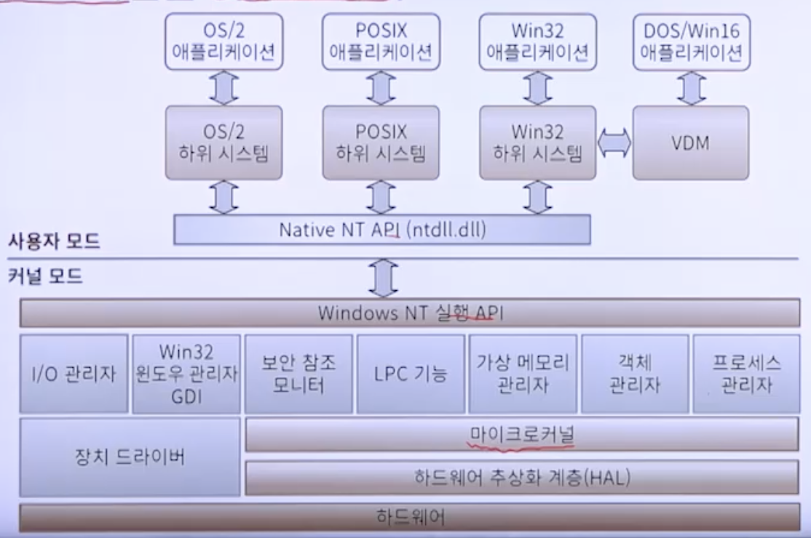

# 15강. 운영체제 사례

## 01. Linux

#### 리눅스의 개요

- 1991년 Linus Torvaldsrk MINIX에 기반하여 개발
  - MINIX: 마이크로 커널 구조의 아주 작은 수업용 운영체제
- 소스 공개
- 개발자 뿐 아니라 일반인 및 기업용으로 사용 가능한 운영체제
- 인텔 CPU 뿐 아니라 ARM 등 다양한 CPU를 지원
- 실습용 컴퓨터부터 슈퍼컴퓨터까지 널리 사용됨

### 리눅스의 장점

- 무료
- UNIX와 완벽하게 호환 가능
- 높은 안정성
- 낮은 성능의 하드웨어에서 동작 가능
- 개인용 컴퓨터에서 서버 기능 수행 가능

### 리눅스의 단점

- 교육, 유지보수 문제
- 보안 문제가 상대적으로 심각할 수 있음
- 떨어지는 보급률
- 특정 하드웨어가 지원되지 않을 수 있음
  - 최근 좋아지고 있음

### 리눅스 커널

- 일체형 커널

  - 소스가 공개되어 있기 때문에 필요 없는 부분은 제거 가능

  

- 멀티태스킹, 멀티유저 시스템

- 멀티 코어, 멀티프로세서 지원

- 여러 가지 하드웨어 지원

  - 리눅스의 대부분은  C 언어로 작성되어 있어 다양한 플랫폼에 손쉽게 이식됨

- UNIX 표준인 POSIX 표준 지원

- 프로세스 간 통신 지원
  - 세마포어, 메시지 큐, 공유 메모리 등
- 다양한 파일 시스템 지원
  - Ext4, FAT, NTFS, HPFS 등
- 모듈
  - 필요한 서비스를 모듈로 만들어, 커널을 교체하거나 시스템을 재시동하지 않고 기능 추가 가능
- 파일 형태의 주변장치 접근

### 임베디드 시스템

- 미리 정해진 특정한 기능을 수행하기 위해 하드웨어와 소프트웨어를 결합하여 설계된 컴퓨터 시스템

- 한 가지 일을 잘 하도록 설계된 시스템

- 예: 세탁기

  - 여러 센서를 이용하여 물의 양, 세탁물에 대한 정보 등 측정

  - 효율적인 세탁을 위해 임베디드 시스템의 제어를 통해 동작

- 보통 실시간 시스템에 이용됨

### 실시간 시스템

- 시스템의 상황과 무관하게 정해진 마감시간 내에 주어진 이벤트에 반응해야 함
- 실시간 운영체제(RTOS)는 빠르게 주어지는 마감시간 내에 작업을 처리하는데 중점을 둠
- 두 가지로 구분
  - 경성 실시간 시스템
  - 연성 실시간 시스템

- 경성 실시간 시스템(hard real-time system)
  - 반드시 마감시간 내 작업을 완수해야 함
  - 예: 항공기 전자제어 시스템, 심박동기 등

- 연성 실시간 시스템(soft real-time system)
  - 마감시간 내 작업을 완수하면 좋지만 못해도 실패는 아님
  - 기준에 따라 어떤 작업을 완수할 것인가 결정해야 함
  - 예: 멀티미디어 재생

#### 임베디드 리눅스

- 임베디드 시스템을 위해 개발된 리눅스
- 필요한 요건
  - 소용량 메모리를 감안하여 운영체제의 크기를 최소화하여 필요한 부분만 남겨야 함
  - 저성능 CPU를 감안하여 성능이 최적화되어야 함
  - 리눅스는 원래 범용 컴퓨터 시스템을 위한 운영체제이므로 실시간 시스템의 요구사항에 대응할 수 있어야 함
- 장점
  - 무료로 사용 가능하며, 운영체제를 응용에 적합하게 수정 가능
  - 많은 사용자와 개발자로부터 검증받았으며, 많은 검증된 코드를 바로 사용 가능
  - 운영체제의 최신 동향 반영
  - 리눅스에 익숙한 개발자는 빠르게 적응 가능
- 단점
  - 경성 실시간 시스템에 적절하지 못하고 요구되는 H/W 사양 높음

## 02.Windows

### 윈도우의 역사

- PC에서 GUI를 제공하는 것을 목적으로 1985년에 처음 발표
- Windows NT
  - POSIX 표준 및 Windows 3.0의 API를 지원하는 Win32 추가
  - 서버용 운영체제로 보안과 신뢰성 강화
- Windows 95
  - 이전과 달리 윈도우 안에 MS-DOS 포함
- Windows XP
  - Windows NT 구조에 Windows 95/98의 사용자 편의성 집합

### 윈도우 커널

- 마이크로커널을 확장한 형태

  

  - 커널 모드에서는 마이크로커널 위에 여러 서비스가 동작
    - I/O 관리자, Win32 윈도우 관리자 GDI, 보안 참조 모니터, LPC 기능, 가상 메모리 관리자, 객체 관리자, 프로세스 관리자 등
    - 사용자 모드에서는 OS/2, POSIX, Win32에 대응되는 하위 시스템이 동작
    - NT API가 커널 모드와 사용자 모드를 연결

- I/O 관리자

- Win32 윈도우 관리자와 그래픽 장치 인터페이스(GDI)

  - 사용자의 입력과 화면 출력을 제어
  - Win32 하위 시스템이지만 성능 향상을 위해 커널 모드에서 동작

- 보안 참조 모니터

  - 자원의 접근 가능 여부 점검

- LPC(Local Procedure Call) 기능

  - 같은 기계에서 동작하는 프로세스 사이의 정보교환

- 가상 메모리 관리자

- 객체 관리자

  - 다른 서비스가 자원을 접근하려면 거쳐야 하는 자원관리 서비스
  - 모든 자원은 객체로 간주

- 프로세스 관리자

## 03. Android

### 모바일 운영체제

- 모바일 환경의 요구조건
  - 배터리로 동작하기 때문에 전력 소모량을 줄여야 함
  - 대부분 무선 네트워크로 인터넷에 연결됨
  - 터치 스크린 등 입출력장치가 일반적인 PC 환경과 다름
  - 저수준 운영체제와 고수준 사용자 인터페이스가 결합된 형태
- 대표적인 모바일 운영체제
  - 안드로이드
  - iOS

### 안드로이드의 개요

- 2008년 처음 발표
- 스마트폰에서 가장 널리 사용되고 있음
- 셋톱 박스, 스마트 TV, 자동차 등 사용 범위가 넓어지고 있음

### 안드로이드의 특징

- 기본적으로 소스는 공개되어 있지만, 회사에 따라 디바이스 드라이버 등이 비공개되는 경우가 늘고 있음
- ARM, x86 CPU 지원
  - 다른 CPU 지원도 이론적으로는 가능
- 리눅스에 기반한 일체형 커널 구조
- C, C++로 구현된 운영체제에 Java로 개발된 응용 프로그램 도앚ㄱ
- iOS에 비해 다양한 하드웨어를 지원하기에 파편화 문제 존재
  - 파편화 문제: 특정 H/W에서만 동작하는 S/W 존재 가능

- 안드로이드 런타임(ART)
  - 응용 프로그램을 처음 설치할 때 중간 코드를 실제 기계 코드로 번역하고, 이후 실행할 때 번역된 코드를 실행해 성능을 높임
  - 설치시 코드를 번역하는 과정이 포함되기 때문에 설치에 시간이 더 걸림