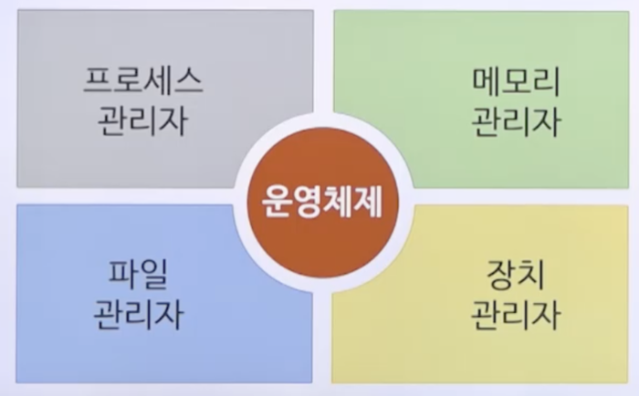
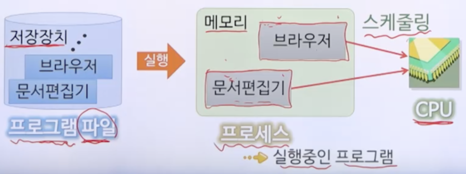

# 1강. 운영체제 소개

# 1. 운영체제란 무엇인가?

## 컴퓨터 시스템의 구성

- 하드웨어
  - CPU, 메모리, 저장장치, 입출력장치, 네트워크 장치 등
- 소프트웨어
  - 응용 소프트웨어(pdf등)
  - 시스템소프트웨어
    - 응용소프트웨어와 하드웨어간 매개체 역할
    - ex. 컴파일러, 맥, 리눅스 운영체제 등
- 운영체제
  - 시스템 소프트웨어
  - 컴퓨터 시스템의 자원을 관리하고, 컴퓨터 프로그램이 동작하기 위한 서비스를 제공하는 프로그램의 모음

## 운영체제의 역할

- 컴퓨터 시스템의 자원 관리
  - 자원: 하드웨어, 소프트웨어 자원, 데이터
  - ex. 저장장치에서 데이터 읽어 오기, 키보드/마우스 제어, 프로그램 동시 실행 시 CPU 및 메모리 효율적 관리
  - 컴퓨터 시스템을 효율적으로 운영하는 목적
- 사용자 지원
  - 사용자가 내린 명령을 해석하여 실행하게 함
  - 사용자가 하드웨어 사이의 매개체 역할
  - 사용자에게 편의성을 제공하는 목적

## 컴퓨터 시스템과 운영체제

- 운영체제가 없던 초기의 컴퓨터 시스템
  - 응용 프로그램이 직접 컴퓨터 시스템의 자원 제어
  - 응용 프로그램 개발자는 하드웨어 제어방법을 잘 알아야 함
- 여러 사용자가 하드웨어를 공유하는 경우 자원 분할 어려움
- 운영체제가 있는 컴퓨터 시스템
  - 하드웨어와 응용 프로그램 사이에 위치
  - 운영체제가 컴퓨터 시스템의 자원 제어
  - 컴퓨터 시스템이 안정적, 효율적으로 동작됨

## 커널 모드와 사용자 모드

- 커널 모드(슈퍼바이저 모드)
  - 하드웨어를 직접 제어할 수 있는 CPU 명령어를 사용할 수 있는 모드
  - 운영체제의 커널이 동작함
- 사용자 모드(보호 모드)
  - 하드웨어를 직접 제어할 수 있는 CPU 명령어를 사용할 수 없는 모드
  - 응용 프로그램이 동작함
- 시스템 호출
  - 응용 프로그램이 하드웨어에 대한 제어가 필요한 경우 이용
  - 운영체제에 서비스를 요청하는 매커니즘

## 커널(kernel)

- 커널 모드에서 동작하는 운영체제의 핵심 요소
- 응용 프로그램과 하드웨어 수준의 처리 사이의 가교 역할
- 구성 방식: 일체형 커널, 마이크로커널
- 일체형 커널(monolithic kernel)
  - 운영체제의 모든 서비스가 커널 내에 포함됨(커널 == OS)
  - 장점: 커널 내부 요소들이 서로 효율적으로 상호작용
  - 단점: 한 요소라도 오류 발생시 시스템 전체 장애 발생 가능
  - ex. UNIX, Linux
- 마이크로 커널(microkernel)
  - 운영체제 요소의 대부분을 **커널 외부**로 분리(커널 최소화)
  - 메모리 관리, 멀티태스킹, 프로세스간 통신(IPC) 등 최소한의 요소만 커널 내에 남김
  - 장점: 새로운 서비스를 추가하여 운영체제 확장이 쉬움, 유지보수 용이하여 안정성이 우수
  - 단점: 커널 외부 요소들 사이는 IPC가 필요하여 성능저하 발생(항상 커널을 거쳐서 데이터를 주고받아야 함)

# 2. 운영체제의 구성

## 운영체제의 구성

- 컴퓨터 시스템의 자원 성격에 따라 구분
  - **프로세스 관리자, 메모리 관리자, 장치관리자, 파일 관리자**

## 프로세스 관리자

- 프로세스의 생성 및 삭제
- CPU 할당을 위한 스케쥴 결정
- 프로세스의 상태를 관리하며 상태 전이 처리

## 메모리 관리자

- 메모리(주기억장치) 공간에 대한 **요구의 유효성** 확인
- 메모리 할당 및 회수
- 메모리 공간 보호

## 장치 관리자

- 컴퓨터 시스템의 모든 장치 관리
- 시스템 장치의 할당, 작동, 반환

## 파일 관리자

- 컴퓨터 시스템의 모든 파일 관리
- 저장장치의 공간 관리
- 파일의 접근 제한 관리

# 3. 운영체제의 유형

## **일괄처리 운영체제**

- Batch processing
  - 작업을 모아서 순서대로 처리하는 방식
- 사람(오퍼레이터)이 하던 일을 프로그램이 빠르게 처리하게 되면서, 전체적인 작업 처리 속도가 향상됨
- 나중에 들어온 작업은 **앞선 작업들이 모두 끝날 때까지** 아무런 상호작용 없이 기다려야만 함

## **시분할 운영체제**

- Time-sharing
  - 각 사용자의 프로그램을 **한 번에 조금씩** 수행하는 방식
- 대화형(interactive) 운영체제라고도 함
- 사용자들은 마치 혼자 컴퓨터를 사용하는 듯한 느낌을 받음
- 응답시간이 일괄처리 운영체제보다 크게 단축됨
  - 응답시간: 요청한 시점부터 반응이 시작되는 시점까지의 소요시간

## **실시간 운영체제(RTOS)**

- Real-time
  - 원하는 시간 내에 프로그램의 결과를 얻을 수 있는 방식
- 처리 결과가 현재의 결정에 영향을 주는 환경에서 사용됨
  - 미사일 제어 시스템, 증권거래 관리 시스템 등
- 중요한 작업에 대한 처리 기한을 맞추는 것이 중요
  - 우선순위가 높은 작업을 우선 처리할 수 있는 기법 활용

## **분산 운영체제**

- 분산 시스템을 관리하기 위한 운영체제
  - 분산 시스템: 2개 이상의 컴퓨터 시스템이 네트워크로 서로 연결되어 서로의 자원을 이용하는 시스템
- 다른 컴퓨터 시스템의 자원을 이용하는 것이 마치 자신의 컴퓨터 시스템에 있는 자원을 이용하는 것처럼 가능해야 함