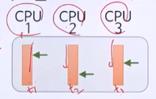

# 2강. 프로세스와 쓰레드

## 프로세스란?

### 프로세스: 실행중인 프로그램

- 프로그램: 동작을 하지 않는 정적/수동 개체
- 프로세스: 동작을 하는 능동적 개체

### 운영체제로부터 자원을 할당 받아 동작

- 자원: CPU, 메모리, 입출력장치, 파일 등
- 동작: CPU가 프로세스 명령을 실행

## 프로세스와 운영체제

### 운영체제(프로세스 관리자)가 처리하는 작업

- 프로세스를 생성 및 종료
- 프로세스를 실행시키기 위한 스케쥴링 장업
- 프로세스의 상태 관리

## 프로세스의 구성

### 메모리 구조

- 프로그램 실행에 직접적으로 필요한 코드와 데이터
  - 코드 영역
    - 프로그램 자체
  - 데이터 영역
    - 프로그램 실행시 필요한 데이터
    - 정적 데이터 영역: 상수, 변수의 값
    - 스택 영역: 서브프로그램 호출상태 등
    - 힙 영역: 사용자 할당 영역

### 프로세스 제어 블록(Process Control Block: PCB)

-  운영체제가 프로세스를 관리하기 위해 필요한 정보
- 각각의 프로세스마다 존재
- 여러 프로세스가 번갈아 실행되는 경우, PCB에 저장된 정보 활용

### 프로세스 상태 관리

- 생성, 준비, 실행, 종료, 대기 상태
  - 운영체제에 따라서 더 세세하게도, 더 간단하게도 사용
- 생성
  - 처음 작업이 시스템에 주어진 상태
- 준비
  - 실행 준비가 되어 CPU 할당을 기다리는 상태
- 실행
  - CPU가 할당(디스패치)되면 실행됨
  - 프로세스가 처리되는 상태
- 대기
  - 프로세스가 I/O 작업이 끝날 때까지 또는 특정 자원을 할당받을 떄 까지 보류되는 상태
- 종류
  - 프로세스가 더 이상 실행되지 않도록 끝난 상태

### 프로세스 상태 변화

실행상태에서 준비 상태로 가는것과, 실행상태에서 대기 상태로 가는 것과의 차이점이 뭐가 있는지?

## 부모 프로세스와 자식 프로세스

### 프로세스 생성 방법

- 사용자가 프로그램을 직접 실행
- 한 프로세스가 다른 프로세스를 생성
  - 프로세스 생성 시스템 호출 이용
  - 부모 프로세스: **시스템 호출을 하는** 프로세스

## 프로세스 생성 시스템 호출

### UNIX, Linux: `fork()`

- 자식 프로세스는 부모 프로세스의 복제본

- PID 제외하고는 동일함

  

### UNIX, Linux: `exec()`

- 자식프로세스는 부모 프로세스와는 다른 프로그램 실행

### Windows: `CreateProcess()`

-  자식 프로세스는 새로운 프로그램 생성
- Windows와 Linux, unix는 프로세스 생성하는 과정이 조금 다름

### 프로세스 종료 방법

- 프로세스가 모든 처리를 완료(정상적 종료)
- 부모 프로세스에 의해 자식 프로세스가 강제 종료
  - 프로세스 **종료 시스템 호출** 이용
  - 자식 프로세스 생성시 얻은 자식 PID 이용
- 부모 프로세스가 종료되는 경우 운영체제가 자식 프로젝스 종료

## 2. 쓰레드란?

### 전통적인 프로세스

- 하나의 프로그램을 실행하기 위한 기본적인 단위
- 자원 소유의 단위
  - 하나의 메모리 구조
- 디스패칭의 단위
  - 하나의 제어흐름만 존재

### 쓰레드(thread)

- 프로세스 내에서의 **다중처리**를 위해 제안된 개념
  - 쓰레드마다 실행할 수 있는 위치가 다를 수 있다
  - 하나의 프로세스 안에서 여러개의 제어 흐름을 가질 수 있음
- 하나의 프로그램을 실행하기 위한 기본적인 단위
- 디스패칭의 단위
  - 디스패칭의 단위: 쓰레드
  - 자원 소유의 단위: 프로세스

- 하나의 프로세스 내에는 하나 **이상**의 쓰레드가 존재 

### 프로세스 비교

- 전통적인 프로세스

  

- 쓰레드 있는 프로세스

  

### 쓰레드와 프로세스

- 쓰레드는 **실행**에 필요한 최소한의 정보만 가짐
  - PC를 포함한 레지스터 값
  - 상태 정보
  - 스택 영역

### 다중 쓰레드로 구성된 프로세스

- 멀티 CPU 또는 멀티 코어 컴퓨터 시스템

  - 다중 쓰레드를 병렬로 처리 가능

    - 쓰레드 자체가 병렬적으로 동시에 처리가 가능

    

- 처리 속도 별로 쓰레드가 나눠진 경우

  - 효율적인 처리 가능

    - 용도별, 처리 속도별로 나눔

    

> 1. 프로세스는 실행 중인 프로그램을 의미하며, CPU, 메모리, 파일, 입출력장치 등 실행에 필요한 자원이 할당된다.
> 2. 프로세스 제어 블록은 프로세스를 명시해 주는 다양한 내용을 포함하고 있다.
> 3. 프로세스는 생성, 준비, 실행, 대기, 종료의 다섯 상태 중 하나로 존재하며, CPU의 스케줄링, 입출력 대기 등에 따라 준비, 실행, 대기 등으로 상태가 변화되며 동작한다.
> 4. 쓰레드는 프로세스에서 실행의 개념만 분리한 것으로 디스패칭의 단위이다.
> 5. 하나의 프로세스 내에는 하나 이상의 쓰레드가 있을 수 있어, 다중 쓰레드를 생성하여 프로세스 내에서의 다중처리를 할 수 있다.