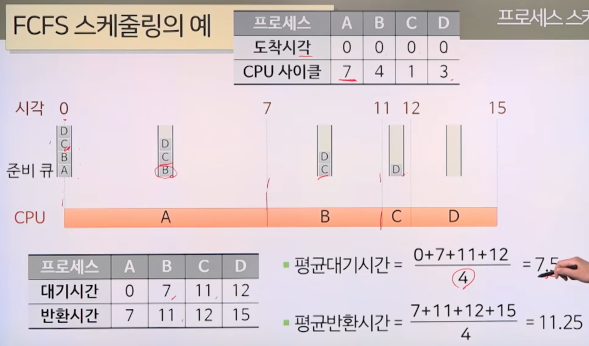
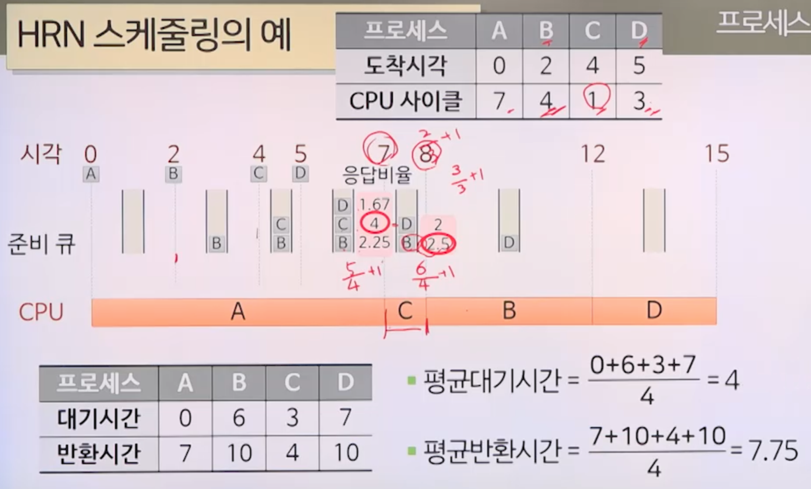

# 3강. 프로세스 스케쥴링

## 1. 프로세스 스케쥴링

### 스케쥴링

- 여러 가지 작업의 처리순서를 결정하는 것
- 예: 프로세스 스케쥴링, 디스크 스케쥴링 등

### 프로세스 스케쥴링

- 주어진 프로세스가 여러 개인 경우, **프로세스 처리순서를 결정**하는 것

## 스케쥴링 단계

### 하위단계 스케줄링

- 준비 큐에 있는 프로세스를 선택하여 사용 가능한 CPU를 할당(디스패치)하는 역할
- 수행 주체: 디스패처(dispatcher)

### 스케쥴링 기본 목표

- 공정성
  - 모든 프로세스가 적정 수준에서 CPU 작업을 할 수 있게 함
- 균형
  - 시스템 자원이 충분히 활용될 수 있게 함
- **운영체제의 유형**에 따른 스케줄링의 목표
  - 일괄처리 운영체제
    - 처리량의 극대화(처리량: 주어진 시간에 처리한 프로세스 수)
    - 반환시간의 최소화(반환시간: 프로세스 생성 시점부터 종료 시점까지의 소요시간)
    - CPU 활용의 극대화
  - 시분할 운영체제
    - 빠른 응답시간(요청한 시점부터 반응이 시작되는 시점까지의 소요시간)
    - 과다한 대기시간 방지(프로세스가 종료될 때까지 준비큐에서 기다린 시간의 합) 
  - 실시간 운영체제
    - 처리기한 맞춤

### 스케줄링 정책

- 선점 스케줄링(preemptive) 정책
  - 실행 중인 프로세스에 인터럽트를 걸고, 다른 프로세스에 CPU를 할당할 수 있는 스케줄링 방식
  - 높은 우선순위의 프로세스를 우선 처리해야 하는 경우에 유용
    - 실시간 시스템, 시분할 시스템
  - 문맥 교환에 따른 오버헤드 발생
    - 운영체제는 문맥 교환이 매우 빠르게 실행되도록 만들어져야 함
      - 문맥(context): CPU의 모든 레지스터와 기타 운영체제에 따라 요구되는 프로세스의 상태
      - 문맥 교환(context switching): CPU가 현재 실행하고 있는 프로세스의 문맥을 PCB(프로세스 제어 블록)에 저장하고, 다른프로세스의 PCB로부터 문맥을 복원하는 작업
- 비선점(nonpreemptive) 스케줄링 정책
  - 실행중인 프로세스를 바로 준비상태로 전이시킬 수 없는 스케줄링 방식
  - CPU를 할당받아 실행이 시작된 프로세스는 대기상태나 종료상태로 전이될 때까지 계속 실행상태에 있게 됨
  - 강제적인 문맥 교환이 없어 오버헤드 발생하지 않음
  - 긴 프로세스가 실행 중이라면 짧은 프로세스가 오래 기다리게 되는 경우 발생

### 스케줄링의 평가 기준

- 평균대기시간
  - 각 프로세스가 수행이 완료될 떄까지 준비 큐에서 기다리는 시간의 합의 평균값
- 평균반환시간
  - 각 프로세스가 **생성된 시점부터 수행이 완료된 시점**까지의 소요시간의 평균값
- 예시

## 2. 스케줄링 알고리즘

### FCFS 스케줄링

- First Come First Serve
- 비선점방식
- 준비 큐에 도착한 순서에 따라 디스패치
- 예시

- 장점
  - 가장 간단한 스케줄링 기법

- 단점
  - 짧은 프로세스가 긴 프로세스를 기다리거나 중요한 프로세스가 나중에 수행될 수도 있음
    - 시분할 운영체제나 실시간 운영체제에는 부적합
  - 프로세스들의 도착순서에 따라 평균 반환시간이 크게 변함

### SJF 스케줄링

- Shortest Job First

- 비선점 방식

- 준비 큐에서 기다리는 프로세스 중 실행시간이 가장 짧다고 예상되는 것을 먼저 디스패치

  - 이미 실행되고 있는 프로세스는 포함하지 않는다! ⭐️

- 예시

  

- 장점
  - 일괄처리 환경에서 구현하기 쉬움
- 단점
  - **실제로는** 먼저 처리할 프로세스의 CPU 시간을 예상할 수 없음. 예측이 불가능. 직접 적용은 거의 불가능.
  - 새로 들어온 짧은 가 긴 프로세스를 기다리거나 중요한 프로세스가 나중에 수행될 수도 있음
    - 시분할 운영체제나 실시간 운영체제에는 부적합

### SRT 스케줄링

- Shortest Remaining Time

- SJF 알고리즘의 **선점방식**

- 준비큐에서 기다리는 프로세스 중 남은 실행시간이 가장 짧다고 예상되는 것을 먼저 디스패치

- 예시

  

- 장점

  - SJF보다 평균대기시간, 평균반환시간에서 효율적임

- 단점

  - 실제로는 프로세스의 CPU 시간을 예상할 수 없음

  - 각 프로세스의 실행시간 추적, 선점을 위한 문맥 교환 등 SJF보다 오버헤드가 큼

    

### RR 스케줄링

- Round Robin

- 선점 방식

- 준비큐에 도착한 순서대로 디스패치하지만, 정해진 시간 할당량에 의해 실행 제한

- 시간 할당량 안에 종료하지 못한 프로세스는 준비 큐의 마지막에 배치됨

- 예시

  

- 장점
  - CPU를 독점하지 않고 공평하게 이용
    - 시분할 운영체제에 적합
- 단점
  - 시간 할당량이 너무 크면 FCFS 스케줄링과 동일
  - 시간 할당량이 너무 작으면 너무 많은 문맥 교환 발생으로 오버헤드가 커짐

### HRN 스케줄링

- Highest Response Ratio Next

- 비선점 방식

- 준비 큐에서 기다리는 프로세스 중 응답비율이 가장 큰 것을 먼저 디스패치

  - 
  - 예상실행시간이 짧을수록, 대기시간이 길 수록 응답비율이 커짐

- 예시

  

- 장점
  - SJF 스케줄링의 단점을 보완
    - 예상실행시간이 긴 프로세스도 오래 대기하면 응답비율이 커져 나중에 들어오는 짧은 프로세스보다 먼저 디스패치 가능
- 단점
  - 실제로는 프로세스의 CPU 시간을 예상할 수 없다

### 다단계 피드백 큐 스케줄링

- 선점방식
- I/O 중심 프로세스와 연산 중심 프로세스 특성에 따라 서로 다른 시간 할당량 부여
- 단계1부터 단계n까지 하나씩의 준비 큐 존재
- 단계 k는 단계 k+1에 피드백
- 단계가 커질수록 시간 할당량도 커짐

- 스케줄링 방법
  - 디스패치 후 대기상태로 갔다가, 준비상태가 될 떄에는 현재와 동일한 단계의 준비큐에 배치
  - 시간 할당량을 다 썼으면 다음 단계의 준비큐로 이동 배치
  - 단계 k의 준비 큐에 있는 프로세스가 디스패치되려면 단계1부터 단계 k-1까지 모든 준비 큐가 비어 있어야 함
- 특징
  - I/O 위주 프로세스는 높은 우선권 유지
    - 시간 할당량을 다 썼으면 높아지지만, 입출력이 많은 프로세스는 짧으므로
    - 연산 위주의 프로세스는 낮은 우선권이지만 긴 시간 할당량

 

### 정리

