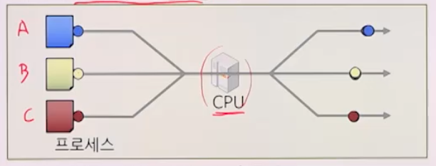
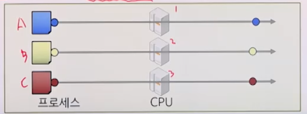
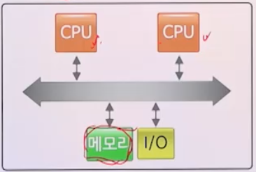
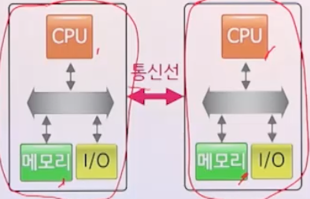
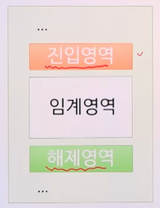
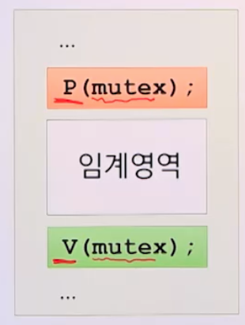
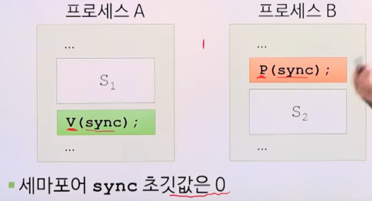

# 4강. 병행 프로세스 I

## 1. 병행 프로세스의 개요

### 병행성과 병행 프로세스

- 병행성(Concurrency)
  - 여러 개의 프로세스 또는 쓰레드가 동시 수행되는 시스템의 특성

- 병행 프로세스
  - 동시 수행되는 여러 개의 프로세스 또는 쓰레드


### 병행 프로세스의 실행 형태

- 1개의 CPU: 인터리빙 형식

  

  - CPU의 입장에서 보면 하나의 프로세스를 번갈아 가며 처리

- 여러 개의 CPU: 병렬처리 형식

  

- 멀티프로세서 시스템에서의 메모리 구조에 따라

  - 강결합 시스템(공유 메모리 구조)

    

  - 약결합 시스템(분산 메모리 구조)

    


### 프로세스 간의 관계

- 독립 프로세스
  - 수행 중인 다른 프로세스에 영향을 주지도 받지도 않음
  - 데이터 및 상태를 다른 프로세스와 공유하지 않음
  - 프로세스의 실행
    - 결정적: 실행결과는 입력에 의해서만 결정
    - 재생 가능: 같은 입력에 대해 항상 동일한 실행결과
- 협력 프로세스
  - 수행 중인 다른 프로세스와 영향을 주고받음
  - 데이터 및 상태를 다른 프로세스와 공유
  - 프로세스의 실행
    - 비결정적: 실행결과는 **실행순서**에 좌우됨
    - 재생 불가능: 같은 입력에 대해 항상 동일한 실행결과를 보장하지 못함


## 2. 병행성 문제

### 병행성 문제

- 협력 프로세스인 경우 발생 가능한 문제
  - 상호배제
  - 동기화
  - 통신


### 상호배제

- 2개 이상의 프로세스가 동시에 임계영역을 수행하지 못하도록 하는 것
  - 임계영역: 2개 이상의 프로세스가 동시에 사용하면 안되는 공유자원을 액세스하는 프로그램 코드 영역
  - 상호배제가 잘 될 수 있도록 잘 처리해줘야 함


### 동기화

- 2개 이상의 프로세스에 대한 처리 순서를 결정하느 ㄴ것
  - 프로세스 동기화
- 상호배제: 임계 영역에 대한 동기화 문제


### 통신

- 프로세스들이 데이터를 공유하기 위해 반드시 필요
  - 프로세스 간 통신(IPC)
- 통신 방법
  - 하나의 변수 사용
  - 메시지를 서로 주고받음


## 3. 세마포어

### 세마포어(semaphore)

- 상호배제와 동기화 문제를 해결하기 위한 도구
- 다익스트라(Dijkstra)가 제안
- **정수형 공용변수**
  - 저장값: 사용 가능한 자원의 수 또는 잠김이나 풀림의 상태

- 상황에 맞춰 0 이상의 정수로 초기화
- ⭐️ **두 기본연산 P와 V에 의해서만 사용됨**
  - 두 기본연산인 P, V만 사용된다
  - 기본연산: 인터럽트되지 않고 하나의 단위로 처리됨
    - P가 시작됐으면, 중간에 중단되지 않음

- 세마포어마다 **대기 큐**가 필요


#### 연산 P

- 검사, 감소시키려는 시도

  ```python
  void P (semaphore s)
  {
  	if (s > 0) 
  		s--;
  	else
  		현재 프로세스를 대기;
  }
  ```


#### 연산 V

- 증가

  ```python
  void V (semaphore s)
  {
  	if (대기중인 프로세스 없음) 
  		s++;
  	else
  		대기 중인 프로세스 1개 진행;
  }
  ```

  

### 상호배제 해결

세마포어로 어떻게 해결?

- 상호배제를 위한 일반적인 요구사항
  - 한 프로세스가 임계영역 수행 중
    - 다른 프로세스는 임계영역에 진입해서는 안됨
  - 임계영역 수행 중이던 프로세스가 임계영역 벗어남
    - 누군가 하나는 임계영역을 새로이 수행할 수 있어야 함
  - 임계영역 진입 못하고 대기하는 프로세스
    - 적절한 시간 내에 임계 영역 수행을 시작할 수 있어야 함

- 상호배제를 위한 임계영역 주변의 코드 영역

  

  - 진입영역
    - 임계영역에 대한 수행을 해도 되는지 체크
  - 해제영역
    - 다른 프로세스가 임계영역 수행을 시작할 수 있도록 함

- 세마포어 이용

  

  - 세마포어 mutex 초깃값은 1
  - 진입영역:  P(mutex)
  - 해제영역: V(mutex)
  - 대기 큐는 FIFO로 동작


### 동기화 해결

- 상황: 프로세스 A가 코드 S1을 수행한 후, 프로세스 B가 코드 S2를 수행하도록 동기화

  