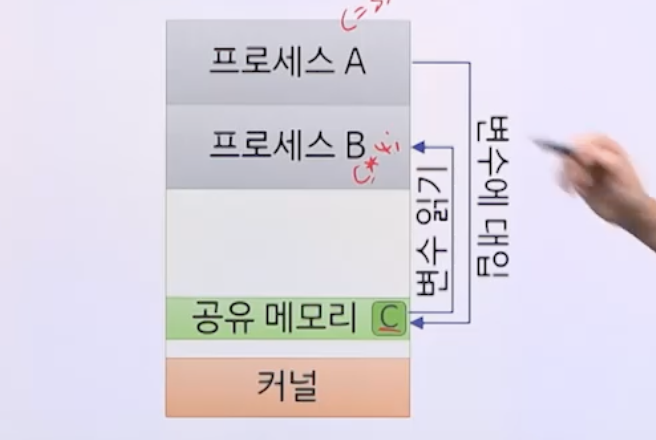
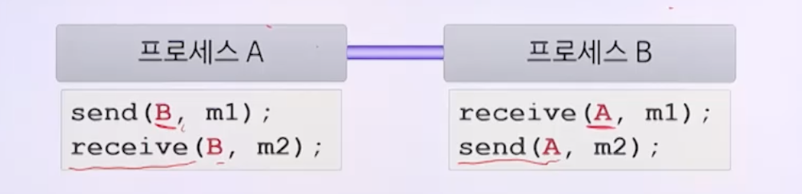

# 5강. 병행 프로세스 II

## 01. 생산자-소비자 문제

### 생산자-소비자 문제 정의

- 두 협력 프로세스 사이에 버퍼를 두고 생산자와 소비자의 상황을 다루는 문제
  - 생산자: 데이터를 넣는 프로세스
  - 소비자: 데이터를 꺼내는 프로세스

### 생산자-소비자 문제 조건

- 버퍼에 여러 프로세스가 동시에 접근할 수 없음
  - 버퍼에 데이터를 넣는 동안에는 데이터를 꺼낼 수 없음
  - 버퍼에서 데이터를 꺼내는 동안에는 데이터를 넣을 수 없음
    - **상호배제 필요**
- 버퍼의 크기가 유한함(유한 버퍼 문제)
  - 버퍼가 가득 찬 경우 생산자는 대기해야 함
  - 버퍼가 빈 경우 소비자는 대기해야 함
    - **동기화 필요**

### 세마포어를 이용한 해결

- **상호배제**: 세마포어 `mutex` (초깃값 1)

- **버퍼가 가득 찬 경우 동기화**: 세마포어 `empty` (초깃값 n) *n은 버퍼 크기

- **버퍼가 빈 경우 동기화**: 세마포어 `full` (초깃값 0)

- 3개의 세마포어: `mutex`, `empty`, `full`

## 02. 판독기-기록기 문제

### 판독기-기록기 문제 정의

- 여러 협력 프로세스 사이에 공유자원을 두고 판독기와 기록기의 상황을 다루는 문제
  - 판독기: 데이터를 읽는 프로세스(공유자원에는 **영향 미치지 않음**)
  - 기록기: 데이터를 쓰는 프로세스(공유자원에 **영향 미침**)

### 판독기-기록기 문제 조건

- 하나의 기록기가 공유자원에 데이터를 쓰는 중에는 다른 기록기나 판독기는 공유자원에 접근할 수 없음
  - 공유자원에 데이터를 쓰는 동안에는 누구도 접근할 수 없음
  - 공유자원에서 데이터를 읽는 동안에는 데이터를 쓸 수 없음
    - 상호배제 필요
- 여러 판독기는 동시에 공유자원에서 데이터를 읽을 수 **있음**
  - 판독기가 읽는 중 새로운 판독기 읽기 시도 => 가능
  - 판독기가 읽는 중 기록기 대기
    - 새로운 판독기 읽기 시도 => 불가능

### 제1판독기-기록기 문제

- 판독기가 공유자원에 접근 중이라면 **기록기보다 판독기에 우선순위**를 줌
- 즉, 새로운 판독기는 즉시 공유자원에 접근 가능
- 문제점
  - 기록기의 기아상태 유발 가능

### 세마포어를 이용한 해결

- 상호배제: 세마포어`wrt` 초기값(1)

  

- 판독기 우선: 일반변수 `rcount` (초깃값 0), 세마포어 `mutex` (초깃값 1)

  - 읽으려고 하는 판독기 갯수

  

- 2개의 세마포어 `wrt`, `mutex`, 일반변수 `rcount`

  

### 제2판독기-기록기 문제

- 판독기가 공유자원에 접근 중이라면 **판독기보다 기록기에 우선순위**를 줌

- 즉, 대기중인 기록기가 있다면 새로운 판독기는 공유자원에 접근 불가능
- 문제점
  - 판독기의 병행성이 떨어짐
  - 판독기의 기아상태 유발 가능

### 세마포어를 이용한 해결

- 5개의 세마포어 `rd`, `wrt`, `mutex1`, `mutex2`, `mutex3`

  

## 03. 프로세스간 통신

### 프로세스간 통신(IPC)

- InterProcess Communication
- 병행 프로세스가 데이터를 서로 공유하는 방법
  - 공유 메모리 방법
  - 메시지 전달방법

- 하나의 운영체제에서 두 방법 함께 사용 가능

### 공유 메모리 방법

- 협력 프로세스가 동일한 변수를 사용

  - 동일한 변수: 공유자원인 메모리 공간 사용

    

- 예제

  - 생산자-소비자 문제의 **유한 버퍼**
  - 판독기-기록기 문제의 **공유자원**

- 장점

  - 대량 데이터 교환: 고속 통신 가능

- 단점

  - 통신상 발생 가능 문제 해결하기 위해서는 응용 프로그래머 필요

### 메시지 전달방법

- 협력 프로세스가 메시지를 주고받음

  - 시스템 호출 `send()`, `receive()`

  

- 소량의 데이터 교환에 적합

- 통신상 발생 가능 문제 해결

  - 운영체제가 알아서 해결
  - 어떻게?

### 메시지 전달방법의 논리적 구조

- 통신 링크

  - 메시지가 지나다니는 통로

  

- 통신 링크의 구현 형태

  - 연결 대상: 두 프로세스, 셋 이상 프로세스
  - 두 프로세스 사이 링크 개수: 하나, 둘 이상
  - 방향성: 단방향, 양방향
  - 용량: 무한, 유한, 0

### 통신 링크의 용량

- 무한

  

  - 송신자는 대기 없음

- 유한

  

  - 송신자는 큐가 가득 차면 대기

- 0

  

  - 송신자는 수신자가 메시지를 받을 수 있을 때 까지 대기

### 직접통신

- 두 프로세스가 직접 서로를 지정하여 메시지 전달

  

  - 오직 하나의 통신 링크가 자동 설정
  - 하나의 통신 링크는 오직 두 프로세스 사이에만 연관
  - 통신 링크는 양방향

- 대칭형 주소 지정

  

- 비대칭형 주소 지정

  

  - 수신자가 여러 송신자와 통신 링크를 갖는 경우 사용

### 간접통신

- 프로세스 사이에 둔 우편함을 통해 메시지 전달

  

  - 같은 우편함을 이용하는 경우 통신 링크가 설정
  - 여러 우편함을 이용하면 여러 개의 통신 링크 존재
  - 하나의 통신 링크가 여러 프로세스와 연관 가능
  - 통신 링크는 단방향 또는 양방향

- 우편함이 수신 프로세스에 소속

  - 수신자 하나
  - 통신 링크는 단방향
  - 수신 프로세스가 종료하면 우편함도 사라짐

  

- 우편함이 운영체제에 소속

  - 수신자 여럿
  - 한순간에 하나의 수신자만 가능
  - 운영체제가 수신자 관리
  - 통신 링크는 양방향

  

  