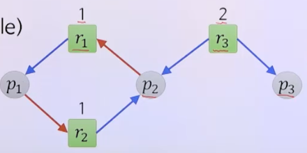
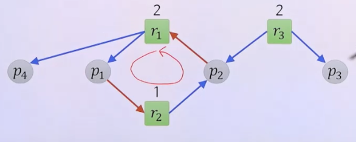
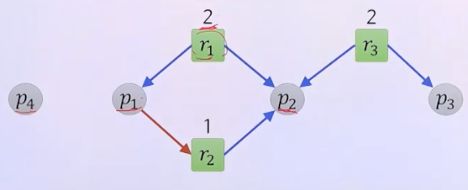

# 6강. 교착상태 I

## 01. 교착상태의 개요

### 프로세스 자원 사용 절차

- 요구 > 사용 > 해제
- 요구과정에서 가용한 자원이 없으면
  - 자원을 획득할 때까지 대기

### 교착상태(deadlock)

- 여러 개의 프로세스가 서로 상대방의 작업이 끝나기만 기다리고 있어 어느 쪽도 **영원히** 진행하지 못하는 상태

  

### 교착상태와 기아상태의 차이

- 교착상태

  

- 기아상태

  - 해소될 가능성이 있는 상태

  

## 02. 교착상태의 특성

### 교착상태의 필요조건

- 네 가지 조건이 동시에 만족될 때 교착상태 발생 **가능**
  - 상호배제
  - 점유대기
  - 비선점
  - 환형대기

### 상호배제(mutual exclusion) 조건

- 프로세스가 **자원에 대한 배타적인 통제권**을 요구
- 적어도 하나 이상의 자원은 여러 프로세스에 의해 **동시에 사용될 수 없음**
- 다른 프로세스가 점유한 자원이 필요하면 반드시 대기

### 점유대기(hold and wait) 조건

- 프로세스가 이미 한 자원을 할당받아 점유하고 있는 상황에서 다른 프로세스가 점유하고 있는 또 다른 자원을 요구하여 해제되기를 기다리는 상황

### 비선점(no preemption) 조건

- 프로세스에 할당된 자원은 그 프로세스가 사용을 마치고 스스로 반환하기 전에는 해제되지 않음
- 할당된 자원은 타의에 의해서는 해제되지 않음

### 환형대기(circular wait) 조건

- 프로세스의 자원 점유 및 점유된 자원의 요구 관계가 환형을 이루며 대기하는 상황

### 자원할당 그래프 G=(V, E)

- V: 정점의 집합 V = P ⋃ R
  - P = {p1, p2, ..., pn}: n개의 프로세스
  - R = {r1, r2, ..., rn}: m개의 자원
- E:  방향 있는 간선의 집합 E = Q ⋃ S
  - Q = {(pi, rj): pi ∈ P, rj ∈ R}: 프로세스 pi가 자원 rj를 요구
    - 요구간선 
  - S = {(rj, pi): rj ∈ R, pi ∈ P}: 자원 rj가 프로세스 pi에 할당
    - 할당간선 

### 자원할당 그래프 예

- 특정시점의 자원할당 그래프인 것

### 자원할당 그래프

- 교착상태의 필요조건 표현
  - 상호배제: 하나의 할당간선
  - 점유대기: 한 프로세스에 할당간선과 요구간선 연결
  - 비선점: 요구간선
  - 환형대기: 사이클(cycle)

- 교착상태인지 여부 판단?

  - 사이클 없음 > 교착상태 없음
  - 사이클 있음 > 교착상태 발생 가능

- 교착상태의 예

  

- 교착상태가 아닌 예

  - p4에 할당된 자원이 다 소비되면, 해당 자원을 p2에 할당가능

  

  - 교착상태 해소

  ​	

### 교착상태의 처리기법

- 교착상태 예방
  - 교착상태의 네 가지 필요조건이 동시에 만족되는 것을 피하여 교착상태가 발생하지 않도록 하는 방법
- 교착상태 회피
  - 프로세스에 필요한 자원의 최대량에 대한 정보를 이용하여 교착상태가 발생하지 않도록 하는 방법
- 교착상태 탐지 및 복구
  - 교착상태의 발생 여부를 조사하여 발생한 경우에는 적절한 조치를 취해 정상상태로 복구하는 방법

## 03. 교착상태 예방

