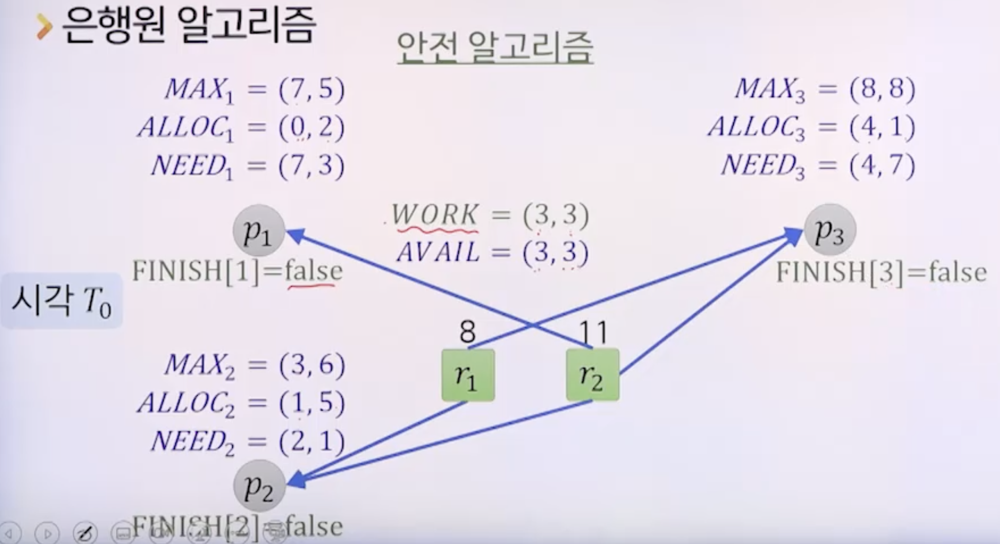

# 7강. 교착상태 II

## 01. 교착상태 회피

### 교착상태 회피

- 프로세스의 자원 사용에 대한 사전 정보를 활용하여 교착상태가 발생하지 않는 상태에 머물도록 하는 방법
- 사전 정보
  - 현재 할당된 자원
  - 가용상태의 자원
  - 프로세스들의 최대 요구량

### 안전상태와 안전순서열

- 안전상태
  - 교착상태를 회피하면서 각 프로세스에 그들의 최대 요구량까지 빠짐없이 자원을 할당할 수 있는 상태
  - 안전순서열이 존재하는 경우
  - 안전상태 내에서는 교착상태가 일어날 수 없다. 교착상태는 불안전상태에서만 일어난다.
- 불안전상태
  - 안전순서열이 존재하지 않는 경우

### 안전순서열

- 순서 있는 프로세스의 집합 <p1, p2, ..., pn >

- 각 pi에 대해 pi가 추가로 요구할 수 있는 자원의 양이 현재 가용상태의 자원으로 충당되거나 혹은 여기에 pj(단, j < i)에 할당된 자원까지 포함하여 충당 가능한 경우

- 예시

  

  - 세 개의 프로세스p1, p2, p3, 자원 종류 한 개 r1(단위자원 8)

  - 여기서 최대요구량이란, 각각의 프로세스가 종료되기 위해서 추가적으로 필요한 자원의 양

  - 2개 자원 가용

    - p2(1개 자원 더 할당) > p2 종료 > p2가 가진 2개 다시 r1으로, 가용자원 3개 > p3(3개 자원 더 할당) > p3 종료 > p3가 가진 자원 8개가 다시 r1으로, 가용자원 8개 > p1(5개 더 할당) > p1 종료

    - p2 > p3 > p1 순서대로 종료 가능
    - 안전순서열: p2 > p3 > p1

  - 가용한 자원이 최대요구량에 비해 부족한 경우, 불완전상태

    - 이런 상태가 나타날 것이므로, 운영체제가 해당 요구간선을 회피해서 안전상태 유지

    

### 교착상태 회피

- 교착상태는 불안전상태에서만 발생 가능
- 항상 안전상태를 유지해야 함
- 프로세스가 가용상태의 자원을 요구하더라도 프로세스는 대기상태가 될 수 있음
  - 자원이용율은 다소 낮아질 수 있음

### 교착상태 회피 알고리즘

- 각 자원의 단위자원이 하나밖에 없는 경우
  - 변형된 자원할당 그래프 이용
- 각 자원의 단위자원이 여러 개 일 수 있는 경우
  - 은행원 알고리즘 이용

#### 변형된 자원할당 그래프: 각 자원의 단위자원이 하나밖에 없는 경우

- 자원 정점에 표시하던 단위자원의 개수 제거

- 선언간선(pi, rj) 추가 

  - 앞으로 프로세스가 pi가 자원 rj를 요구하게 될 것임
  - 요구간선과 구분을 위해 점선으로 표시

  

  - p1, p2가 r2를 앞으로 요구할 수 있다는 것을 나타냄

- 자원을 요구받으면 해당 선언간선을 요구간선으로 변경

- 그 요구간선을 할당간선으로 **변환해도 사이클이 생기지 않는 경우에만 자원을 할당**하고 할당간선으로 변환

- 예

  - 현재 교착상태가 생긴 것은 아니지만, 미래에 교착상태가 발생할 가능성이 있는 경우 회피

  

#### 은행원 알고리즘: 각 자원의 단위자원이 여러 개 일수 있는 경우

- 자원을 요구받으면 그 자원을 **할당해 주고 난 후의 상태를 계산해서 그것이 안전상태인지 확인**

- 안전상태가 보장되는 경우에만 자원을 할당

  

  

- 은행원 알고리즘

  

  - 예시

    

    - 안전 알고리즘(초록)

    

    - 안전 순서열: p2, p3, p1

    

    - 상태계산

    

    - 바뀐 상태값에 대해 안전 알고리즘을 돌려보는 것

      - 안전순서열이 존재하면 이대로 할당

        

      - 그렇지 않다면, 계산 취소(REQ1 할당하지 않음)

        

    

## 02. 교착상태 탐지 및 복구

### 교착상태 탐지 및 복구

- 사후에 처리하는 방법
- 교착상태 탐지
  - 시스템의 교착상태 여부를 조사하기 위해 주기적으로 상태 조사 알고리즘 수행
- 교착상태 복구
  - 교착상태가 탐지된 경우 적절한 조치를 취해 정상 상태로 복구

### 교착상태 탐지

- Shoshani와 Coffman 알고리즘

  - 안전알고리즘과 유사
    - 안전알고리즘과 달리, **현재 상황**이 교착인지 아닌지 확인
    - 할당받은 자원이 없으면, false로 처리하지 않음

  - 상황 1

    

  - 상황 2

    

- Shoshani와 Coffman 알고리즘 pseudo code

  - 시간 복잡도: O(mn^2)

  - 알고리즘 수행 시점

    - 즉시 받아들일 수 없는 지원 요구가 있을 때

    - 정해진 시간 간격

    - CPU 효율이 일정 수준 이하로 떨어질 때

      

### 교착상태 복구

- 교착상태가 탐지되면 복구조치
- 복구의 주체
  - 오퍼레이터: 수작업으로 복구
  - 운영체제: 자동으로 복구
- 복구 방법
  - 교착상태 프로세스를 종료
  - 교착상태 프로세스가 할당받은 자원을 해제

#### 교착상태 프로세스를 종료

- 모든 교착상태 프로세스를 종료
  - 단점: 진행했던 내용에 대한 복원비용이 큼
- 사이클이 제거될 때 까지 교착상태 프로세스를 하나씩 종료
  - 단점: 종료 대상을 선택하기 위한 비용
    매 프로세스 종료 후 교착상태 재확인을 위한 비용

#### 교착상태 프로세스가 할당받은 자원을 해제

- 사이클이 제거될때까지 할당된 자원을 단계적으로 선점하여 다른 프로세스들에 할당
- 프로세스와 자원 선택 기준
  - 프로세스 진척도, 사용 중인 자원의 수 등
- 프로세스의 **복귀 시점**도 제반 요소를 고려하여 결정
- 기아상태에 빠지지 않도록 프로세스 선택 시 **복구 횟수** 고려