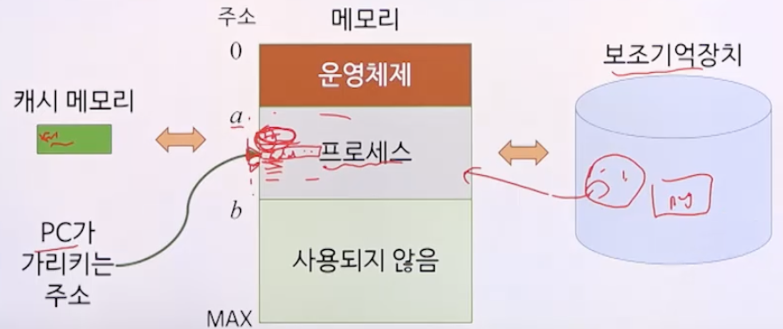
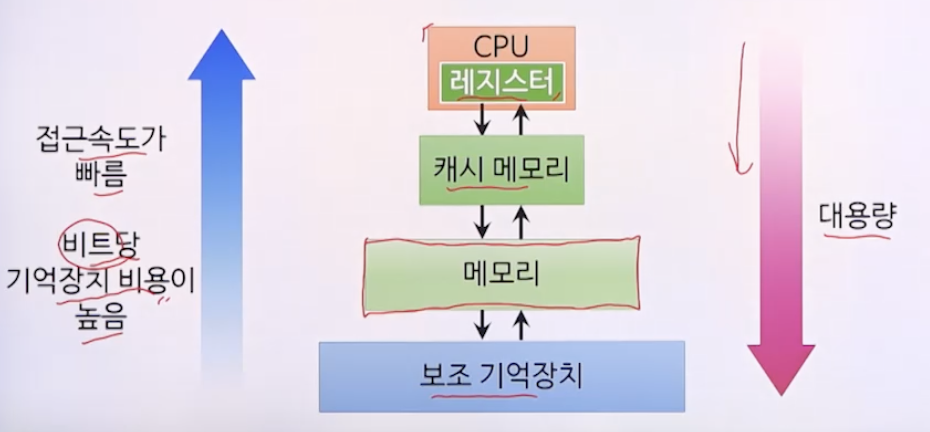

# 8강. 메모리 관리

## 01. 프로세스와 메모리

### 프로세스의 동작

- 프로그램 카운터(PC)를 참조하여 수행될 명령을 메모리에서 읽어 CPU로 수행하는 것
  - 보조기억장치는 메모리보다 일반적으로 느리고
  - 캐시 메모리는 빠르다

### 기억장치 계층구조

### 메모리 관리

- 메모리 호출
  - 언제 새로운 프로세스를 메모리에 둘 것인가?
- 메모리 배치
  - 다음에 실행된 프로세스를 메모리 내의 어느 곳에 둘 것인가?
- 메모리 교체
  - 메모리가 꽉 찬 상태에서 새로운 프로세스를 메모리에 적재해야 한다면 어떤 프로세스를 제거할 것인가?
- 그 외: 고정/동적 분할, 고정/유동 적재영역 등

## 02. 단일 프로그래밍 환경

### 단일 프로그래밍

- 하나의 프로세스만 메모리를 전용으로 사용하는 것

- 프로세스는 하나의 연속된 블록으로 메모리에 할당
  - 연속 메모리 할당

### 단일 프로그래밍의 문제점

- 메모리의 용량을 초과하는 프로세스는 실행 못함

- 메모리 낭비 심함

  - 지속적으로 사용되지 않는 프로세스도 메모리에 계속 적재

- 주변 장치 등 자원의 낭비 심함

  - CPU가 놀게 되는 경우

  

## 03. 다중 프로그래밍 환경

### 다중 프로그래밍

- 여러 개의 프로세스가 메모리에 동시에 적재되는 것

- CPU 연산과 입출력을 동시에 함으로써 CPU 이용도와 시스템 처리량 증가

  

### 메모리 분할

- 여러 프로세스를 메모리에 적재하기 위해 고안된 방법
- 하나의 분할에 하나의 프로세스가 적재되는 방식
- 종류: 고정 분할, 동적 분할

#### 고정분할

- 메모리를 여러 개의 고정된 크기의 영역으로 분할

  - 분할 크기는 더 이상 변하지 않음(고정)

- 프로세스 배치 방법 1

  - 분할영역마다 큐를 두고 큐에 들어온 프로세스는 해당 분할영역에만 적재

  - 절대 번역(절대 주소 사용) 및 적재

  - 효율성 낮음(다른 분할이 비어있더라도 1에만 채움)

    

- 프로세스 배치 방법 2

  - 하나의 큐만 두고 큐에 들어온 프로세스는 어느 분할 영역에든 적재
  - 재배치 가능 번역 및 적재
  - 복잡함

  

- 문제점: 내부 단편화

  - 프로세스의 크기가 적재된 분할영역의 크기보다 작아서 분할영역 내에 남게 되는 메모리 발생

  - 수행할 프로세스의 크기를 미리 알고 그에 맞춰 고정 분할을 해야 함

  - **현실적이지 못함**

  - 예시

     

#### 동적 분할

- 메모리의 분할 경계가 고정되지 않음
- 각 프로세스에 필요한 만큼의 메모리만 할당

#### 문제점: 외부 단편화

- 메모리의 할당과 반환이 반복됨에 따라 작은 크기의 공백이 메모리 공간에 흩어져 생김

#### 통합

- 인접된 공백을 더 큰 하나의 공백으로 만들어 외부 단편화 해결

  

#### 집약

- 메모리 내의 모든 공백을 하나로 모아 외부 단편화 해결

  

### 메모리 보호

- 프로세스가 다른 할당 영역을 침범하지 않게 하는 것

- 하한-상한 또는 하한-크기 레지스터 쌍으로 제한

  

- 이 제한 넘어서 운영체제를 호출하려면 시스템 호출 이용

## 04. 메모리 배치기법

### 메모리 배치기법이란?

- 동적 분할 다중 프로그래밍에서 새로 반입된 프로그램이나 데이터를 메모리의 어느 위치에 배치할 것인가를 결정

- 종류
  - 최초 적합
  - 후속 적합
  - 최적 적합
  - 최악 적합

### 최초 적합

- 프로세스가 적재될 수 있는 빈 공간 중 가장 먼저 발견되는 곳을 할당

### 후속 적합

- 최초 적합의 변형
- 이전에 탐색이 끝난 그 다음 부분부터 시작하여 사용 가능한 빈 공간 중에서 가장 먼저 발견되는 곳을 할당

### 최적 적합

- 필요한 공간을 제공할 수 있는 빈 공간 중 가장 작은 곳을 선택하여 할당
  - 공백4 선택
- 큰 빈 공간을 최대한 많이 남겨놓기 위한 방법

### 최악 적합

- 필요한 공간을 제공할 수 있는 빈 공간 중 가장 큰 곳을 선택하여 할당
  - 공백5 선택
- 작은 자투리가 남아 사용되지 못하는 공간이 발생하는 것을 최소화하기 위한 방법