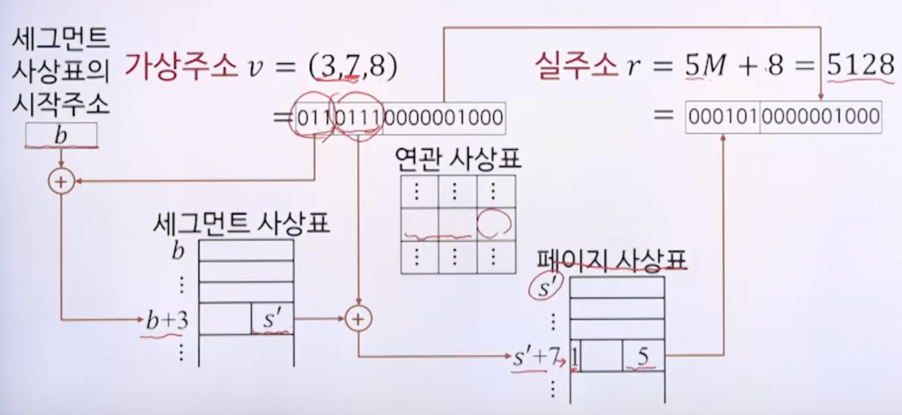

# 9강. 가상 메모리

## 01. 가상 메모리의 개념

### 연속 메모리 할당

- 메모리 크기보다 더 큰 기억공간이 필요한 프로세스는 실행 불가

### 가상 메모리 

- 메모리 크기보다 더 큰 기억공간이 필요한 프로세스도 실행할 수 있게 하는 방법

  - 프로그램카운터(PC)가 가리키고 있는 일부분의 메모리만 실제 메모리에 올려놓으면, 실행 가능

- 실행 중인 프로세스에 의해 참조되는 주소(가상주소)를 메모리에서 사용하는 주소와 분리

  - 현재 필요한 일부만 메모리에 적재

  

### 사상(mapping)

- 프로세스 실행을 위해 가상주소를 실주소로 변환하는 과정

- 동적 주소변환(DAT):  프로세스가 실행되는 동안 사상

- 인위적 연속성

  - 가상주소 공간에서 연속적인 주소가 실주소 공간에서도 연속적일 피룡는 없음

  

## 02. 블록 단위 주소 변환

### 주소변환

- 주소변환 사상표

  - 동적 주소변환을 위한 정보를 가진 표

    

- 주소변환이 바이트나 워드 단위로 이뤄지면, 변환에 필요한 정보량이 너무 많아 비효율적임

  

### 블록 사상 시스템

- 블록 단위로 주소변환
- 가상 메모리의 각 블록이 메모리의 어디에 위치하는지 관리
- 가상주소 v = (b, d)
  - b: 블록번호
  - d: 블록의 시작점으로부터의 변위

- 블록의 크기는 적절히 정해야 함
  - 크기가 커질 수록
    - 사상표 크기 감소
    - 블록 전송시간 증가, 동시에 적재할 프로세스 수 감소
  - 크기가 작아질 수록
    - 블록 전송시간 감소, 동시에 적재할 프로세스 수 증가
    - 사상표 크기 증가

### 블록의 구성방식

- 페이지(page)

  - 블록의 크기가 동일

    

- 세그먼트(segment)

  - 블록의 크기가 다를 수 있음

    

### 페이징 기법

- 가상 메모리를 페이지 단위로 나누어 관리하는 방법

- 메모리 영역도 페이지와 동일한 크기의 페이지 프레임으로 나눔

  - 페이지 프레임: 페이지를 담을 수 있는 틀

    - 3번 페이지를 5번 페이지 프레임에 적재

      

- 페이징 사상표

  - 가상 주소를 실주소로 동적 변환 할 수 있게 함
  - 페이지 번호에 대한 페이지 프레임 번호 저장
    - 페이지번호를 인덱스로 사용
    - 페이지 존재 비트: 실제 메모리 상에 존재하는 페이지인지
      - 만약 페이지 존재 비트가 0이면, 메모리에 적재되어있지 않음
      - 따라서 메모리에 적재되어야 하는 처리 필요(페이지프레임에 적재 필요)
    - 보조기억장치 주소
      - 보조기억장치에서의 주소값
      - 페이지프레임에서 다 쓰고, 다시 보조기억장치로 옮겨갈 필요가 있음
      - 이 때 보조기억장치 s로 옮겨야 하므로 주소가 필요함

  

### 페이징 기법

- 직접사상에 의한 동적 주소변환

  - 페이지 사상표를 직접 이용
  - 가상주소: 3번페이지에서 8만큼 떨어진 곳(변위값)
  - 페이지 크기  M = 1024(2의 10승)
    - 변위는 페이지 크기만큼 잡는다. 따라서 10비트

  

- 연관사상에 의한 동적 주소 변환

  - 페이지 변환 정보를 연관 메모리에 저장한 연관 사상표를 이용
  - 페이지 크기 M = 1024(2의 10승)
  - 연관메모리는 빠르게, 한꺼번에 페이지 번호를 검색

  

- 연관/직접 사상에 의한 동적 주소변환

  - 연관사상표에는 **가장 최근에 참조된 페이지**만 보관
  - 연관사상표에 없을 때만 직접사상 이용
  - 페이지 크기 M = 1024

  

### 페이징 기법의 특징

- 논리적 의미와 무관한 동일 크기의 페이지 나눔
- 메모리 보호는 페이지 단위로 이루어짐
- 외부 단편화가 발생하지 않음
  - 외부 단편화: 주변에 사용하지 못하고 남는 공간들이 생기는 것들
- 내부 단편화는 발생 가능
  - 미미한 수준

### 세그먼트테이션 기법

- 가상 메모리를 세그먼트 단위로 나누어 관리하는 방법
  - 세그먼트: 논리적 의미에 부합하는 다양한 크기의 블록
- 세그먼트 사상표를 이용하여 동적 주소 변환

- 세그먼트 사상표

  - 세그먼트 번호에 대한 실주소에서의 시작 위치 저장
  - 세그먼트 길이는 오버플로 확인용
    - 세그먼트 길이

  

- 동적 주소변환

   

### 페이징/세그먼테이션 혼용기법

- 세그먼테이션 기법의 논리적 장점 + 페이징 기법의 메모리 관리 측점의 장점

- 가상 메모리를 세그먼트 단위로 분할 후 각 세그먼트를 다시 페이지 단위로 분할

- 메모리는 페이지 프레임으로 분할

- 가상주소 v = (s, p, d)

  

- 동적 주소변환(페이지크기: M = 1024)

  

## 03. 메모리 호출 기법

### 메모리 호출 기법

- 어느 시점에 페이지 또는 세그먼트를 메모리에 적재할 것인가를 결정하는 기법
- 페이징 기법에서의 호출기법 종류
  - 요구 페이지 호출기법
  - 예상 페이지 호출기법

### 요구 페이지 호출기법

- 프로세스의 페이지 요구가 있을 때, 요구된 페이지를 메모리에 적재하는 방법

  

### 예상 페이지 호출기법

- 곧 사용될 것으로 예상되는 페이지를 미리 메모리에 적재하는 방법

  

### 메모리 호출기법 비교

- 요구 페이지 호출기법
  - 옮길 페이지 결정에 대한 오버헤드 최소화
  - 적재된 페이지는 실제로 참조됨
  - 프로세스 시작 시점에는 연속적으로 페이지 부재 발생
    - 그때마다 약간씩 딜레이 발생 가능성

- 예상 페이지 호출기법
  - 예상이 잘못된 경우 시간과 메모리 공간 낭비
  - 프로세스 시작 시점에 적용하면 성능이 개선됨