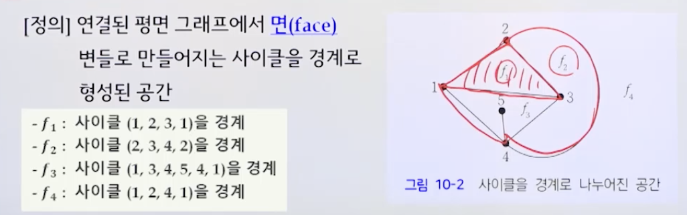
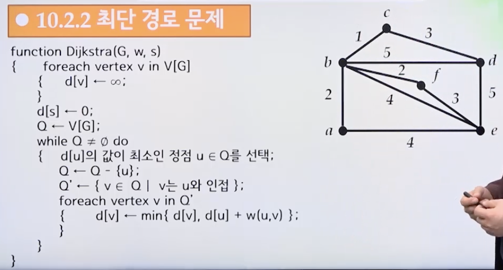

# 10강. 그래프2

## 10.1 그래프의 탐색

### (1) 평면 그래프와 4색 정리

#### 평면 그래프

- 그래프의 모든 변을 서로 교차하지 않게 그릴 수 있는 그래프를 평면 그래프(planar graph)라고 함

- 평면 그래프가 아닌 예

  

- 평면 그래프의 예

  

  

#### 오일러의 공식(Euler's Formula)

- 연결된 평면 그래프에서 면(face) 변들로 만들어지는 **사이클**을 경계로 형성된 공간

  

- 연결된 평면 그래프에서 꼭지점의 수를 v, 변의 수를 e, 면의 수를 f라고 하면
  - `v-e+f = 2`

#### 4색 정리

- 지도의 인접한 구역을 서로 다른 색으로 칠하는데 오직 4가지 색이면 충분하다
- 평면 그래프가 주어졌을 때, 각 꼭지점에 대하여 인접한 꼭지점과 서로 다른 색으로 칠하는데 필요한 색은 4가지이면 충분하다.

### (2) 오일러 투어

#### 오일러 투어

- 오일러 트레일(Eulerian trail) 
  - 그래프의 모든 변들을 각각 한 번만 지나는 트레일
- 오일러 투어(Eulerian tour [circuit/cycle])
  - 닫힌 오일러 트레일(즉, 시작점과 종점이 같은 오일러 트레일)

#### 오일러 그래프 정리

- 연결 그래프가 오일러 투어를 가지기 위한 **필요충분 조건**은 그래프의 **모든 꼭지점의 차수는 짝수**인 것

- 오일러 그래프 == 오일러 투어를 갖는 그래프

  - A graph that has an Eulerian circuit. For an undirected graph, this means that the graph is connected and every vertex has even degree

- 연결 그래프가 오일러 투어를 가지면 모든 꼭지점의 차수는 짝수

  - [증명] 연결 그래프 G = (V, E)가 오일러 투어를 가진다고 가정
    - V의 임의의 꼭지점 v는 다른 꼭지점들과 변에 의해 연결됨
    - v와 연결된 변은 오일러 투어에 의해 v로 들어온느 변과 나가는 변으로 구분할 수 있고, 들어오는 변의 수와 나가는 변의 수는 항상 동일

- 연결 그래프 G의 모든 꼭지점의 차수는 짝수이면 G는 오일러 그래프

  - [증명] 그래프 G가 연결 그래프이고 모든 꼭지점의 차수는 짝수라 가정하자

  - 오일러 투어는 다음 알고리즘을 통해 구할 수 있다\

    - 1. G의 임의의 꼭지점 v를 고른다

      2. v에서 시작하고 v에서 끝나는 임의의 사이클 C를 선택한다

      3. C가 오일러 투어이면 증명을 끝낸다. 만약 아니라면 아래 과정을 반복한다

         3-1. G에서 C에 속하는 모든 변을 제거하고 새로운 G'을 만든다

         3-2. C와 G'가 공유하는 꼭지점 중 하나를 고르고 w라고 한다

         3-3. w에서 시작하고 w에서 끝나는 임의의 사이클 C'를 선택한다

         3-4. 기존의 C와 새로 선택된 C'를 합쳐서 새로운 C를 만든다.

### (3) 해밀턴 경로

#### 해밀턴 경로와 해밀턴 사이클

- 해밀턴 경로(Hamiltonian path)
  - 그래프의 모든 꼭지점들을 한 번 씩만 지나는 경로
  - A Hamiltonian path is a path in an undirected graph that visits each vertex exactly once
- 해밀턴 사이클(Hamiltonian cycle)
  - 닫힌 해밀턴 경로(시작점과 종점이 같은 해밀턴 경로)

## 10.2 그래프의 활용

### 10.2.1 가중 그래프

- 가중 그래프(weighted graph)
  - 그래프의 각 변에 실수값이 붙여진 그래프
  - 변에 부여된 값은 가중치(weight)라고 함

- 최단경로 문제
  - 출발지와 도착지가 주어졌을 때 가장 짧은 경로를 찾는 문제
- 최소 신장 트리 문제
  - 그래프의 모든 꼭지점을 최소 수의 변으로 연결하는 문제
  - 사이클이 없는 연결 그래프(11강 참고)

### 10.2.2 최단경로 문제

- 다익스트라....포기..

  

  

