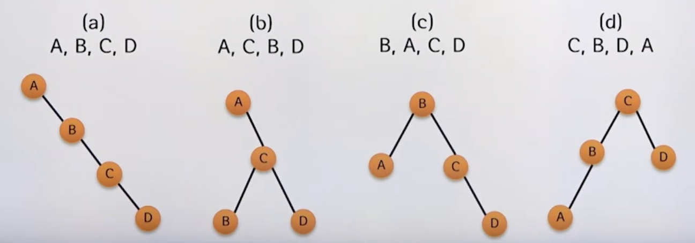
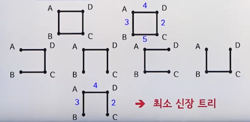
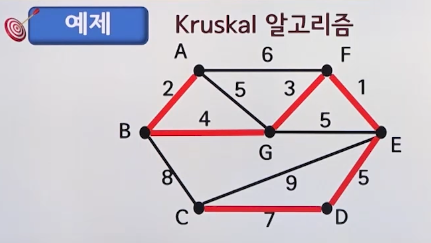
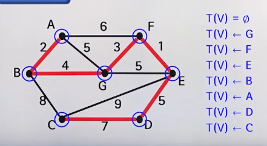

# 11강. 트리

## 11.1 기본 사항 

### (1) 트리의 정의

- 트리의 종류

  

#### 트리

- 사이클이 없는 단순 연결 그래프를 트리(tree)라고 한다
  - Trivial tree
    - 꼭지점 하나로 구성된 트리
  - Empty tree
    - 꼭지점이 하나도 없는 트리
  - Forest
    - 한 개 이상의 트리로 구성된 그래프

#### 루트 트리

- 루트 트리  T는 다음 조건을 만족하는 1개 이상의 노드 들의 유한집합

  - 루트(root: v1)라고 부르는 노드가 1개 존재

  - 나머지 노드(v2, v3, v4, ..., vn)들은 m개의 서로 분리된 집합으로 나뉘며, Ti는 다시 루트 트리가 됨. 
    - 이 때 T1, T2,...Tm을 각각 v1의 서브트리(subtree)라고 함

### (2) 주요 용어

#### 트리의 주요 용어

### (3) 트리의 표현

- 중첩된 집합
- 중첩된 괄호
- 결각

#### 닮은 트리

- 트리의 구조는 동일하지만, 노드 데이터의 내용이 서로 다를 떄 이들 트리는 서로 닮았다고 함

  

### (4) 주요 정리

- n개의 꼭지점을 가지는 연결 그래프가 n-1개의 변을 가지면 해당 그래프는 트리
- n개의 꼭지점을 가지는 트리는 n-1개의 변을 가짐

## 11.2 이진 트리

### 이진 트리

- 이진 트리(binary tree)

  - 공집합이거나 모든 노드가 최대 2개의 서브트리를 갖는 루트 노드인 트리

    - left subtree

    - right subtree

    - left child

    - right child

  - 루트 트리와의 차이점

    - 공집합일 수 있음

    - 왼쪽과 오른쪽을 구분함

      

- 최대 노드 수

  - 이진 트리  T의 높이가 h개 일 때 T의 최대 노드 수는

     

#### 완전 이진 트리

- 높이가 h인 트리에서 레벨 0부터 h-1 까지 모든 노드가 채워져 있고 레벨 h에서는 왼쪽 노드부터 차례로 채워진 이진트리를 완전 이진 트리(complete binary tree)라 한다

#### 정리

- 완전 이진 트리는 같은 노드 수를 갖는 트리 중 최소의 높이를 갖는다

- n개의 노드를 갖는 이진 트리의 최소 높이

  

- 이진 트리의 높이

  

- 포화 이진 트리
  - 높이가 k인 트리에서 레벨 0부터 레벨 k까지 모든 노드가 채워진 이진 트리를 포화 이진 트리(full binary tree)라고 함
  - 완전 이진 트리의 특별한 경우
  - 

## 11.3 이진 탐색 트리

### (1) 이진 탐색 트리의 정의

- 이진 트리에서 모든 노드가 탐색을 위한 키 값을 가지고 있으며 키들이 다음의 속성을 만족할 때, 주어진 이진트리를 **이진 탐색 트리(binary search tree)**라고 함

  - 임의의 노드Ni에 대해 

    - Ni의 **왼쪽** 서브트리의 키값들은 Ni의 키값 ki보다 **작아야** 한다

    - Ni의 **오른쪽** 서브트리의 키값들은 Ni의 키값 ki보다 **커야** 한다

### (2) 이진 탐색 트리의 구성

### (3) 이진 탐색 트리 검색

- 탐색 노드를 루트 노드로 설정한다

- 탐색 노드와 주어진 키를 비교한다

  - 일치한다면, 키를 반환하고 탐색을 멈춘다
  - 그렇지 않다면
    - 주어진 키가 **현재 탐색 노드보다 작다면**, 왼쪽 자식을 탐색 노드를 설정한다. 왼쪽 자식이 없는 경우, 키 없음을 반환하고 탐색을 멈춘다
    - 주어진 키가 **현재 탐색 노드보다 크다면**, 오른쪽 자식을 탐색 노드로 설정한다. 만약 오른쪽 자식이 없는 경우 키 없음을 반환하고 탐색을 멈춘다.
  - 과정을 반복한다

- 효율적인 이진 탐색 트리

  - 비교 횟수

    

  - 비교 횟수 기대값

    

    

#### 참고: Huffman Coding in Data Compression

## 11.4 트리의 활용

### 11.4.1 최소 신장 트리(MST)

- 신장트리

  - 그래프 G의 모든 꼭지점을 연결하고 사이클이 존재하지 않는 G의 부분 그래프를 G의 신장 트리(spanning tree)라 한다
  - 그래프 G의 모든 꼭지점을 포함하는 트리

- 최소 신장 트리(Minimum Spanning Tree)

  - 그래프 G의 모든 변의 가중치의 합을 총 가중치(total weight)이라고 했을 G의 신장 트리 중 총 가중치가 가장 작은 신장 트리를 최소 신장 트리라고 함

    

  - 주어진 그래프에서 신장 트리의 수는 꼭지점의 개수가 커짐에 따라 기하급수적으로 증가

    - 완전 그래프 Kn의 신장 트리의 수는 n^(n-2)개

      

  

### 11.4.2 MST 구하는 알고리즘

#### (1) Kruskal 알고리즘(변 중심)

1. 가중치의 오름차순으로 변을 정렬한다
2. 가장 작은 가중치의 변부터 차례대로 트리에 추가한다
3. 모든 꼭지점이 연결될 때까지 2번 과정을 반복한다

- 예시

  

#### (2) Prim 알고리즘(꼭지점 중심)

1. 임의의 꼭지점 하나를 트리에 추가한다
2. 트리의 꼭지점이 아니면서 트리와 연결된 꼭지점 중에서 가장 작은 가중치의 변으로 ㅇ녀결된 꼭지점을 추가한다.
3. 모든 꼭지점이 연결될 때까지 2번 과정을 반복한다

- 예시

  