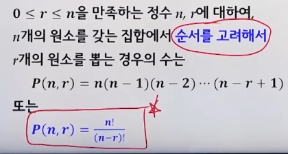

# 12강. 조합이론

## 12.1 기본 계수 법칙

### 곱의 법칙

- 두 사건 A, B가 일어날 경우의 수가 각각 N(A) = m, N(B) = n 일 때, 사건 A, B가 동시에 일어날 경우의 수는 m x n 이다. 
- N(A x B) = N(A) x N(B) = m x n

### 합의 법칙

- 두 사건 A, B가 일어날 경우의 수가 각각 N(A) = m, N(B) = n이고, A와 B의 교집합이 공집합이고, 사건 A 또는 B가 일어날 경우의 수는 m + n 이다
-  

### 합집합의 크기

- 사건 X, Y, Z가 발생할 방법의 집합을 각각 A, B, C라고 하면 

  - X 또는 Y가 발생할 경우의 수

     

  - X 또는 Y또는 Z가 발생할 경우의 수

     

## 12.2 순열

### (1) 순열(permutation)

- 순서를 고려하는 것이 중요

 

- 중복집합에서의 순열

- 예시: 최단경로

 

### (2) 중복순열

- 중복집합에서의 순열

  - n개의 원소를 갖는 집합에서 중복을 허용하고 순서를 고려해서 r개 원소를 뽑는 경우의 수

    

- 예시

   

### (3) 원순열

- n개의 원소를 갖는 집합의 모든 원소들을 원형으로 나열하는 경우의 수

   

- 예시

   

## 12.3 조합

### (1) 조합(combination)

- 0 <= r <= n을 만족하는 정수 r, n에 대하여 n개의 원소를 갖는 집합에서 r개의 원소를 **순서 없이** 뽑는 경우의 수

 

### (2) 이항 정리(binomial theorem)

 

- 예시

   

## 12.4 이산확률

### 표본공간과 사건

- 어떤 실험을 했을 때, 가능한 모든 결과 중에서 반드시 하나의 결과만 나타난다고 하자
- 실험의 모든 결과의 집합을 표본공간(sample space)이라 하며, 표본공간의 부분집합을 사건(event)라고 한다

### 수학적 확률 

- 예시 

  

### 조건부 확률

- 표본공간 S에 두 사건 A, B가 있고, P(B) > 0 이라고 하자. 사건 B가 발생했다는 가정 하에 사건 A가 발생활 확률을 조건부 확률(conditional probability) P(A|B)라고 한다

  

- 예시

  

## 12.5 점화식(recurrence relation)

### 점화식

- 점화식이란 수열의 항 사이에서 성립하는 관계식

   

- 주어진 수열에 관한 점화식을 푼다[점화식의 해를 구한다]는 것은 수열의 일반항인 an을 n에 관한 식으로 나타내는 것

- 예시

   

  

  

## 12.6 비둘기집 원리

### 비둘기집 원리(pigeonhole principle)

 

- 예시

  

