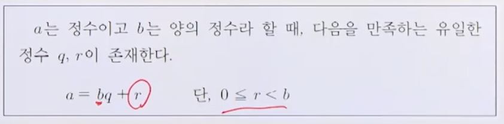
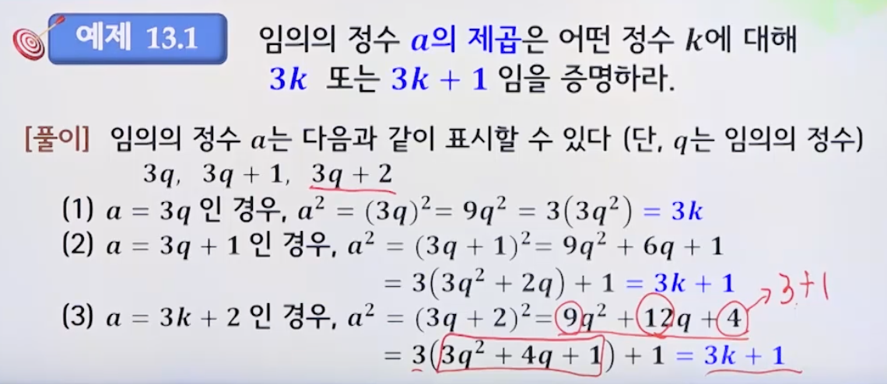

# 13강. 정수론

## 13.1 나눗셈

### (1) 약수와 배수

#### 나눗셈

#### 약수와 배수

#### 나누어떨어짐(divisibility)

### (2) 최대 공약수(GCD)

#### 최대공약수(gcd: greatest common divisor)

####  베주의 항등식(Bezout's identity)

#### 유클리드 호제법(Euclidean algorithm)

## 13.2 나머지 연산

## 13.3 소수와 소인수분해

## 13.4 RSA 암호

