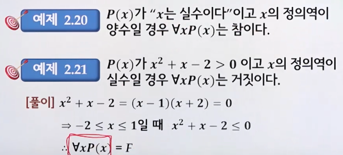
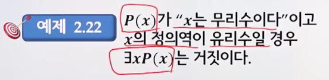
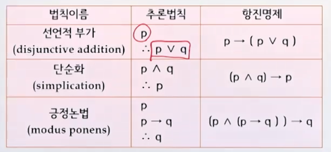
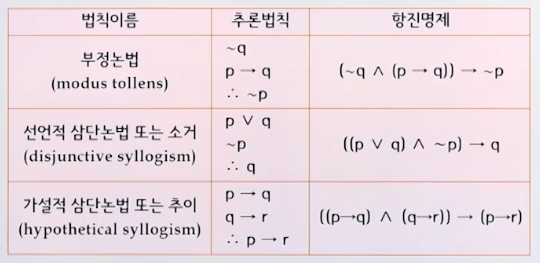
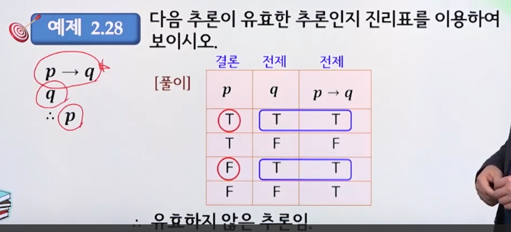

# 2강. 논리

## 2.1 명제(Proposition)

> 명제와 명제가 아닌 것을 구분할 수 있어야 한다

참과 거짓을 구별할 수 있는 문장이나 수학적 식을 명제라고 한다

- 명제의 진리값

  - 참(True): 타당한 명제
  - 거짓(False): 타당하지 않은 명제

- 명제의 종류

  - 합성명제
  - 조건명제, 쌍조건명제
  - 항진명제, 모순명제

- 명제를 판별하라

  ```
  6은 2의 배수다 // 명제(참)
  철수는 공부를 잘 한다 // 명제가 아님
  2+3=7 // 명제(거짓)
  x+2=0 // 명제가 아님 => 명제 함수
  ```

- 명제의 진리값을 구하여라

  ```
  2, 3, 6은 소수이다 // 거짓
  소수의 개수는 무한하다 // 참
  126 = 2^6 // 거짓
  지구에서 가장 높은 산은 에베레스트이다. // 참
  ```


## 2.2 논리연산

> 합성명제의 진리값을 구할 수 있어야 한다

- 논리 상수(T, F)
- 논리 변수(p, q)

### 2.2.1 논리 연산자(operator)

- 합성명제(compound proposition)
  - 하나 이상의 명제와 논리 연산자, 그리고 괄호로 이루어진 명제
- 논리합(disjunction: or, ∨)
  - p ∨ q

- 논리곱(conjunction: and, ∧)
  - p ∧ q
- 부정(negation: ~, ㄱ)
  - ~p
- 배타적 논리합(exclusive or: xor, ⊕) ⭐️
  - p⊕q ≡ (p∧~q) ∨ (~p∧q)
  - 둘 다 참인 것이 F 


### 2.2.2 조건명제

#### 조건명제

- 명제 p와 q가 있을 때, 명제 p가 조건의 역할을 수행하고 명제 q가 결론의 역할을 수행하는 경우
- p → q
  - p는 q의 충분조건
  - q는 p의 필요조건 

#### 쌍조건명제(conditional proposition, ↔)

-  명제 p와 q가 있을 때, 명제 p와 q가 조건의 역할과 결론의 역할을 동시에 수행하는 경우
- p ↔ q
  - (p → q) ∧ (q → p)
- p ↔ ≡ ~(p⊕q)


### 2.2.3 동치

#### 논리적 동치(logical equivalence, =)

- 두 명제 p와 q가 논리적으로 동등하면 논리적 동치라고 하고, p = q라고 표시한다(세줄)
  - 논리적으로 동등하다는 말은, 두 명제가 항상 동일한 진리값을 가진다는 의미
  - p ↔ q
- 역, 이, 대우
  - 조건명제  **p→q** 일 때
    - 역(converse) **q → p**
    - 이(inverse) **~p → ~q**
    - 대우(contrapositive): **~q → ~p**

#### 논리적 동치법칙

1. 교환법칙(commutation law)
   - p ∨ q ≡ q ∨ p
   - p ∧ q ≡ q ∧ p
   - p ↔ q ≡ q ↔ p

2. 결합법칙(associative law)

   - ( p ∨ q ) ∨ r ≡ p ∨ ( q ∨ r )
   - ( p ∧ q ) ∧ r ≡ p ∧ ( q ∧ r )

3. 분배법칙(distributive law)

   - p ∨ ( q ∧ r ) ≡ ( p ∨ q ) ∧ ( p ∧ r )
   - p ∧ ( q ∨ r ) ≡ ( p ∧ q ) ∨ ( p ∧ r )

4. 항등법칙(identity law)

   - p ∨ F ≡ p
   - p ∧ T ≡ p

5. 지배법칙(domination law)

   - p ∨ T ≡ T
   - p ∧ F ≡ F

6. 부정법칙(negation law)

   - ~T ≡ F
   - ~F ≡ T
   - p ∨ (~p) ≡ T
   - p ∧ (~p) ≡ F

7. 이중부정법칙(double negation law)

   - ~(~p) ≡ p

8. 멱등법칙(idempotent law)

   - p ∨ p ≡ p
   - p ∧ p ≡ p

9. 드모르간 법칙(de Morgan's law)

   - ~ ( p ∨ q ) ≡ ( ~p ) ∧ ( ~q )
   - ~ ( p ∧ q ) ≡ ( ~p ) ∨ ( ~q )

10. 흡수법칙(absorption law) ⭐️

    - p ∨ ( p ∧ q ) ≡ p
    - p ∧ ( p ∨ q ) ≡ p

11. 함축법칙(implication law)

    p → q ≡ ~p ∨ q

12. 대우법칙

    p → q ≡ ~q → ~p


#### 항진명제(tautology)와 모순명제(contradiction)

- 합성명제를 구성하는 명제의 진리값과 상관없이 
  - 항상 참인 명제를 항진명제
  - 항상 거짓인 명제를 모순명제라고 함


## 2.3 술어논리

> 한정자가 포함된 술어논리를 구사할 수 있어야 한다

### 2.3.1 술어논리와 명제함수

#### 논리(logic)

- 명제논리(proposition logic)
  - 명제
- 술어논리(predicate logic)
  - 명제함수

#### 명제함수(propositional function)

- 변수의 값에 의해 함수의 진리값이 결정되는 문장이나 식
- 변수의 명세
  - 변수의 값을 적시
  - 변수의 범위를 제시(한정화: Ɐ, Ǝ)

####  한정화(quantification)

- 전체한정자(universal quantifier, Ɐ)

  - "모든" 또는 "임의의"를 의미
  - 명제함수 ⱯxP(x)와 같이 사용되었을 경우, 정의역의 모든[임의의] x 에 대해서 P(x)가 참(T)임을 의미
  - 예

  

- 존재한정자(existential quantifier, Ǝ)

  - 명제함수와 ƎxP(x)같이 사용되었을 때는, 정의역이 어떤 x에 대해서 P(x)가 참(T)임을 의미

  - 예

    	


### 2.3.2 타당성 검사

#### 명제함수의 타당성

- 벤 다이어 그램(Venn diagram)
  - 한정자가 사용된 명제함수의 타당성을 직관적으로 검사
- 삼단논법
  - 영희는 서울에 있다
  - 서울은 한국에 있다
  - 따라서 영희는 한국에 있다


## 2.4 추론

> 두 명제의 논리적 동치 여부를 판별할 수 있어야 한다

- 참으로 알려진 명제를 기초로 하여 달느 명제를 유도해 내는 과정
- 결론의 근거를 제공하는 알려진 명제를 전제(premise)라고 한다
- 새로 유도된 명제 결론(conclusion)

### 유효추론

- 전제를 참이라고 가정하였을 때, 결론이 항상 참이 되는 추론

- 삼단논법

  - ((p → q) ∧ (q → r)) → (p → r)

  

### 추론규칙

- 기본적인 추론규칙은 논리적 동치(항진명제)를 이용

  

  

- 예

  