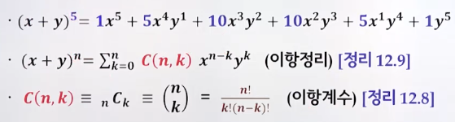
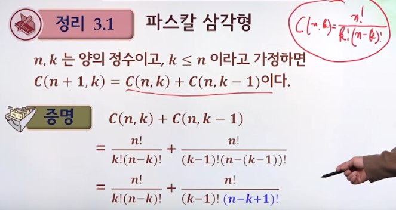
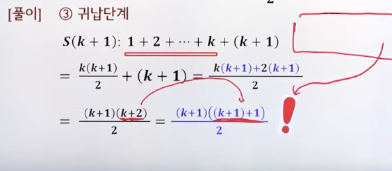

# 3강. 증명

## 3.1 기본사항

### 공리(axiom)

- 어떤 다른 명제들을 증명하기 위해 전제로 사용되는 가장 기본적인 가정으로, **별도의 증명 없이 참으로 이용되는 명제**를 공리라고 한다.

### 증명(proof)

- 증명이란 특정한 공리들을 가정하고, 그 가정하에 제안된 명제가 참임을 입증하는 작업

### 정리(theorem)

- 공리로부터 증명된 명제를 정리라고 함
- 보조정리(lemma)
  - 정리를 증명하는 과정 중에 사용되는 증명된 명제
  - A proven proposition which is used as a stepping stone to a larger result
- 따름정리(corollary)
  - 정리로부터 쉽게 도출되는 부가적인 명제
  - A corollary typicall follows a theorem

### 증명 방법

- 직접 증명법
  - 공리와 정의, 그리고 정리를 논리적으로 직접 연결하여 증명
- 수학적 귀납법
  - 자연수 n에 대한 명제의 성질을 증명하는 데 유용한 증명 방법. **기본단계, 귀납가정, 귀납단계**를 이용
- 간접 증명법
  - 증명해야 할 명제를 증명하기 쉬운 형태로 변형하여 증명하는 방법
  - 대우 증명법, 모순 증명법, 반례 증명법, 존재 증명법
- 기타
  - 전수 증명법, 조합적 증명법, 컴퓨터 이용 증명법


## 3.2 직접증명법

### 직접 증명법(direct proof)

- 연역법(deduction)
  - 이미 증명된 하나 또는 둘 이상의 명제를 전제로 해 새로운 명제를 결론으로 이끌어내는 것
- 명제를 변형하지 않고 증명
- 주로 공리와 정의, 그리고 이미 증명된 정리를 논리적으로 직접 연결해 증명하는 형식을 따름

### 예제

- 두 홀수의 합은 짝수임을 증명하라

```
x = 2a + 1, y = 2b + 1 (단, a,b는 정수)
x + y = 2a + 1 + 2b + 1 = 2(a + b + 1)
여기서 (a + b + 1) 은 정수이므로, 
x + y 도 짝수이다.
```

- 두 유리수의 합이 유리수임을 증명하라

```
r, s를 유리수라 하자
r = a/b (단, a와 b는 정수이고 b는 0이 아니다)
s = c/d (단, c와 d는 정수이고, d는 0이 아니다.)

=> r + s = a/b + c/d = (ad + bc) / bd

ad + bc와 bd는 정수, bd는 0이 아니므로 
두 유리수의 합은 유리수이다.
```

### 파스칼 삼각형(Pascal's triangle)


- 이항계수들을 삼각형 모양으로 만들어 둠

  - 2강 20분

  


- 파스칼 삼각형 증명

  

  


## 3.3 수학적 귀납법

> 기본단계와 귀납가정을 설계하고, 귀납단계를 통해서 주어진 명제가 타당함을 증명할 수 있다

- 모든 자연수 n에 대해 명제를 증명하는데 유용

- 3단계 과정

  - 1단계: 기본단계(basis)
    - n의 출발점에서 명제가 성립하는가 확인
  - 2단계: 귀납가정(inductive assumption)
    - n=k일때 명제가 성립한다고 가정
  - 3단계: 귀납단계(inductive step)
    - n=k+1일 때도 명제가 성립함을 증명

- 예제

  

  


## 3.4 간접증명법

> 직접적으로 명제를 증명하기 어려울 때는, 증명하기 쉬운 형태로 주어진 명제를 변경할 수 있다.

### 대우증명법(proof by transposition)


### 모순증명법(proof of contradiction)

- P → Q를 증명할 때, ~P를 가정하면 모순이 발생함을 보이는 것
- 귀류법(오류로 귀착된다), 배리법(이치에 어긋난다)
- 예제


### 반례증명법

- 한정자(quantifer)가 포함된 명제의 증명

  - **전체한정자(Ɐ)가 사용된 명제가 거짓임을 증명: 반례증명법**
  - 존재한정자(Ǝ)가 사용된 명제가 참임을 증명: 존재증명법

- 예제

  


### 존재증명법

- **존재한정자가 사용된 명제가 참임을 증명**

- **구성적 존재증명법**

  - 명제함수 ƎxP(x)를 증명할 때 P(x)를 참으로 만드는 x를 찾거나 찾는 과정을 제시함

    

- 비구성적 존재증명법

  - 명제함수 ƎxP(x)를 증명할 때 P(x)를 참으로 만드는 x를 찾지 않고 우회적으로 명제가 타당함을 보이는 방법

    


## 3.5 다양한 증명방법

> 전수증명법, 조합적 증명법, 컴퓨터를 이용한 증명방법을 이해하고 상황에 따라 증명방법을 사용할 수 있다.

### 전수증명법

- 명제에서 유도될 수 있는 경우의 수가 적을 때 일일이 모든 경우의 수를 조사하는 방법


### 조합적 증명법

- 두 집합의 원소의 갯수가 동일함을 증명할 때 사용됨
  - 전단증명
    - 원소가 n개인 집합 A와 m개인 집합 B를 찾은 후, 두 집합이 일대일 관계임을 보여 n=m임을 증명
  - 중복산정
    - 동일한 집합의 원소를 두 가지 방법으로 센 다음, 그 결과가 각각 n과 m이라면 n=m임을 증명


### 컴퓨터를 이용한 증명방법

- 증명하기가 복잡한 경우, 컴퓨터의 데이터 처리능력을 이용하여 증명

- 4색 정리
  - 평면의 유한개의 부분으로 나누어 각 부분에 색을 칠할 때, 서로 맞닿은 부분을 다른 색으로 칠한다면 4가지 색으로 충분하다


# 연습문제

- Q6. 두 유리수의 합이 유리수임을 직접증명법으로 증명하시오
- Q7. 소수는 완전수가 아님을 모순증명법으로 증명하시오.
- Q8. ***m\* + 𝒏**이 무리수이면, 적어도 ***m***과 𝒏 둘 중 하나는 무리수임을 대우증명법으로 증명하시오.
- Q9.  𝒏 ≥ 5인 자연수에 대해 2*ⁿ* ≥ 𝒏²가 성립함을 수학적 귀납법으로 증명하시오.
- Q10. 모든 실수 *ɑ*에 대해 (*ɑ*+1)²≥ *ɑ*²가 성립하는지 반례 증명법으로 증명하시오.