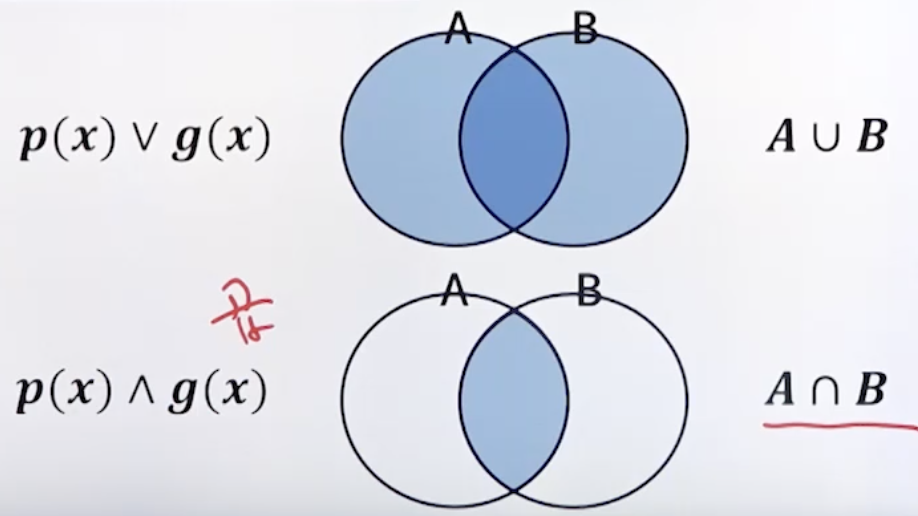
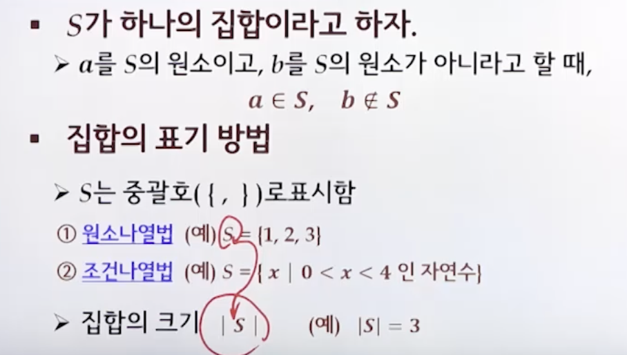
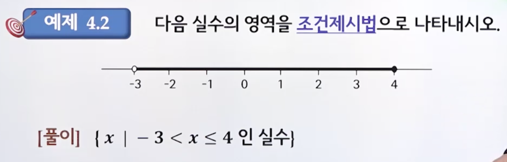

# 4강. 집합론

> 집합과 원소를 구분할 수 있고, **원소나열법**과 **조건제시법**으로 집합을 표현할 수 있다
>
> 집합의 **분할**과 **멱집합**을 구할 수 있다
>
> 합집합, 교집합, 차집합, 여집합, 대칭차집합과 같은 집합의 기본연산을 수행할 수 있다
>
> 집합의 다양한 대수법칙의 원리를 이해하고 필요에 따라 활용할 수 있다
>
> ∈∪∩⊂⊆⊇∈∪∩⋁⋀⋃∃∀⊈⊉⊄⊅∉∌≠

## 4.1 기본사항

### 논리학과 집합론

### 집합과 원소

- 무정의 용어
  - 정의 없이 사용하는 용어
  - 직관적으로 이해할 수 있으나 다른 용어로 정의하기 힘든 대상을 표현하기 위해 사용
- George Couter의 집합
  - "우리의 직관이나 사고로부터 한정적이고 분리된 객체들의 전체 M에서의 수집"

### 집합의 표기법

### 부분집합(subset)

- 부분집합(subset)
  - A의 모든 원소가 B의 원소이면 A는 B의 부분집합이라 하고, A⊆B 또는 A⊂B로 표기한다
    - A ⊆ B 또는 A ⊂ B ⇔ ∀x ( x ∈ A → x ∈ B)
    - ∈∪∩⊂⊆⊇∈∪∩⋁⋀⋃∃∀⊈⊉⊄⊅∉∌≠
- 진부분집합(proper subset)
  - A는 B의 진부분집합 
  - ⇔ A ⊆ B, B ⊈ A
  - ⇔ A ⊆ B, A ≠ B
- 상동(equal)
  - A = B ⇔ A ⊆ B, B ⊆ A

### 서로소

### 분할

### 멱집합

## 4.2 집합연산

## 4.3 집합의 대수법칙

