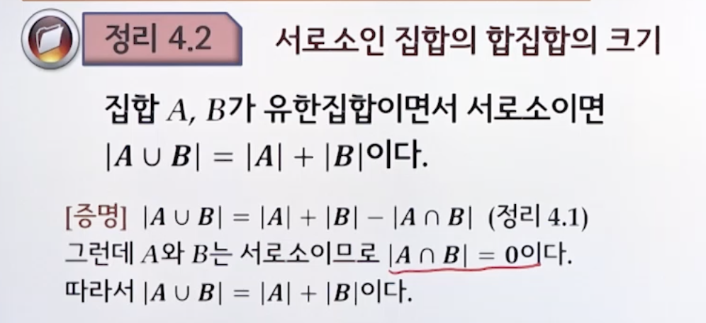

# 4강. 집합론

> 집합과 원소를 구분할 수 있고, **원소나열법**과 **조건제시법**으로 집합을 표현할 수 있다
>
> 집합의 **분할**과 **멱집합**을 구할 수 있다
>
> 합집합, 교집합, 차집합, 여집합, 대칭차집합과 같은 집합의 기본연산을 수행할 수 있다
>
> 집합의 다양한 대수법칙의 원리를 이해하고 필요에 따라 활용할 수 있다
>
> ∈∪∩⊂⊆⊇∈∪∩⋁⋀⋃∃∀⊈⊉⊄⊅∉∌≠

## 4.1 기본사항

### 논리학과 집합론

### 집합과 원소

- 무정의 용어
  - 정의 없이 사용하는 용어
  - 직관적으로 이해할 수 있으나 다른 용어로 정의하기 힘든 대상을 표현하기 위해 사용
- George Couter의 집합
  - "우리의 직관이나 사고로부터 한정적이고 분리된 객체들의 전체 M에서의 수집"

### 집합의 표기법

### 부분집합(subset)

- 부분집합(subset)
  - A의 모든 원소가 B의 원소이면 A는 B의 부분집합이라 하고, A⊆B 또는 A⊂B로 표기한다
    - A ⊆ B 또는 A ⊂ B ⇔ ∀x ( x ∈ A → x ∈ B)
- 진부분집합(proper subset)
  - A는 B의 진부분집합 
  - ⇔ A ⊆ B, B ⊈ A
  - ⇔ A ⊆ B, A ≠ B
- 상동(equal)
  - A = B ⇔ A ⊆ B, B ⊆ A

### 서로소(disjoint)

- 서로소, 쌍으로 서로소  ⇔ A ∩ B = ∅

- n개의 집합 A1, A2, ... An은 쌍으로 서로소(pairwise disjoint)

  

- 예제

  

  ​	쌍으로 서로소는 아니다

### 분할(partition)

- 집합 A를 공집합(∅)이 아닌 부분집합들로 나눌 때, A의 모든 원소들이 각각 나누어진 부분집합들 중 **하나**에만 포함될 경우 이 부분집합들 전체의 집합을 A의 분할이라고 함

  

- 예제: 셋 다 아님

  

  

  

### 멱집합(power set)

- 집합 A의 모든 부분집합들의 집합을 A의 멱집합이라고 하고, P(A)로 표기한다

- 예제

  

  

## 4.2 집합연산

> 합집합, 교집합, 차집합, 여집합, 대칭차집합

### 합집합

### 교집합

### 차집합

### 여집합

### 대칭차집합

### 곱집합(Cartesian product)

- U를 전체집합, A ⊂ U, B ⊂ U라 할 때, A의 원소 a와 B의 원소 b로 만들어지는 순서쌍 (a,b)들의 집합을 A와 B의 곱집합이라고 함.

- A × B = { (a, b) | a ∈ A, b ∈ B}

- 예시
  - A = {1, 2}와 B = {a, b}라 할 때,
  - A x B= = {(1, a), (1, b), (2, a), (2, b)}

- 예제

  

  

## 4.3 집합의 대수법칙

### 4.3.1 집합의 크기에 관한 성질

#### 합집합의 크기

#### 따름정리

#### 서로소인 집합의 합집합의 크기

### 4.3.2 포함관계 및 항등식

#### 교집합, 합집합, 포함관계의 이행성

> p → q & q → r 그러면 p → r

#### 원소 논증

#### 집합의 항등식

#### 포함관계에 대한 동치 

