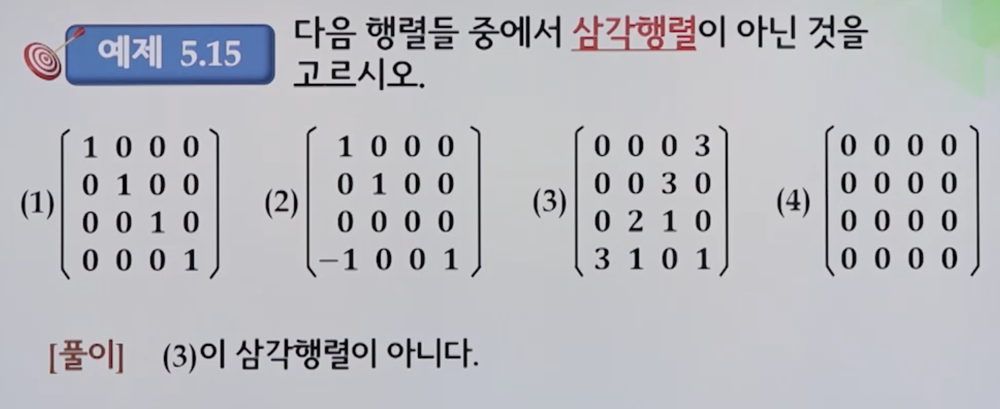
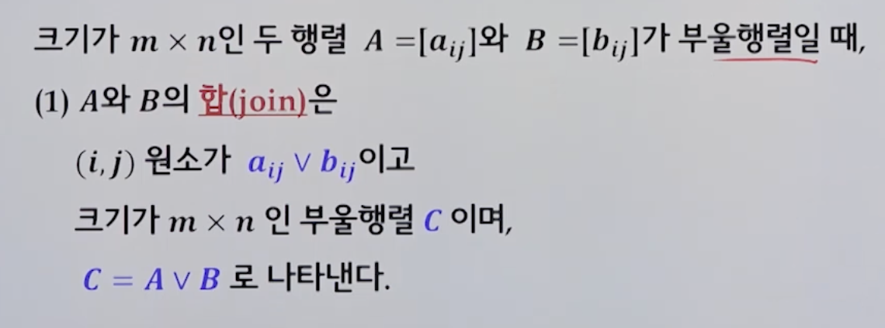

# 5강. 행렬

> 실세계의 데이터를 행렬로 표현할 수 있다
>
> 행렬의 합, 차, 스칼라의 곱, 행렬의 곱, 행렬의 전치 등과 같은 행렬의 기본연산을 수행할 수 있다
>
> 가우스 소거법을 통해 일차연립방정식을 풀 수 있다
>
> 행렬의 유형을 구분할 수 있다
>
> 부울행렬의 연산을 수행할 수 있다

## 5.1 기본사항

### 행렬 기본

- 행과 열로 구성되는 사각형 형태로 수를 배열한 것
- 컴퓨터 분야의 활용
  - 프로그래밍 언어, 자료구조, 컴퓨터 그래픽스, 패턴인식, 로봇동작, 인공지능 등

### 행렬 정의

- m, n이 양의 정수일 때, m개의 행과 n개의 열로 구성된 직사각형의 수 배열 A를 m x n 행렬이라고 한다
  - 행렬 A에서 i 번째 행의 j 번째 열의 수를 행렬 A의 (i, j) 원소라 하며, aij로 표시함.
  - 혹은 A = (aij)로 표현하기도 함
- 행벡터(row vector): 1 x n 행렬
- 열벡터(column vector): m x 1 행렬

### 영행렬(zero matrix)

- 모든 원소가 0인 행렬을 영행렬이라고 함

## 5.2 행렬의 연산

### 5.2.1 기본연산

#### 행렬의 합, 차, 스칼라 곱

#### 행렬의 합과 스칼라 곱의 연산법칙

- 행렬의 합과 스칼라 곱은 같은 크기의 행렬 A, B, C에 대해 다음과 같은 연산법칙들을 만족한다.(a, b는 실수이고, O는 원소가 0인 영행렬을 의미)
- 행렬의 합

- 스칼라 곱

#### 행렬의 곱

- A가 m x n 행렬이고, B가 n x l 행렬일 때, 행렬의 곱 AB는 (i, j)원소가 다음과 같이 정의되는 **m x l** 행렬이다.

  

-  예제

- 행렬의 곱의 연산법칙

  - 교환법칙은 없음( AB ≠ BA)

  

- 교환법칙이 성립하지 않는 예

  

- 예제

  - 행렬의 거듭제곱(A가 정방행렬)

  

  

- 0행렬이 아니지만, 곱했을 때 0행렬이 되는 행렬 A, B가 존재한다

  

### 5.2.2 가우스 소거법

- 모든 행렬이 다 역행렬을 가지는 것은 아니다

#### 기본행연산

- 행 교환(row interchange) 연산 (Ri,j)
  - 두 행의 위치를 서로 바꾸는 연산
- 행 스케일링(row scaling) 연산(Ri(c))
  - 하나의 행에 0이 아닌 스칼라를 곱하는 연산
- 행 대체(row replacement) 연산(Ri,j(c))
  - 하나의 행에 스칼라 곱을 해서 다른 행에 더하는 연산

#### 일차연립방정식과 행렬의 관계

#### 행제형 행렬(row echelon matrix)

- 다음 세 가지 조건을 만족하는 행렬을 **행사다리꼴(행제형)**이라고 한다
  - 영행이 아닌 행은 영행의 위에 있다
  - 영행이 아닌 행의 첫 번째 0이 아닌 원소를 그 행의 선도원소라 하는데, 모든 선도원소는 1이다.
  - 주어진 행의 선도원소는 그 아래 행의 선도원소보다 왼쪽에 있다.

- 예제(4번 빼고 다 아님)

  

#### 소거 행제형 행렬(reduced row echelon matrix)

- 다음 조건을 만족하는 행제형 행렬을 소거 행제형 행렬이라고 한다
  - 행제형 3가지 조건
  - 선도원소가 포함된 열에서 선도원소를 제외한 모든 원소는 0이다

- 예제(4번빼고 전부아님)

  

### 5.2.3 가우스 소거법 예제

- 책 참고

## 5.3 행렬의 종류

#### 정방행렬(square matrix)

- n x n 행렬을 n차 정방행렬이라고 하며, n을 정방행렬의 차수라 함

#### 대각행렬(diagonal matrix)

- n차 정방행렬에서 대각원소 이외의 모든 원소가 0인 행렬을 대각행렬이라 한다
- 즉, i ≠ j 이면 aij = 0 이다

#### 스칼라행렬(scalar matrix)

- 대각원소가 모두 동일하고, 그 외의 모든 원소가 0인 행렬을 스칼라행렬이라고 함

#### 단위행렬(unit matrix)

- 스칼라행렬에서 대각원소가 1인 경우
- n차 정방행렬에서 대각 원소가 모두 1이고, 나머지 원소는 모두 0인 행렬을 단위행렬이라 함. 
  - 즉, i = j 이면 aij = 1이고, i ≠ j 이면 ij = 0

#### 대칭행렬(symmetric matrix)

- n차 정방행렬에서 aij = aji인 행렬을 대칭행렬이라고 함

#### 역대칭행렬(skew symmetric matrix)

- n차 정방행렬에서 aij = -aji 이고, 대각원소가 모두 0인 행렬을 역대칭행렬[교대행렬] 이라고 함
  - 즉, i = j이면 aij = 0이고, i ≠ j 이면 aij = -aji

- 예제

  

#### 삼각행렬(triangular matrix)

- n차 정방행렬에서 

  - **상삼각행렬**: 주대각선 아래에 있는 모든 원소들이 0일 경우(i > j 일 때, aij = 0)
  - **하삼각행렬**: 주대각선 위에 있는 모든 원소들이 0일 경우(i < j 일 때, aij = 0)

- 삼각행렬

  - 상삼각행렬, 하삼각행렬을 통틀어 이름

- 예제

  

#### 전치행렬(transpose matrix)

- m x n 행렬 A가 주어졌을 때,  A의 행과 열을 서로 교환한 행렬을 A의 전치행렬이라고 함(A^T로 표기)

  - A^T의 크기는 n x m 이 됨

- 예제

  

#### 역행렬(inverse matrix)

- 사용은 잘 안하지만, 암호문 만들때나 사용

- n차 정방행렬 A, B가 주어졌을 때, AB = BA = In인 행렬 B가 존재하는 경우 행렬 A를 역가능(invertible)하다고 함

  - 이때 행렬 B를 A의 역행렬이라고 하고, A^-1로 표기

- 예제

  

#### 예제

## 5.4 부울행렬

- 행렬의 모든 원소가 부울값(0 or 1)으로만 구성된 행렬을 부울행렬이라고 함

### 부울행렬의 합, 교차, 부울곱

#### 합(join)

#### 교차(meet)

#### 부울곱(boolean product)

- 예제

