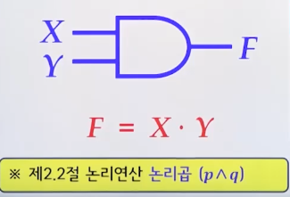
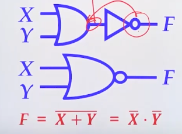
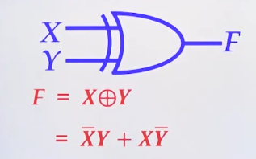
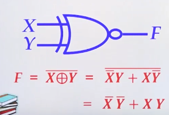
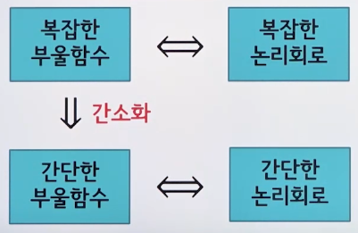
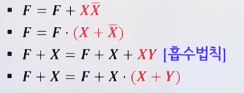

# 8강. 부울대수

## 8.1 기본사항

### (1) 디지털 논리회로

### (2) 기본 논리게이트(AND, OR, NOT)

#### AND 게이트

#### OR 게이트

#### NOT 게이트

### (3) 기타 논리게이트(NAND, NOR, XOR, XNOR)

#### NAND

#### NOR

#### XOR

#### XNOR

 

## 8.2 부울대수

### 8.2.1 부울대수 소개

- 부울식

  - 부울식은 다음과 같이 순환적으로 정의한다
  - 부울상수 0, 1은 부울식이다
  - 부울변수는 부울식이다
  - X, Y가 부울식일 때,
    - AND, OR, NOT, () 도 부울식이다

- 부울대수의 기본정리

  

  

### 8.2.2 부울대수의 성질

- 논리와 부울대수의 관련성

  

- 논리의 기본정리, 집합의 기본정리 확인

### 8.2.3 쌍대성 원리 및 보수

- **쌍대성 원리(principle of duality)**

  - 부울식에서 논리곱과 논리합을 서로 바꾸고, 논리상수 0과 1을 서로 바꾸면 원래 부울식의 쌍대(dual)를 얻게 됨
  - 주어진 부울식과 그것의 쌍대는 진리값이 서로 같다

- 드 모르간 법칙의 일반화

   

- 부울 함수의 보수
  - 드 모르간 법칙 이용
  - 쌍대 원리 이용

## 8.3 부울함수의 대수적 간소화

### 8.3.1 간소화 목적

- 부울함수와 논리회로의 관계

  

### 8.3.2 간소화 예

- 항 결합

  - 두 개의 항을 결합하여 하나의 항으로 만드는 방법

  

- 문자 소거

  -  중복된 문자를 제거하는 방법(흡수법칙)

    

- 중복항 첨가

  - 부울함수의 진리값이 변하지 않도록 하면서 간소화를 위한 적절한 항을 첨가하는 방법

  - 예제 8-5 참고

    

- 예제 8-5

  