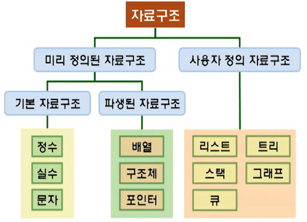

# 1강. 자료구조란 무엇인가?

## 1. 자료와 정보

### 자료의 가공 결과(정보)

- P : Processing
- I : Information
- D : Data

### 정보의 정의

- 어떤 상황에서 대해서 적절한 **의사결정을 할 수 있게 하는** 지식으로서 **자료의 유효한 해설이나 자료 상호간의 관계를 표현**하는 내용
- 어떠한 상황에 적절한 결정이나 판단에 사용될 수 있는 형태로 가공되거나 분류되기 위해 '처리 과정'을 거쳐서 정리되고 정돈된 **자료의 2차 처리 결과물**

## 2. 추상화의 개념

### 추상화

- 공통적인 개념을 이용하여 같은 종류의 다양한 객체를 정의하는 것
- 추상화를 통해 간결하게 말하는 사람의 의사를 전달할 수 있게 되는 것

- 자료의 추상화 (1)
  - 물리적이며 전기적인 동작과는 무관하게 자료를 생각하고 바라보는 사람의 상상
  - "정수가 컴퓨터 내부에서 '0101'의 이진코드로 어떻게 저장될까"라는 의문 없이 정수 그 자체를 머릿속의 그림처럼 떠올리는 것
- 자료의 추상화(2)
  - 다양한 대상을 컴퓨터에서 저장하고 처리하기 위해 그 대상들의 의미와 구조에 대해서 공통의 특징만을 뽑아 정의한 것
  - 컴퓨터 내부의 이진수 표현 방법, 저장 위치 등은 포함되지 않고, 단순하게 개발자의 머릿속에 그림을 그리는 것처럼 개념화하여 개발자들 사이의 의사를 쉽게 전달하기 위해 사용되는 방법

## 3. 자료구조와 알고리즘

### 자료구조

- 추상화를 통해 알고리즘에서 사용할 자료의 논리적 관계를 구조화 한 것
- 자료의 추상화와 구조화가 적절히 이루어지지 못함녀 소프트웨어는 비효율적으로 수행되거나 소프트웨어의 확장성에 문제가 생길 수 있음
- 자료 => (자료의 추상화) => 자료구조

### 알고리즘

- 컴퓨터에게 일을 시키기 위한 (추상화된) 명령어의 연속된 덩어리
- 사람(개발자)이 컴퓨터에게 일을 시키기 위한 사람의 의도와 명령을 전달해 줄 수 있는 방법(언어/글)
- 컴퓨터에게 시킬 일
- 컴퓨터가 수행할 명령어의 유한 집합이 사람의 머릿속에 추상화되어 존재하는 것
- 컴퓨터에게 시킬 일(프로그램)을 머릿속에서 추상화시켜서 대략적으로 상상해놓은 것

### 자료구조와 알고리즘의 관계

- 자료구조는 입력 자료에 대한 추상화 된 상태라면, 알고리즘은 컴퓨터가 수행해야 할 명령의 추상화

### 추상 자료형

- 자료구조와 알고리즘의 중간쯤에 있는 자료의 복잡한 논리적 성격을 정의하는 형식
- 자료값의 집합과 연산 집합에 대한 정의로 구성되며, 자료구조를 표현하는 가장 대표적인 방법

### 추상화와 추상 자료형

- 추상화: 그림이나 수식과 같이 의미를 표현하고 전달하는 방법
- 추상 자료형: 전산학에서 사용되는 자료구조를 표현하는(공통의 의미를 추출하여 전달하는) 방법

## 4. 알고리즘의 개념과 조건

### 알고리즘과 프로그램

- 알고리즘
  - 컴퓨터에게 일을 시키기 위한 (추상화된) 명령어의 연속된 덩어리
  - 사람(개발자)이 컴퓨터에게 일을 시키기 위한 사람의 의도와 명령을 전달해 줄 수 있는 방법(언어/글)
  - 컴퓨터에게 시킬 일
  - 컴퓨터가 수행할 명령어의 유한 집합이 사람의 머릿속에 추상화되어 존재하는 것
  - 컴퓨터에게 시킬 일(프로그램)을 머릿속에서 추상화시켜서 대략적으로 상상해놓은 것
- 알고리즘의 조건
  - 출력: 알고리즘을 수행하고 나면 적어도 한 가지 결과를 생성해야 함
  - 유효성: 반드시 실행 가능해야 함
  - 입력: 외부/내부 입력값은 유한해야 하며, 반드시 입력 형태가 정의될 수 있어야 함
  - 명확성: 각 명령들은 명확하고 애매모호하지 않아야 함
  - 유한성: 반드시 종료가 명확하게 정의되어 있어야 함

## 5. 알고리즘의 성능

### 알고리즘의 실행시간 분석

- 알고리즘을 실행하는데 필요한 **예측 실행시간**을 추정하여 알고리즘의 성능을 분석
- 실행시간의 예측
  - 알고리즘의 실행 횟수를 O(n) 이라고 표현
  - 같은 O(n)을 가진다고 해서 같은 실행시간을 갖는 것이 아니라 **실행시간의 유사한 증가 경향**에 대한 표현 방법

### 알고리즘의 실행메모리 분석

- 알고리즘을 실행하는데 필요한 공간(메모리)을 추정하여 알고리즘의 성능을 분석

- 실행 메모리의 예측(1)
  - 알고리즘의 공간 복잡도(space complexity)는 프로그램을 실행시켜서 완료하는데 필요한 총 메모리 공간
  - **고정 공간**은 프로그램의 크기나 입출력의 횟수에 관계없이 **컴파일 시**에 결정되어 프로그램의 실행이 끝날 때 까지 고정적으로 필요한 메모리 공간

- 실행 메모리의 예측(2)
  - **가변 공간**은 프로그램의 실행 과정에 동적으로 할당되어야 하는 자료 구조와 변수들을 위해 필요한 메인메모리 공간
  - Sp = Sc + Se (공간복잡도 = 고정공간 + 가변공간)

### 알고리즘의 성능 측정

- 컴퓨터가 실제로 프로그램을 실행하는데 걸리는 시간을 측정하여 알고리즘의 성능을 측정
- 실행 시간의 측정
  - 실제로 실행시간을 시계(시스템 시계)로 재는 것
  - 실제로 실행될 수 있는 프로그램(실행 파일)이 있어야 함
  - 시스템 시계를 이용

