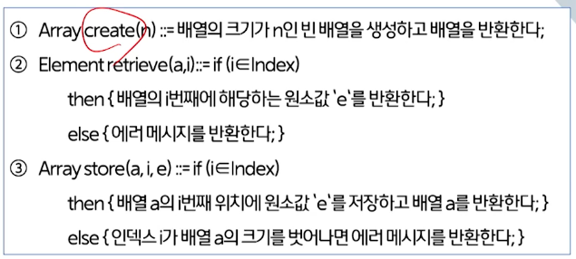

# 2강. 배열

## 1. 배열의 정의

### 배열의 정의

- 일정한 차례나 간격에 따라 벌여 놓음(사전적 정의)
- **'차례'(순서)와 관련된 기본적인 자료구조**

- 원소의 메모리 공간(메인 메모리, DDR)의 물리적인 위치를 '순서'적으로 결정하는 특징
- 배열의 순서는 메모리 공간에서 저장되는 '원소값의 물리적 순서'
- 인덱스와 원소값(<index, value>)의 쌍으로 구성된 집합


### 배열의 의미

- 인덱스로 표현되는 순서를 가지는 값
- 원소들이 모두 같은 자료형과 같은 크기의 기억 공간을 가짐
- 배열의 인덱스값을 이용해 원소값에 접근하기 때문에 직접 접근이 가능

- 배열의 인덱스값
  - 추상화된 값 = 컴퓨터의 내부구조나 메모리 주소와 무관하게 개발자에게 개념적으로 정의됨
  - 메모리 주소값은 실제 메모리의 물리적인 위치값
  - 배열의(추상화된) 인덱스값은 프로그래밍 언어와 컴파일 과정을 통해  메모리 주소값과 연결됨
  - 배열의 인덱스는 0부터 시작


## 2. 배열의 추상 자료형

### 추상자료형

- 객체 및 관련된 연산의 정의로 구성됨
- 자료구조 구현전의 설계 단계


### 자료형

- 메모리 저장 할당을 위한 변수 선언
- 자료구조의 구현 단계(프로그래밍 언어를 이용한 선언)


### ADT Array 객체: <i∈Index, e∈Element> 쌍들의 집합

- Index
  - 순서를 나타내는 원소의 유한집합
- Element
  - 자료형이 같은 원소의 집합




## 3. 배열연산의 구현

### 배열의 생성(create)

```c
void create(int n){ // n= 5
  int a[n];
  int i;
  for (i=0, i<n, i++){
    a[i] = 0;
  }
} 
```


### 배열값의 검색(retrieve)

```c
# define array_size 5
int retrieve(int *a, int i) {
  if (i>=0 && i<array_size)
    return a[i];
  else {
    printf("Error\n");
    return (-1);
  }
}
```

- 배열값의 검색 결과
  - 다음과 같은 원소값이 저장되어 있다고 가정하며, '30'이 출력됨


### 배열값의 저장(store)

- a[3]의 값이 35로 저장됨

```c
#define array_size 5
void store(int *a, int i, int e) { // i=3, e=35
  if (i>=0 && i<array_size)
    a[i] = e;
  else printf("Error\n");
}
```


## 4. 1차원 배열

### 1차원 배열의 정의

- 한 줄 짜리 배열을 의미하며, 하나의 인덱스로 구분됨

- A[i]는 배열의 첫 번째 원소 A[0]이 저장된 메모리 주소인 a로부터 시작하여, A[0]부터 A[i-1]개까지 i개의 배열 A[]를 지나서 저장됨
- **따라서, A[]의 메모리 시작주소를 a라고 가정하면, A[i]의 메모리 저장주소는 [a+i*k]가 됨**


### 1차원 배열에서의 주소 계산

- A[0]의 시작주소를 a라고 가정하면, A[3] 저장 주소는?
  - [a + 3*k]
  - 
  - 


## 5. 배열의 확장

## 6. 희소행렬의 개념