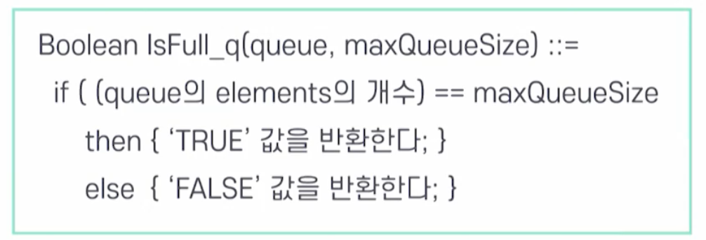

# 4강. 큐

## 1. 큐의 개념

### 큐의 의미

- 한 쪽에서는 삽입 연산만 가능하고, 다른 한쪽에서는 삭제 연산만 발생 가능한 양쪽이 모두 터진 관
- 선입선출(First-In-First-Out, FIFO) 또는 선착순 서브(First-Come-First-Serve, FCFS) 알고리즘과 함께 사용됨

### 큐의 정의

## 2. 큐의 추상 자료형

### 큐의 객체 정의

- 큐의 추상자료형
- 큐 객체: 0개 이상의 원소를 갖는 유한 순서 리스트

### 큐의 연산 

### 큐의 삽입(Add_q) 연산

### 큐의 삭제(Delete_q) 연산

### 빈 큐 검사 (isEmpty_q) 연산

### 큐의 만원 검사(IsFull_q) 연산

### Add/Delete 연산의 실행

## 3. 큐의 응용

## 4. 배열을 이용한 큐의 구현

## 5. 원형 큐

